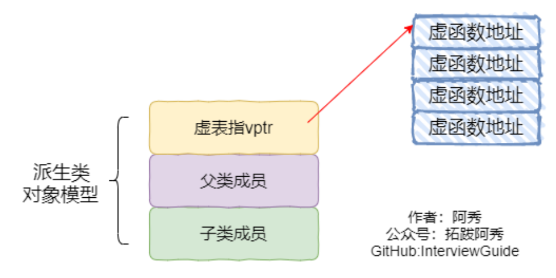
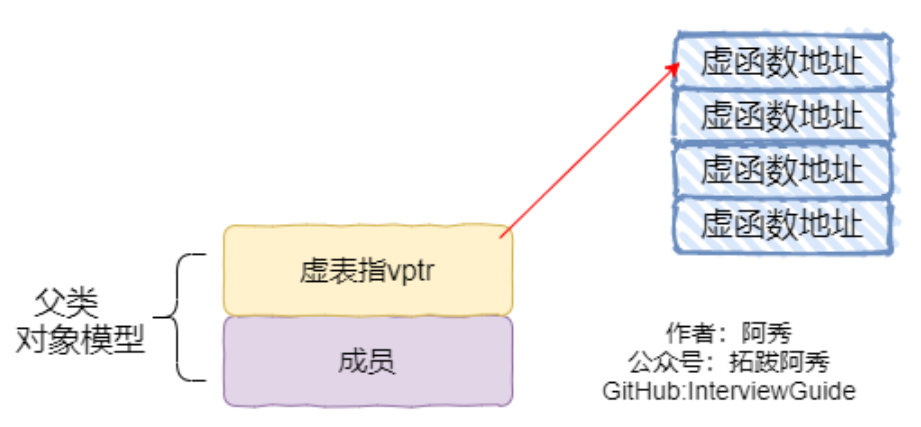
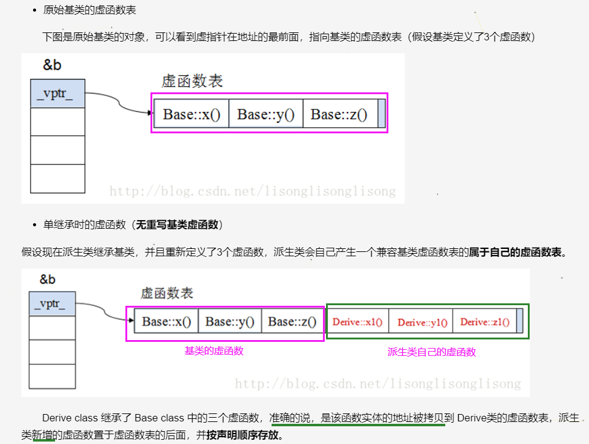
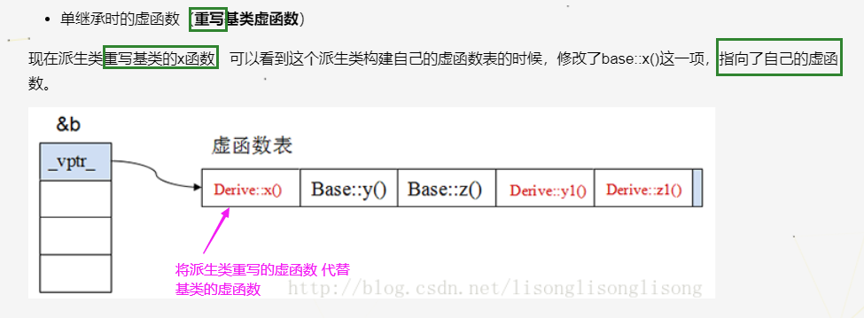
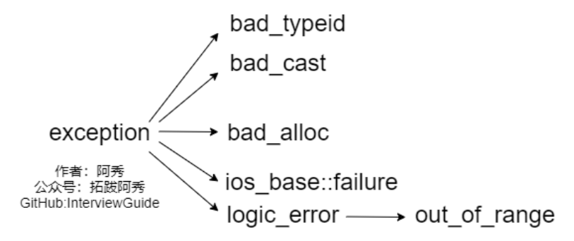
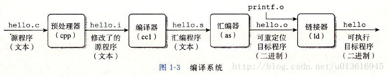
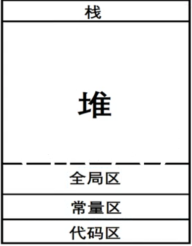
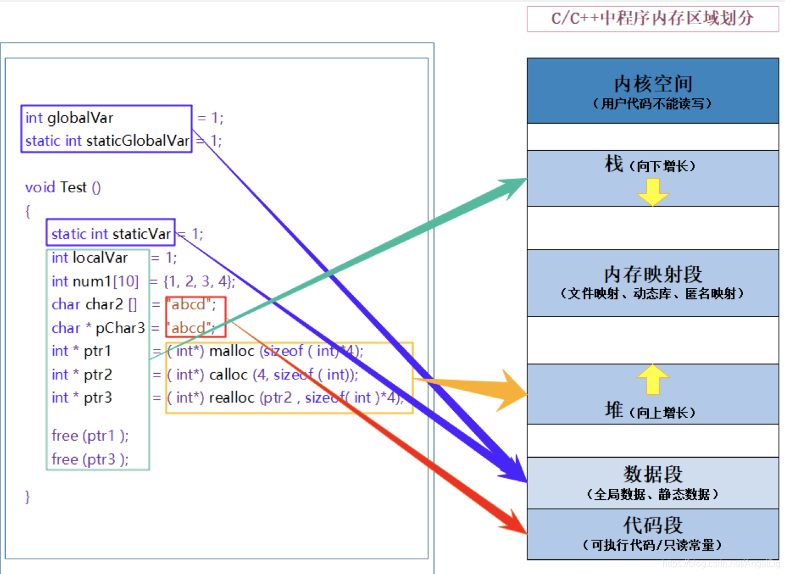
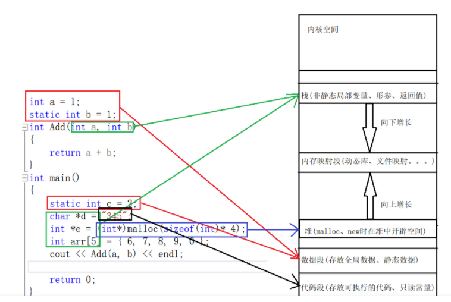

# C++小抄

## 面试过程中不会的题

### 1、哈希表除留取余法的桶个数为什么是质数

> 那么问题来了，这个p取多大呢？p的取值不好，会不会造成哈希函数的不均匀？先看一个简单的例子：
>
> 有一个数组： 1, 3，5，7，9，11，13, 15，17，19，21， 23，25   我们选取p为4（=2*2，含有约数2），即有四个桶，经过哈希函数后，
>
> 很明显求余结果都为1或者3，：都落在哈希地址为1的桶里，很明显这是不合理的。
>
> 为什么会出现这种情况呢，那么p应该怎么选取呢？
>
> 我们发现，上面数组求余后的哈希地址都为1,3,1,3，哈希地址的值不是1，就是3，所有哈希地址的差值不是2就是0，即3-3=0,1-1=0，3-1=2，恰好p=4的约数也是2，这个是不是巧合呢？
>
> 我们换一个数组来试一试：
>
> 数组b:     28，35，63，77，105，我们取p=21(3*7)
>
> 哈希地址： 7 ，14,  0， 14， 0
>
>    我们的数组差值都是7的倍数，哈希地址也是7的倍数，即哈希地址的差值也是0,7或者7的倍数，巧合的是我们的p也包含因数7。是不是只要p包含一个因数，这个因数对数组差值为这个因数的倍数整除的结果差值也是这个因数的倍数呢？
> 原文链接：https://blog.csdn.net/ilozk/article/details/90762541


质数，也就是素数，就是指一个大于1的自然数，约数（因数）只有1和它自己，否则叫合数。

除留取余，就是哈希函数 将 关键字 被某个不大于哈希表长m的 数p除后所得余数为哈希地址。这是最常用、也最简单的构造哈希函数的方法

**面试答**：如果散列值的因数越多，可能导致的散列分布越不均匀，所以p的选择需要选择约数少的数值，什么数值的约数最少呢？当然是只有1和它自己的质数了。所以往往将桶个数设置为质数或不包含小于20的质因数的合数，**使得散列分布均匀**。

### 2、为什么要重载

> 1、试想如果没有函数重载机制，如在C中，假如我们要打印一些数据，你必须要这样去做：为这个print函数取不同的名字，如print_int、print_string。这里还只是两个的情况，如果是很多个的话，就需要为实现同一个功能的函数取很多个名字，如加入打印long型、char*、各种类型的数组等等。这样做很不友好！
>
> 2、类的构造函数跟类名相同，也就是说：构造函数都同名。如果没有函数重载机制，要想实例化不同的对象，那是相当的麻烦！
>
> 3、操作符重载，本质上就是函数重载，它大大丰富了已有操作符的含义，方便使用，如+可用于连接字符串等！
>
> 原文链接：https://blog.csdn.net/qq_43503315/article/details/89714020

### 3、C中为什么不能用重载

> #### 简单版本
>
> 在LInux下，采用gcc编译完成后，函数名字的修饰没有发生改变；采用g++编译完成后，函数名字的修饰变成【_Z+函数长度+函数名+类型首字母】
> 所以C语言没办法支持函数重载，因为同名函数没办法区分；而C++是通过函数修饰规则来区分，只要参数不同，修饰出来的名字就不一样，就支持了重载
> 原文链接：https://blog.csdn.net/weixin_43766018/article/details/114949819

> #### 程序如何运行起来
>
> 通过我们在写好一个.c/.cpp文件的时候，点击开始运行，那么它就能运行起来，运行一个程序就这一步就好了吗？其实当然不是，下面让我们来看看我们C/C++中我们的程序到底是如何运行起来的。大致可以分为4个阶段，如下：
>
> - 预处理阶段（在预处理阶段，会进行宏替换，条件编译，头文件展开，去掉注释）
> - 编译阶段（在编译阶段，首先会进行语法语义检错，无误后要将我们写好的C文件编译成汇编文件）
> - 汇编阶段（在汇编阶段就是要将我们的汇编文件转换成可执行的机器指令）
> - 链接阶段（在链接阶段就是要把我们的所有的目标文件以及我们所依赖的库文件链接到一起生成可执行程序）
>
> #### 编译时重命名
>
> 在链接文件的时候，假如我们写了一个重载函数add,那么我们的重载函数在我们的C++底层中是如何处理的？
>
> 很容易想到，在编译过程中，编译器会将我们的代码编译成汇编文件，这里其实就存在这一种重命名机制，我们把它就叫做名字修饰。
> 名字修饰内容
> 1、在C语言中，编译器在编译过程会将我们的函数重命名，具体的方法就是在我们的函数名前加上“_“修饰符，通过这种方式就可以在我们的符号表种查找到了，但是假如有两个相同的函数，编译之后进行相同的重命名，在符号表中生成的函数名一样，那么就无法区分到底是哪个函数了，所以这也就是我们的C语言为什么不支持函数重载的原因了。
> 2、在C++中，既然支持函数重载，那么它肯定对C语言在这方面进行了优化，具体的方法就是在我们的函数名后面加上参数然后生成我们符号表中的函数名称。那么这样一来，就很容易理解了，为什么C++可以支持函数重载了，就是因为函数重载底层的原理造成的，就是由于重载函数在符号表中生成的函数名称不一样，这样就能区分到底是哪个函数了。这样一来编译就能通过了。
>
> C++能否按照C语言的方式来编译文件
> 答案是肯定可以的，只需要在我们的函数前加上 extern ”C“ 即可。
>
> 原文链接：https://blog.csdn.net/qq_43503315/article/details/89714020


## 常见题

### 1.多态如何实现？virtual

有了虚函数，基类指针指向基类对象时就使用基类的成员（包括成员函数和成员变量），指向派生类对象时就使用派生类的成员。

换句话说，基类指针可以按照基类的方式来做事，也可以按照派生类的方式来做事，**它有多种形态，或者说有多种表现方式**，我们将这种现象称为**多态（Polymorphism）**

C++提供多态的目的是：可以通过基类指针对所有派生类（包括直接派生和间接派生）的成员变量和成员函数进行“全方位”的访问，尤其是成员函数。如果没有多态，我们只能访问成员变量。


在基类的函数前，加上`virtual`关键字，然后派生类中`重写`该函数。

运行时，根据对象类型来调用相应的函数。

- 即如果对象类型是派生类，就调用派生类的函数，但是如果派生类没有重写该函数，那么调用对应基类的函数
- 如果对象类型是基类，则调用基类的函数。

```c++
#include <iostream>
using namespace std;
class Base{ // 基类
public:
     virtual void fun(){ // 虚函数
        cout << " Base::func()" <<endl;
     }
};
class Son1 : public Base{ // 派生类Son1
public:
     virtual void fun() override{
        cout << " Son1::func()" <<endl;
     }
};
class Son2 : public Base{};// 派生类Son2

int main()
{
    // 基类or派生类对象赋值给基类对象
    // 也可以理解为：基类指针对象指向 ==> 基类or派生类对象
     Base* base = new Son1; 
     base->fun(); // 调用派生类自己的
     base = new Son2;
     base->fun(); // 派生类Son2自己没有重写，所以调用基类的
     delete base;
     base = NULL;
     return 0;
}
// 运行结果
// Son1::func()
// Base::func()
```

如何体现多态性？

虚表：虚函数表的缩写，类中含有virtual关键字修饰的方法时，编译器会自动生成虚表，

一个类有一个虚表，定义每一个对象时，都会生成一个vptr指针，指向类的虚表（类对象的虚表指针==》虚表）

虚表指针：在含有虚函数的类实例化对象时，对象地址的前四个字节（保证虚函数表有最高的性能），会保存一个指针，指向虚表地址。





**上图中展示了虚表 和 虚表指针 在基类对象和派生类对象中的模型，下面阐述实现多态的过程**

- 编译器发现基类中有虚函数时，会自动为每个含有虚函数的类生成一份虚表。该表是一个一维数组，虚表里保存了虚函数的入口地址
- 编译器会在每个对象的前4个字节（无论是基类对象还是派生类对象），保存一个虚表指针，即`vptr`，指向对象所属类的虚表。在构造的时候，比如`Base* base = new Son1 `，会根据对象的类型去初始化虚指针vptr，从而让vptr指向正确的虚表，从而在调用函数的时候，能找到正确的函数
- 当涉及到多态性的时候，**采用了虚函数和动态绑定**，此时的调用就不会在**编译时候确定而是在运行时确定**。所谓合适的时机，就是在派生类定义对象时，程序会自动调用构造函数，**先在构造函数中创建虚表**，并初始化。然后调用基类构造函数构造基类，此时编译器“只看到”基类，并为基类创建虚表，且让一个虚表指针指向它。再调用派生类构造函数构造派生类，创建派生类自己的虚表，并让一个虚表指针指向派生类的虚表（`派生类有两个虚表指针`）。
- 当派生类对基类的虚函数没有进行重写时，派生类的虚表指针会指向基类的虚表，**其实还是自己的虚表，因为派生类将基类的虚函数地址拷贝到了自己的虚表中**；进行了重写的话，则会指向自己的虚表；当派生类中有自己的虚函数时，在自己的虚表中，将此虚函数地址添加到后面（基类虚函数地址、派生类虚函数地址）

[参考链接](https://www.cnblogs.com/xiaokang01/p/12394420.html)

**注：对象不包含虚函数表，只有虚指针，类才包含虚函数表，派生类会生成一个兼容基类的虚函数表。**






### 2、析构、构造中不可以调用虚函数

```c++
#include <iostream>
using namespace std;

class A{
public:
    // 无论构造、析构都不建议在里面 调用 虚函数！！
    // virtual A();构造函数是不允许设置为虚函数的
    A(){
        cout << "A construction " << endl;
    }
    virtual void func1(){
        cout << "A func1 " << endl;
    }
    void func2(){
        cout << "A func2 " << endl;
    }
    virtual ~A(){ // 析构函数可以，而且鼓励支持
        cout << "A deconstruction " << endl;
    }
};

class B : public A{ // 声明为public继承，默认是private
public:
    void func1() override{ // override表明重写父类虚函数
        cout << "B func1 " << endl;
    }
};

int main(){
    A a;
    B b;
    a.func1(); 
    b.func1(); // 只有声明为virtual的才会重写
   
    a.func2(); 
    b.func2(); // 继承父类
    return 0;
}
```

输出

```c++
A construction 
A construction 
A func1 
B func1 
A func2 
A func2 
A deconstruction 
A deconstruction
```

C++的继承体系中，子类会先构造父类的数据成员，然后再构造自己的数据成员。

假设子类B创建一个对象b，调用构造函数`B()`，那么会先构造父类A的成员，也就是调用A的构造函数，接着A调用`virtual`函数，由于是虚函数，会先调用子类，但注意，此刻子类还处于构造父类的过程，子类本身的数据成员（不同于父类的）是还未定义的！访问未定义的成员在C++中是不允许的，会引发未知错误！


### 3、说一说C++中的四个cast转换以及不用C的强制转换

向上转换：**派生类** `指针或引用` 向 **基类** 指针或引用 的转换
向下转换：**基类** `指针或引用` 向 **派生类** 指针或引用 的转换

> - const_cast：用于将const变量转为 非 const
> 
> - static_cast：用于各种隐式转换，比如非const转const,void转指针等，static_cast能用于多态向上转化，如果向下转能成功但是不安全，结果未知。没有类型检查。
>   
>- dynamic_cast：用于动态类型转换。只能用于含有虚函数的类，用于类层次间的向上（可以不用这个也是安全的）和向下转化。`只能转 指针或引用`。dynamic_cast具有类型检查的功能。
>   
>   - 向下转化时，如果是非法的对于 指针 返回NULL，对于 引用 抛异常。
>   
>     它通过判断在执行到该语句的时候`变量的运行时类型`和`要转换的类型`是否相同来判断是否能够进行向下转换
>   
> - reinterpret_cast几乎什么都可以转，比如将int转指针，可能会出问题，**尽量少用**
> 
>   
> 
>C的强制转换，表面上看起来功能虽大什么都能转，**但是转化不够明确，不能进行错误检查，容易岀错**。
> 
>原文链接：https://blog.csdn.net/qq_37535749/article/details/113580424


### 4、说一说智能指针

原文链接：https://blog.csdn.net/worldwindjp/article/details/18843087/

[参考链接2](https://blog.csdn.net/runner668/article/details/80539221?utm_medium=distribute.pc_relevant.none-task-blog-2~default~baidujs_baidulandingword~default-0.control&spm=1001.2101.3001.4242)

#### 实现原理

智能指针是一个类，这个类的构造函数中传入一个普通指针，析构函数中释放传入的指针。

智能指针的类都是栈上的对象，所以当函数（或程序）结束时会自动被释放，

#### 作用

C++程序设计中使用堆内存是非常频繁的操作，堆内存的申请和释放都由程序员自己管理。程序员自己管理堆内存可以提高了程序的效率，但是整体来说堆内存的管理是麻烦的，C++11中引入了智能指针的概念，方便管理堆内存。使用普通指针，容易造成堆内存泄露（忘记释放），二次释放，程序发生异常时内存泄露等问题等，使用智能指针能更好的管理堆内存。

#### 常用的智能指针

 1）auto_ptr

- 在命名空间std内。有很多问题。 不支持复制（拷贝构造函数）和赋值（operator =），**但复制或赋值的时候不会提示出错**。
- 因为不能被复制，所以不能被放入容器中。

2) unique_ptr

- 也不支持复制和赋值，**但比 auto_ptr 好，直接赋值会编译出错**。
- 实在想赋值的话，需要使用：std::move。如下：

```c++
 std::unique_ptr<int> p1(new int(5));
 std::unique_ptr<int> p2 = p1; // 编译会出错
 std::unique_ptr<int> p3 = std::move(p1); // 转移所有权, 现在那块内存归p3所有, p1成为无效的指针.
```

​                        

3) shared_ptr

- C++11或boost的中
- 基于**引用计数**的智能指针。可随意赋值，直到内存的引用计数为0的时候这个内存会被释放。

4）weak_ptr

- C++11或boost的，弱引用。 

- **问题**：shared_ptr引用计数有一个问题就是 `互相引用形成环`，这样两个指针指向的内存都无法释放。

- 需要手动打破循环引用或使用weak_ptr。顾名思义，weak_ptr是一个弱引用，只引用，不计数。

- 如果一块内存被shared_ptr 和 weak_ptr同时引用，当所有shared_ptr析构了之后，不管还有没有weak_ptr引用该内存，内存也会被释放。

- 所以weak_ptr不保证它指向的内存一定是有效的，在使用之前需要检查weak_ptr是否为空指针。

- > weak_ptr是为了配合shared_ptr而引入的一种智能指针，因为它不具有普通指针的行为，没有重载operator*和->,它的最大作用在于协助shared_ptr工作，像旁观者那样观测资源的使用情况。weak_ptr可以从一个shared_ptr或者另一个weak_ptr对象构造，获得资源的观测权。但weak_ptr没有共享资源，它的构造不会引起指针引用计数的增加。使用weak_ptr的成员函数use_count()可以观测资源的引用计数，另一个成员函数expired()的功能等价于use_count()==0,但更快，表示被观测的资源(也Q就是shared_ptr的管理的资源)已经不复存在


### 5、手写智能指针？


### 6、函数可以返回局部变量吗？

>  一般来说，函数是可以返回局部变量的。局部变量的作用域只在函数内部，在函数返回后，局部变量的内存已经释放。
>
> 因此，**如果函数返回的是局部变量的值，不涉及地址，程序不会出错。**
>
> 但是如果返回的是局部变量的地址(指针)的话，程序运行后会出错。因为函数只是把指针复制后返回了，但是指针指向的内容已经被释放了，这样指针指向的内容就是不可预料的内容，调用就会出错。
>
> 准确的来说，函数不能通过返回指向栈内存的指针(注意这里指的是栈，**返回指向堆内存的指针是可以的**)。返回static静态变量也是可以的。
> ————————————————
> 原文链接：https://blog.csdn.net/kai8wei/article/details/44699493


### 7、宏定义const、#define、typedef、inline函数区别？

#### const与#define

1. const定义的常量是变量带类型，而#define定义的只是个常数不带类型；
2. define只在**预处理**阶段起作用，简单的文本替换，而const在**编译、链接过程中**起作用；
3. define只是简单的字符串替换**没有类型检查**。而const是有数据类型的，是要进行判断的，可以避免一些低级错误；
4. define预处理后，占用**代码段空间**，const占用**常量区**；
5. const不能重定义，而define可以通过#undef取消某个符号的定义，进行重定义；
6. define独特功能，比如可以用来防止文件重复引用。

#### #define、typedef

1. 宏主要用于定义常量及书写复杂的内容；typedef主要用于定义类型别名
2. 宏在预处理的时候对内容进行简单替换，不会进行类型检查；typedef在编译的时候进行，会对类型进行检查，更加安全
3. 宏不是语句，不在在最后加分号；typedef是语句，要加分号标识结束。
4. `typedef char * String_t` 定义了一个新的类型别名，有类型检查。
    `#define String_d char *` 只做了简单的替换，无类型检查。

#### define、inline

1. #define是关键字，inline是函数；
2.  宏定义在预处理阶段进行文本替换，inline函数在编译阶段进行替换；
3. inline函数有类型检查，相比宏定义比较安全；

### 8、malloc/free和new/delete

#### 区别

- malloc和free是标准库函数，支持覆盖；new和delete是运算符，不重载。
- malloc仅仅分配内存空间，free仅仅回收空间，不具备调用构造函数和析构函数功能，用malloc分配空
- 间存储类的对象存在风险；new和delete除了分配回收功能外，还会调用构造函数和析构函数。
- malloc和free返回的是void类型指针（必须进行类型转换），new和delete返回的是具体类型指针。

例子

> 【参数说明】size 为需要分配的内存空间的大小，**以字节（Byte）计**。
>
> 【函数说明】malloc() 在堆区分配一块指定大小的内存空间，用来存放数据。这块内存空间在函数执行完成后不会被初始化，它们的值是未知的。如果希望在分配内存的同时进行初始化，请使用 [calloc()](http://c.biancheng.net/cpp/html/134.html) 函数。
>
> 【返回值】分配成功返回指向该内存的地址，失败则返回 NULL。
>
> 由于申请内存空间时可能有也可能没有，所以需要自行判断是否申请成功，再进行后续操作。
>
> 函数的返回值类型是 void *，**void 并不是说没有返回值或者返回空指针，而是返回的指针类型未知。所以在使用 malloc() 时通常需要进行强制类型转换，将 void 指针转换成我们希望的类型**

```c++
char *ptr = (char *)malloc(10); //申请10B的内存空间，返回void*类型，强制转化为char*，由char*类型指针指向
int* p = (int*)malloc(4*pow(1024, 3)); //申请4GB（4*10^3^3B）的内存空间，强制转换成int*，由int*指针指向这块内存
```


#### 为什么引入new/delete

- malloc/free和new/delete都是用来 申请内存 和 回收内存 的。
- 在对非基本数据类型的对象使用的时候，对象创建的时候还需要执行构造函数，销毁的时候要执行析构函数。
- 而malloc/free是库函数，是已经编译好的代码，所以不能把构造函数和析构函数的功能**强加给**malloc/free，所new/delete是必不可少的。

### 9、被free回收的内存是立即返还给操作系统吗？

不是的，被free回收的内存会首先被ptmalloc使用双链表保存起来，

当用户下一次申请内存的时候，会尝试从这些内存中寻找合适的返回。

这样就避免了频繁的系统调用，占用过多的系统资源。

同时ptmalloc也会尝试对小块内存进行合并，避免过多的内存碎片。


### 10、C++强制类型转换操作符 dynamic_cast

向上转换总是安全的，向下则要分两种情况。如果 基类指针 指向的对象

- 是基类对象，则 不可以 向下转型成 派生类指针
- 是派生类指针，可以 向下转型成派生类指针

#### dynamic_cast主要用于“安全地向下转型”

dynamic_cast**用于类继承层次间的 `指针或引用` 转换**。主要还是用于执行“安全的向下转型（safe downcasting）”，

“向上转型”（即派生类指针或引用类型转换为其基类类型），本身就是安全的，（**子类转换成父类本身就是安全的**）

尽管可以使用dynamic_cast进行转换，但这是没必要的， 普通的转换已经可以达到目的，（**毕竟使用dynamic_cast是需要开销的**。）

```c++
class Base
{
public:
    Base(){};
    virtual void Show(){cout<<"This is Base calss";}
};
class Derived:public Base
{
public:
    Derived(){};
    void Show(){cout<<"This is Derived class";}
};
int main()
{
    Base *base ;
    Derived *der = new Derived; // 派生类对象指针 指向 派生类对象
    //base = dynamic_cast<Base*>(der); //正确，但不必要。
    base = der; //先上转换总是安全的
    base->Show();
    system("pause");
}
```

### dynamic_cast与继承层次的指针

对于“向下转型”有两种情况。

- 一种是 `基类指针 所指对象 是 派生类类型` ，这种转换是安全的；
- 另一种是 `基类指针 所指对象 是 基类类型`，在这种情况下dynamic_cast在运行时做检查，转换失败，返回结果为0；

```c++
#include "stdafx.h"
#include<iostream>
using namespace std;

class Base
{
public:
    Base(){};
    virtual void Show(){cout<<"This is Base calss";}
};
class Derived:public Base
{
public:
    Derived(){};
    void Show(){cout<<"This is Derived class";}
};
int main()
{    
    //这是第一种情况: 基类对象指针 指向 派生类对象
    // 可以安全转换： 基类对象指针 为 派生类对象指针
    Base* base = new Derived;
    if(Derived *der= dynamic_cast<Derived*>(base))
    {
        cout<<"第一种情况转换成功"<<endl;
        der->Show();
        cout<<endl;
    }
    //这是第二种情况：基类对象指针 指向 基类对象
    // 不能转换：基类对象指针 不能 转换为 派生类对象指针
    Base * base1 = new Base;
    if(Derived *der1 = dynamic_cast<Derived*>(base1))
    {
        cout<<"第二种情况转换成功"<<endl;
        der1->Show();
    }
    else 
    {
        cout<<"第二种情况转换失败"<<endl;
    }

    delete(base);
    delete(base1);
    system("pause");
}
```


### 11、浅拷贝与深拷贝

**浅拷贝**

浅拷贝只是拷贝一个指针，并没有新开辟一个地址，拷贝的指针和原来的指针指向同一块地址，

如果原来的指针所指向的资源释放了，那么再释放浅拷贝的指针的资源就会出现错误。

**深拷贝**

深拷贝不仅拷贝值，还开辟出一块新的空间用来存放新的值，即使原先的对象被析构掉，释放内存了也不会影响到深拷贝得到的值。

**在自己实现拷贝赋值的时候，如果有指针变量的话是需要自己实现深拷贝的**。


### 12、inline函数与宏定义

- 在使用时，宏只做简单字符串替换（编译前）。而内联函数可以进行参数类型检查、语法判断等功能（编译时），且具有返回值。
- 内联函数 在编译时 直接将函数代码嵌入到目标代码中，省去函数调用的开销来提高执行效率，并且进行参数类型检查，具有返回值，可以实现重载。
- 宏定义时要注意书写（参数要括起来）否则容易出现歧义，内联函数不会产生歧义

内联函数适用场景

- 使用宏定义的地方都可以使用 inline 函数。
- 作为 类成员接口函数 来读写类的私有成员或者保护成员，会提高效率。


### 13、大端、小端存储

大端存储：字数据的高字节存储在低地址中

小端存储：字数据的低字节存储在低地址中 （安分守己，低存低）

例如：32bit的数字0x12345678

所以在Socket编程中，往往需要将操作系统所用的小端存储的IP地址转换为大端存储，这样才能进行网络传输

小端模式中的存储方式为：


大端模式中的存储方式为：


#### 如何在代码中判断？

了解了大小端存储的方式，如何在代码中进行判断呢？下面介绍两种判断方式

**方式一：使用强制类型转换**-这种法子不错

```c++
#include <iostream>
using namespace std;
int main()
{
     int a = 0x1234;
     //由于int和char的长度不同，借助int型转换成char型，只会留下低地址的部分
     char c = (char)(a);
     if (c == 0x12)
     cout << "big endian" << endl;
     else if(c == 0x34)
     cout << "little endian" << endl;
}
```

**方式二：巧用union联合体**

```c++
#include <iostream>
using namespace std;
//union联合体的重叠式存储，endian联合体占用内存的空间为每个成员字节长度的最大值,这里为int类型4字节
// a, ch公用4字节的内存
union endian
{
     int a;
     char ch;
};
int main()
{
     endian value;
     value.a = 0x1234;
     //a和ch共用4字节的内存空间
     if (value.ch == 0x12)
     	cout << "big endian"<<endl;
     else if (value.ch == 0x34)
     	cout << "little endian"<<endl; 
}
```


### 14、volatile、mutable和explicit关键字的用法

#### (1)  volatile

volatile 关键字是一种类型修饰符，**用它声明的类型变量表示可以被某些编译器未知的因素更改**，比如：操作系统、硬件或者其它线程等。

遇到这个关键字声明的变量，编译器对访问该变量的代码就不再进行优化，**从而可以提供对特殊地址的稳定访问**。

当要求使用 volatile 声明的变量的值的时候，**系统总是重新从它所在的内存读取数据**，即使它前面的指令刚刚从该处读取过数据。

**volatile定义变量的值是易变的，每次用到这个变量的值的时候都要去重新读取这个变量的值，而不是读CPU寄存器内的备份。**

**多线程中被几个任务共享的变量需要定义为volatile类型。**

##### 多线程下的volatile

有些变量是用volatile关键字声明的。当两个线程都要用到某一个变量且该变量的值会被改变时，应该用volatile声明，**该关键字的作用是防止优化编译器把变量从内存装入CPU寄存器中**。

如果变量被装入寄存器，那么两个线程有可能一个使用内存中的变量，一个使用寄存器中的变量，这会造成程序的错误执行。

volatile的意思是让编译器每次操作该变量时一定要从内存中真正取出，而不是使用已经存在寄存器中的值。

#### （2）mutable

mutable的中文意思是“可变的，易变的”，跟constant（既C++中的const）是反义词。在C++中，mutable也是为了突破const的限制而设置的。

被mutable修饰的变量，将永远处于可变的状态，即使在一个const函数中。

我们知道，**如果类的成员函数不会改变对象的状态，那么这个成员函数一般会声明成const的**。

但是，有些时候，我们需要在const函数里面修改一些跟类状态无关的数据成员，那么这个函数就应该被**mutable**来修饰，并且放在函数后后面关键字位置。

```c++
class person
{
int m_A;
mutable int m_B;//特殊变量 在常函数里值也可以被修改
public:
     void add() const//在函数里不可修改this指针指向的值 常量指针
     {
         m_A=10;//错误 不可修改值，this已经被修饰为常量指针
         m_B=20;//正确
     }
}

class person
{
    int m_A;
    mutable int m_B;//特殊变量 在常函数里值也可以被修改
}
int main()
{
    const person p;//修饰常对象 不可修改类成员的值
    p.m_A=10;//错误，被修饰了指针常量
    p.m_B=200;//正确，特殊变量，修饰了mutable
}
```

#### （3）explicit

explicit关键字用来修饰类的构造函数，被修饰的构造函数的类，不能发生相应的隐式类型转换，**只能以显式的方式进行类型转换**，注意以下几点：

- explicit 关键字只能用于类内部的**构造函数声**明上
- explicit 关键字作用于单个参数的构造函数
- 被explicit修饰的构造函数的类，不能发生相应的隐式类型转换


### 15、C++的异常处理的方法

在程序执行过程中，由于程序员的疏忽或是系统资源紧张等因素都有可能导致异常，任何程序都无法保

证绝对的稳定，常见的异常有：

数组下标越界

除法计算时除数为0

动态分配空间时空间不足

...

如果不及时对这些异常进行处理，程序多数情况下都会崩溃。

#### （1）try、throw、catch关键字

C++中的异常处理机制主要使用**try**、**throw**和**catch**三个关键字，其在程序中的用法如下：

```c++
#include <iostream>
using namespace std;
int main()
{
     double m = 1, n = 0;
     try {
         cout << "before dividing." << endl;
         if (n == 0)
         	throw - 1; //抛出int型异常
         else if (m == 0)
         	throw - 1.0; //拋出 double 型异常
         else
         	cout << m / n << endl;
         cout << "after dividing." << endl;
     }
     catch (double d) {
     	cout << "catch (double)" << d << endl;
     }
     catch (...) {
     	cout << "catch (...)" << endl;
     }
     cout << "finished" << endl;
     return 0; 
}
//运行结果
//before dividing
//catch (...)
//finished
```

代码中，对两个数进行除法计算，其中除数为0。可以看到以上三个关键字，程序的执行流程是先执行try包裹的语句块，如果执行过程中没有异常发生，则不会进入任何catch包裹的语句块，如果发生异常，则使用throw进行异常抛出，再由catch进行捕获，throw可以抛出各种数据类型的信息，代码中使用的是

数字，也可以自定义异常class。catch根据throw抛出的数据类型进行精确捕获（不会出现类型转换），如果匹配不到就直接报错，可以使用catch(...)的方式捕获任何异常（不推荐）。当然，如果catch了异常，当前函数如果不进行处理，或者已经处理了想通知上一层的调用者，可以在catch里面再throw异常。

#### （2）函数的异常声明列表

有时候，程序员在定义函数的时候知道函数可能发生的异常，可以在函数声明和定义时，指出所能抛出

异常的列表，写法如下：

```c++
int fun() throw(int,double,A,B,C){...};
```

这种写法表名函数可能会抛出int,double型或者A、B、C三种类型的异常，

如果throw中为空，表明不会抛出任何异常，如果没有throw则可能抛出任何异常

#### （3）C++标准异常类exception



bad_typeid：使用typeid运算符，如果其操作数是一个多态类的指针，而该指针的值为 NULL，则会拋出此异常，例如：

```c++
#include <iostream>
#include <typeinfo>
using namespace std;
class A{
public:
 virtual ~A();
};

int main() {
     A* a = NULL;
     try {
        cout << typeid(*a).name() << endl; // Error condition
     }
     catch (bad_typeid){
         cout << "Object is NULL" << endl;
     }
     return 0; 
}
//运行结果：bject is NULL
```

bad_cast：在用 dynamic_cast 进行从多态基类对象（或引用）到派生类的引用的强制类型转换时，如果转换是不安全的，则会拋出此异常

bad_alloc：在用 new 运算符进行动态内存分配时，如果没有足够的内存，则会引发此异常

out_of_range:用 vector 或 string的at 成员函数根据下标访问元素时，如果下标越界，则会拋出此异常


### 16、static用法和作用

**1.先来介绍它的第一条也是最重要的一条：隐藏（static函数，static变量均可）**

- 当同时编译多个文件时，所有未加static前缀的全局变量和函数都具有全局可见性。而static的全局变量仅在所在源文件作用域内有效


**2.static的第二个作用是保持变量内容的持久。**

- （static变量中的记忆功能和全局生存期）存储在静态数据区的变量，会在程序刚开始运行时，就完成初始化，也是唯一的一次初始化。
- 共有两种变量存储在静态存储区：全局变量和static变量，只不过和全局变量比起来，static可以控制变量的可见范围，说到底static还是用来隐藏的。


**3.static的第三个作用是默认初始化为0（static变量）**

- 其实全局变量也具备这一属性，因为全局变量也存储在静态数据区。
- 在静态数据区，内存中所有的字节默认值都是0x00，某些时候这一特点可以减少程序员的工作量。


**4.static的第四个作用：C++中的类成员声明static**

1) 函数体内static变量的作用范围为该函数体，不同于auto变量，该变量的内存只被分配一次，因此其值在下次调用时仍维持上次的值；

2) **在模块内的static全局变量可以被 模块内 所用函数访问，但不能被 模块外 其它函数访问**； 

3) 在模块内的static函数只可被这一模块内的其它函数调用，这个函数的使用范围被限制在声明它的模块内； 

4) 在类中的static成员变量属于整个类所拥有，对类的所有对象只有一份拷贝； 

5) 在类中的static成员函数属于整个类所拥有，这个函数不接收this指针，因而只能访问类的static成员变量。

类内：

6) static类对象必须要在类外进行初始化，static修饰的变量先于对象存在，所以static修饰的变量要在**类外初始化**；

7) 由于static修饰的类成员属于类，不属于对象，因此static类成员函数是没有this指针的，this指针是指向本对象的指针。正因为没有this指针，所以static类成员函数不能访问非static的类成员，只能访问 static修饰的类成员；

8) static成员函数不能被virtual修饰，static成员不属于任何对象或实例，所以加上virtual没有任何实际意义；静态成员函数没有this指针，虚函数的实现是为每一个对象分配一个vptr指针，而vptr是通过this指针调用的，所以不能为virtual；虚函数的调用关系，this->vptr->ctable->virtual function


### 17、成员初始化列表什么时候必须使用？

##### 1) 必须使用成员初始化的四种情况

① 当初始化一个引用成员时；

② 当初始化一个常量成员时；

③ 当调用一个基类的构造函数，而它拥有一组参数时；

④ 当调用一个成员类的构造函数，而它拥有一组参数时；

##### 2) 成员初始化列表做了什么

① 编译器会一一操作初始化列表，以适当的顺序在构造函数之内安插初始化操作，并且在任何显示用户代码之前；

② list中的项目顺序是由类中的成员声明顺序决定的，不是由初始化列表的顺序决定的；

##### 3）效率

用初始化列表会快一些的原因是，**对于自定义类型，它少了一次调用构造函数的过程**，而在函数体中赋值则会多一次调用。而对于内置数据类型则没有差别。

### 18、内存泄露，以及如何避免？

**内存泄露**

一般我们常说的内存泄漏是指**堆内存的泄漏**。堆内存是指程序从堆中分配的，大小任意的(内存块的大小可以在程序运行期决定)内存块，使用完后必须显式释放的内存。

应用程序般使用malloc,、realloc、new等函数从堆中分配到块内存，使用完后，程序必须负责相应的调用free或delete释放该内存块，否则，这块内存就不能被再次使用，我们就说这块内存泄漏了（申请的堆内存在函数退出时没有释放，就会内存泄露）

**避免内存泄露的几种方式**

计数法：使用new或者malloc时，让该数+1，delete或free时，该数-1，程序执行完打印这个计数，如果不为0则表示存在内存泄露一定要将基类的析构函数声明为**虚函数**

对象数组的释放一定要用**delete []**，有new就有delete，有malloc就有free，保证它们一定成对出现

**检测工具**

Linux下可以使用**Valgrind工具**

Windows下可以使用**CRT库**


### 19、复用、零拷贝

**对象复用**

对象复用其本质是一种设计模式：Flyweight享元模式。

通过将对象存储到“对象池”中实现对象的重复利用，这样可以避免多次创建重复对象的开销，节约系统资源。

**零拷贝**

零拷贝就是一种**避免 CPU 将数据从一块存储拷贝到另外一块存储**的技术。

零拷贝技术可以减少数据拷贝 和 共享总线操作的次数。

在C++中，vector的一个成员函数**emplace_back()**很好地体现了零拷贝技术，它跟push_back()函数一样可以将一个元素插入容器尾部，

区别在于：使用push_back()函数需要调用拷贝构造函数和转移构造函数，而使用emplace_back()插入的元素原地构造，不需要触发拷贝构造和转移构造，效率更高。举个例子：

```c++
#include <vector>
#include <string>
#include <iostream>
using namespace std;
struct Person
{
     string name;
     int age;
     //初始构造函数
     Person(string p_name, int p_age): name(std::move(p_name)), age(p_age)
     {
     	cout << "I have been constructed" <<endl;
     }
     //拷贝构造函数
     Person(const Person& other): name(std::move(other.name)), age(other.age)
     {
     	cout << "I have been copy constructed" <<endl;
     }
     //转移构造函数
     Person(Person&& other): name(std::move(other.name)), age(other.age)
     {
        cout << "I have been moved"<<endl;
     }
};
int main()
{
     vector<Person> e;
     cout << "emplace_back:" <<endl;
     e.emplace_back("Jane", 23); //不用构造类对象
     vector<Person> p;
     cout << "push_back:"<<endl;
     p.push_back(Person("Mike",36));
     return 0; 
}
//输出结果：
//emplace_back:
//I have been constructed
//push_back:
//I have been constructed
//I am being moved.
```


### 20、C++三大特性

#### （1）继承

**让某种类型对象获得另一个类型对象的属性和方法。**

它可以使用现有类的所有功能，并在无需重新编写原来的类的情况下对这些功能进行扩展

常见的继承有三种方式：

1. 实现继承：指使用基类的属性和方法而无需额外编码的能力

2. 接口继承：指仅使用属性和方法的名称、但是子类必须提供实现的能力

3. 可视继承：指子窗体（类）使用基窗体（类）的外观和实现代码的能力（C++里好像不怎么用）

例如，将人定义为一个抽象类，拥有姓名、性别、年龄等公共属性，吃饭、睡觉、走路等公共方法，

在定义一个具体的人时，就可以继承这个抽象类，既保留了公共属性和方法，也可以在此基础上扩展跳舞、唱歌等特有方法

#### （2）封装

数据和代码捆绑在一起，避免外界干扰和不确定性访问。

封装，也就是**把客观事物封装成抽象的类**，并且类可以把自己的数据和方法只让可信的类或者对象操作，对不可信的进行信息隐藏，

例如：将公共的数据或方法使用public修饰，而不希望被访问的数据或方法采用private修饰。

#### （3）多态

换句话说，基类指针可以按照基类的方式来做事，也可以按照派生类的方式来做事，**它有多种形态，或者说有多种表现方式**，我们将这种现象称为**多态（Polymorphism）**

C++提供多态的目的是：可以通过基类指针对所有派生类（包括直接派生和间接派生）的成员变量和成员函数进行“全方位”的访问，尤其是成员函数。如果没有多态，我们只能访问成员变量。

同一事物表现出不同事物的能力，即向不同对象发送同一消息，不同的对象在接收时会产生不同的行为（**重载实现编译时多态，虚函数实现运行时多态**）。

多态性是允许你将父对象设置成为和一个或更多的他的子对象相等的技术，赋值之后，父对象就可以根据当前赋值给它的子对象的特性以不同的方式运作。

实现多态有二种方式：重写（override），重载（overload）。

**重写**：是指子类重新定义父类的虚函数的做法。

**重载**：是指允许存在多个同名函数，而这些函数的参数表不同（或许参数个数不同，或许参数类型不同，或许两者都不同）。

​	      例如：基类是一个抽象对象——人，那教师、运动员也是人，而使用这个抽象对象既可以表示教师、也可以表示运动员。

### 21、移动构造函数

1) 我们用对象a初始化对象b后，对象a我们就不在使用了，但是对象a的空间还在呀（在析构之前），既然拷贝构造函数，实际上就是把a对象的内容复制一份到b中，那么为什么我们不能直接使用a的空间呢？这样就避免了新的空间的分配，大大降低了构造的成本。这就是移动构造函数设计的初衷；

2) 拷贝构造函数中，对于指针，我们一定要采用深层复制，而移动构造函数中，对于指针，我们采用浅层复制。浅层复制之所以危险，是因为两个指针共同指向一片内存空间，若第一个指针将其释放，另一个指针的指向就不合法了。所以我们只要避免第一个指针释放空间就可以了。避免的方法就是将第一个指针（比如a->value）置为NULL，这样在调用析构函数的时候，由于有判断是否为NULL的语句，所以析构a的时候并不会回收a-\>value指向的空间；

3) 移动构造函数的参数和拷贝构造函数不同，拷贝构造函数的参数是一个左值引用，但是移动构造函数的初值是一个右值引用。意味着，移动构造函数的参数是一个右值或者将亡值的引用。也就是说，只用用一个右值，或者将亡值初始化另一个对象的时候，才会调用移动构造函数。而那个move语句，就是将一个左值变成一个将亡值。


### 22、静态、动态类型，以及静态、动态绑定

静态类型：对象在声明时采用的类型，在编译期既已确定；

动态类型：通常是指一个指针或引用目前所指对象的类型，是在运行期决定的；

静态绑定：绑定的是静态类型，所对应的函数或属性依赖于对象的静态类型，发生在编译期；

动态绑定：绑定的是动态类型，所对应的函数或属性依赖于对象的动态类型，发生在运行期；

从上面的定义也可以看出，非虚函数一般都是静态绑定，而虚函数都是动态绑定（如此才可实现多态

性）。

举个例子：

```c++
#include <iostream>
using namespace std;
class A {
public:
 /*virtual*/ void func() { std::cout << "A::func()\n"; }
};

class B : public A {
public:
 void func() { std::cout << "B::func()\n"; }
};

class C : public A {
public:
 void func() { std::cout << "C::func()\n"; }
};

int main()
{
     C* pc = new C(); //pc的静态类型是它声明的类型C*，动态类型也是C*；
     B* pb = new B(); //pb的静态类型和动态类型也都是B*；
     A* pa = pc; //pa的静态类型是它声明的类型A*，动态类型是pa所指向的对象pc的类型C*；
     pa = pb; //pa的动态类型可以更改，现在它的动态类型是B*，但其静态类型仍是声明时候的A*；
   
     C *pnull = NULL; //pnull的静态类型是它声明的类型C*,没有动态类型，因为它指向了NULL；

     pa->func(); //A::func() pa的静态类型永远都是A*，不管其指向的是哪个子类，都是直接调用A::func()；
    
     pc->func(); //C::func() pc的动、静态类型都是C*，因此调用C::func()；
     pnull->func(); //C::func() 不用奇怪为什么空指针也可以调用函数，因为这在编译期就确定了，和指针空不空没关系；
     return 0; 
}
```

在上面的例子中，

如果基类A中的func不是virtual函数，那么不论pa、pb、pc指向哪个子类对象，对func的调用都是在定义pa、pb、pc时的静态类型决定，早已在编译期确定了。同样的空指针也能够直接调用no-virtual函数而不报错（这也说明一定要做空指针检查啊！），因此静态绑定不能实现多态；

**如果func是虚函数，那所有的调用都要等到运行时根据其指向对象的类型才能确定，比起静态绑定自然是要有性能损失的，但是却能实现多态特性；**

**本文代码里都是针对指针的情况来分析的，但是对于引用的情况同样适用。**

至此总结一下静态绑定和动态绑定的区别：

- 静态绑定发生在编译期，动态绑定发生在运行期；
- 对象的动态类型可以更改，但是静态类型无法更改；
- 要想实现动态，必须使用动态绑定；
- 在继承体系中只有虚函数使用的是动态绑定，其他的全部是静态绑定；

**建议：**

绝对不要重新定义继承而来的非虚(non-virtual)函数（《Effective C++ 第三版》条款36），因为这样导致函数调用由对象声明时的静态类型确定了，而和对象本身脱离了关系，没有多态，这也将给程序留下不可预知的隐患和莫名其妙的BUG；

另外，在动态绑定也即在virtual函数中，要注意默认参数的使用。当缺省参数和virtual函数一起使用的时候一定要谨慎，不然出了问题怕是很难排查。

看下面的代码：

```c++
#include <iostream>
using namespace std;
class E {
public:
     virtual void func(int i = 0)
     {
        std::cout << "E::func()\t" << i << "\n";
     }
};

class F : public E {
public:
     virtual void func(int i = 1)
     {
        std::cout << "F::func()\t" << i << "\n";
     }
};

void test2()
{
     F* pf = new F();
     E* pe = pf;
     pf->func(); //F::func() 1 正常，就该如此；
     pe->func(); //F::func() 0 哇哦，这是什么情况，调用了子类的函数，却使用了基类中参数的默认值！   
}

int main()
{
     test2();
     return 0;
}
```


### 23、怎么比较浮点数的大小

对两个浮点数判断大小和是否相等不能直接用==来判断，会出错！明明相等的两个数比较反而是不相等！**对于两个浮点数比较只能通过相减，并与预先设定的精度比较，记得要取绝对值！**浮点数与 0的比较也应该注意。与浮点数的表示方式有关。


### 24、函数调用的实现过程

##### 栈帧

1) 机器用栈来 传递过程参数、存储返回信息、保存寄存器用于以后恢复，以及本地存储。

而为单个过程分配的那部分栈称为栈帧；栈帧可以认为是程序栈的一段。一个函数的栈帧用ebp 和 esp 这两个寄存器来划定范围ebp 指向当前的栈帧的底部,esp 始终指向栈帧的顶部;

ebp 寄存器又被称为帧指针(Frame Pointer);
esp 寄存器又被称为栈指针(Stack Pointer);

##### 函数调用

 第一步：函数调用

  1、将函数调用语句下一条语句的地址保存到在栈中，以便函数调用完成后返回。（将函数放到栈空间中称为压栈）。

   2、对实参表从后向前，一次计算出实参的值，并且将值压栈。

   3、跳转到函数体处。

  第二步：函数体执行

  4、如果函数体中定义了变量，将变量压栈

  5、将每一个形参以栈中对应的实参值取代，执行函数体的功能体。

  6、将函数体中的变量、保存到栈中的实参值，依次从栈中取出，释放栈空间（出栈）。

  第三步：返回

  7、返回过程执行的是函数体中的return语句。其过程是从栈中取出刚开始调用函数时压入的地址，跳转到函数的下一条语句。当return语句不带有表达式时，按照保存的地址返回，当return语句带有表达式时，将计算出的return表达式的值保存起来，然后再返回。


### 25、函数模板

原文链接：https://blog.csdn.net/lms1008611/article/details/81985815（有例子，讲的很好）

  - 函数模板是泛型编程在C++中的应用方式之一
    
  - 函数模板能够根据实参对参数类型进行推导
    
  - 函数模板支持显示的指定参数类型
    
  - 函数模板是C++中重要的代码复用方式

  - 函数模板通过具体类型产生不同的函数

  - 函数模板可以定义任意多个不同的类型参数

  - 函数模板中的返回值类型必须显示指定

  - 函数模板可以像普通函数一样重载

    

### 26、声明以及定义

**如果是指变量的声明和定义：**

从编译原理上来说，声明是仅仅告诉编译器，有个某类型的变量会被使用，但是编译器并不会为它分配任何内存。而定义就是分配了内存。

**如果是指函数的声明和定义：**

- 声明：一般在头文件里，对编译器说：这里我有一个函数叫function() 让编译器知道这个函数的存在。

- 定义：一般在源文件里，具体就是函数的实现过程 写明函数体。

  

```c++
int a; // 定义
extern int a; // 声明
```

声明：

- 告诉编译器，这个名字已经被预定了，别的地方再也不能它来作为变量名或对象名。这种声明最典型的例子就是函数参数的声明。


定义：

- 就是编译器为一个变量或对象分配一块内存空间，并给它取上名字。这个名字就是变量名或对象名。并且，在这个变量的作用域中只能被定义一次，当被定义多次的时候，编译器会报错。说你重覆定义同一个变量或对象。


extern作用：

- extern 可以修饰变量，即放在变量前。其作用是声明 我（extern）修饰的变量 其定义在别的文件中。不在当前文件。

对于声明和定义,其实它们有个很明显的区别：

**定义，创建了对象并分配内存空间。声明，没有分配空间**

————————————————
原文链接：https://blog.csdn.net/cbs612537/article/details/7635611


### 27、组合、与继承相比的优缺点

##### 继承

继承是Is a 的关系，比如说Student继承Person,则说明Student is a Person。

继承的优点是子类可以重写父类的方法来方便地实现对父类的扩展。

继承的缺点有以下几点：

- 父类的内部细节对子类是可见的。
- 子类从父类继承的方法在编译时就确定下来了，所以无法在运行期间改变从父类继承的方法的行为。
- 如果对父类的方法做了修改的话（比如增加了一个参数），则子类的方法必须做出相应的修改。所以说子类与父类是一种**高耦合**，违背了面向对象思想。

##### 组合

组合也就是设计类的时候把要组合的类的对象加入到该类中作为自己的成员变量。

组合的优点：

- 当前对象只能通过所包含的那个对象去调用其方法，所以所包含的对象的内部细节对当前对象时 **不可见** 的。
- 当前对象与包含的对象是一个**低耦合**关系，如果修改包含对象的类中代码**不需要修改当前对象类的代码**。
- 当前对象可以在运行时**动态的绑定所包含的对象**。可以通过set方法给所包含对象赋值。

组合的缺点：

- 容易产生过多的对象。
- 为了能组合多个对象，必须仔细对接口进行定义。

### 28、函数指针

如果在程序中定义了一个函数，那么在编译时系统就会为这个函数代码分配一段存储空间，这段**存储空间的首地址**称为这个函数的地址。

而且函数名表示的就是这个地址。既然是地址我们就可以定义一个指针变量来存放，这个指针变量就叫作函数指针变量，简称函数指针。

定义方式

```c++
函数返回值类型 (* 指针变量名) (函数参数列表);
double (*p) (int, float);
```

**最后需要注意的是，指向函数的指针变量没有 ++ 和 -- 运算。**

```c++
# include <stdio.h>
int Max(int, int);  //函数声明
int main(void)
{
    int(*p)(int, int);  //定义一个函数指针
    int a, b, c;
    p = Max;  //把函数Max赋给指针变量p, 使p指向Max函数
    
    printf("please enter a and b:");
    scanf("%d%d", &a, &b);
    
    c = (*p)(a, b);  //通过函数指针调用Max函数
    
    printf("a = %d\nb = %d\nmax = %d\n", a, b, c);
    return 0;
}
int Max(int x, int y)  //定义Max函数
{
    int z;
    if (x > y) z = x;
    else z = y;
    return z;
}
/*输出结果是：
please enter a and b:3 4
a = 3
b = 4
max = 4
*/
```


### 29、内存结构对齐以及原因

##### 定义

理论上说，任何变量的访问其实都可以从任何的内存地址开始，即变量的存储和内存地址是无关性的。但实际情况却由于各种原因（比如可移植性、性能等等），某些特定的变量必须在特定的内存地址上被存储和访问。这种需求就要求各种数据类型必须按照一定的既有规则在内存空间上进行排列。而不是一个一个的按照位置紧挨着排列。这就是内存对齐

##### 原因

**结构体内存对齐实际是一种拿空间换时间的做法**：

**平台原因(移植原因)**：不是所有的硬件平台，都能访问任意地址上的任意数据的；某些硬件平台只能在某些地址处取某些特定类型的数据，否则抛出硬件异常

**性能原因**： 数据结构(尤其是栈)应该尽可能地在自然边界上对齐。 原因在于，为了访问未对齐的内存，处理器需要作两次内存访问；而对齐的内存访问仅需要一次访问
原文链接：https://blog.csdn.net/qq_44759710/article/details/100108370

### 30、运算符重载

可以重定义或重载大部分 C++ 内置的运算符。这样，您就能使用自定义类型的运算符。

1.  引入运算符重载，是为了实现类的多态性；

2. 只能重载已有的运算符，而无权发明新的运算符；对于一个重载的运算符，其优先级和结合律与内置类型一致才可以；不能改变运算符操作数个数

3.  下标运算符必须是成员函数，下标运算符通常以所访问元素的引用作为返回值，同时最好定义下标

   运算符的常量版本和非常量版本；

   

重载的运算符是带有特殊名称的函数，**函数名是由关键字 operator 和其后要重载的运算符符号构成的**。与其他函数一样，重载运算符有一个返回类型和一个参数列表。

```c++
Box operator+(const Box&);
```

声明加法运算符用于把两个 Box 对象相加，返回最终的 Box 对象。大多数的重载运算符可被定义为普通的非成员函数或者被定义为类成员函数。如果我们定义上面的函数为类的非成员函数，那么我们需要为每次操作传递两个参数，如下所示：

```c++
Box operator+(const Box&, const Box&);
```


例子

```c++
#include <iostream>
using namespace std;
 
class Box
{
   public:
      double getVolume(void)
      {
         return length * breadth * height;
      }
      void setLength( double len ) length = len;  
      void setBreadth( double bre ) breadth = bre;
      void setHeight( double hei ) height = hei;
  
      // 重载 + 运算符，用于把两个 Box 对象相加
      Box operator+(const Box& b)
      {
         Box box;
         box.length = this->length + b.length;
         box.breadth = this->breadth + b.breadth;
         box.height = this->height + b.height;
         return box;
      }
   private:
      double length;      // 长度
      double breadth;     // 宽度
      double height;      // 高度
};
// 程序的主函数
int main( )
{
   Box Box1;                // 声明 Box1，类型为 Box
   Box Box2;                // 声明 Box2，类型为 Box
   Box Box3;                // 声明 Box3，类型为 Box
   double volume = 0.0;     // 把体积存储在该变量中
 
   // Box1 详述
   Box1.setLength(6.0); 
   Box1.setBreadth(7.0); 
   Box1.setHeight(5.0);
 
   // Box2 详述
   Box2.setLength(12.0); 
   Box2.setBreadth(13.0); 
   Box2.setHeight(10.0);
 
   // Box1 的体积
   volume = Box1.getVolume();
   cout << "Volume of Box1 : " << volume <<endl;
 
   // Box2 的体积
   volume = Box2.getVolume();
   cout << "Volume of Box2 : " << volume <<endl;
 
   // 把两个对象相加，得到 Box3
   Box3 = Box1 + Box2;
 
   // Box3 的体积
   volume = Box3.getVolume();
   cout << "Volume of Box3 : " << volume <<endl;
 
   return 0;
}
```

```c++
Volume of Box1 : 210
Volume of Box2 : 1560
Volume of Box3 : 5400
```


### 31、 函数调用过程栈的变化，返回值和参数变量哪个先入栈

 1、调用者函数把被调函数所需要的参数按照与被调函数的形参顺序相反的顺序压入栈中,即:从右向左依次把被调 

 函数所需要的参数压入栈;

 2、调用者函数使用call指令调用被调函数,并把call指令的下一条指令的地址当成返回地址压入栈中(这个压栈操作

 隐含在call指令中);

3、在被调函数中,被调函数会先保存调用者函数的栈底地址(push ebp),然后再保存调用者函数的栈顶地

址,即:当前被调函数的栈底地址(mov ebp,esp);

 4、在被调函数中,从ebp的位置处开始存放被调函数中的局部变量和临时变量,并且这些变量的地址按照

定义时的顺序依次减小,即:这些变量的地址是按照栈的延伸方向排列的,先定义的变量先入栈,后定义的变量后

入栈;


### 32、编译过程



一个.c源程序需要经过预处理器生成.i文件，再经过编译器生成.s文件，再经过汇编器生成可重定位目标文件.o文件，再与其他.o文件经过链接器生成最终的可执行目标程序。

`预处理阶段`。主要是处理源文件中以“#”开头的预编译指令。

- 删除#define并展开宏
- 处理所有条件预编译指令，如#if, #ifdef, #endif
- 插入头文件到“#include”处
- 删除所有注释
- 添加行号和文件名标识，以便编译时编译器产生调试用的行号信息
- 保留所有#pragma编译指令。

`编译阶段`。将预处理得到的预处理文件进行语法分析，词法分析，语义分析，优化后，生成汇编代码文件（汇编语言源程序）。
`汇编阶段`。利用汇编程序（汇编器）将汇编语言源程序转换成机器指令序列（机器语言程序）。
`链接阶段`。将多个可重定位的目标文件.o合并以生成可执行文件，其可以被加载到内存中，由系统执行。
————————————————
原文链接：https://blog.csdn.net/u013616945/article/details/77418365


### 33、sizeof求对象的大小，有什么因素会影响大小

- 当一个函数参数是数组时，传递的是一个指针，此时不能用sizeof求数组的长度
- 当一个类中添加虚函数时，不会影响类对象的大小，因为类对象保存了一个虚函数指针，指向虚函数表的指针不会变
- sizeof计算对象的大小时不会考虑static变量大小


### 34、cout、printf区别

- cout是有缓冲输出，printf是无缓冲输出
- cout<<是一个函数，cout<<后可以跟不同的类型是因为cout<<已存在针对各种类型数据的重载，所以会自动识别数据的类型。输出过程会首先将输出字符放入缓冲区，然后输出到屏幕。
- printf是无缓冲输出。有输出时立即输出


### 35、隐式转换，如何消除隐式转换？

1. C++的基本类型中并非完全的对立，部分数据类型之间是可以进行隐式转换的。所谓隐式转换，是指不需要用户干预，编译器私下进行的类型转换行为。很多时候用户可能都不知道进行了哪些转换
2. C++面向对象的多态特性，就是通过父类的类型实现对子类的封装。通过隐式转换，你可以直接将一个子类的对象使用父类的类型进行返回。在比如，数值和布尔类型的转换，整数和浮点数的转换等。某些方面来说，隐式转换给C++程序开发者带来了不小的便捷。C++是一门强类型语言，类型的检查是非常严格的。
3.  基本数据类型 基本数据类型的转换以取值范围的作为转换基础（保证精度不丢失）。隐式转换发生在从小->大的转换中。比如从char转换为int。从int->long。自定义对象 子类对象可以隐式的转换为父类对象。
4. C++中提供了**explicit关键字**，在构造函数声明的时候加上explicit关键字，**能够禁止隐式转换**。
5. 如果构造函数只接受一个参数，则它实际上定义了转换为此类类型的隐式转换机制。可以通过将构造函数声明为explicit加以制止隐式类型转换，关键字explicit**只对一个实参的构造函数有效**，需要多个实参的构造函数不能用于执行隐式转换，所以无需将这些构造函数指定为explicit。


## 内存管理

### 1.类的大小

假如有一个类A，里面没有任何成员，那么它的大小`sizeof(A)=1`，因为C++标准不允许大小为0的类，这是因为：

1. 使用`new`来动态为类对象分配一个空间的时候，不能分配为0的大小。
2. 避免使用除以`sizeof(A)`（为0）的情况

所以要给空类分配一个字节的大小。

假如现在有一个B类继承A类，且B类不为空，那么`sizeof(B)`就是**仅仅计算B内成员的大小，而继承的A的大小为0。**


空类的实例大小就是类的大小，所以sizeof(a)=1字节,如果a是指针，则sizeof(a)就是指针的大小，即4字节。

有**虚函数的类对象**中都有一个虚函数表指针 __vptr，其大小是4字节

```c++
class A { virtual Fun(){} };
int main(){
     cout<<sizeof(A)<<endl;// 输出 4(32位机器)/8(64位机器);
     A a; 
     cout<<sizeof(a)<<endl;// 输出 4(32位机器)/8(64位机器);
     return 0; 
}
```


静态成员存放在**静态存储区**，不占用类的大小, 普通函数也不占用类大小

```c++
class A { static int a; };
int main(){
     cout<<sizeof(A)<<endl;// 输出 1;
     A a; 
     cout<<sizeof(a)<<endl;// 输出 1;
     return 0; 
}
```

类对象的大小受哪些因素影响？

- 普通的非静态成员，根据类型大小判断
- 结构对齐而分配的大小
- 非静态成员不占用内存大小，成员函数也不占用内存大小
- 如果是派生类，继承基类的那一部分也会占用一定空间
- 类对象有虚函数的话，会在类对象中插入虚函数指针，会占用一个指针大小

### 2.C++的内存管理以及内存分布

在C++中，内存分成5个区，他们分别是堆、栈、全局/静态存储区和常量存储区和代码区

- 
- **栈**，在执行函数时，函数内 局部变量 的存储单元都可以在栈上创建，**函数执行结束时** 这些存储单元自动被释放。栈内存分配运算 内置于处理器的指令集中，效率很高，但是分配的内存容量有限。
- **堆**，就是那些由new分配的内存块，他们的释放编译器不去管，由我们的应用程序去控制，一般一个new就要对应一个delete。**如果程序员没有释放掉，那么在程序结束后，操作系统会自动回收**。
- **全局/静态存储区**，在程序编译的时候，内存就已经分配好，这块内存**在程序的整个运行期间都存在**。它主要存放静态数据（局部static变量，全局static变量）、全局变量。
- **常量存储区**，这是一块比较特殊的存储区，他们里面存放的是常量字符串，不允许修改。
- **代码区**，存放程序的二进制代码

#### 内存分布

原文链接：https://blog.csdn.net/AngelDg/article/details/104871782





- 内核空间： 放置操作系统相关的代码和数据。（用户不能直接进行操作 ------ 可以通过调用系统提供的 api 函数）
- 栈又叫堆栈，非静态局部变量/函数参数/返回值等等，栈是向下增长的。
- 内存映射段是高效的I/O映射方式，用于装载一个共享的 动态内存库。用户可使用系统接口创建共享共享内存，做进程间通信。
- 堆用于程序运行时动态内存分配，堆是可以上增长的。
- 数据段–存储全局数据和静态数据。
- 代码段–可执行的代码/只读常量。


### 3.类的数据成员和成员函数内存分布情况

**数据成员**：一个 类对象的地址 就是 类占用的一块内存空间的首地址，这个首地址也就对应 具体某一个成员变量的地址。（在定义类对象的同时这些成员变量也就被定义了）

**成员函数**：不占用对象的内存。这是因为所有的函数都是存放在代码区的，不管是全局函数，还是成员函数。（要是成员函数占用类的对象空间，**那么将是多么可怕的事情**：定义一次类对象就有成员函数占用一段空间。）

**函数 都是 放在代码区**，不占用内存，静态函数也不例外，不要一看到 **static** 这个单词就主观的认为是存放在全局数据区，那是不对的。


### 4.关于this指针你知道什么？

性质

- 类内指针
- 只能在非静态成员函数内使用，且只能调用非静态成员，不能在全局函数、静态函数中使用
- this指针只有在 成员函数 中才有定义，且存储位置会因编译器不同有不同存储位置

this指针是一个类内隐含指针，指向类所占内存的首地址，也可以显式的调用非静态成员，比如`return a`，可以写成`return this.a`(a为非静态成员)。如果返回类本身`return *this`

编译器会对this指针进行优化，传递速度较快。

**创建销毁：**this在成员函数的开始前构造，在成员函数的结束后清除。这个生命周期同任何一个函数的参数是一样的，没有任何区别。当调用一个类的成员函数时，编译器将类的指针作为函数的this参数传递进去。如：

```c++
A a;
a.func(10);//此处，编译器将会编译成：A::func(&a,10);
```


**存放位置：**this指针会因编译器不同而有不同的放置位置。可能是栈，也可能是寄存器，甚至全局变量。在汇编级别里面，一个值只会以3种形式出现：立即数、寄存器值和内存变量值。不是存放在寄存器就是存放在内存中，它们并不是和高级语言变量对应的。


### 5.构造、析构函数里面不能调用virtual函数

```c++
class A{
	A(){ virtual func()};
	~A();
}
class B:public A{
	B(){};
	~B(){};
}
int main(){
	B b; // 错误！
}
```

C++的继承体系中，子类会先构造父类的数据成员，然后再构造自己的数据成员。

假设子类B创建一个对象b，调用构造函数`B()`，那么会先构造父类A的成员，也就是调用A的构造函数，接着A调用`func()`函数，由于是虚函数，会先调用子类，但注意，此刻子类还处于构造父类的过程，子类本身的数据成员（不同于父类的）是还未定义的！访问未定义的成员在C++中是不允许的，会引发未知错误！

### 6.如果一个类作为父类，最好声明析构函数为virtual函数

如果一个类不作为父类，则不该将析构声明为virtual函数。因为它没有子类，不用去做多余的事情

假如作为父类，那么将析构函数声明为virtual是必要的。多态性质的父类，析构函数为virtual时，析构函数的运作方式是，由最深层次的派生（最小的儿子）的那个子类的析构函数最先被调用，然后是其每一个的父类的析构函数被调用。

## C++11新标准

### 1.哪些新特性

- nullptr代替NULL
- auto、decltype关键字推导类型
- 基于范围的for(auto& a:A)遍历
- 类、结构的初始化列表
- Lambda表达式（匿名函数）
- forward_list（单向链表）

### 2.auto\decltype

**auto**：编译器通过初始值来进行类型的推演，从而获得变量的类型。所以说auto定义的变量必须有初始值

```c++
//普通；类型
int a = 1, b = 3;
auto c = a + b;// c为int型
//const类型
const int i = 5;
auto j = i; // 变量i是顶层const, 会被忽略, 所以j的类型是int
auto k = &i; // 变量i是一个常量, 对常量取地址是一种底层const, 所以b的类型是const int*
const auto l = i; //如果希望推断出的类型是顶层const的, 那么就需要在auto前面加上cosnt,需要显式

//引用和指针类型
int x = 2;
int& y = x;
auto z = y; //z是int型 不是int& 型!!!
auto& p1 = y; //p1是int&型,需要显式
auto p2 = &x; //p2是指针类型int*
```

**decltype**：如果希望从**表达式**中推断出要定义变量的类型，但却不想用表达式的值去初始化变量，可以使用(就是只使用类型，不使用内容)

它的作用是 选择并返回 操作数的数据类型。在此过程中，编译器只是分析表达式并得到它的类型，却**不进行实际的计算表达式**的值

```c++
int func() {return 0};
//普通类型
decltype(func()) sum = 5; // sum的类型是函数func()的返回值的类型int, 但是这时不会实际调用函数func()

int a = 0;
decltype(a) b = 4; // a的类型是int, 所以b的类型也是int

//不论是顶层const还是底层const, decltype都会保留 
const int c = 3;
decltype(c) d = c; // d的类型和c是一样的, 都是顶层const

int e = 4;
const int* f = &e; // f是底层const
decltype(f) g = f; // g也是底层const

//引用与指针类型
//1. 如果表达式是引用类型, 那么decltype的类型也是引用
const int i = 3, &j = i;
decltype(j) k = 5; // k的类型是 const int&
//2. 如果表达式是引用类型, 但是想要得到这个引用所指向的类型, 需要修改表达式:
int i = 3, &r = i;
decltype(r + 0) t = 5; // 此时是int类型
//3. 对指针的解引用操作 返回的是引用类型
int i = 3, j = 6, *p = &i;
decltype(*p) c = j; // c是int&类型, c和j绑定在一起
//4. 如果一个表达式的类型不是引用, 但是我们需要推断出引用, 那么可以加上一对括号, 就变成了引用
类型了
int i = 3;
decltype((i)) j = i; // 此时j的类型是int&类型, j和i绑定在了一起
```


### 3.nullptr\NULL

NULL是C语言中定义为(void*)，而在C++中则被定义为整数0

NULL有什么缺点？

> 在传入NULL参数时，会把NULL当做整数0来看，如果我们想**调用参数是指针**的函数，该怎么办
>
> 呢?nullptr在C++11被引入用于解决这一问题，nullptr可以**明确区分整型和指针类型**，不会与整型变量相混淆，能够根据环境自动转换成相应的指针类型，但不会被转换为任何整型，所以不会造成参数传递错误。

```c++
#include <iostream>
using namespace std;
void fun(char* p) {
 cout << "char*" << endl; 
}
void fun(int p) {
 cout << "int" << endl;
}
int main()
{
    fun(NULL); 
    return 0;
}
//输出结果：int
```


### 4.智能指针

智能指针是一个类，用来**存储** 指向动态分配对象资源 的**指针**，负责自动释放动态分配的对象，防止堆内存泄漏。动态分配的资源，交给一个类对象去管理，当类对象声明周期结束时，自动调用析构函数释放资源

```c++
class A{
	A(){};
	~A(){};
}
// 普通管理资源
void func1(){
	A *a;
	...
    delete a;
}
// 智能指针管理资源
void func2(){
	auto_ptr<A> *a;
	...
}
```

对于func1，指针a的释放依赖于程序员的自觉，这本身是不靠谱的，是人就存在错误的机会！

而对于func2，指针a由智能指针auto_ptr管理，只要该函数调用结束，即退出函数局部作用域，就会销毁。这一过程是如何做到的呢？

==》以对象在释放时自动调用析构函数这一机制，来使用智能指针对象来管理资源。

比如auto_ptr指针，是指向对象的指针（可以把它想象成一个罐装的容器），将需要管理的资源放到里面去。资源一旦获得，就让auto_ptr指向该资源（就将它放入罐子里）。我们知道，局部对象离开作用域是要被销毁的，所以当函数退出，auto_ptr就会调用析构函数，进行销毁，那么所指向的资源也会释放（罐子里的资源释放），就自动完成了资源的释放。整个过程，资源由智能指针管理。

**auto_ptr**：不能够用于STL容器。发生复制行为时，比如两个auto_ptr智能指针A，B，执行`A=B`，那么B所指向的资源（罐子里装的资源），会全部转移给A（全部倒到B中），而B则会置为nullptr。为什么要保证只能一个智能指针指向同一个资源呢？

==》如果赋值后两个都不为空，指向同一个资源，那么假如释放其中一个智能指针A，那么相应地，所管理的资源也会释放掉，而B指针却还指向那块资源，此时资源是释放掉不存在的，所以会引发错误。

**shared_ptr**：对资源引用进行计数的指针。可以追踪某个资源一共被多少个指针对象所指向。当计数为0的时候会自动的释放动态分配的资源。shared_ptr可以复制，不需要将另一个置为空。

那么如何计数的呢？

- 智能指针将一个计数器与类指向的资源对象相关联，引用计数器跟踪共有多少个指针共享同一资源
- 每次创建类的新对象（新资源）时，初始化指针并将对该资源的引用计数置为1
- 当对象作为另一对象的副本而创建时，拷贝构造函数 拷贝 指针，并增加与之相应的引用计数
- 对一个对象进行赋值时，赋值操作符**减少左操作数**所指对象的引用计数（如果引用计数为减至0，则删除对象），并**增加右操作数**所指对象的引用计数
- 调用析构函数时，构造函数减少引用计数（如果引用计数减至0，则删除基础对象）


## STL容器

### 1、左值右值

在C++11中可以取地址的、有名字的就是左值，反之，不能取地址的、没有名字的就是右值（将亡值或纯右值）

**左值**：可以获取地址的 表达式。可以出现在赋值语句的左边，对该表达式赋值。但是如果加上const的话，可以声明如下标识符，可以取地址，但不可以赋值了。

```c++
const int& a = 10;
```

**右值**：无法获取地址的对象。通常有：常量值、函数返回值、lambda表达式等。无法获取地址，但是可以对它进行改变，比如定义了右值的右值引用，就可以改变它。

### 2、解决哈希冲突

- **线性探测**：使用hash函数计算出的位置，如果已经有元素占用了，则向后依次寻找，找到表尾则回到表头，直到找到一个空位为止
- **开链法**：如果hash函数计算出的格子相同，则按顺序存在这个list中
- **再散列**：发生冲突时，使用另一种hash函数再计算一个地址，直到不冲突
- **二次探测**：使用hash函数计算出的位置如果已经有元素占用了，按照1^2、 2^2、 3^2、...这样的步长去找，直到不冲突位置为止。如果步长是随机数序列，则称为伪随机探测
- **公共溢出区**：一旦hash函数计算的结果相同，就放入公共溢出区


