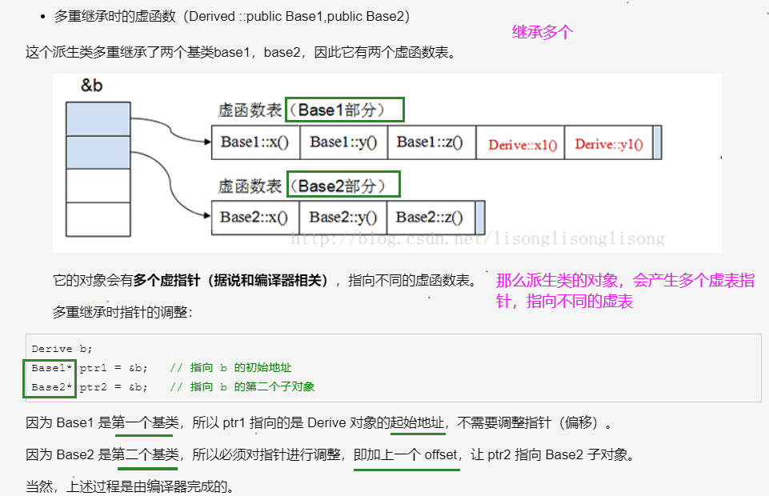

# C++小抄

## 内存管理

### 1.类的大小

假如有一个类A，里面没有任何成员，那么它的大小`sizeof(A)=1`，因为C++标准不允许大小为0的类，这是因为：

1. 使用`new`来动态为类对象分配一个空间的时候，不能分配为0的大小。
2. 避免使用除以`sizeof(A)`（为0）的情况

所以要给空类分配一个字节的大小。

假如现在有一个B类继承A类，且B类不为空，那么`sizeof(B)`就是**仅仅计算B内成员的大小，而继承的A的大小为0。**


空类的实例大小就是类的大小，所以sizeof(a)=1字节,如果a是指针，则sizeof(a)就是指针的大小，即4字节。

有**虚函数的类对象**中都有一个虚函数表指针 __vptr，其大小是4字节

```c++
class A { virtual Fun(){} };
int main(){
     cout<<sizeof(A)<<endl;// 输出 4(32位机器)/8(64位机器);
     A a; 
     cout<<sizeof(a)<<endl;// 输出 4(32位机器)/8(64位机器);
     return 0; 
}
```


静态成员存放在**静态存储区**，不占用类的大小, 普通函数也不占用类大小

```c++
class A { static int a; };
int main(){
     cout<<sizeof(A)<<endl;// 输出 1;
     A a; 
     cout<<sizeof(a)<<endl;// 输出 1;
     return 0; 
}
```

类对象的大小受哪些因素影响？

- 普通的非静态成员，根据类型大小判断
- 结构对齐而分配的大小
- 非静态成员不占用内存大小，成员函数也不占用内存大小
- 如果是派生类，继承基类的那一部分也会占用一定空间
- 类对象有虚函数的话，会在类对象中插入虚函数指针，会占用一个指针大小

### 2.C++的内存管理

在C++中，内存分成5个区，他们分别是堆、栈、全局/静态存储区和常量存储区和代码区

- **栈**，在执行函数时，函数内局部变量的存储单元都可以在栈上创建，函数执行结束时这些存储单元自动被释放。栈内存分配运算内置于处理器的指令集中，效率很高，但是分配的内存容量有限。
- **堆**，就是那些由new分配的内存块，他们的释放编译器不去管，由我们的应用程序去控制，一般一个new就要对应一个delete。如果程序员没有释放掉，那么在程序结束后，操作系统会自动回收。
- **全局/静态存储区**，内存在程序编译的时候就已经分配好，这块内存在程序的整个运行期间都存在。它主要存放静态数据（局部static变量，全局static变量）、全局变量和常量。
- **常量存储区**，这是一块比较特殊的存储区，他们里面存放的是常量字符串，不允许修改。
- **代码区**，存放程序的二进制代码

### 3.类的数据成员和成员函数内存分布情况

一个类对象的地址就是类所包含的这一片内存空间的首地址，这个首地址也就对应具体某一个成员变量的地址。（在定义类对象的同时这些成员变量也就被定义了）

成员函数不占用对象的内存。这是因为所有的函数都是存放在代码区的，不管是全局函数，还是成员函数。（要是成员函数占用类的对象空间，**那么将是多么可怕的事情**：定义一次类对象就有成员函数占用一段空间。）

函数都是放在代码区，不占用内存，静态函数也不例外，不要一看到 **static** 这个单词就主观的认为是存放在全局数据区，那是不对的。


### 4.关于this指针你知道什么？

性质

- 类内指针
- 只能在非静态成员函数内使用，且只能调用非静态成员，不能在全局函数、静态函数中使用
- this指针只有在 成员函数 中才有定义，且存储位置会因编译器不同有不同存储位置

this指针是一个类内隐含指针，指向类所占内存的首地址，也可以显式的调用非静态成员，比如`return a`，可以写成`return this.a`(a为非静态成员)。如果返回类本身`return *this`

编译器会对this指针进行优化，传递速度较快。

**创建销毁：**this在成员函数的开始前构造，在成员函数的结束后清除。这个生命周期同任何一个函数的参数是一样的，没有任何区别。当调用一个类的成员函数时，编译器将类的指针作为函数的this参数传递进去。如：

```c++
A a;
a.func(10);//此处，编译器将会编译成：A::func(&a,10);
```


**存放位置：**this指针会因编译器不同而有不同的放置位置。可能是栈，也可能是寄存器，甚至全局变量。在汇编级别里面，一个值只会以3种形式出现：立即数、寄存器值和内存变量值。不是存放在寄存器就是存放在内存中，它们并不是和高级语言变量对应的。


### 5.构造、析构函数里面不能调用virtual函数

```c++
class A{
	A(){ virtual func()};
	~A();
}
class B:public A{
	B(){};
	~B(){};
}
int main(){
	B b; // 错误！
}
```

C++的继承体系中，子类会先构造父类的数据成员，然后再构造自己的数据成员。

假设子类B创建一个对象b，调用构造函数`B()`，那么会先构造父类A的成员，也就是调用A的构造函数，接着A调用`func()`函数，由于是虚函数，会先调用子类，但注意，此刻子类还处于构造父类的过程，子类本身的数据成员（不同于父类的）是还未定义的！访问未定义的成员在C++中是不允许的，会引发未知错误！

### 6.如果一个类作为父类，最好声明析构函数为virtual函数

如果一个类不作为父类，则不该将析构声明为virtual函数。因为它没有子类，不用去做多余的事情

假如作为父类，那么将析构函数声明为virtual是必要的。多态性质的父类，析构函数为virtual时，析构函数的运作方式是，由最深层次的派生（最小的儿子）的那个子类的析构函数最先被调用，然后是其每一个的父类的析构函数被调用。

## C++11新标准

### 1.哪些新特性

- nullptr代替NULL
- auto、decltype关键字推导类型
- 基于范围的for(auto& a:A)遍历
- 类、结构的初始化列表
- Lambda表达式（匿名函数）
- forward_list（单向链表）

### 2.auto\decltype

**auto**：编译器通过初始值来进行类型的推演，从而获得变量的类型。所以说auto定义的变量必须有初始值

```c++
//普通；类型
int a = 1, b = 3;
auto c = a + b;// c为int型
//const类型
const int i = 5;
auto j = i; // 变量i是顶层const, 会被忽略, 所以j的类型是int
auto k = &i; // 变量i是一个常量, 对常量取地址是一种底层const, 所以b的类型是const int*
const auto l = i; //如果希望推断出的类型是顶层const的, 那么就需要在auto前面加上cosnt,需要显式

//引用和指针类型
int x = 2;
int& y = x;
auto z = y; //z是int型 不是int& 型!!!
auto& p1 = y; //p1是int&型,需要显式
auto p2 = &x; //p2是指针类型int*
```

**decltype**：如果希望从**表达式**中推断出要定义变量的类型，但却不想用表达式的值去初始化变量，可以使用(就是只使用类型，不使用内容)

它的作用是 选择并返回 操作数的数据类型。在此过程中，编译器只是分析表达式并得到它的类型，却**不进行实际的计算表达式**的值

```c++
int func() {return 0};
//普通类型
decltype(func()) sum = 5; // sum的类型是函数func()的返回值的类型int, 但是这时不会实际调用函数func()

int a = 0;
decltype(a) b = 4; // a的类型是int, 所以b的类型也是int

//不论是顶层const还是底层const, decltype都会保留 
const int c = 3;
decltype(c) d = c; // d的类型和c是一样的, 都是顶层const

int e = 4;
const int* f = &e; // f是底层const
decltype(f) g = f; // g也是底层const

//引用与指针类型
//1. 如果表达式是引用类型, 那么decltype的类型也是引用
const int i = 3, &j = i;
decltype(j) k = 5; // k的类型是 const int&
//2. 如果表达式是引用类型, 但是想要得到这个引用所指向的类型, 需要修改表达式:
int i = 3, &r = i;
decltype(r + 0) t = 5; // 此时是int类型
//3. 对指针的解引用操作 返回的是引用类型
int i = 3, j = 6, *p = &i;
decltype(*p) c = j; // c是int&类型, c和j绑定在一起
//4. 如果一个表达式的类型不是引用, 但是我们需要推断出引用, 那么可以加上一对括号, 就变成了引用
类型了
int i = 3;
decltype((i)) j = i; // 此时j的类型是int&类型, j和i绑定在了一起
```


### 3.nullptr\NULL

NULL是C语言中定义为(void*)，而在C++中则被定义为整数0

NULL有什么缺点？

> 在传入NULL参数时，会把NULL当做整数0来看，如果我们想**调用参数是指针**的函数，该怎么办
>
> 呢?nullptr在C++11被引入用于解决这一问题，nullptr可以**明确区分整型和指针类型**，不会与整型变量相混淆，能够根据环境自动转换成相应的指针类型，但不会被转换为任何整型，所以不会造成参数传递错误。

```c++
#include <iostream>
using namespace std;
void fun(char* p) {
 cout << "char*" << endl; 
}
void fun(int p) {
 cout << "int" << endl;
}
int main()
{
    fun(NULL); 
    return 0;
}
//输出结果：int
```


### 4.智能指针

智能指针是一个类，用来**存储** 指向动态分配对象资源 的**指针**，负责自动释放动态分配的对象，防止堆内存泄漏。动态分配的资源，交给一个类对象去管理，当类对象声明周期结束时，自动调用析构函数释放资源

```c++
class A{
	A(){};
	~A(){};
}
// 普通管理资源
void func1(){
	A *a;
	...
    delete a;
}
// 智能指针管理资源
void func2(){
	auto_ptr<A> *a;
	...
}
```

对于func1，指针a的释放依赖于程序员的自觉，这本身是不靠谱的，是人就存在错误的机会！

而对于func2，指针a由智能指针auto_ptr管理，只要该函数调用结束，即退出函数局部作用域，就会销毁。这一过程是如何做到的呢？

==》以对象在释放时自动调用析构函数这一机制，来使用智能指针对象来管理资源。

比如auto_ptr指针，是指向对象的指针（可以把它想象成一个罐装的容器），将需要管理的资源放到里面去。资源一旦获得，就让auto_ptr指向该资源（就将它放入罐子里）。我们知道，局部对象离开作用域是要被销毁的，所以当函数退出，auto_ptr就会调用析构函数，进行销毁，那么所指向的资源也会释放（罐子里的资源释放），就自动完成了资源的释放。整个过程，资源由智能指针管理。

**auto_ptr**：不能够用于STL容器。发生复制行为时，比如两个auto_ptr智能指针A，B，执行`A=B`，那么B所指向的资源（罐子里装的资源），会全部转移给A（全部倒到B中），而B则会置为nullptr。为什么要保证只能一个智能指针指向同一个资源呢？

==》如果赋值后两个都不为空，指向同一个资源，那么假如释放其中一个智能指针A，那么相应地，所管理的资源也会释放掉，而B指针却还指向那块资源，此时资源是释放掉不存在的，所以会引发错误。

**shared_ptr**：对资源引用进行计数的指针。可以追踪某个资源一共被多少个指针对象所指向。当计数为0的时候会自动的释放动态分配的资源。shared_ptr可以复制，不需要将另一个置为空。

那么如何计数的呢？

- 智能指针将一个计数器与类指向的资源对象相关联，引用计数器跟踪共有多少个指针共享同一资源
- 每次创建类的新对象（新资源）时，初始化指针并将对该资源的引用计数置为1
- 当对象作为另一对象的副本而创建时，拷贝构造函数 拷贝 指针，并增加与之相应的引用计数
- 对一个对象进行赋值时，赋值操作符**减少左操作数**所指对象的引用计数（如果引用计数为减至0，则删除对象），并**增加右操作数**所指对象的引用计数
- 调用析构函数时，构造函数减少引用计数（如果引用计数减至0，则删除基础对象）


## STL容器

### 1、左值右值

**左值**：可以获取地址的 表达式。可以出现在赋值语句的左边，对该表达式赋值。但是如果加上const的话，可以声明如下标识符，可以取地址，但不可以赋值了。

```c++
const int& a = 10;
```

**右值**：无法获取地址的对象。通常有：常量值、函数返回值、lambda表达式等。无法获取地址，但是可以对它进行改变，比如定义了右值的右值引用，就可以改变它。

### 2.解决哈希冲突

- **线性探测**：使用hash函数计算出的位置，如果已经有元素占用了，则向后依次寻找，找到表尾则回到表头，直到找到一个空位为止
- **开链法**：如果hash函数计算出的格子相同，则按顺序存在这个list中
- **再散列**：发生冲突时，使用另一种hash函数再计算一个地址，直到不冲突
- **二次探测**：使用hash函数计算出的位置如果已经有元素占用了，按照1^2、 2^2、 3^2、...这样的步长去找，直到不冲突位置为止。如果步长是随机数序列，则称为伪随机探测
- **公共溢出区**：一旦hash函数计算的结果相同，就放入公共溢出区


## 常见题

### 1.多态如何实现？

在基类的函数前，加上`virtual`关键字，然后派生类中`重写`该函数。

运行时，根据对象类型来调用相应的函数。

- 即如果对象类型是派生类，就调用派生类的函数，但是如果派生类没有重写该函数，那么调用对应基类的函数
- 如果对象类型是基类，则调用基类的函数。

```c++
#include <iostream>
using namespace std;
class Base{ // 基类
public:
     virtual void fun(){ // 虚函数
        cout << " Base::func()" <<endl;
     }
};
class Son1 : public Base{ // 派生类Son1
public:
     virtual void fun() override{
        cout << " Son1::func()" <<endl;
     }
};
class Son2 : public Base{};// 派生类Son2

int main()
{
    // 基类or派生类对象赋值给基类对象
    // 也可以理解为：基类指针对象指向 ==> 基类or派生类对象
     Base* base = new Son1; 
     base->fun(); // 调用派生类自己的
     base = new Son2;
     base->fun(); // 派生类Son2自己没有重写，所以调用基类的
     delete base;
     base = NULL;
     return 0;
}
// 运行结果
// Son1::func()
// Base::func()
```

如何出现多态性？

虚表：虚函数表的缩写，类中含有virtual关键字修饰的方法时，编译器会自动生成虚表，一个类有一个虚表，定义每一个对象时，都会生成一个vptr指针，指向类的虚表

虚表指针：在含有虚函数的类实例化对象时，对象地址的前四个字节（保证虚函数表有最高的性能），会保存一个指针，指向虚表地址。


**上图中展示了虚表和虚表指针在基类对象和派生类对象中的模型，下面阐述实现多态的过程**

- 编译器发现基类中有虚函数时，会自动为每个含有虚函数的类生成一份虚表。该表是一个一维数组，虚表里保存了虚函数的入口地址
- 编译器会在每个对象的前4个字节（无论是基类对象还是派生类对象），保存一个虚表指针，即`vptr`，指向对象所属类的虚表。在构造的时候，比如`Base* base = new Son1 `，会根据对象的类型去初始化虚指针vptr，从而让vptr指向正确的虚表，从而在调用函数的时候，能找到正确的函数
- 当涉及到多态性的时候，采用了虚函数和动态绑定，此时的调用就不会在**编译时候确定而是在运行时确定**。所谓合适的时机，就是在派生类定义对象时，程序会自动调用构造函数，**先在构造函数中创建虚表**，并初始化。然后调用基类构造函数构造基类，此时编译器“只看到”基类，并为基类创建虚表，且让一个虚表指针指向它。再调用派生类构造函数构造派生类，创建派生类自己的虚表，并让一个虚表指针指向派生类的虚表。
- 当派生类对基类的虚函数没有进行重写时，派生类的虚表指针会指向基类的虚表，**其实还是自己的虚表，因为派生类将基类的虚函数地址拷贝到了自己的虚表中**；进行了重写的话，则会指向自己的虚表；当派生类中有自己的虚函数时，在自己的虚表中，将此虚函数地址添加到后面（基类虚函数地址、派生类虚函数地址）

[参考](https://www.cnblogs.com/xiaokang01/p/12394420.html)

**注：对象不包含虚函数表，只有虚指针，类才包含虚函数表，派生类会生成一个兼容基类的虚函数表。**





