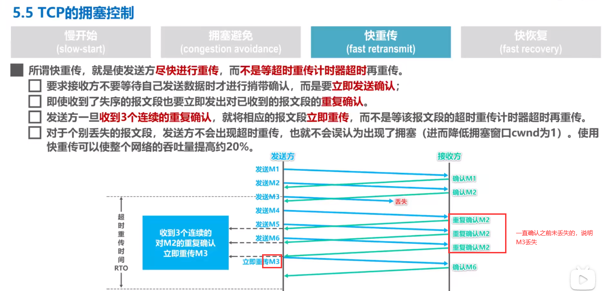

# 计算机网络

## 传输层

### 1、拥塞控制

**慢开始（指数增长）-->拥塞避免（线性增长）**

**快重传**

**快恢复：**

**4个过程总结如下：**

### 2、键入网址到页面显示，期间发生了什么？

客户端：

1. 客户端首先会通过DNS将url的域名进行解析，得到目标服务器IP地址
2. 得到http请求数据报：消息头、请求数据、请求协议
3. 将http数据发送给传输层，指定源端口、目的端口、序列号等，即加上TCP or UDP协议头部
4. 把上一层传下来的包到网络层，加上源IP地址、目的IP地址，即加上IP头部，使包有了远程定位功能
5. 接下来包传到数据链路层，加上MAC帧，里面包含源MAC、下一个要转发的设备点的MAC地址，用于两个设备的包转发
6. 通过网卡进行发送

服务端：

1. 接收到客户端发来的包后，先核对MAC帧，如果对应的目的MAC地址是服务器自己的，就收下，否则丢弃
2. 收下后，拆包，先拆下MAC帧，露出IP地址，发现IP地址正是自己，于是读取IP中的协议项，知道上层是TCP协议
3. 于是继续扒开TCP的头部，发现了里面的序列号，如果这个序列号是服务器想要的，就放入缓存然后返回一个ACK，如果不是则丢弃。TCP还有一个端口号，HTTP服务器正在监听这个端口号
4. 于是扒掉TCP头部，将露出的http数据包发给http进程
5. http进程将这个包请求的页面封装到http响应报文。这个是服务器要发送给客户端的包。
6. 接下来也跟之前客户端发包一样，需要加上tcp、ip、mac头部，然后通过网卡发给客户端

客户端收到包后，跟服务器一样拆包，然后剩下http响应报文放到浏览器中去渲染。

最后，四次挥手断开连接。

**简洁回答：**

1. 首先对url进行域名解析，检查顺序：浏览器缓存、系统缓存、路由器缓存、ISPDNS缓存（一般是通信提供方，比如中国移动）、根域名服务器
2. 浏览器向服务器发送一个http请求报文
3. 服务器向浏览器返回一个响应请求报文
4. 浏览器解析并渲染响应报文相关内容给用户

### 3、TCP\UDP相关的特点？

tcp是一种面向连接的、可靠的传输协议、字节流的传输层协议。传输的单位是报文段。

- 面向连接：一对一的连接，不像UDP可以向多个主机发起连送消息
- 可靠的：无论网络的状况如何，保证信息一定送达
- 字节流：消息包是没有边界的，无论多大的消息，都可以进行传输。并且消息包是有序的，当没有收到对应的包序号，会要求重传。在重组消息时，按序重组，重复的包会丢弃

udp是一种面向无连接的、尽最大努力传输数据的用户数据报协议。传输的单位是用户数据报。

### 4、服务器监听一个端口，最大的tcp连接数是多少？

理论上，tcp连接最大值 = 客户端ip地址数 * 客户端端口数 = (2 ^ 32) * (2 ^ 16 ) = 2 ^ 48

但是这是不可能的。

- 服务器维护tcp连接的是一个socket文件，受服务器系统文件描述符的限制，可以通过ulimit来修改系统能够使用的文件的最大个数
- 受限于服务器内存大小，维护的连接的请求数据在内存缓存中占用一定空间，连接数太大会内存不足。

### 5、tcp\udp的区别

1. 连接
   - tcp提供面向连接的服务，两端传送信息前需要先建立连接
   - udp提供面向无连接的服务，即时通信
2. 可靠性
   - tcp：不管网络链路状况如何，都保证传输到对方，保证数据不重复、不丢失、无差别、按需交付
   - udp：尽最大努力交付，但不保证一定传输到对方
3. 传输方式
   - tcp：基于字节流传输，没有边界，但可以保证有序、可靠
   - udp：基于一个一个包发送，有边界，可能乱序、丢包
4. 服务对象
   - 一对一服务
   - 一对多、一对一、多对多服务
5. 首部开销
   - tcp：20字节（没有使用`选项`字段），使用`选项`字段还会更长，首部开销还是较大的	
   - udp：8字节，固定不变
6. 分片方式
   - tcp：要发送的数据大小如果大于MSS（最大报文长度），在**传输层**需要进行分片，对方收到后，在传输层根据序号将数据分片进行组装，如果缺少哪个数据分片，则要求对方重传这一分片即可
   - udp：发送的数据如果大于MTU（最大传输单元），在**网络层**需要进行分片，对方收到后，在网络层组装数据，传到传输层。如果丢失分片，那么对方需要**重新传送全部数据**，非常没有效率，所以udp尽量不要分片，使发送的数据小于MTU
7. 应用场景
   - tcp：用于传输大文件、http\https
   - udp：包总量比较小，比如dns、视频音频通信、广播

### 6、说一说三次握手？

两次握手可以证明客户端有发送、接收数据的能力，但是对于另一端的服务端，只证明有接收能力，不能证明有发送的能力。

所以需要第三次握手，来证明服务端也是有发送的能力。

三次握手是证明通信双方能够发送、接收数据（即全双工通信）的最少次数。

1. 第一次握手：客户端将`SYN置1`，随机产生一个序列号`seq = J`发送给服务端，客户端进入**SYN_SENT**状态 
2. 第二次握手：服务端收到客户端的`SYN = 1`后，知道客户端想要发起连接，于是将自己的SYN = 1, ACK = 1，并产生一个确认收到对方包acknowledge number，简称ack = 客户端发来的序列号seq + 1，表示ack之前的包都已经收到，希望收到的包的序列号是ack。**同时也随机产生**一个序列号`seq = K`发送给客户端，服务端进入**SYN_RCVD**状态
3. 第三次握手：
   - 客户端检查ack是否等于自己上一次发送的序列号+1，即`ack是否等于J+1`，以及`ACK是否等于1`，检查正确后将自己的ACK置1，产生一个ack = 服务器发的序列号 + 1，发送给服务器，客户端进入ESTABLISHED状态；
   - 服务端收到后，检查`ACK = 1并且ack = 上次发送给客户端的序列号 + 1 = K + 1`后，也进入ESTABLISHED状态。
   - 完成三次握手，连接建立。

### 7、为什么不能两次握手？

有两个原因

1. 已经失效了的连接请求又到了服务器端。
   - client 发出的第一个连接请求报文段并没有丢失，而是在某个网络结点**长时间的滞留**了，以致延误到连接释放以后的某个时间才到达 server（**即客户端服务端连接已经断开**）。
   - 本来这是一个**早已失效**的报文段。但 server 收到此失效的连接请求报文段后，就**误认为**是 client 再次发出的一个新的连接请求。于是就向 client 发出确认报文段，同意建立连接。
   - 假设不采用 “三次握手”，那么只要 server 发出确认，新的连接就建立了。由于现在 client 并没有发出建立连接的请求，因此不会理睬 server 的确认，也不会向 server 发送数据。但 server 却以为新的运输连接已经建立，并一直等待 client 发来数据。这样，server 的很多资源就白白浪费掉了。
   - 采用“三次握手”的办法可以防止上述现象发生。例如刚才那种情况，client 不会向 server 的确认发出确认。server 由于收不到确认（**第三次握手确认第二次握手的确认**），就知道 client 并没有要求建立连接。
2. 无法保证客户端收到第二次握手的报文（服务端无法确认客户端是否收到），也无法保证客户端和服务端之间是否成功互换了初始序列号。

### 8、可以4次握手吗？

可以，但是降低效率。

四次握手是指：

- 第二次握手：Server只发送ACK和acknowledge number，**不发送序列号**；
- 而Server的SYN和初始序列号在第三次握手时发送（三次握手中是服务端在第二次握手就给客户端发送一个随机产生的序号）；**而原来协议**中的第三次握手变为第四次握手。出于优化目的，四次握手中的二、三可以合并。

### 9、第三次握手中，如果客户端的ACK未送达服务器，会怎样？

服务端

- 如果没有收到客户端对第二次握手的应答，那么服务端会以为第二次握手发送的数据没有送达，会重发第二次握手的SYN+ACK（默认重发5次，之后若还是没有收到应答ACK会关闭连接进入CLOSED状态），客户端收到后会重传ACK给服务端

客户端，两种情况：

- 客户端收到服务端重发的ACK
  - 在服务端重发第二次握手的ACK的过程中，**如果**（不是这种情况下也是握手失败的）客户端给服务端发送数据，数据头部ACK是为1的，服务端收到后读取到序列号ack，就会进入ESTABLISHED状态（三次握手成功）
- 客户端没有收到服务端重发的ACK，握手失败，关闭连接
  - 在Server进入CLOSED状态之后（服务端重发5次，但是客户端没收到），如果Client向服务器发送数据，服务器会以RST包（**客户端或服务器异常关闭tcp连接发的包**）应答。

### 10、如果已经建立了连接，但客户端出现了故障怎么办？

服务器每收到一次客户端的请求后都会**重新复位**一个计时器，时间通常是设置为2小时。

若两小时还没有收到客户端的任何数据，服务器就会发送一个**探测报文段**，以后每隔75秒钟发送一次。

若一连发送10个探测报文仍然没反应，服务器就认为客户端出了故障，接着就关闭连接。

### 11、四次挥手

- 第一次挥手：客户端将FIN置为1，发送一个序列号seq给服务端；进入**FIN_WAIT_1**状态；
- 第二次挥手：服务端收到FIN之后，发送一个ACK=1，acknowledge number = 收到的序列号+1；进入**CLOSE_WAIT**状态。此时客户端已经没有要发送的数据了，但仍可以接受服务器发来的数据。
- 第三次挥手：服务端将FIN置1，发送一个序列号给客户端；进入**LAST_ACK**状态；
- 第四次挥手：客户端收到服务器的FIN后，进入**TIME_WAIT**状态；接着将ACK置1，发送一个acknowledge number=序列号+1给服务器；服务器收到后，确认acknowledge number后，变为**CLOSED**状态，不再向客户端发送数据。客户端等待2*MSL（报文段最长寿命）时间后，也进入CLOSED状态。完成四次挥手。

### 12、为什么不能把服务器发送的ack（确认号）和FIN合并起来，变成三次挥手（CLOSE_WAIT状态意义是什么）？

因为这个时候服务器可能还有数据没有发完，所以先回复一个ack表示同意客户端提出的断开连接的请求。

服务端数据发完以后，再发FIN，表示自己这边也可以开始断开连接。

### 13、如果第二次挥手时服务器的ACK没有送达客户端，会怎样？

客户端没有收到ACK确认，会重新发送FIN请求。

### 14、客户端TIME_WAIT状态的意义是什么？

第4次挥手时，客户端给服务端发送的ACK可能丢失，TIME_WAIT状态就是用来重发可能丢失的ACK报文。如果服务端没有收到ACK，就会重发FIN，如果客户端在 2MSL 的时间内收到了FIN，就会重发ACK并再次等待 2MSL ,防止服务端没有收到ACK而不断重发FIN。

MSL(Maximum Segment Lifetime)，指一个片段在网络中最大的存活时间，2MSL就是一个发送和一个回复所需的最大时间。如果直到2MSL，Client都没有再次收到FIN，那么Client推断ACK已经被成功接收，则结束TCP连接。
