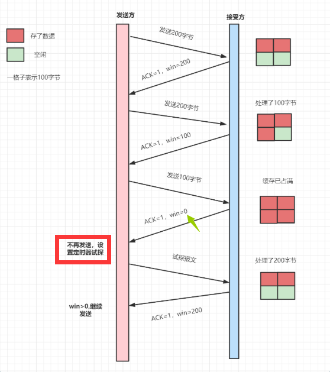

# 计算机网络

[TOC]


## 应用层

### 1、OSI七层网络协议

[参考链接](https://mp.weixin.qq.com/s?__biz=MzAwMDAxNjU4Mg==&mid=2247484204&idx=1&sn=0e83aabb2a48570b5bec563a777f4d26&scene=21#wechat_redirect)


### 2、http报文格式

#### 请求报文


- ##### **请求行**
  
  - 请求方法
    - get：请求指定的页面信息，并返回消息主体(body) + 头信息(header)。
    - post ：向服务器提交数据。这个方法用途广泛，几乎目前所有的提交操作都是靠这个完成。POST跟GET最常用，**但最大的区别在于，POST每次调用都可能会修改数据，是非幂等的，而GET类似于只读，是幂等的**。
    - options：它用于获取当前URL所支持的方法。若请求成功，则它会在HTTP响应头部中带上给各种“Allow”的头，表明某个请求在对应的服务器中都支持哪种请求方法。
      - 使用场景：在**跨域**的情况下，浏览器发起**复杂请求前**会**自动**发起 options 请求。跨域共享标准规范要求，对那些可能对服务器数据产生副作用的 HTTP 请求方法（特别是 GET 以外的 HTTP 请求，或者搭配某些 MIME 类型的 POST 请求），浏览器必须首先使用 options 方法发起一个预检请求，从而获知服务端是否允许该跨域请求。服务器确认允许之后，才发起实际的 HTTP 请求。
  - **url**
  - **协议版本号**
- ##### **请求头部** 
- ##### **请求数据**

```http
GET /cmaskboss/164203142_30_1.enhance.webmask HTTP/1.1
Host: upos-sz-staticks3.bilivideo.com
Connection: keep-alive
User-Agent: Mozilla/5.0 (Macintosh; Intel Mac OS X 10_14_3) AppleWebKit/537.36 (KHTML, like Gecko) Chrome/88.0.4324.150 Safari/537.36
Accept: */*
Origin: https://www.bilibili.com
Sec-Fetch-Site: cross-site
Sec-Fetch-Mode: cors
Sec-Fetch-Dest: empty
Referer: https://www.bilibili.com/
Accept-Encoding: identity
Accept-Language: zh-CN,zh;q=0.9
Range: bytes=0-16
```

第一行的GET 就是**请求方法**，`/cmaskboss/164203142_30_1.enhance.webmask` 则是 **URL** , 而`HTTP/1.1`则是**协议版本**。接下来从`Host`开始到最后一行`Range`，都是**Headers头**。

#### 响应报文

- 状态行
- 响应头部
- 响应数据


```http
HTTP/1.1 206 Partial Content
Content-Type: application/octet-stream
Content-Length: 17
Connection: keep-alive
Server: Tengine
ETag: "92086de1e6d1d4791fb950a0ac7e30ba"
Date: Sat, 30 Jan 2021 09:31:31 GMT
Last-Modified: Sun, 04 Oct 2020 01:54:28 GMT
Expires: Mon, 01 Mar 2021 09:31:31 GMT
Age: 1018695
Content-Range: bytes 0-16/353225
Accept-Ranges: bytes
X-Application-Context: application
x-kss-request-id: 75bcbfa8ab194e3c825e89c81a912692
x-kss-BucketOwner: MjAwMDAyMDEwNw==
X-Info-StorageClass: -
Content-MD5: kght4ebR1HkfuVCgrH4wug==
X-Cache-Status: HIT from KS-CLOUD-JH-MP-01-03
X-Cache-Status: HIT from KS-CLOUD-TJ-UN-14-13
X-Cache-Status: HIT from KS-CLOUD-LF-UN-11-25
Access-Control-Allow-Origin: https://www.bilibili.com
Access-Control-Allow-Headers: Origin,X-Requested-With,Content-Type,Accept,range
X-Cdn-Request-ID: 7e2c783ca7d392624118593ec1dc66bc
```

类似请求报文，`HTTP/1.1`是**协议版本**，`206`是**状态码**，`Partial Content` 则是**状态描述符**。接下来从`Content-Type`开始到最后一行`X-Cdn-Request-ID`都是**Headers信息**。

### 3、状态码

HTTP Status Code是常说的HTTP状态码。当用户访问一个网页时，浏览器会向网页所在服务器发出请求。

服务器则会根据请求作出响应，而状态码则是响应的一部分，代表着本次请求的结果。

所有状态码的第一个数字代表了响应的大概含义，组合上第二第三个数字则可以表示更具体的原因。

如果请求失败了，通过这个状态码，大概初步判断出这次请求失败的原因。以下是五类状态码的含义。

| 状态码 | 含义                                     |
| ------ | ---------------------------------------- |
| 1XX    | 指示信息--表示请求已接收，继续处理       |
| 2XX    | 成功--表示请求已被成功接收、理解、接受   |
| 3XX    | 重定向--要完成请求必须进行更进一步的操作 |
| 4XX    | 客户端错误--请求有语法错误或请求无法实现 |
| 5XX    | 服务器错误--服务器错误未能实现合法的请求 |

可以根据以下流程图了解下各类状态码间的关系。


#### 常见状态码

- 200 OK
  - 这是最常见的状态码。代表请求已成功，数据也正常返回。而B站猫片里虽然响应成功了，但却不是200，而是206，是为什么呢，接下去继续看看。
- 206 Partial Content
  - 这个状态码在上面B站请求的响应结果。服务器已经成功处理了部分 GET 请求。类似于B站看视频或者迅雷这类的 HTTP下载工具都是使用此类响应实现断点续传或者将一个大文档分解为多个下载段同时下载。
- 307 Temporary Redirect
  - 内部重定向。重定向的意思是，当你输入一个网址的时候，浏览器会自动帮你跳转到另外一个网址上。比如，当你在浏览器输入框输入`http://www.baidu.com/`时。由于使用http并不安全，百度会自动帮你跳转到它对应的https网页上。而此时，需要重定向的地址，会通过`Response Headers`的`Location`返回
- 404 Not Found
  - 请求失败，请求所希望得到的资源未被在服务器上发现。出现这个错误的最有可能的原因是服务器端没有这个页面，或者是Request Method与注册URL的Method不一致，比如我有一个URL在服务端注册的Request Method 为 **POST**，但调用的时候却错误用了**GET**，则也会出现404错误。
- 499 Client has closed connection
  - 网络请求过程中，由于服务端处理时间过长，客户端超时。一般常见于，后端服务器处理时间过长，而客户端也设置了一个超时等待时间，客户端等得“不耐烦”了，主动关掉连接时报出。
  - 图示：
- 502 Bad Gateway
  - 服务器方面无法给予正常的响应。一般常见于服务器崩溃后，nginx 无法正常收到服务端的响应，给客户端返回502状态码。
  - 图示：
- 504 Gateway Timeout
  - 网络请求过程中，**由于服务端处理时间过长，网关超时**。一般常见于，后端服务器逻辑处理时间过长，甚至长于 nginx设置的最长等待时间时报错。它跟 499 状态码非常像，区别在于499 表示的是客户端超时，504是网关超时。如果是499超时，可以考虑修改客户端的代码调整超时时间，如果是504，则考虑调整nginx的超时配置。
  - 图示：

### 4、长连接和短连接

- Connection: close
  - 表示请求响应完成之后**立即关闭连接**，这是HTTP/1.0请求的默认值。每次请求都经过“创建tcp连接 -> 请求资源 -> 响应资源 -> 释放连接”这样的过程
- Connection: keep-alive
  - 表示**连接不立即关闭**，可以继续响应下一个请求。HTTP/1.1的请求默认使用一个持久连接。可以做到只建立一次连接，多次资源请求都复用该连接，完成后关闭。流程上是 建立tcp连接 -> 请求资源 -> 响应资源 -> … （保持连接）…  ->  第n次请求资源 -> 第n次响应资源 -> 释放连接。

在http1.1中Request Header和Reponse Header中都有可能出现一个Connection: keep-alive 头信息。Request Header里的Connection: keep-alive 头是为了告诉服务端，客户端想要以长连接形式进行通信。而Response Header里的Connection: keep-alive 头是服务端告诉客户端，我的服务器支持以长连接的方式进行通信。如果不能使用长连接，会**返回  Connection: close ，相当于告诉客户端“我不支持长连接，你死了这条心，老老实实用短连接吧**” 。

#### HTTP为什么要使用长连接

我们知道 HTTP 建立在 TCP 传输层协议之上，而 TCP 的建立需要三次握手，关闭需要四次挥手，这些步骤都需要时间，带给 HTTP 的就是请求响应时延。

如果使用短连接，那么每次数据传输都需要经历一次上面提到的几个步骤，如果能只连接一次，保持住这个连接不断开，期间通信就可以省下建立连接和断开连接的过程，对于提升HTTP性能有很大的帮助。

短连接图示：


可以看到，在使用 Connection: close 通信时，每次都需要重新经历一次握手挥手。可以通过 **Connection: keep-alive** 省下这部分的资源消耗。

长连接


#### 总结

- **长连接**可以**省去较多的TCP建立和关闭的操作，减少浪费，节约时间**。对于频繁请求资源的客户来说，较适用长连接。但是在长连接的应用场景下，需要有一方主动关闭连接。如果客户端和服务端之间的连接一直不关闭的话，连接数则会越来越多，严重的时候会造成资源占用过高。
- **解决方案**：如果这些连接其实长时间内并没有任何数据传输的话，那其实属于空闲连接，这时候可以在服务端**设置空闲连接的存活时间**，超过一定时间后由服务端主动断掉，从而保证无用连接及时释放。

### 5、Cookies

#### Cookies是什么

1. Cookie 是浏览器访问服务器后，服务器传给浏览器的一段数据。里面一般带有该浏览器的身份信息。
2. 浏览器需要保存这段数据，不得轻易删除。
3. 此后每次浏览器访问该服务器，都必须带上这段数据。服务器用使用这段数据确认浏览器身份信息。

#### Cookie的作用

Cookie 一般有两个作用。

1.识别用户身份。

- 举个例子。用户 A 用浏览器访问了“猫猫网”，“猫猫网”的服务器就会立刻给 A 返回一段Cookie数据，内含「uid=a」。
- 当 A 再次访问“猫猫网”下的其他页面时，比如跳转到“猫猫交友评论”，就会附带上「uid=a」这段数据。
- 同理，用户 B 用浏览器访问“猫猫网” 时，就给 B 分配了一段Cookie数据，内含「uid=b」。B 之后访问“猫猫网”的时候，就会一直带上「uid=b」这段数据。
- 因此“猫猫网”的服务器通过Cookie数据就能区分 A 和 B 两个用户了。

2.持久化用户信息。

- 因为cookies的数据会被用户浏览器保存到本地下。因此可以利用这一特点保持一些简单的用户数据。
- 比如一些博客网站，可以通过cookies记录下用户的性别年龄等信息，以此进行一些个性化展示。
- 当然上面提到的都是一些比较粗糙的场景，是为了方便大家理解cookies的功能。实际使用cookies会非常谨慎。


### 6、https

- HTTPS 并不是新协议，而是让 HTTP先 和 SSL（Secure Sockets Layer）通信，再由 SSL 和 TCP 通信，
- 也就是说HTTPS使用了`隧道`进行通信。
- 通过使用SSL，HTTPS具有了加密（防窃听）、认证（防伪装）和 完整性保护（防篡改）。

### 7、HTTP的缺点有哪些？

- 使用明文进行通信，内容可能会被窃听；
- 不验证通信方的身份，通信方的身份有可能遭遇伪装；
- 无法证明报文的完整性，报文有可能遭篡改。

### 8、HTTPS采用的加密方式有哪些？是对称还是非对称？

HTTPS 采用混合的加密机制，使用非对称密钥加密用于传输对称密钥，来保证传输过程的安全性，

之后使用对称密钥加密进行通信来保证通信过程的效率。


## 传输层

### 1、拥塞控制

拥塞控制是**作用于网络的，防止过多的数据包注入到网络中，避免出现网络负载过大的情况**。它的目标主要是最大化利用网络上瓶颈链路的带宽。它跟**流量控制**又有什么区别呢？流量控制是作用于接收者的，根据**接收端的实际接收能力控制发送速度**，防止分组丢失的。

我们可以把网络链路比喻成一根水管，如果我们想最大化利用网络来传输数据，那就是尽快让水管达到最佳充满状态

发送方维护一个拥塞窗口cwnd的变量，用来估算一段时间内数据链路上能够通过的数据量大小。它的大小是动态变化的，代表着链路的拥堵情况。

#### 拥塞控制常见算法：

##### 慢开始、拥塞避免

**慢开始（指数增长）-->拥塞避免（线性增长）**


##### 快重传


##### 快恢复


##### 4个过程总结如下


### 2、键入网址到页面显示，期间发生了什么？


客户端：

1. 客户端首先会通过DNS将url的域名进行解析，得到目标服务器IP地址
2. 得到http请求数据报：消息头、请求数据、请求协议
3. 将http数据发送给传输层，指定源端口、目的端口、序列号等，即加上TCP or UDP协议头部
4. 把上一层传下来的包到网络层，加上源IP地址、目的IP地址，即加上IP头部，使包有了远程定位功能
5. 接下来包传到数据链路层，加上MAC帧，里面包含源MAC、下一个要转发的设备点的MAC地址，用于两个设备的包转发
6. 通过网卡进行发送

服务端：

1. 接收到客户端发来的包后，先核对MAC帧，如果对应的目的MAC地址是服务器自己的，就收下，否则丢弃
2. 收下后，拆包，先拆下MAC帧，露出IP地址，发现IP地址正是自己，于是读取IP中的协议项，知道上层是TCP协议
3. 于是继续扒开TCP的头部，发现了里面的序列号，如果这个序列号是服务器想要的，就放入缓存然后返回一个ACK，如果不是则丢弃。TCP还有一个端口号，HTTP服务器正在监听这个端口号
4. 于是扒掉TCP头部，将露出的http数据包发给http进程
5. http进程将这个包请求的页面封装到http响应报文。这个是服务器要发送给客户端的包。
6. 接下来也跟之前客户端发包一样，需要加上tcp、ip、mac头部，然后通过网卡发给客户端

客户端收到包后，跟服务器一样拆包，然后剩下http响应报文放到浏览器中去渲染。

最后，四次挥手断开连接。

**简洁回答：**

1. 首先对url进行域名解析，检查顺序：浏览器缓存、系统缓存、路由器缓存、ISPDNS缓存（一般是通信提供方，比如中国移动）、根域名服务器
2. 浏览器向服务器发送一个http请求报文
3. 服务器向浏览器返回一个响应请求报文
4. 浏览器解析并渲染响应报文相关内容给用户

### 3、TCP\UDP相关的特点？

tcp是一种面向连接的、可靠的传输协议、字节流的传输层协议。传输的单位是报文段。

- 面向连接：一对一的连接，不像UDP可以向多个主机发起连接消息
- 可靠的：无论网络的状况如何，保证信息一定送达
- 字节流：消息包是没有边界的，无论多大的消息，都可以进行传输。并且消息包是有序的，当没有收到对应的包序号，会要求重传。在重组消息时，按序重组，重复的包会丢弃

udp是一种面向无连接的、尽最大努力传输数据的用户数据报协议。传输的单位是用户数据报。

### 4、服务器监听一个端口，最大的tcp连接数是多少？

理论上，tcp连接最大值 = 客户端ip地址数 * 客户端端口数 = (2 ^ 32) * (2 ^ 16 ) = 2 ^ 48

但是这是不可能的。

- 服务器维护tcp连接的是一个socket文件，受服务器系统文件描述符的限制，可以通过ulimit来修改系统能够使用的文件的最大个数
- 受限于服务器内存大小，维护的连接的请求数据在内存缓存中占用一定空间，连接数太大会内存不足。

### 5、tcp\udp的区别

1. 连接
   - tcp提供面向连接的服务，两端传送信息前需要先建立连接
   - udp提供面向无连接的服务，即时通信
   
2. 可靠性
   - tcp：不管网络链路状况如何，都保证传输到对方，保证数据不重复、不丢失、无差别、按需交付
   - udp：尽最大努力交付，但不保证一定传输到对方
   
3. 传输方式
   - tcp：基于字节流传输，没有边界，但可以保证有序、可靠
   - udp：基于一个一个包发送，有边界，可能乱序、丢包
   
4. 服务对象
   - tcp：一对一服务
   - udp：一对多、一对一、多对多服务
   
5. 首部开销
   - tcp：20字节（没有使用`选项`字段），使用`选项`字段还会更长，首部开销还是较大的	
   - udp：8字节，固定不变
   
6. 分片方式
   
   
   
   - tcp：要发送的数据大小如果大于`MSS（最大报文长度）`，在**传输层**需要进行分段，对方收到后，在传输层根据 **序号** 将数据分段进行组装，如果缺少哪个数据分段，则要求对方重传这一分段即可。**数据在TCP分段，就是为了在IP层不需要分片，同时发生重传的时候只重传分段后的小份数据**。如果传输层没分段，那么IP层就可能会进行分片。
   - udp：发送的数据如果大于`MTU（最大传输单元）`，在**网络层**需要进行分片，对方收到后，在网络层组装数据，传到传输层。如果丢失分片，那么对方需要**重新传送全部数据**，非常没有效率，所以udp尽量不要分片，使发送的数据小于MTU
   
7. 应用场景
   - tcp：用于传输大文件、http\https
   - udp：包总量比较小，比如dns、视频音频通信、广播

### 6、说一说为什么不能两次握手，以及三次握手的原因？

两次握手可以证明客户端有发送、接收数据的能力，但是对于另一端的服务端，只证明有接收能力，不能证明有发送的能力。

所以需要第三次握手，来证明服务端也是有发送的能力。

三次握手是证明通信双方能够发送、接收数据（即全双工通信）的最少次数。


1. 第一次握手：客户端将`SYN置1`，随机产生一个序列号`seq = J`发送给服务端，客户端进入**SYN_SENT**状态 
2. 第二次握手：服务端收到客户端的`SYN = 1`后，知道客户端想要发起连接，于是将自己的SYN = 1, ACK = 1，并产生一个确认收到对方包acknowledge number，简称ack = 客户端发来的序列号seq + 1，表示ack之前的包都已经收到，希望收到的包的序列号是ack。**同时也随机产生**一个序列号`seq = K`发送给客户端，服务端进入**SYN_RCVD**状态
3. 第三次握手：
   - 客户端检查ack是否等于自己上一次发送的序列号+1，即`ack是否等于J+1`，以及`ACK是否等于1`，检查正确后将自己的ACK置1，产生一个ack = 服务器发的序列号 + 1，发送给服务器，客户端进入ESTABLISHED状态；
   - 服务端收到后，检查`ACK = 1并且ack = 上次发送给客户端的序列号 + 1 = K + 1`后，也进入ESTABLISHED状态。
   - 完成三次握手，连接建立。

### 7、为什么不能两次握手？

有两个原因

1. 已经失效了的连接请求又到了服务器端。
   - client 发出的第一个连接请求报文段并没有丢失，而是在某个网络结点**长时间的滞留**了，以致延误到连接释放以后的某个时间才到达 server（**即客户端服务端连接已经断开**）。
   - 本来这是一个**早已失效**的报文段。但 server 收到此失效的连接请求报文段后，就**误认为**是 client 再次发出的一个新的连接请求。于是就向 client 发出确认报文段，同意建立连接。
   - 假设不采用 “三次握手”，那么只要 server 发出确认，新的连接就建立了。由于现在 client 并没有发出建立连接的请求，因此不会理睬 server 的确认，也不会向 server 发送数据。但 server 却以为新的运输连接已经建立，并一直等待 client 发来数据。这样，server 的很多资源就白白浪费掉了。
   - 采用“三次握手”的办法可以防止上述现象发生。例如刚才那种情况，client 不会向 server 的确认发出确认。server 由于收不到确认（**第三次握手确认第二次握手的确认**），就知道 client 并没有要求建立连接。
2. 无法保证客户端收到第二次握手的报文（服务端无法确认客户端是否收到），也无法保证客户端和服务端之间是否成功互换了初始序列号。

### 8、可以4次握手吗？

可以，但是降低效率。

四次握手是指：

- 第二次握手：Server只发送ACK和acknowledge number，**不发送序列号**；
- 而Server的SYN和初始序列号在第三次握手时发送（三次握手中是服务端在第二次握手就给客户端发送一个随机产生的序号）；**而原来协议**中的第三次握手变为第四次握手。出于优化目的，四次握手中的二、三可以合并。

### 9、第三次握手中，如果客户端的ACK未送达服务器，会怎样？

服务端

- 如果没有收到客户端对第二次握手的应答，那么服务端会以为第二次握手发送的数据没有送达，会重发第二次握手的SYN+ACK（默认重发5次，之后若还是没有收到应答ACK会关闭连接进入CLOSED状态），客户端收到后会重传ACK给服务端

客户端，两种情况：

- 客户端收到服务端重发的ACK
  - 在服务端重发第二次握手的ACK的过程中，**如果**（不是这种情况下也是握手失败的）客户端给服务端发送数据，数据头部ACK是为1的，服务端收到后读取到序列号ack，就会进入ESTABLISHED状态（三次握手成功）
- 客户端没有收到服务端重发的ACK，握手失败，关闭连接
  - 在Server进入CLOSED状态之后（服务端重发5次，但是客户端没收到），如果Client向服务器发送数据，服务器会以RST包（**客户端或服务器异常关闭tcp连接发的包**）应答。

### 10、如果已经建立了连接，但客户端出现了故障怎么办？

服务器每收到一次客户端的请求后都会**重新复位**一个计时器，时间通常是设置为2小时。

若两小时还没有收到客户端的任何数据，服务器就会发送一个**探测报文段**，以后每隔75秒钟发送一次。

若一连发送10个探测报文仍然没反应，服务器就认为客户端出了故障，接着就关闭连接。

### 11、四次挥手


- 第一次挥手：客户端将FIN置为1，发送一个序列号seq给服务端；进入**FIN_WAIT_1**状态；
- 第二次挥手：服务端收到FIN之后，发送一个ACK=1，acknowledge number = 收到的序列号+1；进入**CLOSE_WAIT**状态。此时客户端已经没有要发送的数据了，但仍可以接受服务器发来的数据。
- 第三次挥手：服务端将FIN置1，发送一个序列号给客户端；进入**LAST_ACK**状态；
- 第四次挥手：客户端收到服务器的FIN后，进入**TIME_WAIT**状态；接着将ACK置1，发送一个acknowledge number=序列号+1给服务器；服务器收到后，确认acknowledge number后，变为**CLOSED**状态，不再向客户端发送数据。客户端等待2*MSL（报文段最长寿命）时间后，也进入CLOSED状态。完成四次挥手。

### 12、为什么不能把服务器发送的ack（确认号）和FIN合并起来，变成三次挥手（CLOSE_WAIT状态意义是什么）？

因为这个时候服务器**可能还有数据没有发完**，所以先回复一个ack表示同意客户端提出的断开连接的请求。

服务端数据发完以后，再发FIN，表示自己这边也可以开始断开连接。

### 13、如果第二次挥手时服务器的ACK没有送达客户端，会怎样？

客户端没有收到ACK确认，会重新发送FIN请求。

### 14、客户端TIME_WAIT状态的意义是什么？

第4次挥手时，**客户端给服务端发送的ACK可能丢失，TIME_WAIT状态就是用来重发可能丢失的ACK报文**。如果服务端没有收到ACK，就会重发FIN，如果客户端在 2MSL 的时间内收到了FIN，就会重发ACK并再次等待 2MSL ,防止服务端没有收到ACK而不断重发FIN。

MSL(Maximum Segment Lifetime)，指一个片段在网络中最大的存活时间，2MSL就是一个发送和一个回复所需的最大时间。如果直到2MSL，Client都没有再次收到FIN，那么Client推断ACK已经被成功接收，则结束TCP连接。


### 15、为什么TCP是可靠的？

- TCP的连接是基于**三次握手**，而断开则是**四次挥手**。确保连接和断开的可靠性。
- 体现在**有状态**。TCP会记录哪些数据发送了，哪些数据被接受了，哪些没有被接受，并且保证**数据包按序到达**，保证数据传输不出差错。
- 体现在**可控制**。它有报文校验、ACK应答、**超时重传(发送方)**、失序数据重传（接收方）、丢弃重复数据、流量控制（滑动窗口）和拥塞控制等机制。

### 16、聊聊TCP的滑动窗口

TCP 发送一个数据，需要收到确认应答，才会发送下一个数据。这样有个缺点，就是效率会比较低。

为了解决这个问题，TCP引入了**窗口**，它是操作系统开辟的一个缓存空间。窗口大小值表示无需等待确认应答，而可以继续发送数据的最大值。

TCP头部有个字段叫win，也即那个**16位的窗口大小**，它告诉对方本端的TCP接收缓冲区还能容纳多少字节的数据，这样对方就可以控制发送数据的速度，从而达到**流量控制**的目的。

> 通俗点讲，就是接受方每次收到数据包，在发送确认报文的时候，同时告诉发送方，自己的缓存区还有多少空余空间，缓冲区的空余空间，我们就称之为接受窗口大小。这就是win。

TCP 滑动窗口分为两种: 发送窗口和接收窗口。

**发送端的滑动窗口**包含四大部分，如下：

- 已发送 且已收到ACK确认
- 已发送 但未收到ACK确认
- 未发送 但可以发送
- 未发送 且不可发送


**接收方的滑动窗口**包含三大部分，如下：

- 已成功接收 并确认
- 未收到数据 但可以接收
- 未收到数据 且不可以接收的数据


### 17、聊聊TCP的流量控制

参考链接：https://mp.weixin.qq.com/s/ZUnpwUpP7No-VFXd3mUrfw

> TCP三次握手，发送端和接收端进入到ESTABLISHED状态，它们即可以愉快地传输数据啦。
>
> 但是发送端不能疯狂地向接收端发送数据，因为接收端接收不过来的话，接收方只能把处理不过来的数据存在缓存区里。如果缓存区都满了，发送方还在疯狂发送数据的话，接收方只能把收到的数据包丢掉，这就浪费了网络资源啦。

TCP 提供一种机制可以让 发送端 根据 接收端的实际接收能力 **控制** 发送的数据量，这就是**流量控制**。

TCP通过滑动窗口来控制流量，我们看下流量控制的**简要流程**吧：

首先双方三次握手，初始化各自的窗口大小，均为 400 个字节。



> 1. 假如当前发送方给接收方发送了200个字节，那么，发送方的`SND.NXT`会右移200个字节，也就是说当前的可用窗口减少了200 个字节。
> 2. 接受方收到后，放到缓冲队列里面，REV.WND = 400-200=200字节，所以win=200字节返回给发送方。接收方会在 ACK 的报文首部带上缩小后的滑动窗口200字节
> 3. 发送方又发送200字节过来，200字节到达，继续放到缓冲队列。不过这时候，由于大量负载的原因，接受方处理不了这么多字节，只能处理100字节，剩余的100字节继续放到缓冲队列。这时候，REV.WND = 400-200-100=100字节，即win=100返回发送方。
> 4. 发送方继续干活，发送100字节过来，这时候，接受窗口win变为0。
> 5. 发送方停止发送，开启一个定时任务，每隔一段时间，就去询问接受方，直到win大于0，才继续开始发送。

### 18、半连接队列和 SYN Flood 攻击的关系

TCP进入三次握手前，服务端会从**CLOSED**状态变为**LISTEN**状态,同时在内部创建了两个队列：半连接队列（SYN队列）和全连接队列（ACCEPT队列）。

什么是**半连接队列（SYN队列）** 呢? 什么是**全连接队列（ACCEPT队列）** 呢？回忆下TCP三次握手的图：


- TCP三次握手时，客户端发送SYN到服务端，服务端收到之后，便回复**ACK和SYN**，状态由**LISTEN变为SYN_RCVD**，此时这个连接就被推入了**SYN队列**，即`半连接队列`。
- 当客户端回复ACK, 服务端接收后，三次握手就完成了。这时连接会等待被具体的应用取走，在被取走之前，它被推入ACCEPT队列，即`全连接队列`。

SYN Flood是一种典型的DoS (Denial of Service，拒绝服务) 攻击，它在短时间内，伪造**不存在的IP地址**,向服务器大量发起SYN报文。当服务器回复SYN+ACK报文后，不会收到ACK回应报文，导致服务器上建立大量的半连接而半连接队列满了，这就无法处理正常的TCP请求。

主要有 **syn cookie**和**SYN Proxy防火墙**等方案应对。

- **syn cookie**：在收到SYN包后，服务器根据一定的方法，以数据包的 源地址、端口 等信息为参数 计算出一个cookie值 作为自己的SYN、ACK包的序列号，回复SYN+ACK后，服务器并不立即分配资源进行处理，等收到发送方的ACK包后，重新根据数据包的源地址、端口计算该包中的确认序列号是否正确，如果正确则建立连接，否则丢弃该包。
- **SYN Proxy防火墙**：服务器防火墙会对收到的每一个SYN报文进行代理和回应，并保持半连接。等发送方将ACK包返回后，再重新构造SYN包发到服务器，建立真正的TCP连接。

### 19、Nagle 算法与延迟确认

#### Nagle算法

> TCP/IP协议中，无论发送多少数据，**总是要在数据前面加上协议头**，同时，对方接收到数据，也需要发送ACK表示确认。为了尽可能的利用网络带宽，TCP**总是希望**尽可能的发送足够大的数据。**Nagle算法**就是为了尽可能发送大块数据，避免网络中充斥着许多小数据块。

Nagle算法的基本定义是：**任意时刻，最多只能有一个未被确认的小段**。所谓“小段”，指的是小于MSS尺寸的数据块，所谓“未被确认”，是指一个数据块发送出去后，没有收到对方发送的ACK确认该数据已收到。

Nagle算法的实现规则：

- 如果包长度达到MSS，则允许发送；
- 如果该包含有FIN，则允许发送；
- 设置了TCP_NODELAY选项，则允许发送；
- 未设置TCP_CORK选项时，若所有发出去的小数据包（包长度小于MSS）均被确认，则允许发送；
- 上述条件都未满足，但发生了超时（一般为200ms），则立即发送。

#### 延迟确认

如果接受方刚接收到发送方的数据包，在很短很短的时间内，又接收到第二个包。那么请问接收方是一个一个地回复好点，还是合并一起回复好呢？

> 接收方收到数据包后，如果暂时没有数据要发给对端，它可以等一段时再确认（Linux上默认是40ms）。如果这段时间刚好有数据要传给对端，ACK就随着数据传输，而不需要单独发送一次ACK。如果超过时间还没有数据要发送，也发送ACK，避免对端以为丢包。

但是有些场景不能延迟确认，比如发现了**乱序包**、**接收到了大于一个 frame 的报文，且需要调整窗口大小**等。

一般情况下，**Nagle算法和延迟确认**不能一起使用，Nagle算法意味着延迟发，**延迟确认**意味着延迟接收，这样就会造成更大的延迟，会产生性能问题。

### 20、TCP的粘包和拆包

TCP是面向流，没有界限的一串数据。TCP底层并不了解上层业务数据的具体含义，它会根据TCP缓冲区的实际情况进行包的划分，所以在业务上认为，一**个完整的包可能会被TCP拆分成多个包进行发送**，**也有可能把多个小的包封装成一个大的数据包发送**，这就是所谓的TCP粘包和拆包问题。

粘包拆包如图所示：


**为什么会产生粘包和拆包呢?**

- 要发送的数据小于TCP发送缓冲区的大小，TCP将多次写入缓冲区的数据一次发送出去，将会发生粘包；
- 接收数据端的应用层没有及时读取接收缓冲区中的数据，将发生粘包；
- 要发送的数据大于TCP发送缓冲区剩余空间大小，将会发生拆包；
- 待发送数据大于MSS（最大报文长度），TCP在传输前将进行拆包。即TCP报文长度-TCP头部长度>MSS。

**解决方案：**

- 发送端 将每个数据包 封装为固定长度
- 在数据尾部 增加特殊字符 进行分割
- 将数据分为两部分，一部分是头部，一部分是内容体；其中头部结构大小固定，且有一个字段声明内容体的大小。