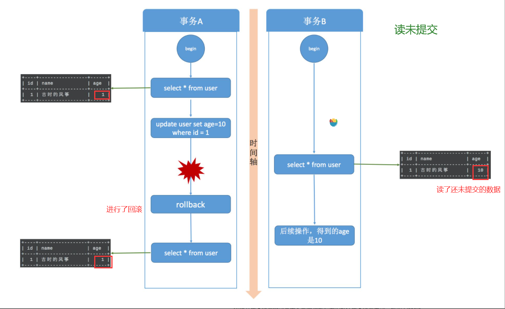
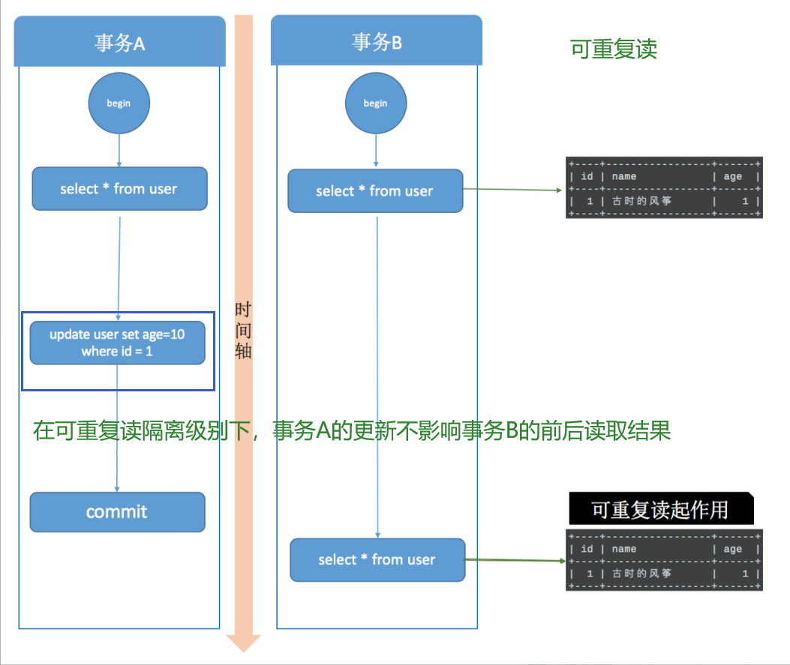
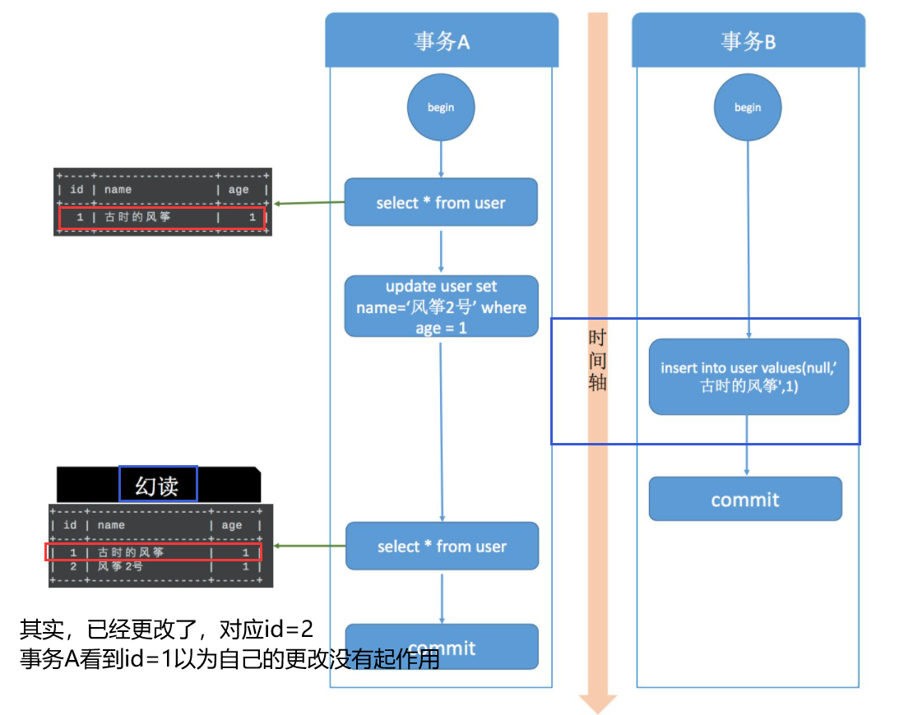
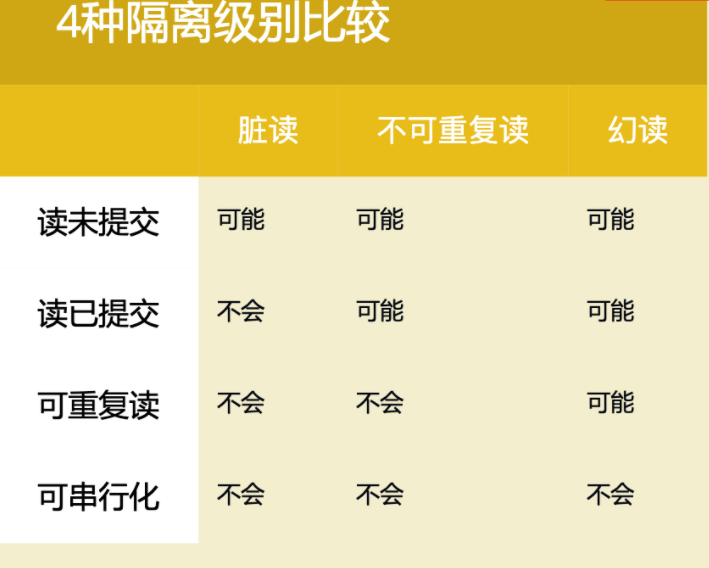
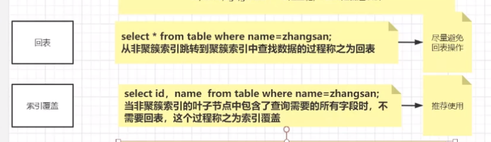
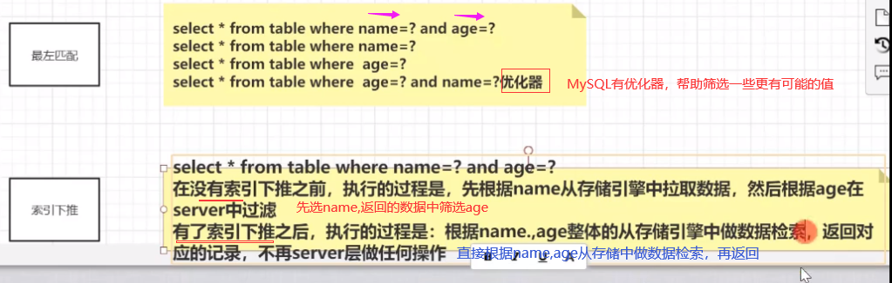

# 数据库知识点1

## 一、数据库设计

1.候选码怎么求？

假如有关系 R<U, F>，U(A,B,C,D,E,G)，F = {AB-->C, CD-->E, E-->A,A-->G}

过程：

首先一定是候选码的（在F左边有、右边没有的）：B、D

一定不是候选码的（只出现在F右边，说明只能由别的推出来）：G

可能是候选码的（F左、右边都有的）：A、C、E

那么从（BD）开始，直到能够推出所有元素即为一个候选码！

（BD）-->啥也推不出来

（BD）+ A：AB-->C, CD-->E,A --> G ==>CEG BD A == ABCDEG，所以（BDA）为一个候选码

同理，(BDC) ，(BDE)为候选码！

## 二、数据库恢复技术

### 1.事务

多个数据操作组成一个完整的事务单元，事务内的数据操作要么全部执行成功，要么全部执行失败

#### 1.1.四大特性ACID

1. 原子性（Autom）：要么全做，要么全不做
2. 一致性（Consistent）：一致性与原子性密切相关，要么全做要么全不做，否则就会造成数据不一致；比如说：银行汇钱，**汇帐方** 与 **被汇帐方**的账户都要改变
3. 隔离性（Isolate）：一个事务的执行不能被其他事务干扰；比如A正在插入数据，其他人不能删除A正在访问的数据
4. 持久性（Duration）：事务开始后就不会终止。数据库的改变是永久的，不可逆；比如要写入磁盘

#### 

## 三、并发控制

### 1.什么是并发？

#### 1.1.并发会带来的 问题

1. 丢失修改
   - 修改的东西没有生效。比如我把票价改成 99 元，结果还是原来的 299 元
2. 读脏数据（读到了未提交的数据）
   - 脏读指的是读到了 其他事务未提交 的数据，未提交意味着这些数据 可能 会回滚，也就是可能最终不会存到数据库中，也就是不存在的数据。读到了并一定最终存在的数据，这就是脏读
   - 比如，你要读取数据库中的字段A、字段B，你读取时恰巧有其他用户正在更新这2个字段，而且是先更新A、再更新B。如果那个用户更新一半（还未提交事务）你就读取了，正打算要更新B但尚未更新时，你就读取了，此时你得到的就是 **脏数据**
3. 不可重复读（（针对**update**操作））
   - 不可重复读指的是在 `同一事务内`，不同的时刻读到的同一批数据 可能是不一样 的，可能会受到其他事务的影响，比如其他事务改了这批数据并提交了。通常针对数据**更新（UPDATE）**操作。
   - 我在一个事务中，连续两次读到的数据不一样。比如我刚开始读到银行余额为 10元。此时单位突然发工资100到这张卡，那么我第二次读就变成了 110 元
4. 幻读
   - 假设事务A对某些行的内容作了更改，但是还未提交，此时事务B插入了与事务A更改前的**记录相同**的记录行，并且在事务A提交之前先提交了，而这时，在事务A中查询，会发现**好像刚刚的更改对于某些数据未起作用**，**但其实是事务B刚插入进来的**，让用户感觉很魔幻，感觉出现了幻觉，这就叫幻读。
   - 在一个事务中，用同样的操作查询数据，得到的 **记录数** 不一致（（和不可重复读的区别：针对的是一个数据整体/范围；并且针对**insert/delete**操作））。比如我第一次查询得到10条数据，第二次查询得到100条数据，每次查询的记录数都是随机值（灵异事件，主要针对新增数据）。

#### 1.2、事务的隔离级别

**读未提交**

> 启动两个事务，分别为事务A和事务B，在事务A中使用 update 语句，修改 age 的值为10，初始是1 ，
>
> 在执行完 update 语句之后，在事务B中查询 user 表，会看到 age 的值已经是 10 了，
>
> 这时候事务A还没有提交，而此时事务B有可能拿着已经修改过的 age=10 去进行其他操作了。
>
> 在**事务B进行操作的过程**中，很有可能事务A由于某些原因，**进行了事务回滚操作**，那其实事务B得到的就是**脏数据**了，拿着脏数据去进行其他的计算，那结果肯定也是有问题的。

**读已提交**

> 同样开启事务A和事务B两个事务，在事务A中使用 update 语句将 id=1 的记录行 age 字段改为 10。
>
> 此时，在事务B中使用 select 语句进行查询，我们发现**在事务A提交之前，事务B中查询到的记录 age 一直是1**，
>
> 直到事务A提交，此时在事务B中 select 查询，发现 age 的值已经是 10 了。
>
> 这就出现了一个问题：在同一事务中(本例中的事务B)，**事务的不同时刻、同样的查询条件，查询出来的记录内容是不一样的**，事务A的提交影响了事务B的查询结果，这就是不可重复读，也就是读提交隔离级别。

**可重复读**

但是可能产生幻读

> 可重复读做到了，这只是针对已有行的更改操作有效，但是对于**新插入的行记录**，就没这么幸运了，幻读就这么产生了。我们看一下这个过程：
>
> 事务A开始后，执行 update 操作，将 age = 1 的记录的 name 改为“风筝2号”；
>
> 事务B开始后，在事务执行完 update 后，执行 insert 操作，插入记录 age =1，name = 古时的风筝，**这和事务A修改的那条记录值相同**，然后提交。
>
> 事务B提交后，事务A中执行 select，查询 age=1 的数据，这时，会发现多了一行，**并且发现还有一条 name = 古时的风筝，age = 1 的记录**，
>
> 这其实就是事务B刚刚插入的，这就是幻读。

**可串行化**

> 串行化是4种事务隔离级别中隔离效果最好的，
>
> 解决了脏读、可重复读、幻读的问题，
>
> 但是效果最差，它将事务的执行变为顺序执行，
>
> 与其他三个隔离级别相比，它就相当于单线程，后一个事务的执行必须等待前一个事务结束。

**四种隔离级别比较**

总结：

> MySQL 的 InnoDB 引擎才支持事务，其中可重复读是默认的隔离级别。
>
> 读未提交和串行化基本上是不需要考虑的隔离级别，前者不加锁限制，后者相当于单线程执行，效率太差。
>
> 读提交解决了脏读问题，行锁解决了并发更新的问题。
>
> 并且 MySQL 在可重复读级别**解决了幻读问题**，是通过**行锁**和**间隙锁**的组合 Next-Key 锁实现的。

参考资料：

https://developer.aliyun.com/article/743691

https://zhuanlan.zhihu.com/p/117476959

#### 1.2.解决方法

1. 排它锁：也叫写锁，X锁
2. 共享锁：也叫读锁，S锁

#### 1.3.封锁协议

1. 一级封锁协议：修改时，必须加 X 锁，直到结束，解决`丢失修改`问题
2. 二级封锁协议：读取时，加 S 锁，**用完就放**，解决`读脏数据`问题
3. 三级封锁协议：读取时，加 S 锁，直到结束，解决`不可重复读`问题

## 四、常见问题

### 1.谈一下你对mysql索引的理解

### 2.B树和B+树区别

### 3.聚簇索引和非聚簇索引

​	判断数据跟索引是否是放在一起的，如果放在一起就是聚簇索引，不放在一起的是非聚簇索引

​	在innodb中，数据在进行插入的时候必须跟某一个**索引值**进行绑定，这个值默认是主键，如果没有主键，选择唯一键，选择6字节的rowid。所以在**innodb中一定是有聚簇索引的。**

​	**myisam中只有非聚簇索引。**

### 4.使用mysql索引原则

- 回表：返回全部数据

- 索引覆盖：类似投影

- 最左匹配：从条件最左边开始匹配

- 索引下推：避免一些冗余

  

  

