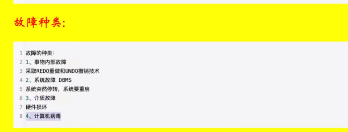

# 数据库知识点1

## 一、数据库设计

1.候选码怎么求？

假如有关系 R<U, F>，U(A,B,C,D,E,G)，F = {AB-->C, CD-->E, E-->A,A-->G}

过程：

首先一定是候选码的（在F左边有、右边没有的）：B、D

一定不是候选码的（只出现在F右边，说明只能由别的推出来）：G

可能是候选码的（F左、右边都有的）：A、C、E

那么从（BD）开始，直到能够推出所有元素即为一个候选码！

（BD）-->啥也推不出来

（BD）+ A：AB-->C, CD-->E,A --> G ==>CEG BD A == ABCDEG，所以（BDA）为一个候选码

同理，(BDC) ，(BDE)为候选码！

## 二、数据库恢复技术

### 1.事务

#### 1.1.四大特性ACID

1. 原子性（Autom）：要么全做，要么全不做
2. 一致性（Consistent）：一致性与原子性密切相关，要么全做要么全不做，否则就会造成数据不一致。比如说：银行汇钱，**汇帐方** 与 **被汇帐方**的账户都要改变
3. 隔离性（Isolate）：一个事务的执行不能被其他事务干扰，比如A正在插入数据，其他人不能删除A正在访问的数据
4. 持久性（Duration）：数据库的改变是永久的。比如要写入磁盘

#### 1.2.故障种类

## 三、并发控制

### 1.什么是并发？

#### 1.1.并发带来的 3 个问题

1. 丢失修改
   - 修改的东西没有生效。比如我把票价改成 99 元，结果还是原来的 299 元
2. 读脏数据
   - 比如，你要读取数据库中的字段A、字段B，你读取时恰巧有其他用户正在更新这2个字段，而且是先更新A、再更新B。如果那个用户更新一半你就读取了，正打算要更新B但尚未更新时，你就读取了，此时你得到的就是 **脏数据**
3. 不可重复读
   - 我在一个事务中，连续两次读到的数据不一样。比如我刚开始读到银行余额为 10元。此时单位突然发工资100到这张卡，那么我第二次读就变成了 110 元

#### 1.2.解决方法

1. 排它锁：也叫写锁，X锁
2. 共享锁：也叫读锁，S锁

#### 1.3.封锁协议

1. 一级封锁协议：修改时，必须加 X 锁，直到结束，解决丢失修改问题
2. 二级封锁协议：读取时，加 S 锁，**用完就放**，解决读脏数据问题
3. 三级封锁协议：读取时，加 S 锁，直到结束，解决不可重复读问题

## 四、常见问题

### 1.谈一下你对mysql索引的理解

### 2.B树和B+树区别

### 3.聚簇索引和非聚簇索引

​	判断数据跟索引是否是放在一起的，如果放在一起就是聚簇索引，不放在一起的是非聚簇索引

​	在innodb中，数据在进行插入的时候必须跟某一个**索引值**进行绑定，这个值默认是主键，如果没有主键，选择唯一键，选择6字节的rowid。所以在**innodb中一定是有聚簇索引的。**

​	**myisam中只有非聚簇索引。**

### 4.使用mysql索引原则

- 回表：返回全部数据

- 索引覆盖：类似投影

- 最左匹配：从条件最左边开始匹配

- 索引下推：避免一些冗余

  

  

