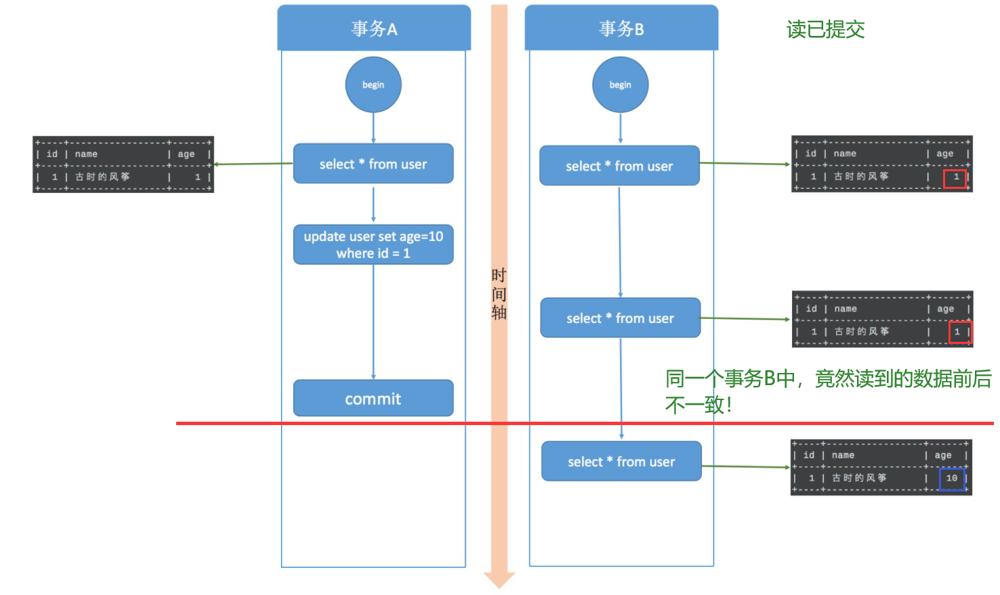
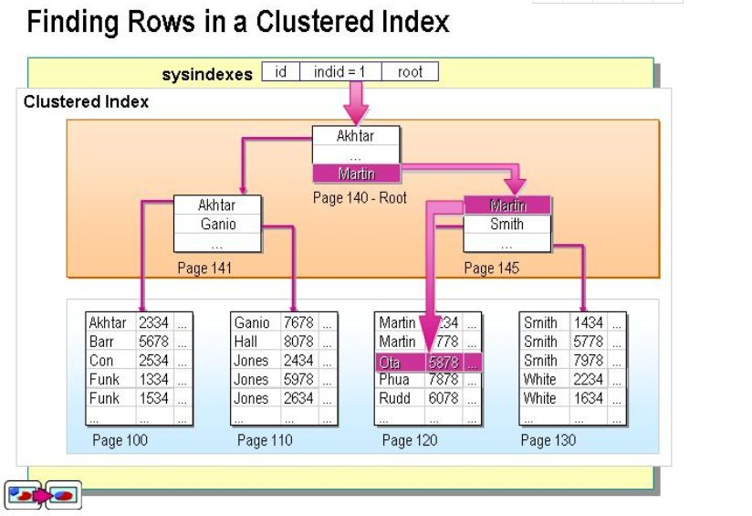

# 数据库知识点1

[TOC]

## 一、数据库设计

1.候选码怎么求？

假如有关系 R<U, F>，U(A,B,C,D,E,G)，F = {AB-->C, CD-->E, E-->A,A-->G}

过程：

首先一定是候选码的（在F左边有、右边没有的）：B、D

一定不是候选码的（只出现在F右边，说明只能由别的推出来）：G

可能是候选码的（F左、右边都有的）：A、C、E

那么从（BD）开始，直到能够推出所有元素即为一个候选码！

（BD）-->啥也推不出来

（BD）+ A：AB-->C, CD-->E,A --> G ==>CEG BD A == ABCDEG，所以（BDA）为一个候选码

同理，(BDC) ，(BDE)为候选码！

## 二、事务

### 1.事务

多个数据操作组成一个完整的事务单元，事务内的数据操作要么全部执行成功，要么全部执行失败

#### 四大特性ACID

1. 原子性（Autom）：要么全做，要么全不做
2. 一致性（Consistent）：一致性与原子性密切相关，要么全做要么全不做，否则就会造成数据不一致；比如说：银行汇钱，**汇帐方** 与 **被汇帐方**的账户都要改变
3. 隔离性（Isolate）：一个事务的执行不能被其他事务干扰；比如A正在插入数据，其他人不能删除A正在访问的数据
4. 持久性（Duration）：事务开始后就不会终止。数据库的改变是永久的，不可逆；比如要写入磁盘

### 2、什么是并发？

#### 并发会带来的 问题

1. 丢失修改
   - 修改的东西没有生效。比如我把票价改成 99 元，结果还是原来的 299 元
2. 读脏数据（读到了未提交的数据）
   - 脏读指的是读到了 其他事务未提交 的数据，未提交意味着这些数据 可能 会回滚，也就是可能最终不会存到数据库中，也就是不存在的数据。读到了不一定最终存在的数据，这就是脏读
   - 比如，你要读取数据库中的字段A、字段B，你读取时恰巧有其他用户正在更新这2个字段，而且是先更新A、再更新B。如果那个用户更新一半（还未提交事务）你就读取了，正打算要更新B但尚未更新时，你就读取了，此时你得到的就是 **脏数据**
3. 不可重复读（（针对**update**操作））
   - 不可重复读指的是在 `同一事务内`，不同的时刻读到的同一批数据 可能是不一样 的，可能会受到其他事务的影响，比如其他事务改了这批数据并提交了。通常针对数据**更新（UPDATE）**操作。
   - 我在一个事务中，连续两次读到的数据不一样。比如我刚开始读到银行余额为 10元。此时单位突然发工资100到这张卡，那么我第二次读就变成了 110 元
4. 幻读
   - 假设事务A对某些行的内容作了更改，但是还未提交，此时事务B插入了与事务A更改前的**记录相同**的记录行，并且在事务A提交之前先提交了，而这时，在事务A中查询，会发现**好像刚刚的更改对于某些数据未起作用**，**但其实是事务B刚插入进来的**，让用户感觉很魔幻，感觉出现了幻觉，这就叫幻读。
   - 在一个事务中，用同样的操作查询数据，得到的 **记录数** 不一致（（和不可重复读的区别：针对的是一个数据整体/范围；并且针对**insert/delete**操作））。比如我第一次查询得到10条数据，第二次查询得到100条数据，每次查询的记录数都是随机值（灵异事件，主要针对新增数据）。

#### 事务的隔离级别

**读未提交**

> 启动两个事务，分别为事务A和事务B，在事务A中使用 update 语句，修改 age 的值为10，初始是1 ，
>
> 在执行完 update 语句之后，在事务B中查询 user 表，会看到 age 的值已经是 10 了，
>
> 这时候事务A还没有提交，而此时事务B有可能拿着已经修改过的 age=10 去进行其他操作了。
>
> 在**事务B进行操作的过程**中，很有可能事务A由于某些原因，**进行了事务回滚操作**，那其实事务B得到的就是**脏数据**了，拿着脏数据去进行其他的计算，那结果肯定也是有问题的。

**读已提交**

> 同样开启事务A和事务B两个事务，在事务A中使用 update 语句将 id=1 的记录行 age 字段改为 10。
>
> 此时，在事务B中使用 select 语句进行查询，我们发现**在事务A提交之前，事务B中查询到的记录 age 一直是1**，
>
> 直到事务A提交，此时在事务B中 select 查询，发现 age 的值已经是 10 了。
>
> 这就出现了一个问题：在同一事务中(本例中的事务B)，**事务的不同时刻、同样的查询条件，查询出来的记录内容是不一样的**，事务A的提交影响了事务B的查询结果，这就是不可重复读，也就是读提交隔离级别。

**可重复读**

但是可能产生幻读

> 可重复读 做到了，这只是针对已有行的更改操作有效，但是对于**新插入的行记录**，就没这么幸运了，幻读就这么产生了。我们看一下这个过程：
>
> 事务A开始后，执行 update 操作，将 age = 1 的记录的 name 改为“风筝2号”；
>
> 事务B开始后，在事务执行完 update 后，执行 insert 操作，插入记录 age =1，name = 古时的风筝，**这和事务A修改的那条记录值相同**，然后提交。
>
> 事务B提交后，事务A中执行 select，查询 age=1 的数据，这时，会发现多了一行，**并且发现还有一条 name = 古时的风筝，age = 1 的记录**，
>
> 这其实就是事务B刚刚插入的，这就是幻读。

**可串行化**

> 串行化是4种事务隔离级别中隔离效果最好的，
>
> 解决了脏读、可重复读、幻读的问题，
>
> 但是效果最差，它将事务的执行变为顺序执行，
>
> 与其他三个隔离级别相比，它就相当于单线程，后一个事务的执行必须等待前一个事务结束。

**四种隔离级别比较**

总结：

> MySQL 的 InnoDB 引擎才支持事务，其中**可重复读**是默认的隔离级别。
>
> 读未提交和串行化基本上是不需要考虑的隔离级别，前者不加锁限制，后者相当于单线程执行，效率太差。
>
> 读提交解决了脏读问题，行锁解决了并发更新的问题。
>
> 并且 MySQL 在可重复读级别**解决了幻读问题**，是通过**行锁**和**间隙锁**的组合 Next-Key 锁实现的。

参考资料：

https://developer.aliyun.com/article/743691

https://zhuanlan.zhihu.com/p/117476959

#### 解决方法

1. 排它锁：也叫写锁，X锁
2. 共享锁：也叫读锁，S锁

#### 封锁协议

1. 一级封锁协议：修改时，必须加 X 锁，直到结束，解决`丢失修改`问题
2. 二级封锁协议：读取时，加 S 锁，**用完就放**，解决`读脏数据`问题
3. 三级封锁协议：读取时，加 S 锁，直到结束，解决`不可重复读`问题

## 四、常见问题

### 1.谈一下你对mysql索引的理解

一开始全部索引都存在于磁盘中，在查询开始会将索引根节点（比如聚集索引底层B+树）加载到内存中，在根节点出搜索是否找到目标，没有的话再根据目标与根节点大小关系，进一步判断，并将相应的节点从磁盘加载到内存，循环直到找到索引节点，然后取索引指向的数据地址，从磁盘中获取并加载到内存进一步处理，至此完成查询。

#### 索引有哪些优缺点？

(1) 优点：

- 唯一索引可以**保证**数据库表中 **每一行的数据** 的 **唯一性**
- 索引可以**加快** 数据 **查询速度**，减少查询时间

(2)缺点：

- 创建索引 和 维护索引 要耗费时间
- 索引需要占物理空间，除了数据表占用数据空间之外，每一个索引 **还要** 占用一定的物理空间
- 以表中的数据进行增、删、改的时候，索引也要动态的维护。

#### 聚集索引与非聚集索引的区别

> 可以按以下四个维度回答：
>
> （1）一个表中只能拥有**一个 聚集索引**，而 **非聚集索引** 一个表可以存在**多个**。
>
> （2）聚集索引存储记录是`物理上连续`存在，而非聚集索引是`逻辑上的连续`，物理存储并不连续
>
> （3）`聚簇索引`：索引的**叶子节点**就是**数据节点**。而`非聚簇索引`的**叶子节点**仍然是**索引节点**，只不过有一个**指针指向对应的数据块**。
>
> （4）聚集索引：物理存储按照索引`排序`；非聚集索引：物理存储不按照索引`排序`；

#### 聚集索引

注：第一列的地址表示该行数据在磁盘中的物理地址，**后面三列**才是我们SQL里面用的表里的列，**其中id是主键，建立了聚集索引**。

结合上面的表格理解聚集索引与物理存储顺序：数据行的物理顺序 与 列值的**顺序相同**，如果我们查询id比较靠后的数据，那么这行数据的地址在磁盘中的物理地址也会比较靠后。而且由于物理排列方式与聚集索引的顺序相同，所以也就只能建立一个聚集索引了。

值得注意的是，**最好还是在创建表的时候添加聚集索引**，由于聚集索引的物理顺序上的特殊性，因此如果再在上面创建索引的时候会根据索引列的排序**移动全部数据行**上面的顺序，会非常地耗费时间以及性能。

#### 非聚集索引

总结：

`聚集索引`就类似新华字典中的拼音排序索引，都是按 `A~Z` 顺序进行，例如找到字典中的“爱”，就里面顺序执行找到“爱”。

- 字典的正文部分本身就是一个目录，您不需要再去查其他目录来找到您需要找的内容。**我们把这种 正文内容 本身就是一种按照一定规则排列的目录称为“聚集索引”。**	

而`非聚集索引`则类似于笔画排序，索引顺序和物理顺序并不是按顺序存放的。

- 现在您看到的连续的“驰、张、弩”三字实际上就是他们在非聚集索引中的排序，是字典正文中的字在非聚集索引中的映射。我们可以通过这种方式来找到您所需要的字，但它需要两个过程，先找到目录中的结果，然后再翻到您所需要的页码。**我们把这种目录纯粹是目录，正文纯粹是正文的排序方式称为“非聚集索引”。**

**总的来说，聚集索引的叶子节点就是数据节点。而非聚簇索引的叶子节点仍然是索引节点，只不过有一个指针指向对应的数据块**

### 2.B树和B+树区别

可以从几个维度去看这个问题：查询是否够快，效率是否稳定，存储数据多少，以及查找磁盘次数，为什么不是普通二叉树，为什么不是平衡二叉树，为什么不是B树，而偏偏是 B+ 树呢？

> （1）为什么不是普通二叉树？
>
> 如果二叉树特殊化为一个链表，相当于全表扫描。平衡二叉树相比于二叉查找树来说，**查找效率更稳定，总体的查找速度也更快**。
>
> （2）为什么不是平衡二叉树呢？
>
> 我们知道，在内存比在磁盘的数据，查询效率快得多。如果树这种数据结构作为索引，那我们每查找一次数据就需要从磁盘中读取一个节点，也就是我们说的一个磁盘块，但是**平衡二叉树可是每个节点 只存储一个 键值和数据的**，如果是B树，**可以存储更多的节点数据，树的高度也会降低**，因此读取磁盘的次数就降下来了，查询效率就快。
>
> （3）为什么不是 B 树而是 B+ 树呢？
>
> B+ 树非叶子节点上是不存储数据的，仅存储索引键值，而B树节点中不仅存储索引键值，也会存储数据。innodb中页的默认大小是16KB，如果不存储数据，那么就**可以存储更多的键值，相应的树的阶数（节点的子节点树）就会更大，树就会更矮更胖**，如此一来我们查找数据进行磁盘的IO次数会再次减少，数据查询的效率也会更快。
>
> B+ 树索引的所有`数据地址`均存储在叶子节点，而且数据是按照顺序排列的，链表连着的。那么 B+ 树使得范围查找，排序查找，分组查找以及去重查找变得异常简单。

### 3、Hash 索引和 B+ 树索引区别是什么？你在设计索引是怎么抉择的？

> - B+ 树可以进行**范围查询**，Hash 索引不能。
> - B+ 树支持 联合索引的最左侧原则，Hash 索引不支持。
> - B+ 树支持 order by 排序，Hash 索引不支持。
> - B+ 树使用 like 进行模糊查询的时候，like 后面（比如%开头）的语句可以起到优化的作用，Hash 索引根本无法进行模糊查询。
> - **Hash 索引在等值查询上比 B+ 树效率更高。**

### 4、使用mysql索引原则

- 回表：返回全部数据

- 索引覆盖：类似投影

- 最左匹配：从条件最左边开始匹配

- 索引下推：避免一些冗余

  

  

### 5、什么是最左前缀原则？什么是最左匹配原则？

最左前缀原则，就是最左优先，在创建多列索引时，要根据业务需求，where 子句中**使用最频繁的一列放在最左边**。

当我们创建一个组合索引的时候，如 (a1,a2,a3)，相当于创建了（a1）、(a1,a2)和(a1,a2,a3)三个索引，这就是最左匹配原则。

### 6、索引不适合哪些场景?

- 数据量少的不适合加索引
- 更新比较频繁的也不适合加索引 、 区分度低的（含有大量重复数据）字段不适合加索引（如性别）

#### 7、MySQL 遇到过死锁问题吗，你是如何解决的？

遇到过。我排查死锁的一般步骤是：

（1）查看死锁日志 show engine innodb status; 

（2）找出死锁Sql 

（3）分析sql加锁情况 

（4）模拟死锁案发 

（5）分析死锁日志

（6）分析死锁结果

### 8、说说数据库的乐观锁和悲观锁是什么以及它们的区别？

（1）悲观锁：

悲观锁她专一且缺乏安全感了，她的心只属于当前事务，每时每刻都担心着它心爱的数据可能被别的事务修改，所以一个事务拥有（获得）悲观锁后，其他任何事务都不能对数据进行修改，只能等待锁被释放才可以执行。

（2）乐观锁：

乐观锁的“乐观情绪”体现在，它认为数据的变动不会太频繁。因此，它允许多个事务同时对数据进行变动。

实现方式：乐观锁一般会使用版本号机制或CAS算法实现。

### 9、MVCC 熟悉吗，知道它的底层原理？

MVCC (Multiversion Concurrency Control)，即多版本并发控制技术。

MVCC在MySQL InnoDB中的实现主要是为了提高数据库并发性能，用更好的方式去处理读-写冲突，做到即使有读写冲突时，也能做到不加锁，非阻塞并发读。

### 10、MySQL数据库cpu飙升的话，要怎么处理呢？

排查过程：

（1）**查看CPU情况**：使用top 命令观察，确定是mysqld导致还是其他原因。

（2）**查看session**：如果是mysqld导致的，show processlist，查看session情况，确定是不是有消耗资源的sql在运行。

（3）**检查可能导致出错的地方**：找出消耗高的 sql，看看执行计划是否准确， 索引是否缺失，数据量是否太大。

处理：

（1）kill 掉这些线程(同时观察 cpu 使用率是否下降)， 

（2）进行相应的调整(比如说加索引、改 sql、改内存参数) 

（3）重新跑这些 SQL。

其他情况：

也有可能是每个 sql 消耗资源并不多，但是突然之间，有大量的 session **连进来导致 cpu 飙升**，这种情况就需要跟应用一起来分析为何连接数会激增，再做出相应的调整，**比如说限制连接数**等

### 11、说说MYSQL的主从延迟，以及你怎么解决？

#### 主从复制

主要涉及三个线程：binlog 线程、I/O 线程和 SQL 线程。

- **binlog 线程**：负责将主服务器上的`数据更改`写入二进制日志（Binary log）中。
- **I/O 线程**：负责从主服务器上`读取二进制日志`，并写入` 从服务器的中继日志`（Relay log）。
- **SQL 线程**：`负责读取中继日志`，解析出主服务器已经执行的数据更改`并在从服务器中重放`（Replay）。

**主从同步延迟的原因**

一个服务器 开放Ｎ个链接 给客户端来连接的，这样有会有大并发的更新操作, 但是**从 服务器 的里面读取binlog的线程仅有一个**，当某个SQL在从服务器上执行的时间稍长 或者由于某个SQL要进行 锁表 就会导致，主服务器的SQL大量积压，未被同步到从服务器里。这就导致了主从不一致， 也就是主从延迟。

**主从同步延迟的解决办法**

- 主服务器要负责更新操作，对安全性的要求比从服务器要高，所以有些设置参数可以修改，比如sync_binlog=1，innodb_flush_log_at_trx_commit = 1 之类的设置等。
- 选择更好的硬件设备作为slave。
- 把一台从服务器当度作为备份使用， 而不提供查询， 那边他的负载下来了， 执行relay log 里面的SQL效率自然就高了。
- 增加从服务器，这个目的还是分散读的压力，从而降低服务器负载。

#### 读写分离

主服务器 处理写操作 以及 实时性要求比较高的 读操作，而从服务器处理 读操作。

读写分离能提高性能的原因在于：

- 主从服务器负责各自的读和写，**极大程度缓解了锁的争用**；
- 从服务器可以使用 MyISAM，提升查询性能以及节约系统开销；
- 增加冗余，提高可用性。

读写分离常用代理方式来实现，代理服务器 接收应用层 传来的读写请求，然后决定转发到哪个服务器

### 12、如果让你做分库与分表的设计，简单说说你会怎么做？

**分库分表方案:**

- 水平分库：以字段为依据，按照一定策略（hash、range等），将一个库中的数据拆分到多个库中。
- 水平分表：以具有相同的字段为依据，按照一定策略（hash、range等），将一个表中的数据拆分到多个表中。
  - 如图：
- 垂直分库：以表为依据，按照业务归属不同，将不同的表拆分到不同的库中。
- 垂直分表：以字段为依据，按照字段的活跃性，将表中字段拆到不同的表（主表和扩展表）中。
  - 如图：

**常用的分库分表中间件：**

- sharding-jdbc
- Mycat

**分库分表可能遇到的问题**

- 事务问题：把库分成多个子库存储在多个节点上，需要用分布式事务
- 跨节点Join的问题：解决这一问题可以分两次查询实现
- 跨节点的count,order by,group by以及聚合函数问题：分别在各个节点上得到结果后**在应用程序端进行合并**。
- 数据迁移，容量规划，扩容等问题
- ID问题：数据库被切分后，不能再依赖数据库自身的主键生成机制，最简单可以考虑UUID
- 跨分片的排序分页问题

### 13、存储引擎

[参考链接](https://www.cyc2018.xyz/%E6%95%B0%E6%8D%AE%E5%BA%93/MySQL.html)

#### InnoDB

是 MySQL 默认的事务型存储引擎，只有在需要它不支持的特性时，才考虑使用其它存储引擎。

实现了四个标准的隔离级别，**默认级别是可重复读**（REPEATABLE READ）。

在可重复读隔离级别下，通过多版本并发控制（MVCC）+ Next-Key Locking 防止幻读。

主索引是聚簇索引，在索引中保存了数据，从而避免直接读取磁盘，因此对查询性能有很大的提升。

内部做了很多优化，包括 从磁盘读取数据时 采用的可预测性读、能够加快读操作并且自动创建的自适应哈希索引、能够加速插入操作的插入缓冲区等。

支持真正的在线热备份。其它存储引擎不支持在线热备份，要获取一致性视图需要停止对所有表的写入，而在读写混合场景中。

#### MyISAM

设计简单，数据以紧密格式存储。对于只读数据，或者表比较小、可以容忍修复操作，则依然可以使用它。

提供了大量的特性，包括压缩表、空间数据索引等。

**不支持事务。**

**不支持行级锁，只能对整张表加锁**，读取时会对需要读到的所有表加共享锁，写入时则对表加排它锁。但在表有读取操作的同时，也可以往表中插入新的记录，这被称为并发插入（CONCURRENT INSERT）。

可以手工或者自动执行检查和修复操作，但是和事务恢复以及崩溃恢复不同，可能导致一些数据丢失，而且修复操作是非常慢的。

如果指定了 DELAY_KEY_WRITE 选项，在每次修改执行完成时，不会立即 将修改的索引数据 写入磁盘，而是会写到内存中的键缓冲区，只有在清理键缓冲区或者关闭表的时候才会将对应的索引块写入磁盘。这种方式可以极大的提升写入性能，但是在数据库或者主机崩溃时会造成索引损坏，需要执行修复操作。

#### 比较

- 事务：InnoDB 是事务型的，可以使用 Commit 和 Rollback 语句。
- 并发：MyISAM 只支持表级锁，而 InnoDB 还支持行级锁。
- 外键：InnoDB 支持外键。
- 备份：InnoDB 支持在线热备份。
- 崩溃恢复：MyISAM 崩溃后发生损坏的概率比 InnoDB 高很多，而且恢复的速度也更慢。
- 其它特性：MyISAM 支持压缩表和空间数据索引。