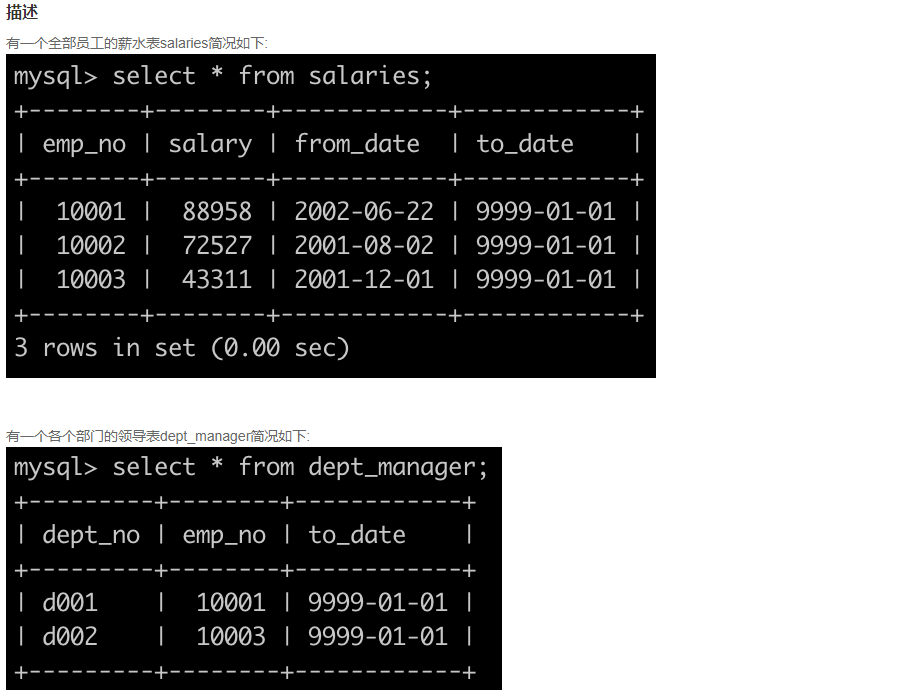

# mysql语句

### **SQL1** **查找最晚入职员工的所有信息**


思路1：直接取入职时间的最大值

```c++
select * from employees
where hire_date = (
    select MAX(hire_date) from employees
)
```

思路2：对入职时间降序排序，然后取第一个

```mysql
select * from employees
where hire_date = (
    select  distinct hire_date from employees
    order by hire_date desc limit 1
)
```

### **SQL2** **查找入职员工时间排名倒数第三的员工所有信息**


思路：

1. 对入职时间排名，先用`destinct`去重
2. 采用降序`desc`
3. 因为是降序，那么取第三个就行，使用`limit2, 1`

```mysql
# desc 降序
# limit 2, 1 表示从第2行后，取1行，即第三行
select * from employees
where hire_date = (
    select distinct hire_date from employees
    order by hire_date desc limit 2,1
)
```


### **SQL3** **查找当前薪水详情以及部门编号dept_no**




思路：

1. 通过外键emp_no来内连接两张表，
2. 排序条件：salaries.emp_no
3. 升序asc，默认就是，可以不写

```mysql
select sa.emp_no, sa.salary, sa.from_date, de.to_date, de.dept_no
from salaries as sa, dept_manager as de
where sa.emp_no = de.emp_no
order by sa.emp_no asc
```


### **SQL4** **查找所有已经分配部门的员工的last_name和first_name以及dept_no**


思路：简单的通过外键，进行内连接,输出两个表部分字段

```mysql
select last_name, first_name, dept_no
from employees, dept_emp
where employees.emp_no = dept_emp.emp_no
```


### **SQL5** **查找所有员工的last_name和first_name以及对应部门编号dept_no**


**思路**：左外连接

1. 通过外键连接两个表，但是呢，对于右表dept_emp中emp_no不存在的，而左表employees存在的，也要输出，那么就是左外连接。保留左表全部信息。
2. 注意左外连接的语法，`left join 右表 on 外键连接`

```mysql
select last_name, first_name, dept_no
from employees left join  dept_emp
on employees.emp_no = dept_emp.emp_no
```


### **SQL7** **查找薪水记录超过15次的员工号emp_no以及其对应的记录次数t**


思路：

此题应注意以下3点：

- 用COUNT()函数和GROUP BY语句，可以统计同一emp_no值的记录条数
- 根据题意，输出的变动次数为t，故用AS语句将COUNT(emp_no)的值转换为t
- 由于COUNT()函数不可用于WHERE语句中，故使用HAVING语句，来限定t>15的条件

having：过滤分组

where：在分组前过滤

```mysql
select emp_no, count(emp_no) as t
from salaries
group by emp_no having t > 15
```


### **SQL8** **找出所有员工当前薪水salary情况**


思路：

1. 排序列名：order by 薪水 
2. 排序规则：降序desc
3. 返回去重结果：dinstinct 待去重列名

```mysql
select distinct salary from salaries
order by salary desc
```


### **SQL10** **获取所有非manager的员工emp_no**


思路：not in，取反

1. 第一个查询，查出两个表都有的emp_no
2. 在第一个查询外嵌套，取相反，即没在两个表中都有的emp_no

```mysql
select employees.emp_no from employees
where employees.emp_no not in(
    select employees.emp_no from employees, dept_manager
    where employees.emp_no = dept_manager.emp_no
)
```


