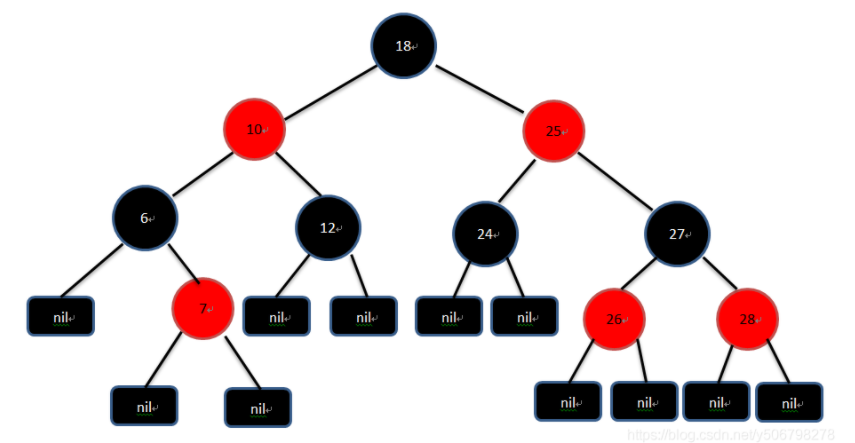

# 数据结构

## 常见问题

### 1、红黑树与平衡二叉树的区别

- 红黑树放弃了追求完全平衡，追求大致平衡，在与平衡二叉树的时间复杂度相差不大的情况下，保证每次插入最只需要三次旋转就能达到平衡，实现起来也更为简单。
- 平衡二叉树追求绝对平衡，条件比较苛刻，实现起来比较麻烦，每次插入新节点之后需要旋转的次数不能预知。
- 红黑树和AVL树的区别在于它使用颜色来标识结点的高度，它所追求的是局部平衡而不是AVL树中的非常严格的平衡。
- 红黑树是牺牲了严格的高度平衡的优越条件为代价，红黑树能够以O(log2 n)的时间复杂度进行搜索、插入、删除操作。
- 红黑树的算法时间复杂度和AVL相同，但统计性能比AVL树更高.

### 2、红黑树

##### 性质

- 根节点是黑色；

- 每个节点是红色或者黑色；

- 所有叶子节点都是黑色（叶子是Null节点，也称为外节点）;

- 每个红色节点的子节点都是黑色（从每个叶子节点到根节点的所有路径上不能有两个连续的红色节点）；

- 从红黑树的任一节点到其每个叶子节点的所有路径都包含相同数目的黑色节点（包含黑色节点的数目称为该节点的黑高度）。

  原文链接：https://blog.csdn.net/y506798278/article/details/104275033

它是一种二叉查找树，但在每个节点增加一个存储位表示节点的颜色，可以是红或黑（非红即黑）。

通过对任何一条从根到叶子的路径上各个节点着色的方式的限制，**红黑树确保没有一条路径会比其它路径长出两倍（这里是和平衡二叉树的主要区别）**，

因此，红黑树是一种弱平衡二叉树（由于是弱平衡，可以看到，在相同的节点情况下，AVL树的高度低于红黑树），

相对于要求严格的AVL树来说，它的旋转次数少，所以**对于搜索，插入，删除操作较多的情况下，我们就用红黑树。**

**如果应用场景中对插入删除不频繁，只是对查找要求较高，那么AVL还是较优于红黑树。**

### 3、排序算法中的问题

稳定的排序算法：[冒泡排序](https://link.zhihu.com/?target=http%3A//baike.baidu.com/view/254413.htm)、[插入排序](https://link.zhihu.com/?target=http%3A//baike.baidu.com/view/1193395.htm)、[归并排序](https://link.zhihu.com/?target=http%3A//baike.baidu.com/view/90797.htm)、[基数排序](https://link.zhihu.com/?target=http%3A//baike.baidu.com/view/1170573.htm)、[折半插入排序](https://link.zhihu.com/?target=http%3A//baike.baidu.com/view/9681546.htm)

不稳定的排序算法：[堆排序](https://link.zhihu.com/?target=http%3A//baike.baidu.com/view/157305.htm)、[快速排序](https://link.zhihu.com/?target=http%3A//baike.baidu.com/view/115472.htm)、[希尔排序](https://link.zhihu.com/?target=http%3A//baike.baidu.com/view/178698.htm)、[选择排序](https://link.zhihu.com/?target=http%3A//baike.baidu.com/view/3632419.htm)

> ###### 冒泡排序
>
> 冒泡排序就是把小的元素往前调或者把大的元素往后调。比较是相邻的两个元素比较，交换也发生在这两个元素之间。所以，如果两个元素相等，我想你是不会再无聊地把他们俩交换一下的；如果两个相等的元素没有相邻，那么即使通过前面的两两交换把两个相邻起来，这时候也不会交换，所以相同元素的前后顺序并没有改变，所以冒泡排序是一种稳定排序算法。
>
> ###### 插入排序 
>
> 插入排序是在一个已经有序的小序列的基础上，一次插入一个元素。当然，刚开始这个有序的小序列只有1个元素，就是第一个元素。比较是从有序序列的末尾开始，也就是想要插入的元素和已经有序的最大者开始比起，如果比它大则直接插入在其后面，否则一直往前找直到找到它该插入的位置。如果碰见一个和插入元素相等的，那么插入元素把想插入的元素放在相等元素的后面。所以，相等元素的前后顺序没有改变，从原无序序列出去的顺序就是排好序后的顺序，所以插入排序是稳定的。
>
> ###### 归并排序 
>
> 归并排序是把序列递归地分成短序列，递归出口是短序列只有1个元素（认为直接有序）或者2个序列（1次比较和交换），然后把各个有序的段序列合并成一个有序的长序列，不断合并直到原序列全部排好序。可以发现，在1个或2个元素时，**1个元素不会交换，2个元素如果大小相等也没有人故意交换，这不会破坏稳定性**。那么，在短的有序序列合并的过程中，稳定是是否受到破坏？没有，合并过程中我们可以保证如果两个当前元素相等时，我们把处在前面的序列的元素保存在结果序列的前面，这样就保证了稳定性。所以，归并排序也是稳定的排序算法。
>
> ###### 基数排序 
>
> 基数排序是按照低位先排序，然后收集；再按照高位排序，然后再收集；依次类推，直到最高位。有时候有些属性是有优先级顺序的，先按低优先级排序，再按高优先级排序，最后的次序就是高优先级高的在前，高优先级相同的低优先级高的在前。基数排序基于分别排序，分别收集，所以其是稳定的排序算法。
>
> ======================================================
>
> ###### 选择排序
>
> 选择排序是给每个位置选择当前元素最小的，比如给第一个位置选择最小的，在剩余元素里面给第二个元素选择第二小的，依次类推，直到第n - 1个元素，第n个元素不用选择了，因为只剩下它一个最大的元素了。那么，在一趟选择，如果当前元素比一个元素小，而该小的元素又出现在一个和当前元素相等的元素后面，那么交换后稳定性就被破坏了。比较拗口，举个例子，序列5 8 5 2 9，我们知道第一遍选择第1个元素5会和2交换，那么原序列中2个5的相对前后顺序就被破坏了，所以选择排序不是一个稳定的排序算法。
>
> ###### 快速排序 
>
> 快速排序有两个方向，左边的i下标一直往右走，当a[i] <= a[center_index]，其中center_index是中枢元素的数组下标，一般取为数组第0个元素。而右边的j下标一直往左走，当a[j] > a[center_index]。如果i和j都走不动了，i <= j，交换a[i]和a[j],重复上面的过程，直到i > j。 交换a[j]和a[center_index]，完成一趟快速排序。在中枢元素和a[j]交换的时候，很有可能把前面的元素的稳定性打乱，比如序列为5 3 3 4 3 8 9 10 11，现在中枢元素5和3（第5个元素，下标从1开始计）交换就会把元素3的稳定性打乱，所以快速排序是一个不稳定的排序算法，不稳定发生在中枢元素和a[j] 交换的时刻。
>
> ###### 希尔排序(shell) 
>
> 希尔排序是**按照不同步长对元素进行插入排序**，当刚开始元素很无序的时候，步长最大，所以插入排序的元素个数很少，速度很快；当元素基本有序了，步长很小， 插入排序对于有序的序列效率很高。所以，希尔排序的时间复杂度会比O(n^2)好一些。由于多次插入排序，我们知道一次插入排序是稳定的，不会改变相同元素的相对顺序，但在不同的插入排序过程中，相同的元素可能在各自的插入排序中移动，最后其稳定性就会被打乱，所以shell排序是不稳定的。
>
> ###### 堆排序 
>
> 我们知道堆的结构是节点i的孩子为2 * i和2 * i + 1节点，大顶堆要求父节点大于等于其2个子节点，小顶堆要求父节点小于等于其2个子节点。在一个长为n 的序列，堆排序的过程是从第n / 2开始和其子节点共3个值选择最大（大顶堆）或者最小（小顶堆），这3个元素之间的选择当然不会破坏稳定性。但当为n / 2 - 1， n / 2 - 2， ... 1这些个父节点选择元素时，就会破坏稳定性。有可能第n / 2个父节点交换把后面一个元素交换过去了，而第n / 2 - 1个父节点把后面一个相同的元素没 有交换，那么这2个相同的元素之间的稳定性就被破坏了。所以，堆排序不是稳定的排序算法。