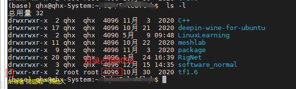

# Linux基础1

## 一、命令行

历史命令前后滚动

- ctrl + p 上一个命令
- ctrl + b 下一个命令

删除光标 [x] 字符

- x= 覆盖的字符  ctrl + d  

- x= 前  ctrl + h 或者 backspace 

- x= 行首  ctrl + a  

- x= 行尾  ctrl + e  

- x=前面所有 ctrl + u

  

tab 自动填充命令或者路径

## 二、目录

### 1.系统目录结构

/bin 下面是一个常用命令的目录

/boot 存放启动linux的核心文件

/dev 存放外部设备的缩写，在linux下访问外设跟文件是一样的

/etc 存放配置文件

/home 每个用户都有一个home目录，用户的主目录

/lib 存放动态链接共享库，相当于windows下的dll文件，几乎所有文件都需要用到这些共享库

/lost + found 一般情况下为空， 只有系统在非法关机后，才会存放一些文件

/media 自动挂载目录，linux系统会自动识别一些设备，比如U盘、光驱等，linux会把这些设备自动挂载到这个目录下

/mnt 手动挂载目录

/sbin root用户的存放命令的目录

/usr 非常重要的目录，用户的很多应用程序和文件都在这个目录下，类似Windows下的 program files

### 2.用户目录

绝对路径：从根目录开始开始 /home/user/test

相对路径：相对于当前目录而言

- . 当前目录
- .. 上一级目录
- ~ home目录 如cd ~ 等价于 /home/user  等价于 cd

sudo su 切换超级(root)用户, 前面是 #

exit 退出root用户 ，前面是$

### 3.目录&文件

#### 3.1查看目录&文件

tree 目录名  ，以树状显示目录下所有文件结构

ls 列出当前目录 部分 文件

ls -a 列出当前目录 全部(all) 文件， 包括隐藏文件

ls -l 列出详细信息

目录

- r -- read
- w -- write
- x -- execute

du -h 以人类(human)能够看懂的方式展示

du -h --max-depth=0 查看当前目录下文件所占磁盘空间

df 系统目录整体情况

cat filename 查看文件内容， 适合内容小的文件，特别长的不适合

more filename  按空格一行一行查看， 按enter看更多， 但是只能往后看，不能会看，按 q 或 ctrl+c退出

less filename ctrl + p 往前翻页 ctrl + b 往后

head -数字n filename 显示**前**n行

tail -数字n filename 显示**后**n行

#### 3.2删除&创建

rm -r aa 删除目录，==递归==删除

rm -ri bb 删除会提示，i -- information

mkdir dictory 创建目录

touch filename 创建文件， 如果已经存在，则修改创建的时间

#### 3.3拷贝

cp 源文件 目的文件 ， 若目的文件已经存在会被覆盖

cp 源目录 目的目录

cp -r 源目录 目的目录  , 将源目录放到目的目录，-r表示**递归拷贝**

#### 3.2移动&改名

mv 源目录 目的目录 ， 若目的目录不存在，那么就相当于改名，若存在，则移动

#### 3.3链接

软链接（符号链接）， 其实就是快捷键，**目录文件**都一样的用法

- ln -s 源目录 快捷键名 ， 之后就可以通过快捷键访问源目录, s表示 soft
- ln -s 源目录绝对路径 快捷键名 ， 那么可以再全局访问源目录， ==建议绝对路径方式==

硬链接，做了一个到源文件(源文件存储在 i 节点上,linux文件存储单元是块block)映射，本身不占用空间，给一个文件加一个硬链接，文件硬链接数就加1

ln 源文件绝对路径 快捷键名 , 不用s ，**只能用于文件**

### 4.权限

#### 4.1修改文件权限

**文字设定法**： chmod [who] [+|-|=] [mode]						

- who:文件所有者--u， 文件所属组--g, 其他人--o
- +添加权限， -减少权限， =覆盖原来的权限
- mode: 读-r, 写-w, 执行-x

比如 chmod o+w filename/dictory , 表示对于 **其他人** 添加filename/dictory 写(**w**)权限

**数字表示法**：所有者7 组用户6 其他人5

- -：没有权限
- r:4
- w:2
- x:1
- 7  ---rwx--- 文件所有者
- 6  ---rw-- 文件所属组
- 5  --rx -- 其他人

chmod -010 filename/dictory , 只减少了文件所属组的权限

chmod 777 filename/dictory 所有用户都有权限

**修改文件所属组**

chown user filename , 授予filename所属于user

chown newuser1:user2 filename, newuser1属于user2组

### 5.查找&检索文件find

#### 5.1按文件属性

**路径在前，查找内容在后**

sudo find 查找的路径 -name "hell0.cpp"

sudo find **查找的路径** -name **"hell0*"**  ，查找目录"hello"开头的

sudo find 查找的路径 -size -10K  -size +5K ，查找 大于5kb~10kb的文件

#### 5.2按文件内容

**查找内容在前**，**查找路径在后**

grep -r **"查找的内容"** **查找的路径** ， 查找指定路径下包含该查找内容的文件

### 6.更新安装

#### 6.1 apt-get

sudo apt-get install tree, 安装软件tree

sudo apt-get remove tree, 卸载tree

sudo apt-get update , 更新软件列表

sudo apt-get clean, 清理 var/cachef/apt/ archives目录下的.deb文件

#### 6.2安装deb包

sudo dpkg -i tree.deb, 安装tree.deb安装包

sudo dpkg -r tree.deb, 删除安装包

#### 6.3安装源码

一般安装步骤

1. 解压缩源代码包
2. 进入安装目录
3. 检测文件是否缺失，创建Makefile,检测编译环境：./configure
4. 编译源码，生成可执行程序：make
5. 把库和可执行程序，安装到系统目录下：sudo make install
6. 删除和卸载软件：sudo make distclean
7. 上述步骤不是绝对的，有的需要查看附带的README文件

