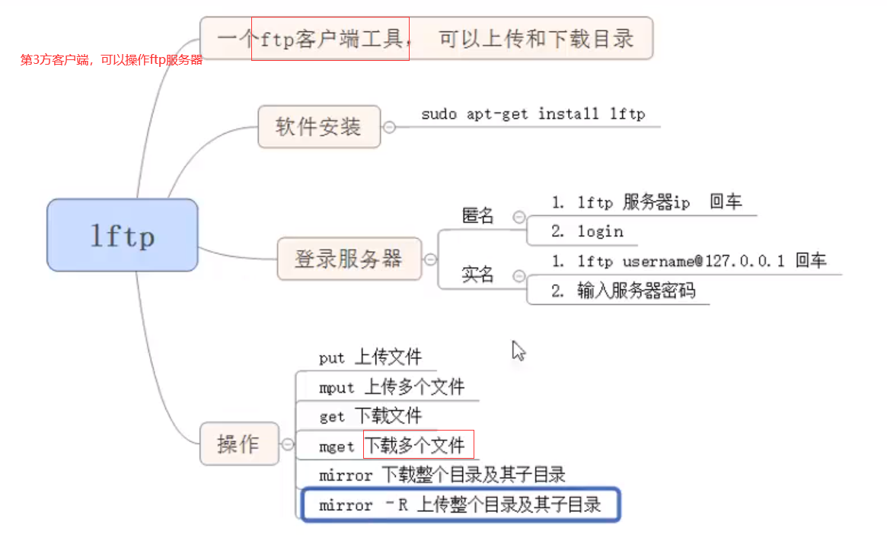

# Linux基础2

## 三、挂载

### 1.挂载&卸载

磁盘设备种类

- sd --> SSCI Devices
- hd --> Hard Disk 硬盘
- fd --> Floppy Disk 软盘

sudo fdisk -l 查看一些磁盘设备的信息

sudo mount 挂载的磁盘目录d /mnt， 挂载d到/mnt目录(**一般都是挂载到这个目录**)下,因为挂载到其他目录x会暂时“覆盖”x目录下的内容！但是卸载后就可以显示x原来的内容！

sudo umount  /mnt/已挂载的目录sda ，需要在挂载的目录外进行

## 四、压缩包管理

### 1.gzip(不建议)

gzip 被压缩内容x --会把x压缩，但是源文件x也会没有

gunzip 压缩包y  --解压缩

### 2.tar

不使用 z / j 参数， 该命令只能对 文件 或 目录 打包

- c -- 创建 -- 压缩时的参数
- x -- 释放 -- 解压缩时的参数
- v -- 显示提示信息 -- 压缩解压缩都可以用 -- 可以省略该参数
- f -- 指定压缩文件的名字
- z -- 使用gzip的方式压缩文件 --.gz
- j -- 使用bzip2的方式压缩文件 --.bz2

压缩：

- tar **z**cvf 生成压缩包的名字（xxx.tar.**gz**) 要压缩的文件或目录
- tar **j**cvf 生成压缩包的名字（xxx.tar.**bz2**) 要压缩的文件或目录

解压缩：

如果要解压缩到指定目录，需要加上 -C 压缩

- tar **zx**vf xxx.tar.gz
- tar **jx**vf xxx.tar.gz

### 3.rar

必须手动安装该软件，压缩解压缩会有提示

压缩：rar a 生成的压缩文件的名字 要压缩的文件或目录

解压缩：rar x 压缩文件名 （解压缩目录）

### 4.zip

压缩： zip -r 压缩的名字 要压缩的文件或目录

解压缩：unzip 压缩文件名  -d 解压缩目录

## 五、进程管理

进程：启动一个程序就会产生一个进程

管道：指令1 -- 管道 -- 指令2， 指令1的输出作为指令2的输入，最后终端屏幕只会输出指令2的输出

### 1.查看进程ps

ps aux ，查看用户的所有进程

ps aux | grep 查找的字符串str ，在ps aux的输出中，用grep查找(重定向)里面是否有字符串str的进程

如 ps aux | grep "bash"

### 2.杀死进程

kill -9 pid  等价于 kill -SIGKILL pid

kill -l 杀死所有进程

### 3.查看当前进程的环境变量

linux 下的环境变量格式：key=value

如 key = value:value:value

Env --PATH

Env | grep PATH

## 六、网络管理

ifconfig ，查看网络ip地址

ping 网址 -c 4 ，连接网络回馈4次就停止

nslookup 域名，查看域名的ip地址

## 七、用户管理

在etc/passwd中可以看到linux下的所有用户

### 1.创建用户

sudo adduser user1，添加用户user1

sudo useradd -s /bin/bash -g 添加到组G1 -d(指定家目录) /home/G1 -m(如果没有G1则创建) G1

sudo groupadd 组G1，添加组G1

### 2.修改密码

sudo passwd user1，修改普通用户密码

sudo passwd root，修改root的密码

### 3.删除用户

sudo deluser user1，删除用户user1

sudo userdel -r user1，删除用户user1

## 八、服务器的搭建

### 1.ftp服务器

使用vsftpd

作用：**文件**的上传和下载，目录是不可以的，但是可以**考虑将目录打包成文件**！

#### 1.1服务器端

1. 修改配置文件 -- 修改vim /etc/vsftpd.conf
2. 重启服务: sudo service vsftpd restart

#### 1.2客户端

1. 实名用户登录

   - ftp ip地址（你要访问的服务器的ip）
   - 输入用户名、密码

2. 文件的上传和下载

   先切换到跟服务器上一样的目录

   - put 上传的内容
   - get 下载的内容

3. 匿名用户登录

   - ftp ip地址
   - 用户名(固定的）：**anonymous**，不用密码
   - 不允许匿名用户在任意目录直接切换，只能在一个指定的目录范围内工作
   - 需要在ftp服务器上创建一个匿名用户的目录。作为匿名用户的根目录,可以修改 /etc/vsftpd.conf里的默认anno_root

还有一个第三方客户端lftd，操作比较智能，会有提示等，操作跟ftp差不多

### 2.nfs服务器

#### 2.1服务器端

1. 创建共享目录 ，mkdir shareDir
2. 修改配置文件，/etc/exports
3. 重启服务，sudo service nfs-kernel-server restart

#### 2.2客户端

将服务器共享目录**挂载到**本地mnt目录下（也可以是其他空目录）就可以，mount serverIP:shareDir /mnt

### 3.ssh服务器

知道对方ip+用户名密码，登录后跟本地用户登录一样

#### 3.1服务器端

服务器、客户端都安装ssh

#### 3.2客户端

登录，ssh ip地址@用户

输入密码

退出，exit

#### 3.3跨主机拷贝scp

安装软件openssh-server

scp 目标主机@ip地址:目录或文件的绝对路径  拷贝到本地，如 scp user@192.168.14.36:/home/user/test.mp3 /home/localuser/music/

目录要加参数  -r ，表示递归拷贝

