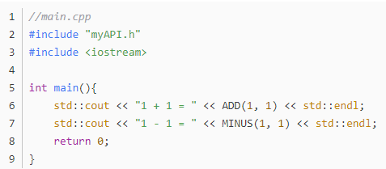

# Linux基础3

## 九、Vim

纯文本，只能命令模式

3种模式：命令模式、编辑模式、末行模式

### 1.命令模式

##### 1.1光标的移动

- H--前 ，J--下 ，K--上 ，L--后
- 行首 0
- 行尾 $
- 文件开始位置 gg
- 文件末尾 G
- 行跳转 300G，表示跳到第300行

##### 1.2删除操作

字符

-  删除光标后面的**字符** x
- ..................前............... X

字符串

- .............................**单词**dw，光标**后边的这一个单词**会被删除
- ............光标到 行首 的**字符串** d0
- ........................ 行尾 ................ D (d$)

行

- 删除当前行 **dd**
- 删除多行 ndd ，删除n行

##### 1.3撤销操作

撤销 u

反撤销 ctrl + r

##### 1.4复制粘贴

- 复制 **yy**
- 复制多行 nyy
- 粘贴 p，粘贴到 光标所在行的 下一行
- 粘贴 P，粘贴到光标 所在行

##### 1.5可视模式

- 切换到可视模式 v
- 通过光标hjkl选择内容
- 操作 ：复制**y** 删除 **d**

##### 1.6查找

-  /hello 从头开始遍历到尾，然后返回首，如此循环，找hello
- ?hello 从尾开始遍历到头，然后返回尾，如此循环，找hello
- #，遍历时把光标移动到查找的单词上按#，遍历的时候快捷键 N 或者 n
- 遍历大致以下面的方式，想象成m*n矩阵，每个位置一个字符
- 查看某个函数，光标移动到函数然后 **大写K**，或者 **man 函数名**

##### 1.7替换单个字符

按 r 选择替换的字符

向右缩进 >>， 向左<<

### 2.文本模式

切换 文本模式

- a -- 在**光标所在位置的后边**插入

- A -- 在当**前行的尾部**插入

  

- i --  在**光标所在位置的前边**插入

- I --  在**光标所在行的行首**插入

  

- o -- 在光**标所在行的下边**创建一个新的行

- O -- ........................... 上...............................

  

- s -- 删除光标后边的**字符**

- S -- 删除光标所在的**行**

### 3.末行模式

#### 3.1查找替换

- s/查找的内容x/替换的内容y/g，**替换同行中的所有的x** -- 替换单个
- **%**s/查找的内容x/替换的内容y/g，替换**文中所有的**x，如果只替换每一行第一个不用/g -- 替换全文
- 20.25ss/查找的内容x/替换的内容y/g，**替换20~25行中 所有的x** -- 替换指定一部分

#### 3.2保存退出

- q 退出
- q! 退出不保存
- w 保存
- wq 保存退出
- x 等价于 wq

#### 3.3分屏操作

水平分屏：sp分屏, ctrl + ww切换屏幕

垂直分屏：vsp分屏， ctrl + ww切换屏幕

#### 3.4打造成IDE

对所有用户生效，需要修改在系统级配置文件目录：/etc/vim/vimrc

对部分用户生效，需要修改用户级配置文件目录：~/.vim/vimrc

## 十、编译

编译大致流程

vim 写程序

g++ 或者 gcc 编译程序生成可执行程序

工作流程

- 预处理 gcc -E
- 编译 gcc -S
- 汇编 gcc -C
- 链接 无参数

-o: 指定生成的文件的名字

-D：在编译的时候定义宏

-I：指定头文件的路径

-g：gdb调试的时候需要添加该参数

-O：编译优化，3个等价（1~3）

-Wall：编译期间输出警告信息

## 十一、库

### 1.静态库

封装源代码，提供静态库以及头文件接口文件

#### 1.1命名规则

- lib + 库的名字 + **.a**
- 如libmytest.a

#### 1.2制作并使用

头文件myAPI.h

源文件myAPI.cpp

一个测试使用静态库的主函数源文件

编译myAPI.cpp源文件,会生成可执行文件myAPI.o：**g++ -c myAPI.cpp**

将可执行文件生成静态库：**ar crv libmyAPI.a myAPI.o**

 然后就可以在测试文件中使用静态库，生成可执行文件，-o是指定生成的名称：**g++ main.cpp libmyAPI.a -o output**

最后执行 **./output**，即可得到结果

#### 1.3优缺点

优点

- 由于打包了可执行文件，访问速度快
- 发布程序的时候，不需要提供相应的库，因为已经打包了可执行文件

缺点

- 当执行行文件很多时，库占用的容量会很大
- 库发生改变，又需要重新编译时，会很耗时

### 2.共享库

#### 2.1命名规则

- lib + 名字 + **.so**

#### 2.2制作并使用

在上一步生成的myAPI.o的基础上，

生成动态库.so文件，**g++ -shared -fPIC -o libmyAPI.so myAPI.o**

使用动态库,生成可执行文件，g++ main.cpp -L. -lmyAPI.so -o outputSo

最后执行./outputSo,即可得到结果

#### 3.3解决程序执行时动态库无法被加载问题

1. 放到系统的库目录lib -- 不推荐！
2. **临时测试**
   - 环境变量 LD_LIBRARY_PATH=将动态库的路径设置给该变量
   - 将设置的值导入到系统环境变量，export LD_LIBRARY_PATH
   - 以上两步也可以简化为一步：export LD_LIBRARY_PATH=将动态库的路径设置给该变量
   - 当终端关闭，设置会失效
3. 永久设置 -- 不常用
   - 在home目录的.bashrc文件中，添加： export LD_LIBRARY_PATH=动态库目录的绝对路径
   - .bashrc修改完成，需要重启终端
4. **常用的方法**
   - 需要找动态链接库的配置文件 -- /etc/ld.so.conf
   - 动态库的路径写到配置文件中 --绝对路径
   - 更新 -- sudo ldconfig -v

#### 3.4优缺点

优点

- 执行程序体积小
- 动态库更新，不需要重新编译程序，函数的接口没变

缺点

- 发布程序的时候，**需要将动态库提供给用户**
- 动态库没有打包到应用程序中，加载速度相对于静态库要慢

