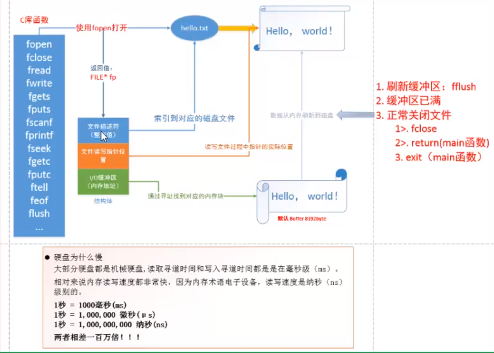

# Linux基础4

## 十二、gdb调试

[ZDZN中文速查](https://doc.zdzn.net/cheatsheet/gdb.html)

纯文字调试，有些麻烦

前提条件： 可执行文件必须包含调试信息 gcc -g

gdb 要调试的可执行文件

1. 启动gdb

   - start -- 开始gdb，但是一次只会执行一行
   - n -- next
   - s -- step(单步) -- 可以进入函数体内部
   - c -- continue -- 直接停在断点位置

2. 查看代码

   -  l -- list
   -  l 行号 函数名，当前文件
   -  l filename:行号 函数名，**查看其他文件**

3. 设置断点

   - 设置文件断点
     - b -- break
     - b 行号 函数名
     - b filename:行号 函数名 ，设置其他文件断点
   - 设置条件断点
     - b 行号 if value==某个值
   - 删除断点
     - delete -- del -- d，几个等价
     - d 断点编号
       - 获取编号：ifo -i 或者 info -b

4. 查看设置的断点

   - 当前文件：b 行号 函数名
   - 指定文件： b 文件名：行号 函数名
   - 设置条件断点：b 行号 if value == 23
   - 查看断点信息：info b
   - 删除断点：d 断点编号

5. 开始 执行gdb调试

   - 执行一步操作
   - 继续执行
   - 执行多步，直接停在断点处

6. 单步调试

   - 进入函数体内部：s，从函数体内部跳出：finish
   - 不进入函数体内部：n
   - 退出当前循环：u

7. 查看变量的值：p -- print

8. 查看变量的类型：ptype 变量名

9. 设置变量的值：set var 变量名 = 某个值

10. 设置追踪变量

    - display
    - 取消追踪 ：undisplay 编号，获取编号：info display

11. 退出gdb调试

    quit

## 十三、makefile

[makefile写法](https://seisman.github.io/how-to-write-makefile/introduction.html#id2)

[Makefile教程](https://blog.csdn.net/weixin_38391755/article/details/80380786/)

基本原则


1. 一个规则

   - 三要素：目标， 依赖， 命令

   ```linux
   目标：依赖
   	命令
   ```

   第一条规则是用来生成终极目标的规则

   - 如果规则中的依赖不存在，向下寻找其他的规则，
   - **更新机制**：比较的是目标文件和依赖文件的时间

2. 两个函数

   - 查找指定目录下，指定的类型的文件
     - src = $(wildcard ~/aa/*.c)
   - 匹配替换函数
     - obj = $(patsubst %.c，%.0，$(src))，将src目录下的所有.c后缀文件替换成.o文件

3. 三个自动变量（只能在规则的命令中使用）

   - $<，规则中的第一个依赖
   - $^，规则中的所有依赖
   - $@，规则中的目标

4. 模式规则

   ​	%.o:%.c，.o 替换.c

   ​	gcc -c $< -o $@，比如 gcc -c main.c -o main.o

5. 例子

   参考资料1[Makefile由浅入深--教程、干货](https://zhuanlan.zhihu.com/p/47390641)

   参考资料2[Makefile简易教程](https://zhuanlan.zhihu.com/p/359807792)

   隐晦规则：后缀为cpp的文件怎么编译成.o，后缀为c的文件怎么编译成.o

   ```shell
   .SUFFIXES: .cpp .c
   .cpp.o:
   	g++ ${INCL} -c $< # 伪等价于 g++ -o *.o -c INCL/*.cpp
   
   .c.o:
   	gcc ${INCL} -c $< # 伪等价于 g++ -o *.o -c INCL/*.c
   ```

   

   定义更多变量

   

   ```shell
   #最后形成的Makefile
   INCL=-I${HOME}/incl
   BIN=$(HOME)/bin
   OBJ1=hellocpp.o
   OBJ2=hello.o
   
   .SUFFIXES: .cpp .c
   .cpp.o:
   	g++ ${INCL} -c $<
   
   .c.o:
   	gcc ${INCL} -c $<
   
   all: hellocpp hello
   
   #C++编译
   hellocpp:${OBJ1}
   	@echo "============开始编译============"
   	g++ -o $@ $? # 等价于 g++ -o hellocpp 
   	@rm -f ${OBJ1}
   	@mv $@ ${BIN}
   	@echo "============编译结束============"
   	@echo ""
   
   #C编译
   hello:${OBJ2}
   	@echo "============开始编译============"
   	gcc -o $@ $?
   	@rm -f ${OBJ2}
   	@mv $@ ${BIN}
   	@echo "============编译结束============"
   	@echo ""
   ```

   


## 十四、系统IO库（C库）




虚拟地址空间


1. 文件描述符

   - int 类型
   - 一个进程最多打开多少文件

2. pcb

   - 进程控制块
   - 在其中有一个 文件描述符表 -- 数组[1024]

3. 虚拟地址空间

   - 用户区， 内核区

   **内存分布如下**：

   - 代码段
   - 已经初始化的全局变量
   - 未被初始化的全局变量
   - 堆 -- 从下往上
   - 共享库
   - 栈 -- 从上往下
   - 环境变量
   - 内核区

4. 读大文件 -- 写入另一个文件

   - 两种方式

     - read write -- 每次读写1个byte

     - getc putc -- 每次读一个byte -- 效率高，标准的C库函数，内部都有一个缓冲区

       

