# 网络编程2

## 三、TCP

### 1.三次、四次握手

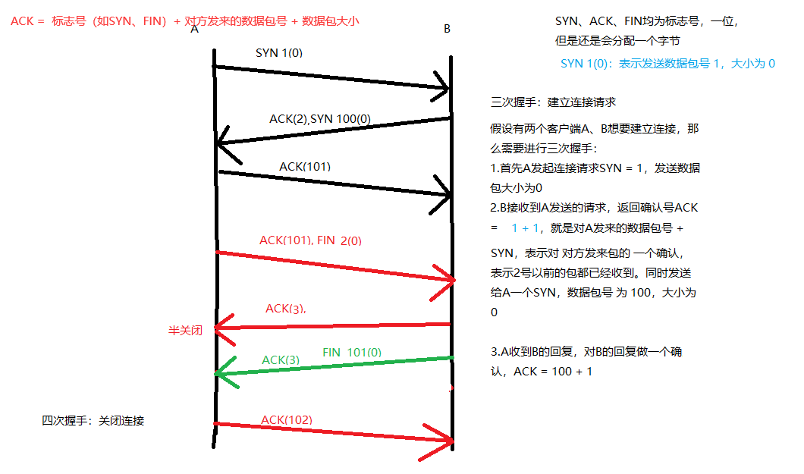


### 2.TCP状态转换图

ESTABLISHED：表示已建立连接

FIN_WAIT_2：主动发起关闭请求的一方，达到半关闭的状态

TIME_WAIT：

- 主动关闭连接一方
- 发出最后一个ACK后
- 等待2MSL 时间再关闭，作用：确保4次握手关闭连接 可靠


## 四、高并发服务器

多进程、多并发服务器不适合大量请求的时候，因为使用的是CPU进行切换！

### 1.多进程并发服务器

multi_process_server.c

```c
#include<stdio.h>
#include<sys/socket.h>
#include<unistd.h>
#include<stdlib.h>
#include<ctype.h>
#include<arpa/inet.h>
#include<wait.h>
#include<strings.h>
#include<sys/wait.h>

#define SERV_PORT 6666
#define SERV_IP "127.0.0.1"

int main(void){
        int lfd, cfd;
        struct sockaddr_in serv_addr, cli_addr;
        socklen_t cli_addr_len;
        char buf[BUFSIZ], cli_IP[BUFSIZ];
        int n, i;
        pid_t pid;

        lfd = socket(AF_INET, SOCK_STREAM, 0);

        serv_addr.sin_family = AF_INET;
        serv_addr.sin_port = htons(SERV_PORT);
        serv_addr.sin_addr.s_addr = htonl(INADDR_ANY);

        bind(lfd, (struct sockaddr* )&serv_addr, sizeof(serv_addr));

        listen(lfd, 32); // 指定最大客户端可连接数
        while(1){
                cli_addr_len = sizeof(cli_addr);
                cfd = accept(lfd, (struct sockaddr* )&cli_addr, &cli_addr_len); // 服务器接到一个连接请求
            	// 显示客户端连接信息
            	printf("client IP: %s , client port: %d\n",
                        inet_ntop(AF_INET, &cli_addr.sin_addr.s_addr, cli_IP, sizeof(cli_IP)),
                        ntohs(cli_addr.sin_port));
                pid = fork(); // 创建一个子进程
                if(pid < 0){
                        perror("fork error!");
                        exit(1);
                }else if(pid == 0){ // 子进程创建成功
                        close(lfd);
                        break;
                }else{
                        close(cfd);
                }
        }
    	
        if(pid == 0){ // 子进程
                while(1){
                        n = read(cfd, buf, sizeof(buf)); // 读取客户端通信
                        if(n == 0){
                                close(cfd);
                                return 0;
                        }else if(n == -1){
                                perror("read error!");
                                exit(1);
                        }else{
                                for(i = 0; i < n; i++){
                                        buf[i] = toupper(buf[i]); // 转为大写
                                }
                                write(cfd, buf, n);
                        }
                }
        }
        return 0;
}

```

4个客户端：

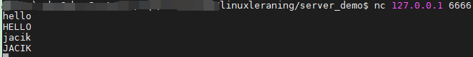

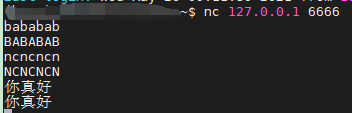

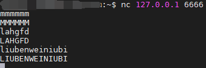

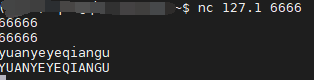

服务器端：

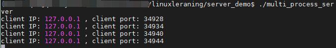


### 2.升级版--能够杀死僵尸进程

服务器显示客户端连接，以及客户端输入的信息

```c
#include<stdio.h>
#include<sys/socket.h>
#include<unistd.h>
#include<stdlib.h>
#include<ctype.h>
#include<arpa/inet.h>
#include<wait.h>
#include<strings.h>
#include<sys/wait.h>

#define SERV_PORT 6666
#define SERV_IP "127.0.0.1"

void wait_child(int signo){
        while(waitpid(0, NULL, WNOHANG) > 0);
        return ;
}

int main(void){
        int lfd, cfd;
        struct sockaddr_in serv_addr, cli_addr;
        socklen_t cli_addr_len;
        char buf[BUFSIZ], cli_IP[BUFSIZ];
        int n, i;
        pid_t pid;

        lfd = socket(AF_INET, SOCK_STREAM, 0);

        serv_addr.sin_family = AF_INET;
        serv_addr.sin_port = htons(SERV_PORT);
        serv_addr.sin_addr.s_addr = htonl(INADDR_ANY);

        bind(lfd, (struct sockaddr* )&serv_addr, sizeof(serv_addr));

        listen(lfd, 32); // 指定最大客户端可连接数
        while(1){
                cli_addr_len = sizeof(cli_addr);
                cfd = accept(lfd, (struct sockaddr* )&cli_addr, &cli_addr_len);
                        printf("client IP: %s , client port: %d\n",
                        inet_ntop(AF_INET, &cli_addr.sin_addr.s_addr, cli_IP, sizeof(cli_IP)),
                        ntohs(cli_addr.sin_port));
                pid = fork();
                if(pid < 0){
                        perror("fork error!");
                        exit(1);
                }else if(pid == 0){
                        close(lfd);
                        break;
                }else{
                        close(cfd);
                        signal(SIGCHLD, wait_child); // 子进程结束就进行回收
                }
        }
        if(pid == 0){ // 子进程
                while(1){
                        n = read(cfd, buf, sizeof(buf)); // 读取客户端通信
                        if(n == 0){
                                close(cfd);
                                return 0;
                        }else if(n == -1){
                                perror("read error!");
                                exit(1);
                        }else{
                                for(i = 0; i < n; i++){
                                        buf[i] = toupper(buf[i]); // 转为大写
                                }
                                write(cfd, buf, n);
                                write(STDOUT_FILENO, buf, n); // 服务器端实时显示客户端的输入
                        }
                }
        }

        return 0;
}

```

客户端：

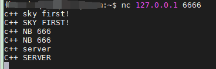

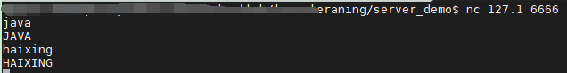

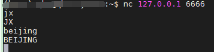

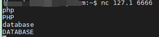

服务器端：

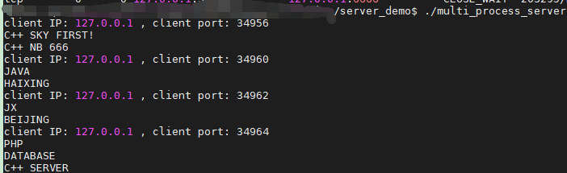

### 3.多线程高并发服务器

### 4.端口复用

setsockopt() ，很强大

### 5.多路IO转接服务器

server -- 监听

select

​	参数：返回值 4个辅助函数

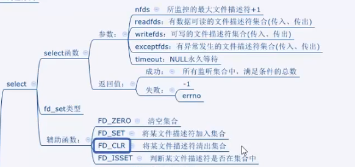

poll

​	参数：结构体{fd, evnets, events}

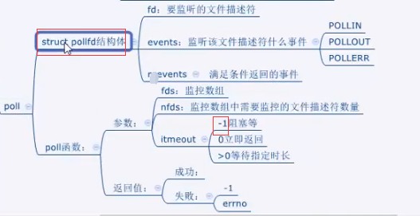

