# 网络编程1

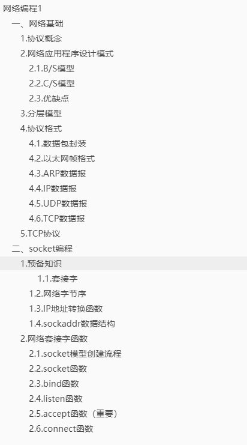

## 一、网络基础

### 1.协议概念

传输文件时的一种格式约定，比如先发文件名，再发数据大小等

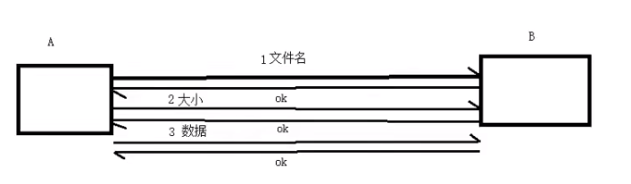


### 2.网络应用程序设计模式

#### 2.1.B/S模型

#### 2.2.C/S模型

#### 2.3.优缺点

C/S

- 优点：1.协议选用灵活 2.缓存数据
- 缺点：1.对用户的安全构成威胁 2.开发者工作量较大，调试困难

B/S

- 优点：1. 安全性高一些 2. 不缓存数据 3.跨平台
- 缺点：1.http 2.现加载现缓存，会受网络速度限制

### 3.分层模型

- OSI 七层模型

- TCP/IP 四层模型

  

顺口溜：“物数网传 会表应”

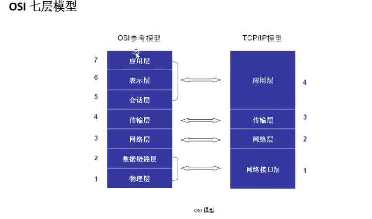

1. **物理层**：主要定义物理设备标准，如网线的接口类型、光纤的接口类型、各种传输介质的传输速率等。它的**主要作用是传输比特流**（就是由1、0转化为电流强弱来进行传输，到达目的地后再转化为1、0，也就是我们常说的数模转换与模数转换）。这一层的数据叫做**比特**。
2. **数据链路层**：定义了如让格式化数据**以帧为单位**进行传输，以及如何控制对物理介质的访问。这一层通常还提供错误检测和纠正，以确保数据的可靠传输。如：串口通信中使用到的115200、8、N、1
3. **网络层**：在位于**不同地理位置的网络中**的两个主机系统之间**提供连接和路径选择**。Internet的发展使得从全世界各站点访问信息的用户数大大增加，而网络层正是管理这种连接的层。
4. **传输层**：定义了一些传输数据的**协议和端口号**（xxx端口80等），如：**TCP协议**（传输控制协议，传输效率低，可靠性强，用于传输可靠性要求高，数据量大的数据），**UDP协议**（用户数据包协议，与TCP特性相反，用于传输可靠性不高，数据量小的数据，如QQ聊天数据就是采用UDP协议）。主要是将从下层接收的数据**进行分段和传输**，到达目的地址后**再进行重组**。常常把这一层数据叫做段。
5. 会话层：通过传输层（端口号：传输端口与接收端口）**建立数据传输的通路**。主要在你的系统之间发起会话或者接受会话请求（设备之间需要互相认识，可以是IP也可以是MAC或者主机名）
6. 表示层：可确保一个系统的应用层所发送的信息可以被另一个系统的应用层读取，例如：PC程序与另一台计算机进行通信，其中一台计算机使用扩展二-十进制交换码（EBCDIC）。而另一台则使用美国信息交换标准码（ASCII）来表示相同的字符。如有必要，表示层会通过使用一种通用格式来实现多种数据格式之间的转换
7. **应用层**：是最接近用户的OSI层。也就是为用户的应用程序（如电子邮件、QQ、浏览器等）提供网络服务。

通信方式

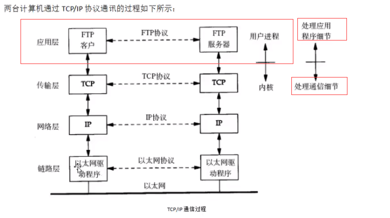

### 4.协议格式

- 数据包封装
- 以太网帧格式
- ARP数据报格式
- IP段格式
- UDP数据报格式
- TCP数据报格式

#### 4.1.数据包封装

假设A想给B发送内容“啥时候还我2块钱”，过程如下：

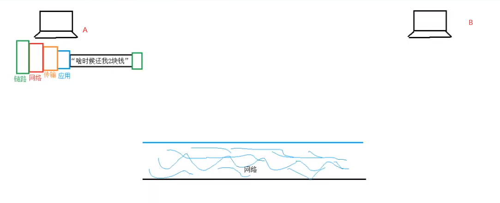


在网络中传输

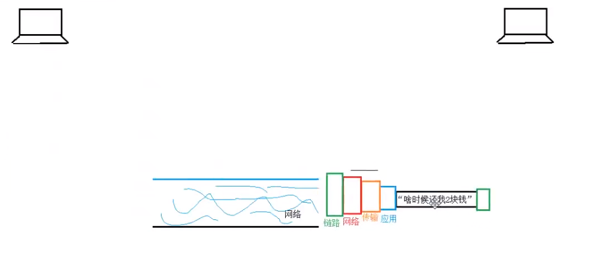

传输到B


解封装

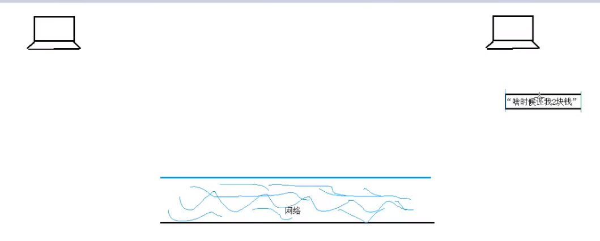

#### 4.2.以太网帧格式

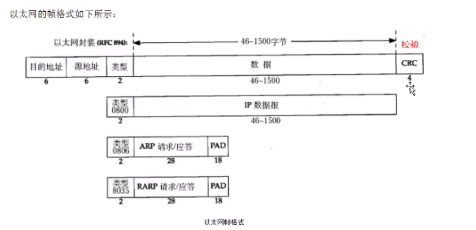

#### 4.3.ARP数据报

作用：获取下一跳的MAC地址，一个路由节点称为“一跳”

格式：

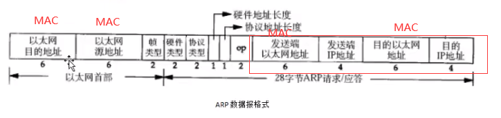

填充ARP数据报（46字节）

0000000...-->ffffffff...(图片有误)

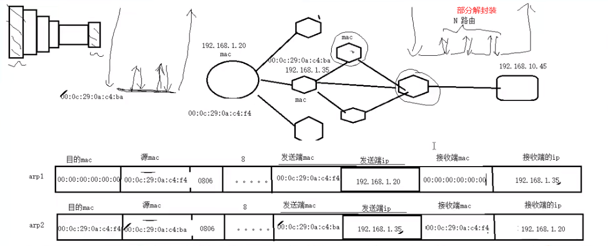

如果网络断开，数据报的发送陷入死循环，可以设置一个总跳数的限制TTL，超过这个限制，则直接丢弃该数据报。

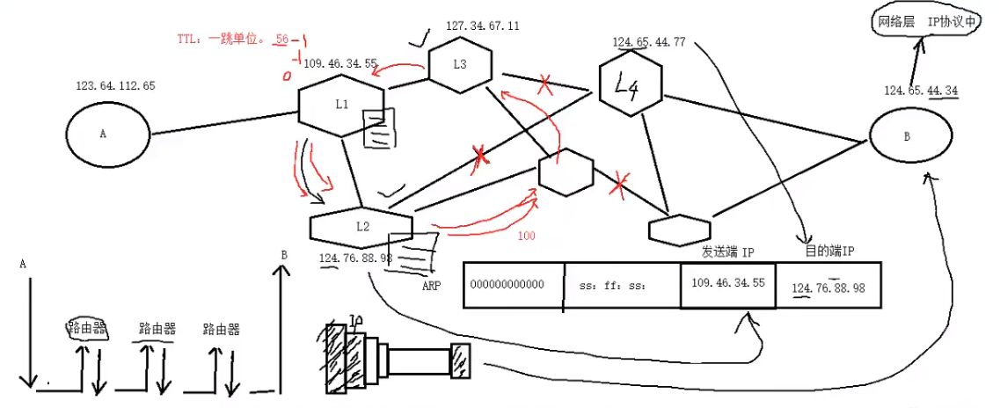


#### 4.4.IP数据报

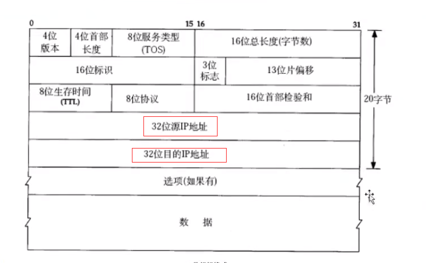

#### 4.5.UDP数据报

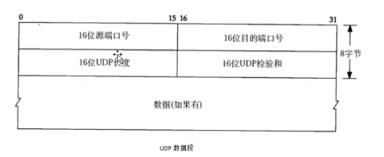


#### 4.6.TCP数据报

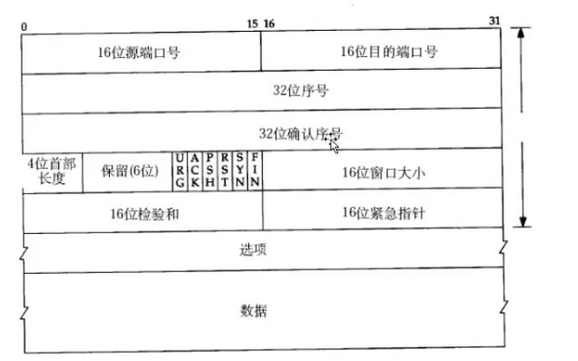


## 二、socket编程

### 1.预备知识

##### 1.1.**套接字**

占用磁盘空间：目录、普通文件、软连接

伪文件（不占用）：管道、套接字、字符设备、块设备

特点：成对出现，必须捆绑IP+port

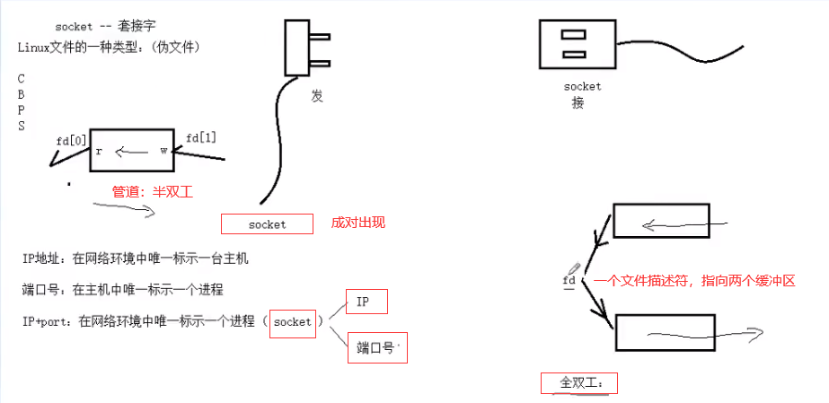


#### 1.2.**网络字节序**(记住结论)

**一般采用大端序**：高地址--低位、低地址--高位

小端序：高地址--高位、低地址--低位

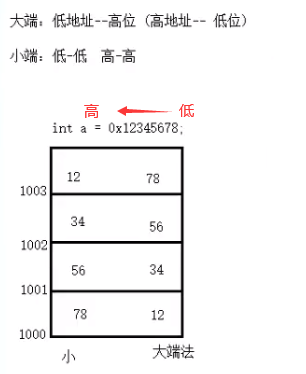

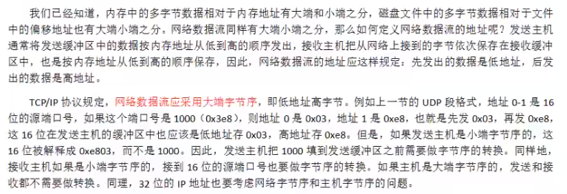

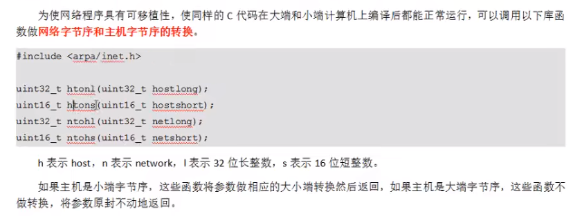


#### 1.3.IP地址转换函数

使用频率高，直接将 字符串 转换 

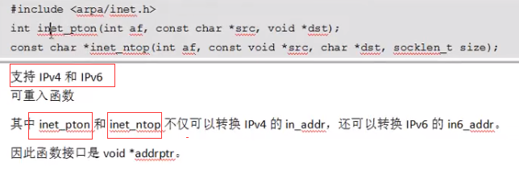

#### 1.4.sockaddr数据结构

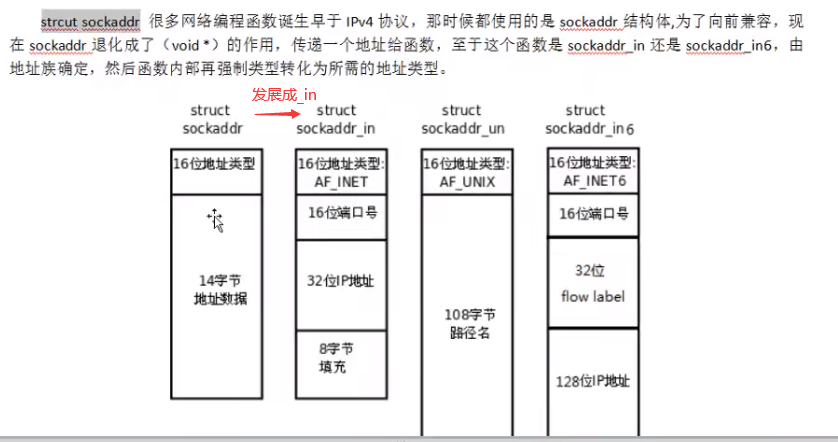

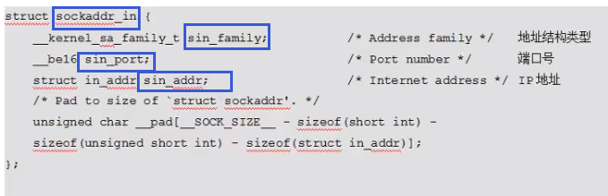


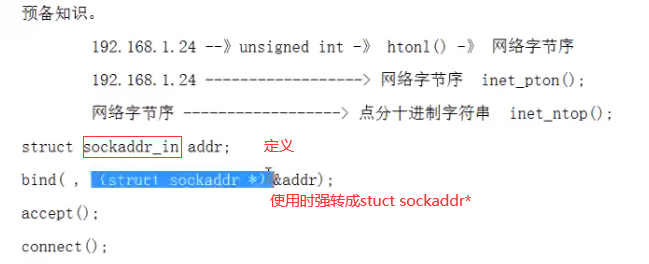


### 2.网络套接字函数

#### 2.1.socket模型创建流程

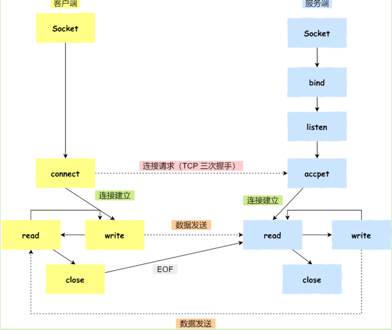

#### 2.2.socket函数

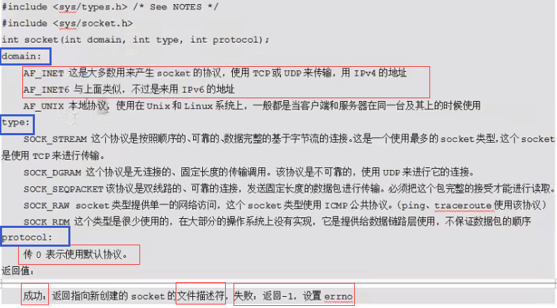


#### 2.3.bind函数

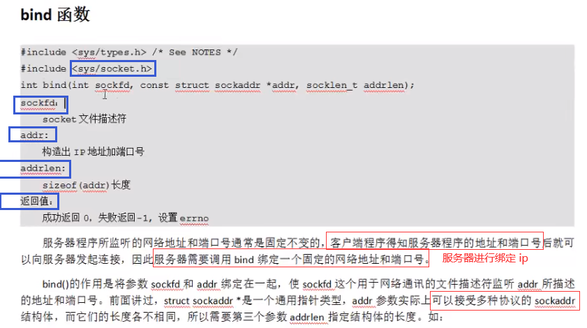


#### 2.4.listen函数

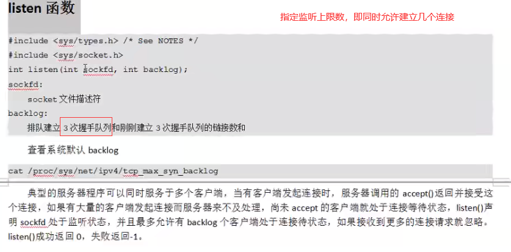

#### 2.5.accept函数（重要）

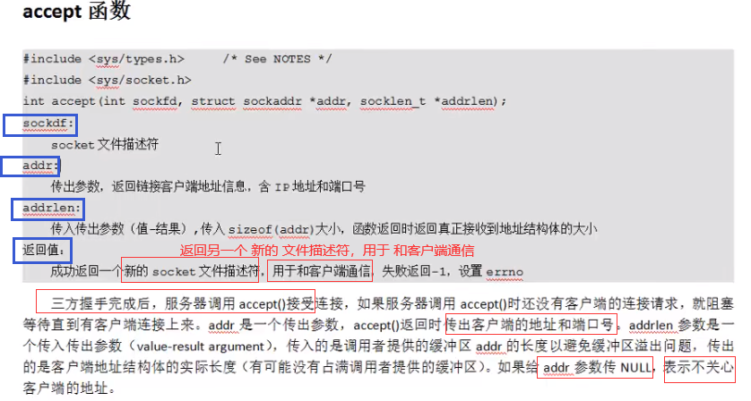

#### 2.6.connect函数

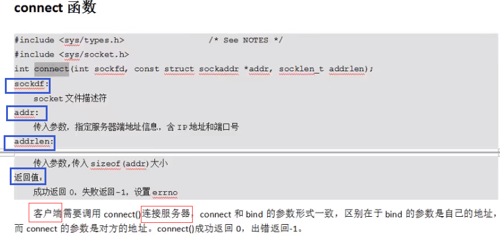


server.c，得倒背如流！

简单功能：实现客户端输入字母，服务器返回对应大写

```c
#include<stdio.h>
#include<sys/socket.h>
#include<unistd.h>
#include<stdlib.h>
#include<ctype.h>
#include<arpa/inet.h>

#define SERV_PORT 6666
#define SERV_IP '127.0.0.1'

int main(void){
  int lfd, cfd;
  struct sockaddr_in serv_addr, cli_addr;
  socklen_t cli_addr_len;
  char buf[BUFSIZ];
  int n, i;
 	// 使用AF_INET:iPv4, SOCK_STREAM：stream协议 ,默认0:tcp
    // lfd是服务器ip地址的索引
  lfd = socket(AF_INET, SOCK_STREAM, 0);
  	// 构造IP:端口
  serv_addr.sin_family = AF_INET; 
  serv_addr.sin_port = htons(SERV_PORT); // 本地字节序转化为网络字节序
  serv_addr.sin_addr.s_addr = htonl(INADDR_ANY); // INADDR_ANY可以任意类型IP
	// 绑定
  bind(lfd, (struct sockaddr* )&serv_addr, sizeof(serv_addr));

  listen(lfd, 32); // 指定最大客户端可连接数

  cli_addr_len = sizeof(cli_addr); // 因为是传入传出参数，所以不能传sizeof
  cfd = accept(lfd, (struct sockaddr* )&cli_addr, &cli_addr_len);
  	// 服务器显示连接的客户端 ip、port
  printf("client IP: %s , client port: %d\n",
        inet_ntop(AF_INET, &cli_addr.sin_addr.s_addr, cli_IP, sizeof(cli_IP)),
        ntohs(cli_addr.sin_port));


  while(1){
      n = read(cfd, buf, sizeof(buf)); // 读取客户端通信文件的大小
      for(i = 0; i < n; i++){
        buf[i] = toupper(buf[i]); // 转为大写
      }
      write(cfd, buf, n); // 写回到客户端
  }

  close(cfd);
  close(lfd);
  return 0;
}

```

假如没有写客户端，执行以下步骤

1. 服务器启动：./server
2. 另一个ssh连接：nc 127.0.0.1 6666


自己实现客户端

client.c

```c
#include<stdio.h>
#include<unistd.h>
#include<stdlib.h>
#include<sys/socket.h>
#include<arpa/inet.h>
#include<string.h>

// 必须是跟服务器的一样 ip+port，才能锁定服务器
#define SERV_IP "127.0.0.1" 
#define SERV_PORT 6666

int main(void){
  int cfd, n;
  struct sockaddr_in serv_addr;
  char buf[BUFSIZ];

  cfd = socket(AF_INET, SOCK_STREAM, 0);

  memset(&serv_addr, 0, sizeof(serv_addr));
  serv_addr.sin_family = AF_INET;
  serv_addr.sin_port = htons(SERV_PORT);
  inet_pton(AF_INET, SERV_IP, &serv_addr.sin_addr.s_addr);

  connect(cfd, (struct sockaddr* )&serv_addr, sizeof(serv_addr));

  while(1){
      fgets(buf, sizeof(buf), stdin); // hello -- fgets -- 'hello\n\0'
      write(cfd, buf, strlen(buf)); // 将客户端输入，写给服务器
      n = read(cfd, buf, sizeof(buf)); // 读取服务器回传数据到客户端
      write(STDOUT_FILENO, buf, n); // 显示到屏幕
  }
  close(cfd);
  return 0;
}

```

现在，有服务端，也有客户端

1. 先启动服务器./serve
2. 开启客户端./client

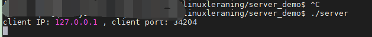

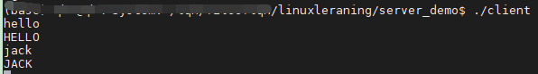

