# 网络编程2

[TOC]

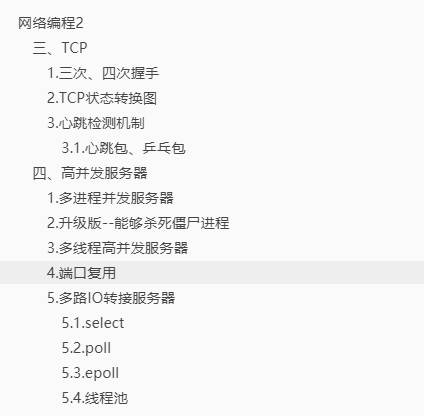

## 三、TCP

### 1.三次、四次握手

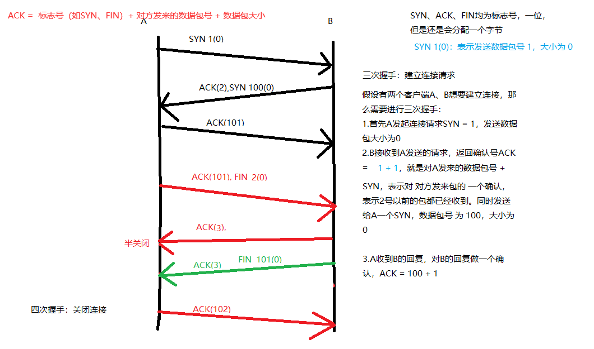


### 2.TCP状态转换图

ESTABLISHED：表示已建立连接

FIN_WAIT_2：主动发起关闭请求的一方，达到半关闭的状态

TIME_WAIT：

- 主动关闭连接一方
- 发出最后一个ACK后
- 等待2MSL 时间再关闭，作用：确保4次握手关闭连接 可靠


### 3.心跳检测机制

#### 3.1.心跳包、乒乓包

应用层机制

假如通信两端A,B，每隔一定频率A向B发送一个包1，B收到回复A一个包2，则表示连接正常；如果A隔了N次还没有收到B的回复包2，则表示断开连接！


## 四、高并发服务器

多进程、多并发服务器不适合大量请求的时候，因为使用的是CPU进行切换！

### 1.多进程并发服务器

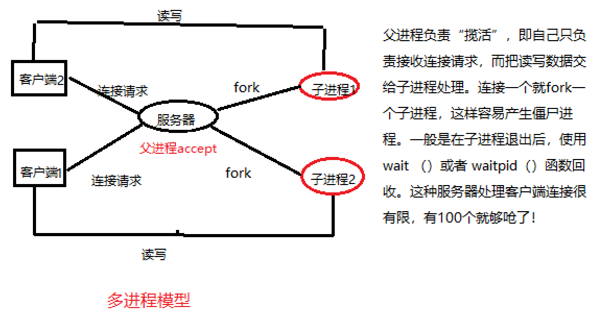

multi_process_server.c

```c
#include<stdio.h>
#include<sys/socket.h>
#include<unistd.h>
#include<stdlib.h>
#include<ctype.h>
#include<arpa/inet.h>
#include<wait.h>
#include<strings.h>
#include<sys/wait.h>

#define SERV_PORT 6666
#define SERV_IP "127.0.0.1"

int main(void){
        int lfd, cfd;
        struct sockaddr_in serv_addr, cli_addr;
        socklen_t cli_addr_len;
        char buf[BUFSIZ], cli_IP[BUFSIZ];
        int n, i;
        pid_t pid;

        lfd = socket(AF_INET, SOCK_STREAM, 0);

        serv_addr.sin_family = AF_INET;
        serv_addr.sin_port = htons(SERV_PORT);
        serv_addr.sin_addr.s_addr = htonl(INADDR_ANY);

        bind(lfd, (struct sockaddr* )&serv_addr, sizeof(serv_addr));

        listen(lfd, 32); // 指定最大客户端可连接数
        while(1){
                cli_addr_len = sizeof(cli_addr);
                cfd = accept(lfd, (struct sockaddr* )&cli_addr, &cli_addr_len); // 服务器接到一个连接请求
            	// 显示客户端连接信息
            	printf("client IP: %s , client port: %d\n",
                        inet_ntop(AF_INET, &cli_addr.sin_addr.s_addr, cli_IP, sizeof(cli_IP)),
                        ntohs(cli_addr.sin_port));
                pid = fork(); // 创建一个子进程
                if(pid < 0){
                        perror("fork error!");
                        exit(1);
                }else if(pid == 0){ // 子进程创建成功
                        close(lfd);
                        break;
                }else{
                        close(cfd);
                }
        }
    	
        if(pid == 0){ // 子进程
                while(1){
                        n = read(cfd, buf, sizeof(buf)); // 读取客户端通信
                        if(n == 0){
                                close(cfd);
                                return 0;
                        }else if(n == -1){
                                perror("read error!");
                                exit(1);
                        }else{
                                for(i = 0; i < n; i++){
                                        buf[i] = toupper(buf[i]); // 转为大写
                                }
                                write(cfd, buf, n);
                        }
                }
        }
        return 0;
}

```

4个客户端：

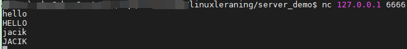

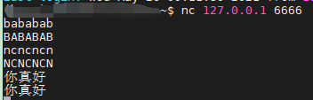

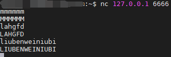

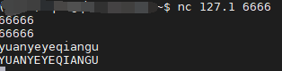

服务器端：

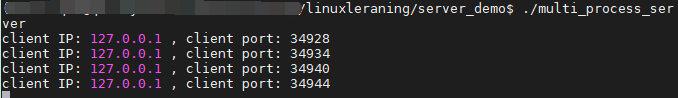


### 2.升级版--能够杀死僵尸进程

服务器显示客户端连接，以及客户端输入的信息

```c
#include<stdio.h>
#include<sys/socket.h>
#include<unistd.h>
#include<stdlib.h>
#include<ctype.h>
#include<arpa/inet.h>
#include<wait.h>
#include<strings.h>
#include<sys/wait.h>

#define SERV_PORT 6666
#define SERV_IP "127.0.0.1"

void wait_child(int signo){
        while(waitpid(0, NULL, WNOHANG) > 0);
        return ;
}

int main(void){
        int lfd, cfd;
        struct sockaddr_in serv_addr, cli_addr;
        socklen_t cli_addr_len;
        char buf[BUFSIZ], cli_IP[BUFSIZ];
        int n, i;
        pid_t pid;

        lfd = socket(AF_INET, SOCK_STREAM, 0);

        serv_addr.sin_family = AF_INET;
        serv_addr.sin_port = htons(SERV_PORT);
        serv_addr.sin_addr.s_addr = htonl(INADDR_ANY);

        bind(lfd, (struct sockaddr* )&serv_addr, sizeof(serv_addr));

        listen(lfd, 32); // 指定最大客户端可连接数
        while(1){
                cli_addr_len = sizeof(cli_addr);
                cfd = accept(lfd, (struct sockaddr* )&cli_addr, &cli_addr_len);
                        printf("client IP: %s , client port: %d\n",
                        inet_ntop(AF_INET, &cli_addr.sin_addr.s_addr, cli_IP, sizeof(cli_IP)),
                        ntohs(cli_addr.sin_port));
                pid = fork();
                if(pid < 0){
                        perror("fork error!");
                        exit(1);
                }else if(pid == 0){
                        close(lfd);
                        break;
                }else{
                        close(cfd);
                        signal(SIGCHLD, wait_child); // 子进程结束就进行回收
                }
        }
        if(pid == 0){ // 子进程
                while(1){
                        n = read(cfd, buf, sizeof(buf)); // 读取客户端通信
                        if(n == 0){
                                close(cfd);
                                return 0;
                        }else if(n == -1){
                                perror("read error!");
                                exit(1);
                        }else{
                                for(i = 0; i < n; i++){
                                        buf[i] = toupper(buf[i]); // 转为大写
                                }
                                write(cfd, buf, n);
                                write(STDOUT_FILENO, buf, n); // 服务器端实时显示客户端的输入
                        }
                }
        }

        return 0;
}

```

客户端：

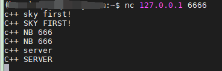

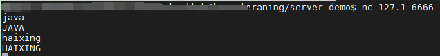

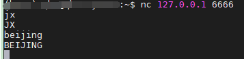

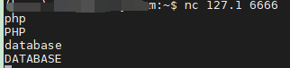

服务器端：

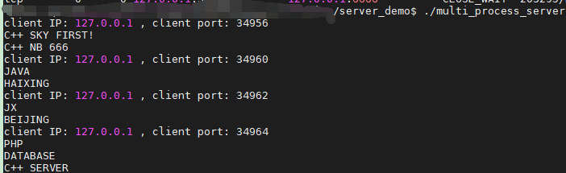

### 3.多线程高并发服务器

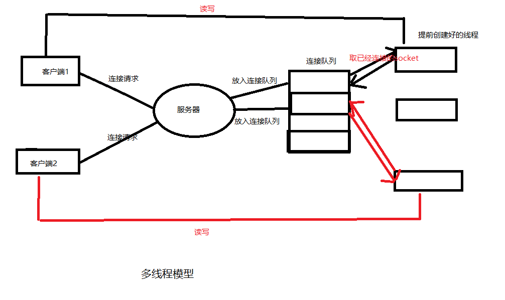

### 4.端口复用

setsockopt() ，很强大

### 5.多路IO转接服务器

server -- 监听

一个进程管理多个socket

**select/poll**

**select 实现多路复用的方式**是，将已连接的 Socket 都放到一个**文件描述符集合**，然后调用 select 函数将文件描述符集合**拷贝**到内核里，让内核来检查是否有网络事件产生，检查的方式很粗暴，就是通过**遍历**文件描述符集合的方式，当检查到有事件产生后，将此 Socket 标记为可读或可写， 接着再把整个文件描述符集合**拷贝**回用户态里，然后用户态还需要再通过**遍历**的方法找到可读或可写的 Socket，然后再对其处理。

**区别**：

1. 而poll跟select原理类似，区别在于select用数组来存放集合，而poll用链表来存放！
2. select 使用**固定长度**的 BitsMap，表示文件描述符集合，而且所支持的文件描述符的个数是有限制的，在 Linux 系统中，由**内核中的 FD_SETSIZE 限**制， 默认最大值为 `1024`，只能监听 0~1023 的文件描述符。poll 不再用 BitsMap 来存储所关注的文件描述符，取而代之用动态数组，以链表形式来组织，突破了 select 的文件描述符个数限制，当然还会受到**系统文件描述符限制**。

**缺点**：poll 和 select 并没有太大的本质区别，**都是使用「线性结构」存储进程关注的 Socket 集合，因此都需要遍历文件描述符集合来找到可读或可写的 Socket，时间复杂度为 O(n)，而且也需要在用户态与内核态之间拷贝文件描述符集合**，这种方式随着并发数上来，性能的损耗会呈指数级增长。


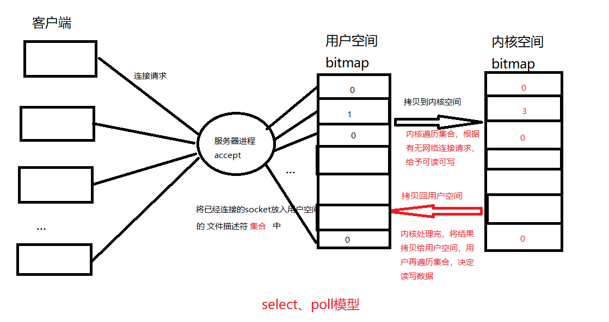

#### 5.1.select

​	参数：返回值 4个辅助函数

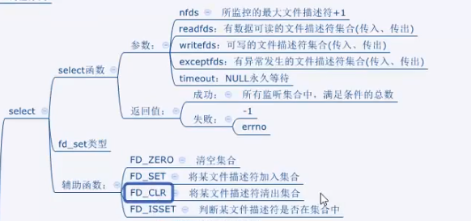

#### 5.2.poll

​	参数：结构体{fd, evnets, events}

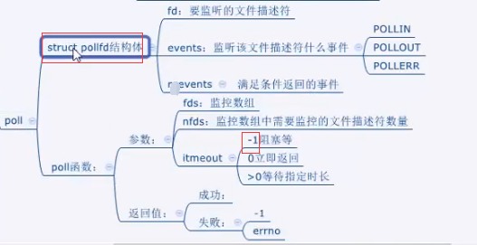

#### 5.3.epoll

API:

- epoll_create() -- int epfd = epoll_create(10) 建议内核
  - 监听10个文件描述符 --epfd(句柄) -- **创建红黑树树根**
- epoll_ctl -- 将监听的客户端请求的文件描述符，**添加到树节点** 或 修改 或 去掉
  - op: EPOLL_CTL_ADD/MOD/DEL
  - events:EPOLLIN/OUT/ERP
- epoll_wait（epfd, evt, 100, -1）; 跟select poll 阻塞监听差不多

**过程**：

1. 客户端连接服务器，服务器accept后，会返回一个文件描述符（一个socket，决定双方是否要读写数据），**在内核中**，epoll_create会建立一颗红黑树的头结点，每当一个socket进来，就会把它加入到红黑树中（这些socket节点都处于待检测的状态）；
2. 当socket发生中有了读写数据的请求，就会触发 **内核调用回调函数** 将其加入到这个**就绪事件列表**中，只需要通过遍历链表（**链表内都是 就绪的socket**），来对该socket处理（读写数据），这里对比select、poll的**需要遍历整个数组(链表)**，效率提升很大！
3. 当用户调用 `epoll_wait()` 函数时，**只会返回有事件发生**的文件描述符的个数，不需要像 select/poll 那样**轮询扫描整个 socket 集合**，大大提高了检测的效率。


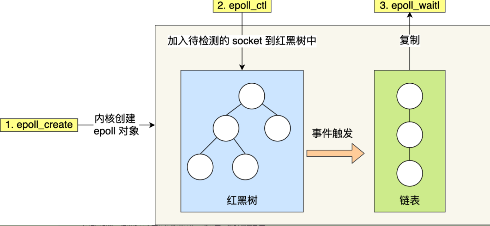

优点：epoll 的方式即使监听的 Socket 数量越多的时候，效率不会大幅度降低，能够同时监听的 Socket 的数目也非常的多了。上限为系统定义的**进程打开的最大文件描述符个数**。因而，**epoll 被称为解决 C10K 问题的利器**。


epoll ET：边缘触发 event = EPOLLIN | EPOLLET

epoll LT：水平触发

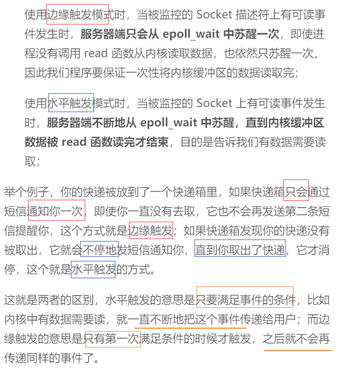

epoll 非阻塞IO

- 边缘触发 while(read() ) fcntl(O_NONBLOCK)
- 如果使用边缘触发模式，I/O 事件发生时只会通知一次，而且我们不知道到底能读写多少数据，所以在收到通知后应尽可能地读写数据，以免错失读写的机会。因此，我们会**循环**从文件描述符读写数据，那么如果文件描述符是阻塞的（没有数据可读写时），进程会阻塞在读写函数那里，程序就没办法继续往下执行。所以，**边缘触发模式一般和非阻塞 I/O 搭配使用**，程序会一直执行 I/O 操作，直到系统调用（如 `read` 和 `write`）返回错误，错误类型为 `EAGAIN` 或 `EWOULDBLOCK`。

epoll 反应堆模型（libevent 核心思想实现）

- libvent  --跨平台 ，源码精炼 --epoll 回调，以之前小写转大写的例子为例：

  - 1.epoll -- 服务器 -- 监听 -- fd -- 可读 -- epoll返回 -- read -- 小写转大写 -- write -- epoll继续监听

  - 2.epoll反应堆模型（相比1，多了一个判断是否可读）

    - epoll -- 服务器 -- 监听 -- cfd -- 可读 -- epoll返回 -- read -- cfd从树上摘下 -- 设置监听cfd 写事件 ，操作 --小写转大写 --等待epoll_wait返回 --回写客户端 -- cfd从树上摘下 ---设置监听cfd 读事件， 操作 --- epoll继续监听

    - evt[i].events = EPOLLIN，evt[I].data.fd == cfd ，*ptr ，struct {int fd, void ( *func )(void *arg)}

      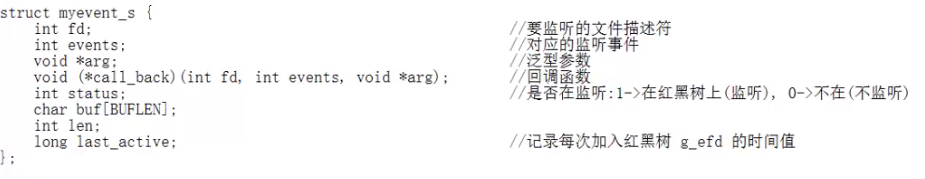


#### 5.4.线程池

有一个线程池队列，有请求加入到任务队列中，唤醒线程池队列

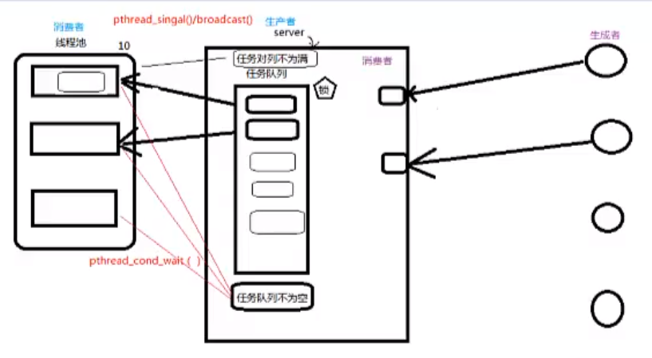

