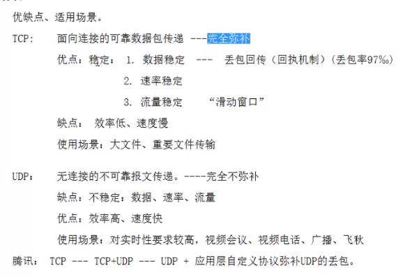
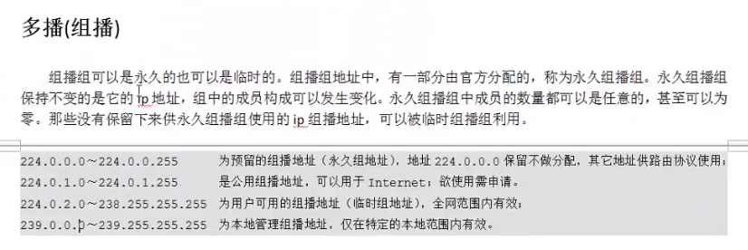
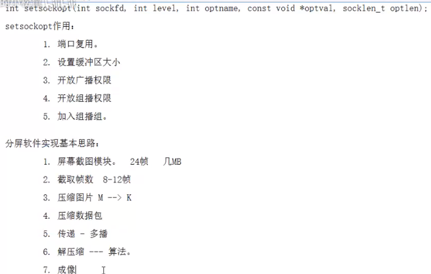

# 网络编程3

[TOC]

## 五、C/S模型-UDP

## 六、组播

ifconfig 查看网卡等信息、

ip address 查看网卡编号（简写 ip ad）

## 七、domain 本地套接字

本地通信

1. pipe fifo 实现最简单
2. mmap 非血缘关系进程间
3. 信号 开销小
4. 本地套 稳定性最好
   - #define offsetof(type, member) ((int)& (type *) 0) ->MEMBER)

## 八、总复习弱点

lseek fcntl

dup2

