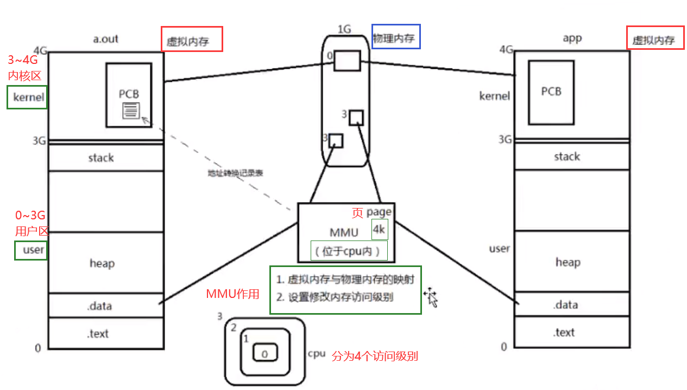

# 系统编程1

## 一、进程

### 1.进程相关概念

#### 1.1.程序和进程

**程序**，是指编译好的二进制文件，在磁盘上；不占用系统资源（cpu、内存、打开的文件、设备、锁）

**进程**，是一个抽象的概念，打开一个程序就会有一个进程。

​	程序 -》剧本（纸） 进程 -》 戏（舞台、演员、灯光、道具...）

​	同一个剧本可以在多个舞台上演 -》**同一个程序也可以加载为不同的进程**（彼此之间互不影响）

​	如：同时打开终端，各自有一个bash但彼此ID不同

#### 1.2.并发

在操作系统中，一个时间段中 有多个进程都处于 **已启动运行** 到 **运行完毕之间** 的状态。但是某一个时刻点只有一个进程运行。

​	如：我们可以使用计算机边听音乐边聊天。计算机cpu切换的很快，以至于让我们感觉是同时进行的。


#### 1.3.单道、多道程序设计

#### 1.4.CPU和MMU


​										      中央处理器CPU



​											  MMU

#### 1.5进程控制块PCB

位于内核区域（3G~4G)，每一个进程在内核中都有进程控制块PCB来维护进程相关的信息；linux内核的进程控制块是task_struct结构体。

/usr/src/linux-headers-3.16.0-30/include/linux/sched.h 文件中可以查看struct task_struct结构体的定义；内部成员很多，需要掌握以下部分：

1. 进程id。系统中每个进程有唯一的id，在c语言中用 pid_t 类型表示，其实就是一个非负整数

2. 进程的状态：**就绪、运行、挂起、停止**等状态

3. 进程切换时需要保存和恢复的一些CPU寄存器

4. 描述虚拟地址空间的信息

5. 描述控制终端的信息

6. 当前工作目录

7. umask 掩码

8. 文件描述符表，包含很多指向file结构体的指针

   

   pcb中保存着一个指针，指向文件描述符表的首地址，通过指针可以指向file_struct，里面有文件的各种信息

   如打开一个文件，会返回一个文件描述符，一般是个数字，通过数字映射到指针，指针取文件信息。

9. 和信号相关的信息(9 ~ 12未讲，但要求掌握)

10. 用户id 和 组 id

11. 会话（session) 和 进程组

12. 进程可以使用的资源上限（Resource Limit）

### 2.环境变量

指的是操作系统中**用来指定操作系统运行环境的一些参数**。通常具备一下特征：

①字符串 ②有统一的格式：名=值[:值(有多个值的时候:格分)] ③值用来描述进程环境信息

- 存储形式：与命令参数类似；char *[]数组，数组名 environ,内部存储字符串，NULL作为哨兵结尾
- 使用形式：与命令参数类似
- 加载位置：与命令参数类似；位于用户区，高于stack的起始位置
- 引入环境变量表：必须声明环境变量；extern char ** environ  

#### 2.1.常见环境变量

PATH

SHELL

TERM

LANG

HOME

getenv函数

setenv函数

unsetenv函数

### 3.进程控制

#### 3.1创建一个子进程：

pid_t fork(void); 

- 失败返回 -1；
- 成功返回“两个”：一个进程 --》2个进程 --》各自对fork做返回
  - 父进程返回进程的ID（**非负**， >0）
  - 子进程返回 0

pid_t类型表示进程ID，但为了表示 -1，它是 **有符号的整型**。（0不是有效进程，init最小，为1）

**注意返回值**，不是fork函数能返回两个值，而是fork后，fork函数变为两个，父子【**各自**】返回一个

创建单个，代码如下：

```c
// 创建单个子进程
#include <stdio.h>
#include <unistd.h>
#include <stdlib.h>

int main(){
        pid_t pid;
        // fork前做了的事情
        printf("before create fork xxxxxxxxxxxxxxxxxx\n");

        // fork
        pid = fork();
        if(pid == -1){ // pid为负，说明fork出错
                perror("fork error");
                exit(1);
        }
        else if(pid == 0){ //pid为0, 说明创建成功
                printf("I'm child, pid = %u\n, ppid = %u\n", getpid(),getppid());
        }
        else{
                printf("I'm parent, pid = %u\n, ppid = %u\n", getpid(), getppid());
                sleep(1);
        }

        printf("yyyyyyyyyyyyyyyyyyyyyyyyyyyyyyyy\n");
        return 0;
}
```


#### 3.2循环创建 n 个子进程（掌握架构，能够白纸写出）

代码如下：

```c
//循环创建 n 个子进程
#include <stdio.h>
#include <unistd.h>
#include <stdlib.h>

int main(){
        pid_t pid;
        // fork前做了的事情
        printf("before create fork xxxxxxxxxxxxxxxxxx\n");
        int i;
        for(i = 0; i < 5; i++){
            // fork
            pid = fork();
            if(pid == -1){ // pid为负，说明fork出错
                perror("fork error");
                exit(1);
            }
            else if(pid == 0){ //pid为0, 说明创建成功
                // 创建完成一个子进程，就跳出，子进程不会创建子进程
                break;
            }
        }
        if(i < 5){
            //sleep(i);
            printf("I'm %dth child, pid = %u\n", i+1, getpid());
        }
        else{
            //sleep(i);
            printf("I'm parent\n");
        }
        return 0;
}

```

使用sleep(i),人为让进程有顺序（按i的值排序），但执行这个fork文件时，其实是6个进程（1个父进程 + 5个子进程）同时争夺资源创建


不使用sleep(i)


一些函数：

1. getpid函数
2. getuid函数
3. getgid函数

#### 3.4**进程共享**

1. ​	父子进程之间fork之后。有何异同？

   - 刚fork后：

     - 父子相同处：用户区相同，如全局变量、.data、.text、栈、堆、环境变量、用户ID、宿主目录、进程工作目录、信号处理方式...

     - 父子不同处：1.进程ID 2.fork返回值 3.父进程ID 4.进程运行时间 5.闹钟（定时器）6.未决信号集

     ==》似乎子进程复制了父进程 0~3G用户空间内容，以及父进程的PCB，但pid不同。真的每一个fork的子进程都要将父进程的 0 ~ 3G地址空间完全拷贝一份，然后映射到物理内存吗？

     ==》当然不是！ 父进程进程间遵循 **读时共享写时复制** 的原则。这样设计，无论进程执行父进程的逻辑还是执行自己的逻辑都能节省内存开销。

2. 重点：

   - 父子进程共享：1.文件描述符（打开文件的结构体） 2.mmap建立的映射器（进程间通信）
   - 特别地，fork之后父进程与子进程的执行顺序**取决于内核所使用的调度算法，是不确定的**

   


