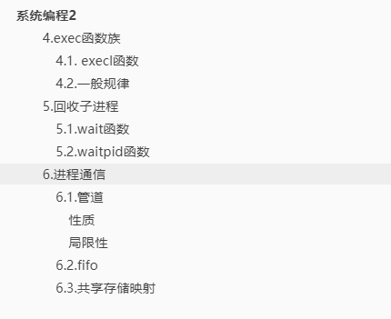
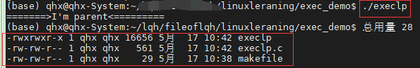
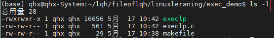
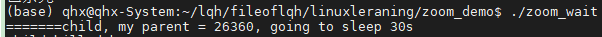
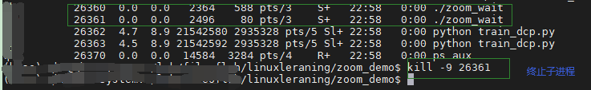
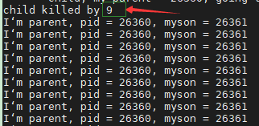

# 系统编程2



### 4.exec函数族

fork创建子进程后**执行的是和父进程相同的程序**（但有可能执行不同的代码分支），子进程往往要调用一种 exec 函数来执行另一个程序。

当进程调用一种 exec 函数时，该进程的**用户空间代码和数据完全被新程序替换**，从新程序的启动例程开始执行。调用 exec 并不创建进程，所以调用 exec 前后该进程id **并未改变**。

将当前进程的.text、.data替换为所要加载的程序的.data、.text，然后让进程从新的.text第一条指令开始执行，但进程ID不变，**换核不换壳**！

有 6 种以exec开头的函数，统称exec函数：

1. int execl(const char* path, const char* arg, ...)
2. int execlp(const char* file, const char* arg, ...)
3. int execle(const char* path, const char* arg, ..., char* const envp[]) // e-加载环境变量env
4. int execlv(const char* path, char* const argv[])
5. int execvp(const char* file, char* const argv[]) // p-加载进程
   - 加载一个进程，使用自定义环境变量env
   - 变参形式：①... ②argv[] (main函数也是变参函数，形式上等同于 int main(int argc, char* argv0, ..))
   - 变参终止条件：①NULL结尾 ②指定固定参数
   - execvp 与 execlp 参数形式不同，原理一致
6. int execve(const char* path, char* const argv[], char* const envp[])

#### 4.1. execl函数


execlp.c代码

```c
#include<stdio.h>
#include<unistd.h>
#include<stdlib.h>
int main(){
        pid_t pid;
        pid = fork();
        if(pid == -1){
            perror("fork error!");
            exit(1);
        }else if(pid > 0){
            printf("=======>I'm parent<=========\n");
        }else{ // 子进程
            execlp("/bin/ls", "ls", "-l", NULL); // 相当于让子进程执行 ls -l的命令, NULL是结束标记
            // execl("./自定义可执行文件路径", "可执行文件", NULL);
        }
        return 0;
}
```



跟ls -l效果是一样的



exec_ps.c代码，实现将ps aux > ps.out 的功能（将ps的屏幕输出放到文件中，也叫作重定向）

```c
#include<stdio.h>
#include<fcntl.h>
#include<stdio.h>
#include<stdlib.h>
#include<unistd.h>

int main(){
        // 打开文件
        int fd;
        fd = open("ps.out", O_WRONLY|O_CREAT|O_TRUNC, 0644);
        // 判断打开是否成功
        if(fd < 0){
                perror("open ps.out error!\n");
                exit(1);
        }
        // 重定向
        dup2(fd, STDOUT_FILENO); // STDOUT --> fd -> ps.out
        
    	execlp("ps", "ps", "aux", NULL);
    	perror("execlp error!");
    	exit(1);
        
    	return 0;
}

```

#### 4.2.一般规律

exec函数一旦调用成功即执行新的程序，不返回。**只有失败才返回，错误值 -1**。所以通常我们直接在 exec函数调用后用perror() 和 exit()，无需if判断

l -- list -- 命令行参数

p -- path -- 搜索file时使用path变量

v -- vector -- 使用命令行 参数数组

e -- environment -- 使用环境变量数组，不使用进程原有的环境变量，设置新加载程序运行的环境变量


### 5.回收子进程

​	**孤儿进程**：父进程先于子进程结束，则子进程成为孤儿，这些孤儿由init进程领养，由init进程回收释放。

​	**僵尸进程**：进程终止，父进程尚未回收，子进程残留资源（PCB）存放于内核中，变成僵尸（Zombie)进程。值得注意的是，僵尸进程是不能用kill命令清除的。因为kill是用来终止进程的，**而僵尸进程已经终止**（但未回收）。

#### 5.1.wait函数

​	一个进程在终止时会关闭所有的文件描述符，释放在用户空间分配的内存，**但它的PCB还保留着，内核在其中保存了一些信息**：如果是**正常终止**则保存着退出状态；如果是**异常终止**则保存着**导致该进程终止的信号是哪个**。

​	这个进程的父进程可以调用wait 或 waitpid获取这些信息，然后彻底清除这个进程。我们知道一个进程的退出状态可以在shell中用特殊变量 $? 查看，因为 shell 是它的父进程，**当它终止时shell调用wait 或 waitpid得到它的退出状态**，同时彻底清除这个进程。

​	

**父进程调用wait函数可以回收子进程终止信息。**函数功能是：父进程一旦调用了wait**就立即阻塞自己**，由wait自动分析是否当前进程的某个子进程已经退出，如果让它找到了这样一个已经变成僵尸的子进程，wait就会收集这个子进程的信息，并把它彻底销毁后返回；如果没有找到这样一个子进程，wait就会一直阻塞在这里，直到有一个出现为止。

​	**该函数3个功能总结如下**：

- 阻塞 等待 子进程退出

- 回收子进程残留资源

- 获取子进程结束状态（子进程为什么退出了）

pid_t wait(int* status)；返回值：成功--清理掉的子进程ID；失败-- -1（没有子进程）;**一次调用回收一次**

​	**当进程终止时，操作系统的隐式回收机制为**：

1. 关闭所有文件描述符
2. 释放用户空间分配的内存；内核的PCB仍存在。其中保存该进程的退出状态。（正常终止->退出值；异常终止 ->终止信号）

​    可使用wait函数**传出参数status来保存进程的退出状态**。借助宏函数来进一步判断进程终止的具体原因。宏函数可分为如下三组：

- WIFEXITED(status) != 0 --> 进程正常结束

   ​	WEXITSTATUS(status) --> 如上宏为真，即进程正常退出，使用这个宏 --> 获得进程退出状态（exit的参数）

- WIFSIGNALED(status) != 0 --> 进程异常终止

   ​	WTERMSIG(status) --> 如上宏为真，即进程异常退出，使用这个宏 --> 获得使进程异常终止的那个信号的编号

- 3.略

   ​	

wait回收子进程代码zoom_wait.c如下：

```c
#include<stdio.h>
#include<stdlib.h>
#include<unistd.h>
#include<sys/wait.h>

int main(void){
        pid_t pid, wpid;
    	int status; // 子进程退出的信息
        pid = fork();

        if(pid == 0){ // 子进程
            printf("=======child, my parent = %d, going to sleep 30s\n", getppid());
            sleep(30);
            printf("=================child die======================\n");
            exit(100);
        }else if(pid > 0){ // 父进程
            wpid = wait(&status); // 回收子进程，并将信息放入status
            if(wpid == -1){ // 回收失败返回 -1
                perror("wait error");
                exit(1);
            }
            if(WIFEXITED(status)){ // 子进程正常退出
                printf("child exit with %d\n", WEXITSTATUS(status));
            }
            if(WIFSIGNALED(status)){ // 子进程异常退出
                printf("child killed by %d\n", WTERMSIG(status)); //返回令进程终止的信号
            }
            while(1){
                printf("I'm parent, pid = %d, myson = %d\n", getpid(), pid);
                sleep(1);
            }
        }else{
            perror("fork error!");
            exit(1);
        }
        return 0;
}

```

运行./zoom_wait



然后在子进程未正常结束前，人为终止;



产生异常信息。可以看到，返回令进程终止的信号 ==> 9



#### 5.2.waitpid函数

作用同wait，但可以指定pid进程进行清理，可以不阻塞

pid_t waitpid(pid_t, int* status, int options)

- 成功：返回清理掉的子进程ID
- 失败：返回 -1（无子进程）

特殊参数 pid：

- **pid > 0 : 回收指定ID的进程**
- **pid = -1：回收 任意 子进程（相当于wait)**
- pid = 0：回收和当前调用waitpid一个组的所有子进程
- pid < -1：回收指定进程组内的任意子进程

返回 0：参数3为 WNOHANG，且子进程正在运行

**注意：一次wait 或 waitpid 的调用只能清理一个子进程，清理多个子进程需要循环**


循环回收n = 5个子进程，代码loop_zoom_waitpid.c代码如下：

```c
#include<stdio.h>
#include<unistd.h>
#include<stdlib.h>
#include<sys/wait.h>

int main(int argc, char* argv[]){
        int n = 5, i; // 默认创建5个子进程
        pid_t p, q, wpid;
        if(argc == 2){
            wpid = waitpid(-1, NULL, WNOHANG); // 第一个参数-1等价于wait(NULL)
            n = atoi(argv[1]);
        }

        for(i = 0; i < n; i++){// 出口1，父进程专用出口
            p = fork();
            if(p == 0) break; // 出口2，子进程出口， i不自增
            else if(i == 3){ // 指定第 3 个子进程
                q = p;
            }
        }

        if(n == i){
            sleep(n);
            printf("I'm parent, pid = %d\n", getpid());
            do{
                wpid = waitpid(-1, NULL, WNOHANG); // 第一个参数-1等价于wait(NULL)
                //wpid = waitpid(q, NULL, WNOHANG); // 杀死指定进程
                if(wpid > 0) n--; // 回收一个成功
                // if wpid == 0
                sleep(1);
            }while(n > 0); // 循环回收 n 个 子进程
            printf("wait finish\n");
        }else{
            sleep(i);
            printf("I'm %dth child, pid = %d, gpid = %d\n", i + 1, getpid(), getgid());
        }
        return 0;
}

```


### 6.进程通信

​	在进程间完成数据传递需要借助操作系统提供特殊的方法，如：文件、管道、信号、共享内存、消息队列、套接字、命名管道等；现如今**常用的进程间通信方式**有：

1. 管道（使用最简单）
2. 信号（开销最小）
3. 共享映射区（无血缘关系）
4. 本地套接字（最稳定）

IPC掌握：

1. 管道
   - pipe
   - 管道一般读写行为	
2. fifo:(**有名管道**)，用于**非血缘关系进程间**通信
3. 共享内存
   - mmap
   - 函数的参数使用注意事项
   - 用于非血缘关系进程间通信

#### 6.1.管道

##### 性质

1. 本质上是一个伪文件（实为内核缓冲区）
2. 由两个文件描述符引用，一个表示读端，一个表示写端
3. 规定数据只能从管道的写段流入读端，从读端流出
4. 原理：管道实为北河使用环形队列机制，借助内核缓冲区（4k)实现

##### 局限性

1. 数据自己读不能自己写
2. 数据一旦被读走，便不在管道中存在，不可反复读取
3. 由于管道采用半双工通信方式。因此，数据只能在一个方向上流动
4. **只能在有公共祖先的进程间使用管道**

优点：实现简单

常见的通信方式：单工通信、半双工通信、全双工通信

管道只能一个方向流动，所以读数据需要关闭写端，写数据需要关闭读端（人为规定）

简单读写代码pipe_test.c如下：

```c
#include<stdio.h>
#include<unistd.h>
#include<string.h>
#include<stdlib.h>

int main(void){
        int fd[2]; //fd[0]--读 ，fd[1]--写
        pid_t pid;

        int ret = pipe(fd);
        if(ret == -1){
            perror("pipe error!");
            exit(1);
        }

        pid = fork();
        if(pid == -1){
            perror("fork error!");
            exit(1);
        }else if(pid == 0){// 子进程 读数据
            close(fd[1]); // 关闭写端
            char buf[1024];
            ret = read(fd[0], buf, sizeof(buf));
            if(ret == 0){
                printf("--------\n");
            }
            write(STDOUT_FILENO, buf, ret);
        }else{ // 父进程 写数据
            close(fd[0]); // 关闭读端
            write(fd[1], "hello pipe\n", strlen("hello pipe\n"));
        }

        return 0;
}

```

#### 6.2.fifo

用于没有血缘关系之间进程通信

#### 6.3.共享存储映射

要求掌握：

1. mmap函数：参数、返回值
2. 借助共享内存放磁盘文件；借助指针访问磁盘文件
3. 父子进程、血缘关系进程  的通信
4. 匿名映射区

磁盘映射到内存mmap_test.c代码如下：

```c
#include<stdio.h>
#include<sys/mman.h>
#include<string.h>
#include<stdlib.h>
#include<unistd.h>

int main(void){
        int len, ret;
        char* p = NULL;
        int fd = open("mytest.txt", O_CREAT|O_RDWR, 0644); // fd 文件描述符
        if(fd < 0){
            perror("open error:");
            exit(1);
        }
    
        p =(char*)mmap(NULL, 4, PROT_READ|PROT_WRITE, MAP_SHARED, fd, 0); // 建立映射
        if(p == MAP_FAILED){
            perror("mmap error:");
            exit(1);
        }

        strcpy(p, "abc"); // 写数据

        ret = munmap(p, 4); // 取消映射
        if(ret == -1){
            perror("munmap error:");
            exit(1);
        }
        close(fd);
        return 0;
}

```

使用mmap时务必注意以下事项：

1. 创建映射区的过程中，隐含着一次对映射文件的读操作
2. 当MAP_SHARED时，要求：**映射区的权限应 <= 文件打开的权限**（处于对映射区的保护）。而MAP_PRIVATE则无所谓，因为mmap中的权限是对内存的限制，父子进程各自独占映射区
3. 映射区的释放与文件关闭无关。**只要映射成功，文件可以立即关闭**
4. 特别注意，当映射文件大小为0时，不能创建映射区。所以：用于映射的文件必须要有实际大小!!!mmap使用常常**出现总线错误**，通常是由于共享文件存储空间大小引起的。
5. munmap传入的地址一定是mmap的返回地址，坚决杜绝对指针 ++ 、-- 操作
6. 如果文件偏移，那么偏移量一定是4k的整数倍。因为通过mmu（寄存器）操作，一个页的大小就是4k
7. **mmap创建映射区出错概率非常高**，一定要检查返回值，确保映射区建立成功再进行后续操作

