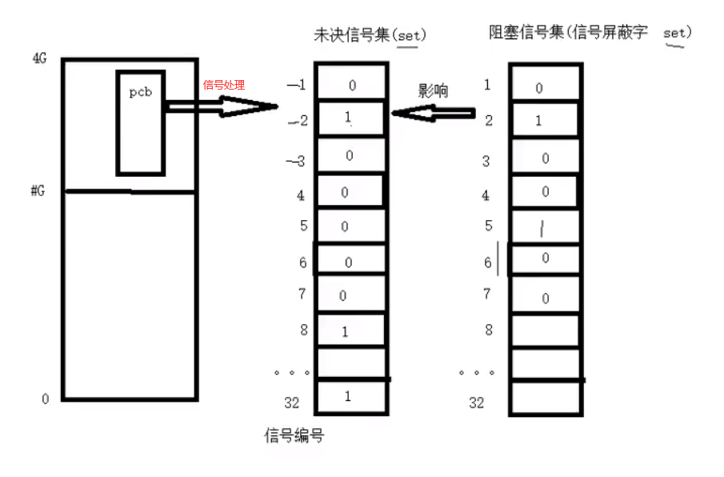
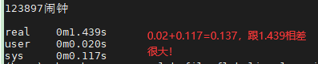
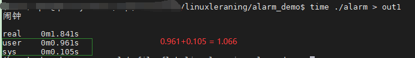
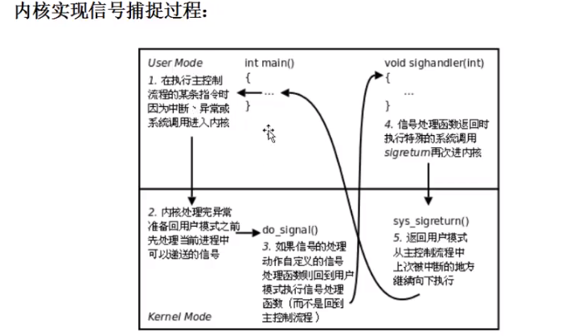
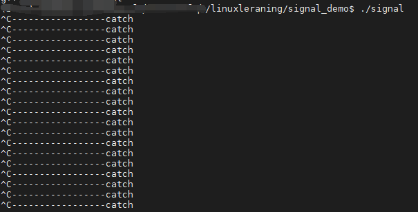
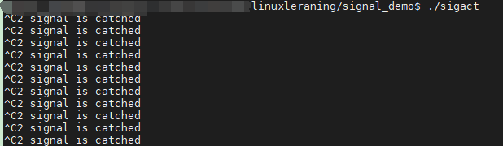

# 系统编程3

## 二、信号

### 1.信号的概念

#### 1.1信号的机制

​	信号的特质：由于信号是由软件方法实现，其实现手段导致信号有很强的延时性。但对于用户来说，这个延时非常短，几乎感觉不到

每个进程收到的**所有信号，都是由内核负责发送的**，内核处理。

kill -l 查看所有信号


#### 1.2.与信号相关的事件和状态

set集合中0表示假，1表示真



**产生信号：**

1. 按键产生，如：ctrl+c、ctrl+z、ctrl+\
2. 系统调用产生，如：kill、raise、abort
3. 软件条件产生，如：定时器alarm
4. 硬件异常产生，如：非法访问内存（段错误）、除0（浮点数除外）、内存对齐出错（总线错误）
5. 命令的产生，如：kill 命令

**递达：**递送 并且 到达进程

**未决：**产生和递达之间的状态。主要由于阻塞（屏蔽）导致的


**信号的处理方式：**

1. 执行默认动作
   - Term：终止进程
   - Core：终止进程且 core文件
   - Ign：忽略
   - Stop：暂停
   - Cont：继续
2. 忽略（丢弃）
3. 捕捉（调用 用户处理函数）：9  和 19不允许暂停和捕捉，只能执行默认动作，甚至不能设置为阻塞


#### 1.3.信号的编号

kill -l，可查看所有信号的编号，一般掌握前31个即可


#### 1.4.信号4要素

编号、名称、事件、默认处理动作

可通过man 7 signal 查看帮助文档


### 2.信号的产生

#### 2.1.终端按键产生的信号

ctrl + c --> 2)SIGINT(终止/中断)  INT --- Interrupt

ctrl + z --> 20)SIGTSTP(暂停/停止) T -- Terminal 终端

ctrl + \ --> 3)SIGQUIT(退出)


#### 2.2.硬件异常产生的信号

除0操作 --> 8)SIGFPE(浮点数例外) F -- float 

非法访问内存 --> 11) SIGSEGV(段错误)

总线错误 --> 7)SIGBUS


#### 2.3.kill 函数/命令产生的信号

kill 命令产生信号：kill -SIGKILL pid


kill 函数：给指定进程发送指定信号（kill不一定是杀死进程)

​	int kill(pid_t pid, int sig)；成功：0；失败：-1（ID非法，信号非法，普通用户杀init进程等权级问题），设置errno

- sig：推荐直接使用宏名，因为不同操作系统关于信号的编号不一定一致
- pid > 0：发送信号给指定进程
- pid = 0：发送信号给 （与 调用 kill函数进程）属于**同一进程组**的所有进程
- pid < 0：取 |pid| 发个对应 进程组
- pid = -1：发送给 **进程有权限发送的** 系统中所有进程


​	进程组：每个进程都属于一个进程组，进程组是一个或多个进程的集合。它们互相关联，共同完成一个实体任务，每个进程组都有一个进程组长，**默认将进程组长ID作为进程组ID**。

​	权限保护：super用户可以发送信号给任意的用户，普通用户是不能向系统用户发送信号的。如kill -9 (root的pid)是不允许的！同样，普通用户也不能向其他普通用户发送信号，终止其进程。只能向自己创建的进程发送信号。普通用户基本规则是：发送者实际或有效用户ID == 接收者实际或有效用户ID


#### 2.4.raise 和 abort函数

raise函数：给当前进程发送指定信号（自己给自己发）

- raise(signo) == kill(getpid(), signo)
- int raise(int sig)；成功：0，失败：非0值

abort函数：给自己发送异常终止信号 6)SIGABRT信号，终止并产生core文件

- void abort(void);无返回值

  

#### 2.5.软件产生的信号

**alarm函数**

​	设置定时器（闹钟），在**指定seconds**后，内核会给当前进程发送 14)SIGALRM信号。进程收到该信号，默认终止动作！**每个进程都有且只有一个定时器！！！**

unsigned int alarm(unsigned int seconds);返回 0 or 剩余的秒数，无失败

常用：返回定时器 alarm(0)，返回**旧闹钟**余下秒数

如：alarm(5) --> 3sec --> alarm(4) --> 5sec -->alarm(5) -->alarm(0)

定时，与进程状态无关（自然定时法）！就绪、运行、挂起（阻塞、暂停）、终止、僵尸...无论进程处于何种状态，alarm都计时！

使用time命令查看程序执行的时间。**程序运行的瓶颈在于IO，优化程序，首先优化IO！**

实际执行时间 = 系统时间 + 用户时间 + 等待时间

```c
#include<stdio.h>
#include<unistd.h>

int main(){
        int i;
        alarm(1); // 一秒后发送信号，默认14)SIGALRM，终止进程！
        for(i = 0; ; i++){ // 死循环
                printf("%d\n", i);
        }
        return 0;
}

```

直接执行time ./aralm，结果如下：



重定向到out: time ./alarm > out

这样写避免了IO，因为写入到屏幕需要耗费大量时间!



**setitimer函数**（知道怎么用就行）

​	设置定时器（闹钟），可以替代alarm函数。精度微妙us，可以实现周期定时。

​	int setitimer(int which, const struct itimerval* new_value, struct itimerval* old_value);成功：0；失败：-1，设置errno；

参数new_value新设置的闹钟值，old_value之前闹钟还剩余的值

参数which指定定时方式

1. 自然定时：ITIMER_REAL ->14)SIGALRM 计算自然时间

2. 虚拟空间计时（用户空间）：ITIMER_VIRTUAL -> 26)SIGVTARM 只计算进程占用cpu的时间

3. 运行时计时（用户+内核）：ITIMER_PROT ->27)SIGPROF 计算占用cpu及执行系统调用的时间

   

### 3.信号集操作函数

​	内核通过**读取未决信号集 **来判断信号 是否应被处理。信号屏蔽字mask可以影响未决信号集。而我们可以在应用程序中自定义set来改变mask.已达到屏蔽指定信号的目的。


**自定义集合  5函数** 

- sigemptyset --将某个信号集置0
- sigfillset --将某个信号集置1
- sigaddset --将某个信号 加入 信号集
- sigdelset --将某个信号 清理出 信号集
- sigismember --判断某个信号 是否 在信号集中


**信号屏蔽字  sigprocmask**

- 作用：屏蔽、解除屏蔽 某些信号

- 参数

  - how
    - SIG_BLOCK：设置set中信号屏蔽
    - SIG_UNBLOCK：解除set中信号屏蔽
    - SIG_SETMASK：用set替换当前屏蔽字
  - set：传入参数
  - oldset
    - 成功：0
    - 失败：-1；设置errno

- 返回值

  

**未决信号集 sigpending**：获取未决信号集


### 4.信号捕捉



#### 4.1.特性

1. 进程正常运行时，默认PCB中有一个信号屏蔽字，假定为*，它决定了进程自动屏蔽哪些信号。当注册了某个信号捕捉函数，捕捉到该信号后，要调用该函数。而该函数有可能执行很长时间，在这期间所屏蔽的信号不由 * 来指定。而是用sa_mask来指定。调用完信号处理函数，再恢复为 *
2. XXX信号捕捉函数执行期间，XXX信号自动被屏蔽
3. 阻塞的常规信号不支持排队，**产生多次只记录一次**（32~64号实时信号支持排队）

**signal、sigaction都不能捕捉信号，由内核捕捉，它们只能进行注册捕捉信号!!!**


#### 4.2.signal简易信号注册

signal.c

```c
#include<stdio.h>
#include<signal.h>
#include<errno.h>
#include<stdlib.h>
#include<unistd.h>

typedef void (*sighandler_t) (int);

void catchsigint(int signo){
        printf("-----------------catch\n");
}

int main(){
        sighandler_t handler;
        handler = signal(SIGINT, catchsigint); //捕捉 ctrl+c产生的2）SIGINT信号
        if(handler == SIG_ERR){
                perror("signal error");
                exit(1);
        }
        while(1);
        return 0;
}

```



#### 4.3.sigaction函数--注册信号

该函数有3个参数

```c
int sigaction(int signum, const struct sigaction *act,
                     struct sigaction *oldact);
```

对于结构体sigaction，重点掌握3个

```c
struct sigaction {
               void     (*sa_handler)(int); // 捕捉函数的函数名
               void     (*sa_sigaction)(int, siginfo_t *, void *);
               sigset_t   sa_mask; // 捕捉信号期间，设置对哪些信号屏蔽
               int        sa_flags; // 标志位，默认0，本信号自动被屏蔽
               void     (*sa_restorer)(void);
           };


```

sigact.c

```c
#include<stdio.h>
#include<signal.h>
#include<errno.h>
#include<stdlib.h>
#include<unistd.h>

void docatch(int signo){
        printf("%d signal is catched\n", signo);
    	//sleep(10);
    	//printf("-------finish--------\n");
}

int main(){
        int ret;
        struct sigaction act;

        act.sa_handler = docatch;
        sigemptyset(&act.sa_mask);
        sigaddset(&act.sa_mask, SIGQUIT);
        act.sa_flags = 0; // 默认属性，信号捕捉函数执行期间，自动屏蔽本信号

        ret = sigaction(SIGINT, &act, NULL);
        if(ret < 0){
                perror("sigaction error");
                exit(1);
        }

        while(1);

        return 0;
}

```



### 

