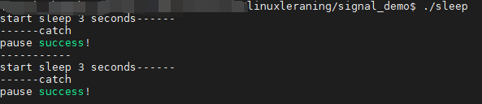
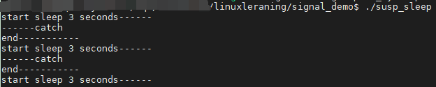

# 系统编程4

[TOC]


### 5.竞态条件

pause函数

​	调用该函数可以造成进程主动挂起，等待信号唤醒。调用该系统调用的进程将处于阻塞状态（主动放弃cpu）直到有信号递达将其唤醒。

int pause(void);返回值：-1 并设置errno为EINTR

返回值：

1. 如果信号的默认处理动作是终止进程，则进程终止，pause函数没有机会返回
2. 如果信号的默认处理动作是忽略，进程继续处于挂起状态，pause函数不返回
3. 如果信号的处理动作是捕捉，则【调用完信号处理函数之后，**pause返回 -1**】，**errno设置为EINTR**，表示“被信号中断”
4. pause收到的信号不能被屏蔽，如果被屏蔽，那么pause就不能被唤醒。

#### 5.1.时序竞态

​	竞态条件，跟**系统负载**有很紧密的关系，体现出信号的不可靠性。系统负载越严重，信号不可靠性越强。

​	不可靠由它的实现原理所导致。信号是由软件方式（跟内核调度高度依赖，延时性强），每次系统调用结束后，或中断处理结束后，需要通过扫描PCB中的未决信号集，来判断是否应处理某个信号，当系统负载过重时，会出现时序混乱。

​	这种意外情况**只能在编写程序过程中，提早预见，主动规避**，而无法通过GDB调试或者其他手段弥补。且由于该错误不具规律，后期捕捉和重现十分困难。


alarm+pause实现sleep功能，mysleep.c

```c
#include<stdio.h>
#include<unistd.h>
#include<errno.h>
#include<signal.h>
#include<stdlib.h>


void catch_sigalarm(int sign){ //捕捉信号函数
        printf("------catch\n");
}

unsigned int mySleep(unsigned int secs){
        int ret;
        struct sigaction act, oldact;
        
    	act.sa_handler = catch_sigalarm;
        sigemptyset(&act.sa_mask);
        act.sa_flags = 0;

        ret = sigaction(SIGALRM,&act, &oldact); // 注册捕捉信号
        if(ret == -1){ // 检查返回值是否合法
            perror("sigaction error!");
            exit(1);
        }

        // 1
    	alarm(secs); //开启闹钟，开始计时
    	// 2    
    	ret = pause(); // 主动挂起 等待信号唤醒
        // 3
    	if(ret == -1 && errno == EINTR){ // pause()唤醒状态：捕捉到闹钟信号ret为-1
            printf("pause success!\n");  // 唤醒后进程恢复
        }

        ret = alarm(0); // 清除闹钟
        sigaction(SIGALRM, &oldact, NULL); // 恢复SIGALRM旧有的处理方式

        return ret;
}

int main(){
        while(1){
            printf("start sleep 3 seconds------\n");
            mySleep(3);
            printf("-----------\n");
        }
        return 0;
}

```



​	假如2处进程失去了cpu占用，那么闹钟过后，进程没有处理闹钟发送的信号。那么再次获得cpu时，闹钟信号已经被处理掉了，而没有被进程处理，从而pause没有等待到信号，没有进行。

**如何解决时序问题？**

​	可以通过设置屏蔽SIGALRM的方法来控制程序执行逻辑，但无论如何设置，程序都有可能在“解除信号屏蔽”与“挂起等待信号”这两个操作间隙失去cpu资源。除非将这两步骤合并成一个“原子操作”。sigsuspend函数具备这个功能。在对时序要求严格的场合下都应该使用sigsuspend替换pause

int sigsuspend(const sigset_t* mask)；挂起等待信号

**sigsuspend函数调用期间，进程信号屏蔽字 由 其参数mask 指定。**

​	可将某个信号（如SIGALRM）从临时信号屏蔽字mask中删除，这样在调用sigsuspend时将解除对该信号的屏蔽，然后挂起等待，当sigsuspend返回时，进程的信号屏蔽字恢复为原来的值。如果原来对该信号是屏蔽态，sigsuspend函数返回后仍然屏蔽该信号。

使用sigsuspend来优化mysleep.c

```c
#include<stdio.h>
#include<unistd.h>
#include<errno.h>
#include<signal.h>
#include<stdlib.h>


void catch_sigalarm(int sign){
        printf("------catch\n");
}

unsigned int mySleep(unsigned int secs){
        int ret;
        struct sigaction newact, oldact;
    	// oldmask--保存原有mask，SIGALRM没有被屏蔽，可以用来解除SIGALRM屏蔽状态
        sigset_t newmask, oldmask, suspmask; // 添加mask
        unsigned int unslept;

        // 1.为 SIGALRM设置捕捉函数
        newact.sa_handler = catch_sigalarm;
        sigemptyset(&newact.sa_mask);
        newact.sa_flags = 0;

        ret = sigaction(SIGALRM,&newact, &oldact); // 注册捕捉信号
        if(ret == -1){
            perror("sigaction error!");
            exit(1);
        }

        // 2.设置阻塞信号集，阻塞SIGALRM信号
        sigemptyset(&newmask);
        sigaddset(&newmask, SIGALRM);
        sigprocmask(SIG_BLOCK, &newmask, &oldmask); // 信号屏蔽字mask

        // 3.定时 secs 秒，结束时产生 SIGALRM信号
        alarm(secs);

        /*4. 构造一个调用 sigsuspend 临时有效的阻塞信号集
         * 在临时阻塞信号集里 解除 SIGALRM的阻塞 */
        suspmask = oldmask;
        sigdelset(&suspmask, SIGALRM); // 保证SIGALRM没有被屏蔽（运行时信号被删掉了，就不可能会阻塞）

        /*5. sigsuspend调用期间，采用临时阻塞信号集 suspmask 替换原有的 阻塞信号集
         * 这个信号集中不包含 SIGALRM 信号，同时挂起等待
         * 当 sigsuspend被信号唤醒返回时，恢复原有的阻塞信号集*/
        sigsuspend(&suspmask);  // 原子操作，要么调用，要么不调用

        unslept = alarm(0);

        // 6.恢复SIGALRM 原有的处理动作，呼应前面注释1
        sigaction(SIGALRM, &oldact, NULL);

        // 7.解除对 SIGALRM 的阻塞，呼应前面注释2
        sigprocmask(SIG_SETMASK, &oldmask, NULL);

        return (unslept);
}

int main(){
        while(1){
            printf("start sleep 3 seconds------\n");
            mySleep(3);
            printf("end-----------\n");
        }

        return 0;
}

```




#### 5.2.可、不可重入函数

注意事项：

1. 定义**可重入函数**，函数内**不能含有**全局变量及static变量，不能使用malloc、free
2. **信号捕捉函数** 应设计为 可重入函数
3. 信号处理程序可以调用的可重入函数可参阅 man 7 signal
4. 没有包含在上述3点中的大部分是 **不可重入**的，其原因为：
   - 使用静态数据结构
   - 调用了 malloc、free
   - 是标准I/O函数


### 6.SIGCHLD信号

产生条件：

- 子进程终止时
- 子进程接收到SIGSTOP信号停止时
- 子进程处在停止状态，接收到 SIGCONT 后唤醒时

借助 SIGCHLD信号回收子进程

​	子进程结束运行，其父进程会收到SIGCHLD信号。该信号的默认处理动作是忽略。可以捕捉该信号，在捕捉函数中完成子进程的回收。


