# 系统编程5

## 三、终端

### 1.终端

#### 1.1.终端启动

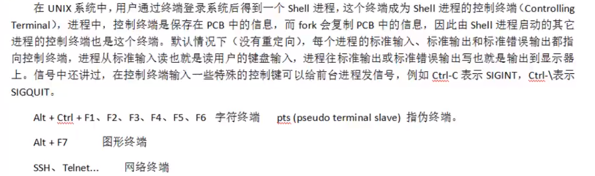

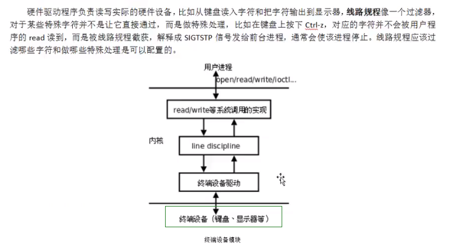

#### 1.2.ttyname

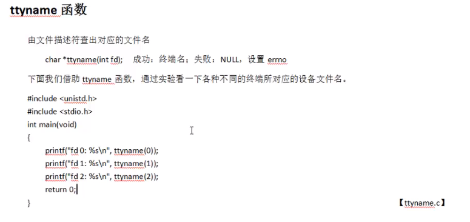

#### 1.3.网络终端

通过网络进行数据传输，比如ssh远程登录，按键每一个命令都是通过网络传到远程服务器，然后将结果通过网络返回到本地

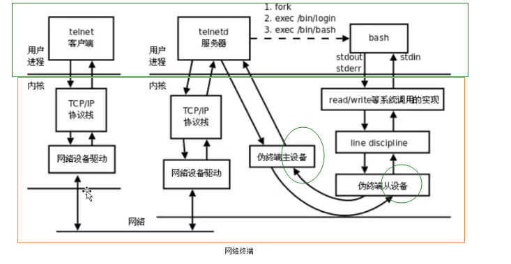

### 2.进程组

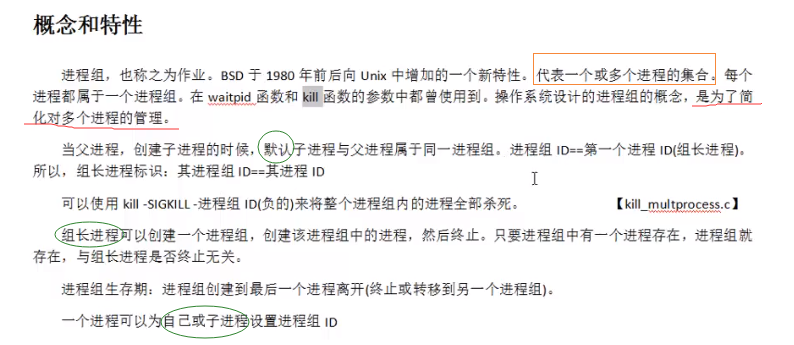

进程组操作函数

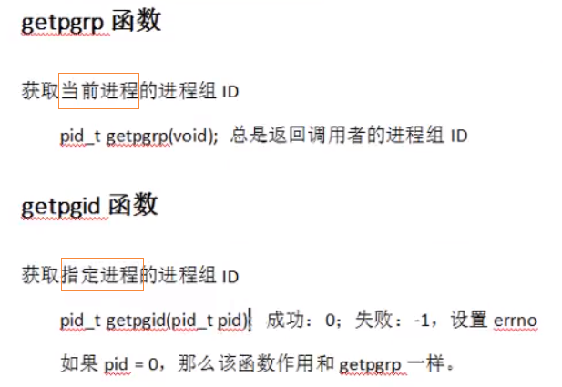

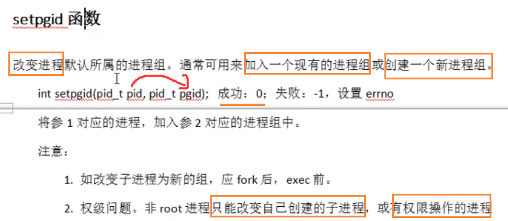

### 3.会话

#### 3.1.创建会话

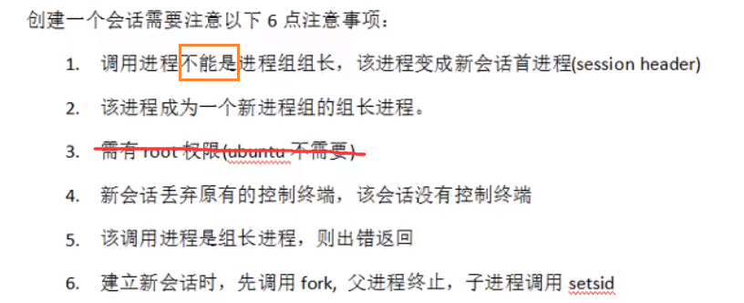

#### 3.2.getsid函数

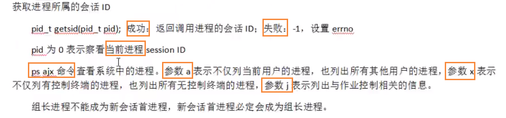

#### 3.3.setsid函数

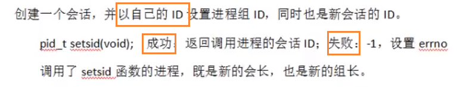

### 4.守护进程

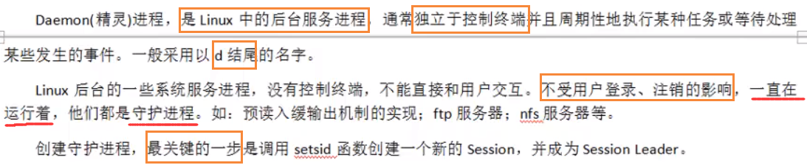

#### 创建守护进程模型

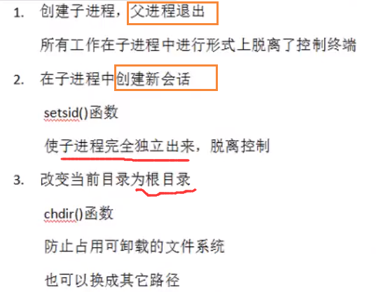

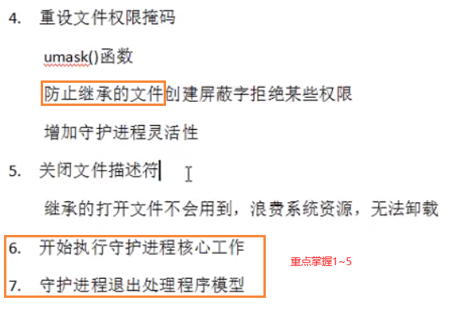

简化步骤如下：

1. 创建子进程 fork
2. 子进程创建新会话 setsid()
3. 改变进程的工作目录 chdir()
4. 指定文件掩码 umask()
5. 将 0/1/2 重定向 /dev/null    dup2()
6. 守护进程主逻辑
7. 退出