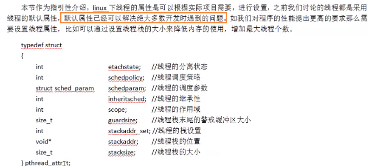

# 系统编程6


## 四、线程

### 1.线程概念

#### 1.1.什么是线程？

LWP：light weight process 轻量级的进程，本质仍是 进程（linux环境下）

进程：独立地址空间，拥有PCB

线程：也有PCB，但没有独立的地址空间（跟进程共享）

区别：在于是否共享地址空间； 独居（进程），合租（线程）

linux下：

- 线程：最小的执行单位
- 进程：最小分配资源单位，可看成是只有一个 线程的进程


#### 1.2.linux内核实现原理


​	类unix系统中，早期是没有“线程”概念的，80年代才引入，借助进程机制实现出了线程的概念，因此在这类系统中，进程和线程关系密切。

1. 轻量级进程，也有PCB，创建线程使用的底层函数和进程一样，都是clone
2. 从内核里看进程和线程是一样的，都有各自不同的PCB，但是PCB中**指向内存资源的三级页表是相同的**
3. 进程可以蜕变成线程
4. 线程可看做 寄存器和栈 的集合
5. 在linux下，线程是最小的执行单元；进程是最小的分配资源单位

查看LWP号：ps -Lf pid 查看指定线程的lwp号


#### 1.3.线程共享资源

1. 文件描述符表

2. 每种信号的处理方式

3. 当前工作目录

4. 用户ID和组ID

5. 内存地址空间（./text/.data/.bss/heap/共享库）

   

#### 1.4.线程非共享资源

1. 线程ID
2. 独享栈
3. errno变量
4. 信号屏蔽字
5. 调度优先级


#### 1.5.优缺点

优点：

- 提高程序并发性
- 开销小
- 数据通信、共享数据库方便

缺点：

- 库函数不稳定
- 调试、编写困难、gdb不支持
- 对信号支持不好

优点相对突出，缺点一般。linux下由于实现方法导致进程、线程差别不是很大。


### 2.线程控制原语（重点）

#### 2.1.pthread_self函数


#### 2.2.pthread_create函数


函数指针：void* (*start_routine) (void *) ==> 指针start_routine指向这样一个函数 void *  funcname(void*)

##### 2.2.1.创建单个线程

```c
#include<stdio.h>
#include<pthread.h>
#include<string.h>
#include<unistd.h>
#include<stdlib.h>

// 线程主控函数
void* third_func(void* arg){
    printf("In thread: thread id = %lu, pid = %u\n", pthread_self(), getpid());
    return NULL;
}

int main(){
        pthread_t tid;
        int ret;

        printf("In main1: thread id = %lu, pid = %u\n", pthread_self(), getpid());
        ret = pthread_create(&tid, NULL, third_func, NULL);
        if(ret != 0){
            fprintf(stderr, "pthread_create error:%s\n", strerror(ret));
            exit(1);
        }

        printf("In main2: thread id = %lu, pid = %u\n", pthread_self(), getpid());

        sleep(1); //主控线程等1秒

        return 0;
}

```


##### 2.2.2.创建多个线程

```c
#include<stdio.h>
#include<pthread.h>
#include<string.h>
#include<unistd.h>
#include<stdlib.h>

// 线程主控函数
void* third_func(void* arg){
    long i = (long)arg; // 转成int会显示损失精度，编译不通过，所以转成更大的类型来接收
    sleep(i);
    printf("I'm %uth thread: thread id = %lu, pid = %u\n", i + 1, pthread_self(), getpid());
    return NULL;
}

int main(){
        pthread_t tid;
        int i;
        int ret;

        for(i = 0; i < 5; i++){
            ret = pthread_create(&tid, NULL, third_func, (void* )i);
            if(ret != 0){
                fprintf(stderr, "pthread_create error:%s\n", strerror(ret));
                exit(1);
            }
        }

        sleep(i); //主控线程等 i 秒

        return 0; // 退出进程
}

```


​	**线程共享全局变量，需要牢记线程默认共享数据段、代码段等地址空间，常用的是全局变量。而进程不共享全局变量，只能借助mmap！**

#### 2.3.pthread_exit函数


#### 2.4.pthread_join函数

回收线程


#### 2.5.pthread_detach函数


#### 2.6.pthread_cancel函数

对应进程kill，需要有取消点


#### 2.7.pthread_equal函数(了解)


#### 2.8.对比进程


### 3.线程属性




### 4.NPTL

用于跨平台

pthread库版本

查看：getconf GNU_LIBPTHREAD_VERSION

gcc编译指定 -lpthread选项

### 5.多线程注意事项


