# 系统编程7

[TOC]

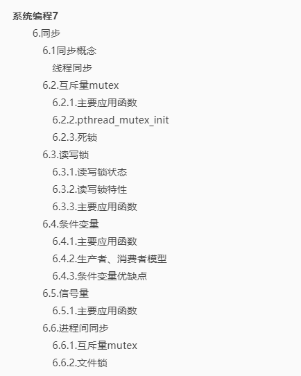

### 6.同步

掌握以下内容：

同步概念：同步、线程同步

互斥量（互斥锁）：

- pthread_mutex_init
- pthread_mutex_destroy
- pthread_mutex_lock
- pthread_mutex_unlock

读写锁：pthread_rwlock，....

条件变量：

- pthread_cond_xxx
- pthread_cond_wait()函数
- 绝对时间：unix计时元年----1970/1/1
  - time_t cur = time(NULL); 
  - struct timespec t
  - t.tv_sec = cur + 10
  - pthread_cond_timedwait(&cond, &mutex, &t)

信号量：互斥量升级版，sem_

进程间同步：

- 信号量
- 文件锁

哲学家问题

#### 6.1同步概念

​	所谓同步，即同时起步，协调一致。不同的对象，对“同步”理解方式不一致。如

- 设备同步，指的是两个设备之间规定一个共同的时间参考
- 数据库同步，指的是让两个或者多个数据库内容保持一致，或者按需要部分保持一致
- 文件同步，指的是让两个或者多个文件夹中的文件保持一致
- 而编程、通信中的同步，与其他的同步略有差异。“同”指的是协同、协助、互相配合，主要表现为协同步调，**按预定的先后次序运行**

##### 线程同步

​	同步即协同步调，按预定的先后次序运行。线程同步指的是一**个线程对某一个功能的调用时**，在没有得到结果之前，该调用不返回。**同时其他线程**为保证数据一致性，**不能调用该功能**。

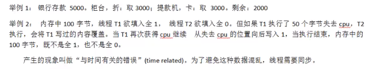

“同步”的目的，是为了**避免数据混乱，解决与时间有关的错误**。实际上，不仅线程需要同步，进程间、信号间等都需要同步机制。因此，所有“**多个控制流，共同操作一个共享资源**”的情况，都需要同步。


#### 6.2.互斥量mutex

linux中提供一把互斥锁mutex(也称为互斥量)。

每个线程在对资源操作前都尝试先加锁，成功加锁才能操作，操作结束解锁。

资源还是共享的，线程间也还是竞争的关系。

但经过“锁”**就将资源的访问变成互斥操作**，而后与时间有关的错误也不会再产生了。

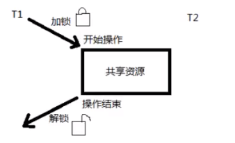

​	当A线程对某个全局变量加锁访问，B在访问前尝试加锁，拿不到锁，B阻塞。C线程**不去加锁**，而直接访问该全局变量，**依然能够访问，但会出现数据混乱**

​	所以，互斥锁实质上是操作系统提供的一把“**建议锁**”（也称“协同锁”），建议程序中有多线程访问共享资源的时候使用该机制，**但是没有强制限定**。因此即使有了mutex，如果有线程不按规则来访问数据，依然会造成数据混乱

##### 6.2.1.主要应用函数

- pthread_mutex_init ，初始化一个锁mutex为1
- pthread_mutex_destroy ，销毁一个锁
- pthread_mutex_lock ，加锁，mutex--
- pthread_mutex_trylock，尝试加锁
- pthread_mutex_unlock，解锁，mutex++

以上5个函数返回值都是：成功返回 0；失败返回 错误号

pthread_mutex_t 类型，本质是一个结构体，为方便理解，可简单看成一个 int 看待

pthread_mutex_t mutex；变量 mutex 只有两种取值 1、0

##### 6.2.2.pthread_mutex_init

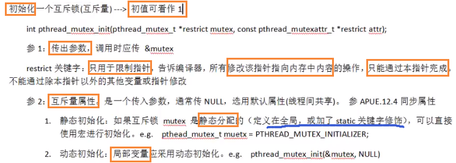

##### 6.2.3.死锁

1. 线程试图对同一个互斥量A加锁两次
2. 线程1拥有A锁，请求B锁；线程2拥有B锁，请求A锁


#### 6.3.读写锁

与互斥量类似，但读写锁允许更高的并行性。其特性为：写独占，读共享

##### 6.3.1.读写锁状态

具备三种状态：

1. 读模式下加锁状态（读锁）
2. 写模式下加锁状态（写锁）
3. 不加锁状态

##### 6.3.2.读写锁特性

1. 读写锁是“写模式加锁”时，解锁前，所有对该锁加锁的线程会被阻塞
2. 读写锁是“读模式加锁”时，如果线程以读模式对其加锁会成功；如果线程以写模式加锁会阻塞
3. 读写锁是“读模式加锁”时，既有试图以写模式加锁的线程，也有试图以读模式加锁的线程。那么读写锁会阻塞随后的读模式请求。优先满足写模式锁。**读锁、写锁并行阻塞，写锁优先级高**。

读写锁也叫共享-独占锁。当读写锁以读模式锁住时，它是以共享模式锁住的；当它以写模式锁住时，它是以独占模式锁住的。**写独占、读共享**

​	读写锁非常适用于对数据结构 **读的次数 远大于 写**的情况。

##### 6.3.3.主要应用函数

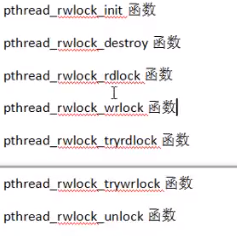

rw--读写


#### 6.4.条件变量

条件变量本身不是锁！但它可以造成线程阻塞。通常与互斥锁mutex配合使用。给多线程提供一个回合的场所。

##### 6.4.1.主要应用函数

1. pthread_conf_init
2. pthread_conf_destroy
3. pthread_conf_wait
4. pthread_conf_timewait
5. pthread_conf_signal
6. pthread_conf_broadcast

cond -- condition -- 条件

以上 6 个函数的返回值都是：成功返回 0；失败返回 错误号

pthread_cond_t 类型，用于定义条件变量

pthread_cond_t cond


**pthread_cont_wait**

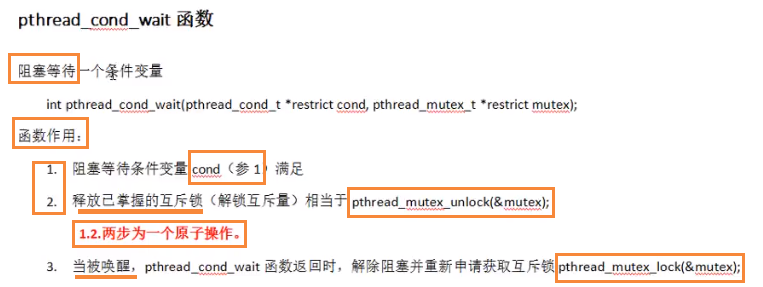


##### 6.4.2.生产者、消费者模型

假设生产者生产大饼，消费者吃大饼

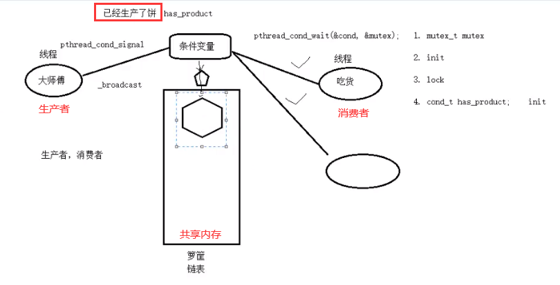

代码cond_var.c如下：

```c
#include<stdio.h>
#include<pthread.h>
#include<unistd.h>
#include<stdlib.h>

struct msg{ // 用链表来模拟箩筐内的大饼
  int num;
  struct msg* next;
};

struct msg* head = NULL; // 头结点
struct msg* mp = NULL; // 临时结点

pthread_mutex_t mutex = PTHREAD_MUTEX_INITIALIZER;//初始化互斥量
pthread_cond_t has_product = PTHREAD_COND_INITIALIZER;// 初始化条件变量

void* producer(void* arg){ //生产者
  while(1){
      // 生产一个数据
      mp = (msg* )malloc(sizeof(struct msg));
      mp->num = rand() % 400 + 1;
      printf("---producted---%d\n", mp->num);

      // 要生产大饼了，加锁
      pthread_mutex_lock(&mutex);
      // 生产一个大饼，头插法，插入到当前链表前面，保证链表最后一个是前面插入的
      mp->next = head;
      head = mp;
      // 生产完，解锁
      pthread_mutex_unlock(&mutex);

      // 生产完，发送信号
      pthread_cond_signal(&has_product);
      sleep(rand() % 3); // 生产者停一会，让消费者有时间消费
  }
  return NULL;
}

void* consumer(void* arg){ //消费者
  while(1){
      // 要准备吃饼，加锁
      pthread_mutex_lock(&mutex);
      while(head == NULL){ // 确保框内有饼，才能吃饼
        pthread_cond_wait(&has_product, &mutex);
      }
      // 删除一个节点，吃掉一个大饼,链表最后一个
      mp = head;
      head = mp->next;
	 // 吃完，解锁
      pthread_mutex_unlock(&mutex);

      printf("-----------------consumer--------------%d\n", mp->num);
      sleep(rand() % 3);
  }
  return NULL;
}

int main(){
  pthread_t ptid, ctid;
  // 创建线程
  pthread_create(&ptid, NULL, producer, NULL);
  pthread_create(&ctid, NULL, consumer, NULL);
  // 回收线程
  pthread_join(ptid, NULL);
  pthread_join(ctid, NULL);
  return 0;
}
```

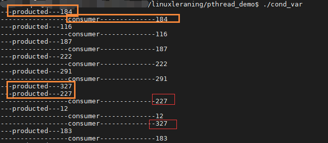

##### 6.4.3.条件变量优缺点

相较于mutex而言，条件变量可以减少竞争

如果直接使用mutex，除了生产者、消费者之间要竞争互斥量以外，消费者之间也需要竞争互斥量，但**如果共享内存中没有数据，消费者之间 互相竞争互斥锁** 是没有意义的。有了条件变量之后，只有生产者完成生产，才会引起消费者之间的竞争，提高了程序效率。


#### 6.5.信号量

**进化版的互斥锁（1个线程->N）**

​	由于互斥锁的粒度比较大，如果我们希望在多个线程间对某一对象的部分数据进行共享，使用互斥锁是没有办法实现的。

​	只能将整个数据对象锁住，这样虽然达到了多线程操作共享数据时保证数据正确性的目的，却无形中导致线程的并发性下降。

​	线程从并行执行，变成了串行执行。与直接使用单进程无异。

​	信号量，是相对折中的一种处理方式，既能保证同步，数据不混乱，又能提高线程并发。

##### 6.5.1.主要应用函数

1. sem_init
2. sem_destroy
3. sem_wait，相当于加锁，**信号量--**，造成线程阻塞
4. sem_trywait
5. sem_timewait
6. sem_post，相当于解锁，**信号量++**，唤醒线程

以上 6 个函数返回值都是：成功返回 0；失败返回 -1，同时设置errno。（注意它们没有pthread前缀，说明**可以用于线程、进程**）

sem_t类型，本质是结构体，为了简化理解。应用期间 看做 整数

sem_t sem；规定信号量sem 不能 <0。头文件<semaphore.h>

结论：**信号量的初值，决定了占用信号量的线程的个数**


**以下反映了生产者，消费者模型加入信号量：**

- sem_blank表示空槽的容量
- sem_star表示装有star的容量

带着**“此消彼长”**的想法来理解

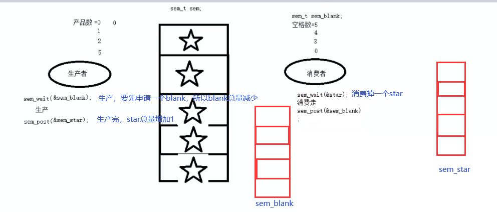

sem_cond_var.c代码，其中注释“加锁”只是类比这种操作的说法，并不代表真的加锁。如下：

```c
#include<stdio.h>
#include<unistd.h>
#include<pthread.h>
#include<stdlib.h>
#include<semaphore.h>

#define NUM 5

int queue[NUM]; // 共享内存，全局数组实现 环形队列
sem_t blank_num, product_num; // 空格子信号量， 产品信号量

void* producer(void* arg){
  int i = 0;
  while(1){
      sem_wait(&blank_num); // 加锁，生产，得消耗一个空格，为 0 则阻塞等待
      queue[i] = rand() % 1000 + 1; // 生产一个产品
      printf("----produce----%d\n", queue[i]);
      sem_post(&product_num); // 生产完，产品数增加

      i = (i + 1) % NUM; // 借助下标实现 环形
      sleep(rand() % 3);
  }
}
void* consumer(void* arg){
  int i = 0;
  while(1){
      sem_wait(&product_num); // 加锁，要消费一个产品，为 0 则阻塞
      printf("=========consume============%d\n", queue[i]);
      queue[i] = 0;
      sem_post(&blank_num); // 解锁，将空位挪出来了，空格数增加
      i = (i + 1) % NUM;
      sleep(rand() % 3);
  }
}

int main(){
  pthread_t ptid, ctid;
  // 初始化信号量
  sem_init(&blank_num, 0, NUM); // 一开始 5 个空槽供使用
  sem_init(&product_num, 0, 0); // 一开始没有生产产品
  // 初始化线程
  pthread_create(&ptid, NULL, producer, NULL);
  pthread_create(&ctid, NULL, consumer, NULL);

  // 回收线程
  pthread_join(ptid, NULL);
  pthread_join(ctid, NULL);
  // 回收信号量
  sem_destroy(&blank_num);
  sem_destroy(&product_num);

  return 0;
}

```

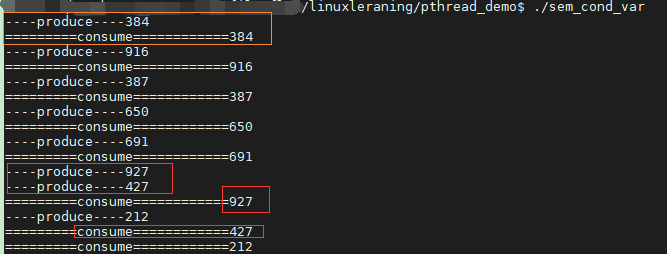


#### 6.6.**进程间**同步

##### 6.6.1.互斥量mutex

进程间也可以使用互斥锁，来达到同步的目的。但应在pthread_mutex_init初始化之前，**修改其属性为进程间共享**。mutex的属性修改函数主要有一下几个：

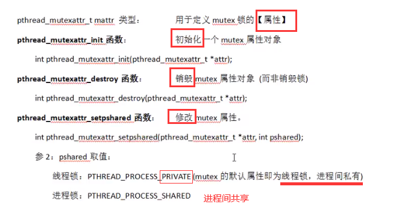

##### 6.6.2.文件锁

借助fcntl函数来实现锁机制。操作文件的进程没有获得锁时，可以打开，但无法执行read、write操作。

fcntl函数：获取、设置文件访问控制属性

int fcntl(int fd, int cmd, .../* arg */); 由参数2cmd是什么，决定参数3

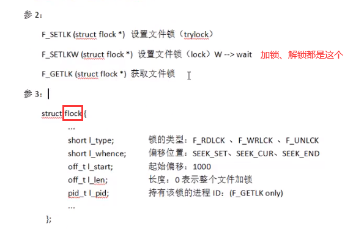

可以锁一部分，由结构体flock中的l_start、l_len控制

一个加锁、解锁例子：

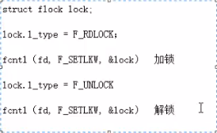

