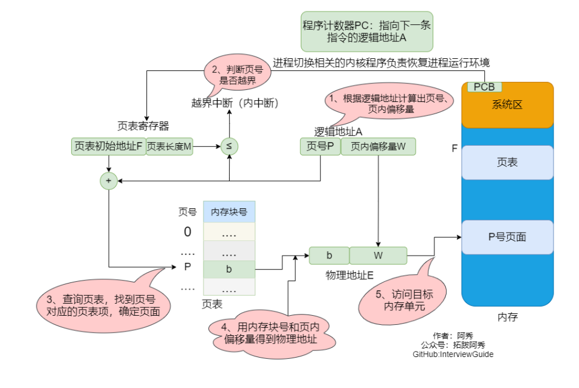
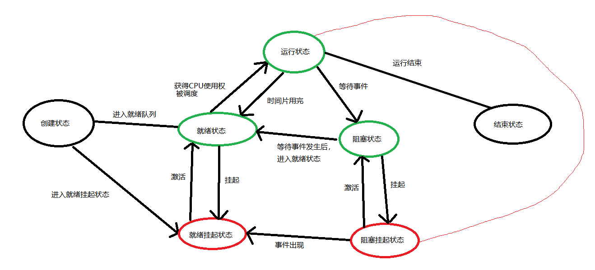
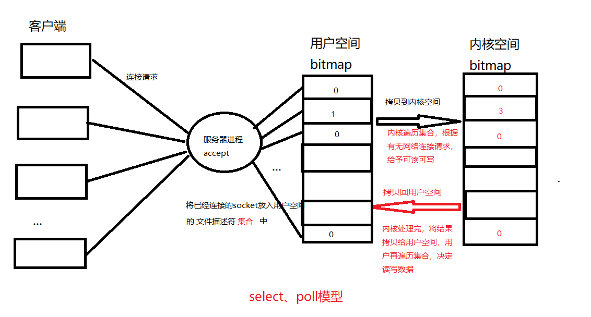
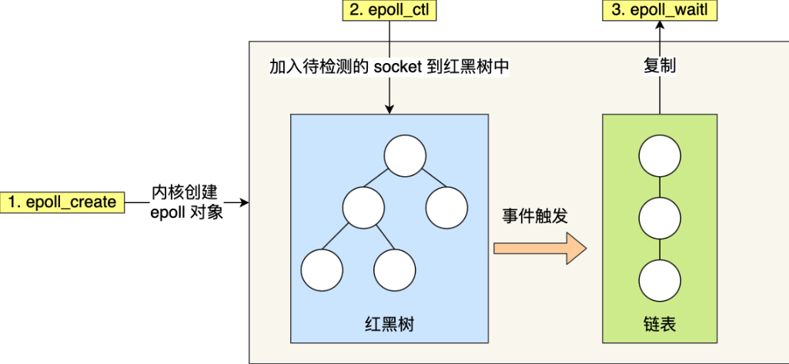
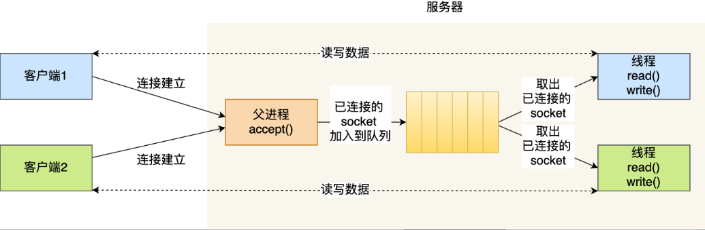
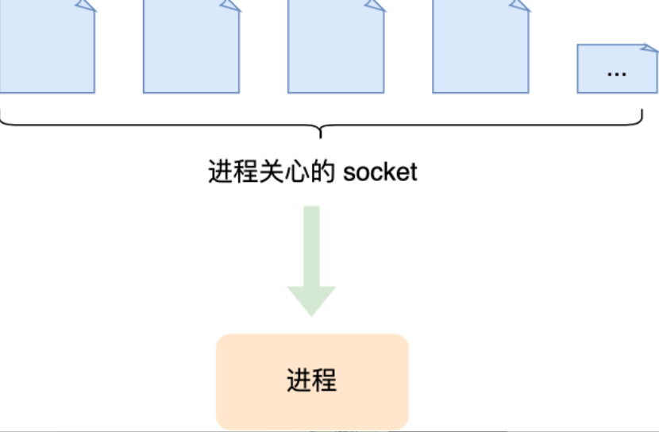

# 操作系统高频面试题

### 1、进程、线程

进程：

- 进程是系统分配资源的最小单位，线程是调度的最小单元。
- 一个可执行程序运行会产生一个或多个进程，进程是运行的可执行程序。一个进程可以有多个线程，但是只有一个主线程，多线程共享进程的内存空间。
- 多个线程在某个时刻只能有一个线程占有资源，线程之间通过竞争，获取资源。
- 线程之间共享进程部分资源，在上下文切换时，共享资源部分线程是不用切换的，只需要切换线程的私有数据、寄存器等，所以线程的切换所需要的开销更小，而进程之间的上下文切换会花费较大的开销。

### 2、调度算法

- **先来先服务**：`非抢占式`使用资源。即对于进程，放到有个队列中，按照队列顺序进行调度
  - 特点：对于长作业有优势，但如果一个长作业先占用资源，而后面到来很多短作业，会造成短作业等待时间过长。
- **短作业优先**：`非抢占式`，即短作业具有的更高的优先级。但是假如有过多的短作业，那么长作业会因此一直处于等待状态，得不到调度
- **最短剩余时间优先**：`抢占式`，每次来一个请求作业时，跟当前正在运行的作业的剩余时间相比，两者选择剩余时间较少的进行调度。
- **时间片轮转法**：将进程按照先来先服务，放到一个就绪队列中。给每一个进程分配一个相同的时间片，从队首取一个进程使用进程，每个进程运行完时间片规定的时间就释放占用的资源，同时放置到队尾，等待下一次调度，唤醒队首调用资源。
  - 效率跟时间片大小很有关系：时间片太小的话，会造成频繁的进程切换，即上下文切换，每次切换进程要保留相关信息，会耗费不少时间。时间片太大的话，又不利于实时性。
- **优先级调度**：给每一个进程设置一个优先级，按照优先级来进行调度。随着进程等待时间加长，优先级也相应增加， 可以防止优先级低的进程永远得不到调度。
- **多级反馈队列**：时间片+优先级调度的结合。
  - 假如有一个进程A需要100个时间片才能执行完，那么需要切换进程100次。假如又希望这个进程能够尽早地完成执行，在是时间片轮转法调度中，是放在一个队列中的，如果队列中还有很多其他进程，那么进程A执行完需要很长时间。
  - 那么怎样让它尽早完成执行？就需要设置优先级了。多级反馈队列就是由多个队列组成，优先级**由高到低**，每个队列的时间片也不相同。
  - 当第一个队列中的进程时间片用完还没执行完的，就会放在第二个队列的末尾（也可以按照优先级放置在其他位置），当第一个队列全部执行完，才可以执行第二个队列，第二、第三队列以此类推。

### 3、linux进程间通信的方式？

- 管道：半双工通信，数据是单向流动的。也就是只能一端发出，一端接收。如果需要互相通信，需要建立两个管道。
  - 匿名管道：内存文件，只存在于内存缓存中。用于有血缘关系的进程之间的通信。比如父子进程之间，linux系统中shell是大部分命令的父进程
  - 有名管道：FIFO文件，借助文件系统，用于非血缘关系之间的进程通信。
- 共享内存：映射一段内存，能够供一些进程共同访问的。由一个进程创建，但可以供多个进程访问。
  - 共享内存是进程间通信（IPC）速度最快的。因为所有进程共享这块内存。想象一下，假如你跟几个小伙伴（多个进程）围在一个黑板（共享内存）前面，那么当一个小伙伴在黑板上写什么，其他人是不是立马就知道了？
  - 往往配合信号量来实现进程间同步与通信
- 套接字：可以在不同主机上（比如中国主机，美国主机）的两个进程通信，当然本地的两个进程通信也是可以的。
- 信号：进程收到某个信号会进行相应的处理，比如中断，or挂起，or挂起。比如输入`ctrl + c`，产生`kill -9`信号，终止当前进程 
- 信号量：是一个计数器。可以控制多个进程对共享资源的访问。可以作为一种锁机制，实现进程、线程对临界区的同步以及互斥访问。 

### 4、系统中快表为什么加快了查询速度？

CPU先给出逻辑地址，然后计算出页号、页内偏移量。

先去快表查询，查不到再去内存的页表中查询。

查询过程：

- 在快表中查询是否存在该页号，如果存在，说明内存中存在对应的数据。通过页号取出该页对应的内存块+页内偏移量**拼接成**对应的物理地址，然后在内存中找到物理地址对应的内存单元即可。如果快表命中，只需要从内存中访问一次即可。
- 如果快表中不存在该页号，也就是没有命中。那么需要`访问`内存中的页表，找到对应的页表项，得到对应的内存块号，再通过取页号对应的内存块+页内偏移**拼接成**物理地址，最后，`访问`物理地址对应的内存单元。如果快表没有命中，则需要两次访问内存。

图示：



### 5、虚拟技术

将物理实体转化为逻辑实体

- **时分复用技术**：多进\线程并发运行。让每个进程占用cpu一个时间片，执行完然后迅速进行切换
- **空分复用技术**：虚拟内存。它将物理内存抽象为地址空间，每个进程都有独立的地址空间。地址空间的页映射到物理内存。内存中并不需要将所有的页放入，当实际需要使用到某个页时，从物理内存中加载进来即可。

### 6、进程的5大状态

- 创建：创建一个进程
- 就绪：进程等待被调度
- 运行：进程在就绪状态下获得cpu使用权，即可运行（调度）
- 阻塞：资源不足（不包括cpu资源，cpu用完得进入就绪状态，等待下一个时间片），暂时等待
- 结束：进程退出



### 7、进程同步4种方式 

**1.** **临界区**

对临界资源进行访问的那段代码称为临界区。

为了互斥访问临界资源，每个进程在进入临界区之前，需要先进行检查。

**2.** **同步与互斥**

同步：多个进程因为合作产生的直接制约关系，使得进程有一定的先后执行关系。

互斥：多个进程在同一时刻只有一个进程能进入临界区。

**3.** **信号量**

信号量（Semaphore）是一个整型变量，可以对其执行 down 和 up 操作，也就是常见的 P 和 V 操作。

**down** : 如果信号量大于 0 ，执行 -1 操作；如果信号量等于 0，进程睡眠，等待信号量大于 0；

**up** ：对信号量执行 +1 操作，唤醒睡眠的进程让其完成 down 操作。

down 和 up 操作需要被设计成原语，不可分割，通常的做法是在执行这些操作的时候屏蔽中断。

如果信号量的取值只能为 0 或者 1，那么就成为了 **互斥量（Mutex）** ，0 表示临界区已经加锁，1 表示临界区解锁。

```c
typedef int semaphore;
semaphore mutex = 1;
void P1() {
 down(&mutex);
 // 临界区
 up(&mutex);
}
void P2() {
 down(&mutex);
 // 临界区
 up(&mutex);
}
```

**使用信号量实现生产者-消费者问题** 

问题描述：使用一个缓冲区来保存物品，只有缓冲区没有满，生产者才可以放入物品；只有缓冲区不为空，消费者才可以拿走物品。

- 因为缓冲区属于临界资源，因此需要使用一个互斥量 mutex 来控制对缓冲区的互斥访问。
- 为了同步生产者和消费者的行为，需要记录缓冲区中物品的数量。数量可以使用信号量来进行统计，这里需要使用**两个信号量**：
  - empty： 记录`空缓冲区`的数量
  - full ：记录`满缓冲区`的数量。
- 其中，empty 信号量是在`生产者进程`中使用，当 empty 不为 0 时，生产者才可以放入物品；full 信号量是在`消费者进程`中使用，当 full 信号量不为 0 时，消费者才可以取走物品。
- **注意**，不能先对缓冲区进行加锁，再测试信号量。也就是说，不能先执行 down(mutex) 再执行down(empty)。如果这么做了，那么可能会出现这种情况：生产者对缓冲区加锁后，执行 down(empty) 操作，发现 empty = 0(没有空间让放生产的物品)，此时生产者睡眠。消费者不能进入临界区，因为生产者对缓冲区加锁了，消费者就无法执行 up(empty) 操作，empty 永远都为 0，导致生产者永远等待，不会释放锁，消费者因此也会永远等待下去。

```c
#define N 100
typedef int semaphore;
semaphore mutex = 1;
semaphore empty = N;
semaphore full = 0;
void producer() { // 生产者
     while(TRUE) {
     int item = produce_item();
     down(&empty);
     down(&mutex);
     insert_item(item);
     up(&mutex);
     up(&full);
     }
}
void consumer() { // 消费者
     while(TRUE) {
     down(&full);
     down(&mutex);
     int item = remove_item();
     consume_item(item);
     up(&mutex);
     up(&empty);
 	}
}
```

**4.** **管程**

使用信号量机制实现的生产者消费者问题需**要**客户端代码**做很多控制**，而管程把控制的代码**独立出来**，不仅不容易出错，也使得客户端代码调用更容易。

c 语言不支持管程，下面的示例代码使用了类 Pascal 语言来描述管程。示例代码的管程提供了 insert() 和remove() 方法，客户端代码通过调用这两个方法来解决生产者-消费者问题。

```c
monitor ProducerConsumer
 integer i;
 condition c;
 procedure insert();
 begin
 // ...
 end;
 procedure remove();
 begin
 // ...
 end;
end monitor;
```


### 8、虚拟内存

虚拟内存技术是为了让物理内存扩充成更大的逻辑内存，从而让程序获得更多的内存。

为了更好的管理内存，操作系统将内存抽象成地址空间。每个程序有自己的地址空间，这个地址空间被分割成多块，每一块称为一页。

这一页被映射到物理内存，但不需要映射到连续的物理内存，也不需要所有页都必须在物理内存中。当程序引用到不在物理内存中的页时，由硬件执行必要的映射，将缺失的部分装入物理内存并重新执行失败的指令。

虚拟内存允许程序可以不用将地址空间的每一页都映射到物理内存，也就是说一个程序不需要全部调入内存就可以运行，这使得有限的内存运行大程序成为可能。

### 9、IO多路复用

**`最基础`**的 TCP 的 Socket 编程，它是阻塞 I/O 模型，基本上**只能一对一通信**，那为了服务更多的客户端，我们需要改进网络 I/O 模型。

**`传统的方式`**是使用`多进程/线程模型`，每来一个客户端连接，就分配一个进程/线程，然后后续的读写都在对应的进程/线程，这种方式处理 100 个客户端没问题，但是当客户端增大到 10000 个时，10000 个进程/线程的调度、上下文切换以及它们占用的内存，都会成为瓶颈。


为了解决上面这个问题，就出现了 `I/O 的多路复用`，可以只在一个进程里处理多个文件的 I/O，Linux 下有三种提供 I/O 多路复用的 API，分别是： select、poll、epoll。


**`select 和 poll `**并没有本质区别，它们内部都是使用「线性结构」来存储进程关注的 Socket 集合。在使用的时候，需要以下步骤：

- 首先需要把`关注的Socket集合`通过 select/poll 系统调用从 `用户态` 拷贝到 `内核态`，
- 然后由内核检测事件，当有网络事件产生时，内核`需要遍历`进程关注 Socket 集合，找到对应的 Socket，并`设置其状态为可读/可写`，
- 然后把整个 Socket 集合从 `内核态` 拷贝到 `用户态`，用户态还要`继续遍历`整个 Socket 集合`找到`可读/可写的 Socket，然后对其处理。

很明显发现，select 和 poll 的缺陷在于，当客户端越多，也就是 Socket 集合越大，Socket 集合的遍历和拷贝会带来很大的开销(**拷贝遍历太多**)，因此也很难应对 C10K。


**`epoll`** 是解决 C10K 问题的利器，通过两个方面解决了 select/poll 的问题。

- epoll 在内核里使用「红黑树」来关注进程所有待检测的 Socket，红黑树是个高效的数据结构，增删查一般时间复杂度是 O(logn)，通过对这棵红黑树的管理，不需要像 select/poll 在每次操作时都传入整个 Socket 集合，减少了内核和用户空间大量的数据拷贝和内存分配。
- epoll 使用事件驱动的机制，内核里维护了一个「链表」来记录就绪事件，只将有事件发生的 Socket 集合传递给应用程序，不需要像 select/poll 那样轮询扫描整个集合（包含有和无事件的 Socket ），大大提高了检测的效率。

而且，epoll 支持边缘触发(只苏醒一次)和水平触发（多次苏醒）的方式，而 select/poll 只支持水平触发，一般而言，边缘触发的方式会比水平触发的效率高。

图示如下：





### 10、边缘触发、水平触发

epoll 支持两种事件触发模式，分别是**边缘触发（edge-triggered，ET）**和**水平触发（level-triggered，LT）**。

这两个术语还挺抽象的，其实它们的区别还是很好理解的。

- 使用`边缘触发模式`时，当被监控的 Socket 描述符上有可读事件发生时，**服务器端只会从 epoll_wait 中苏醒一次**，即使进程没有调用 read 函数从内核读取数据，也依然只苏醒一次，因此我们程序要保证一次性将内核缓冲区的数据读取完；
- 使用`水平触发模式`时，当被监控的 Socket 上有可读事件发生时，**服务器端不断地从 epoll_wait 中苏醒，直到内核缓冲区数据被 read 函数读完才结束**，目的是告诉我们有数据需要读取；

举个例子，你的快递被放到了一个快递箱里，

- 如果快递箱只会通过短信通知你一次，即使你一直没有去取，它也不会再发送第二条短信提醒你，这个方式就是边缘触发；
- 如果快递箱发现你的快递没有被取出，它就会不停地发短信通知你，直到你取出了快递，它才消停，这个就是水平触发的方式。

这就是两者的区别，水平触发的意思是只要满足事件的条件，比如内核中有数据需要读，就一直不断地把这个事件传递给用户；

而边缘触发的意思是只有第一次满足条件的时候才触发，之后就不会再传递同样的事件了


### 11、服务器最大能够支持多大的客户端连接？

TCP 连接是由四元组唯一确认的，这个四元组就是：**本机IP, 本机端口, 对端IP, 对端端口**。

服务器作为服务方，通常会在本地固定监听一个端口，等待客户端的连接。因此服务器的本地 IP 和端口是固定的，于是对于服务端 TCP 连接的四元组只有对端 IP 和端口是会变化的，所以**最大 TCP 连接数 = 客户端 IP 数×客户端端口数**。

对于 IPv4，客户端的 IP 数最多为 2 的 32 次方，客户端的端口数最多为 2 的 16 次方，也就是**服务端单机最大 TCP 连接数约为 2 的 48 次方**。

这个理论值相当“丰满”，但是服务器肯定承载不了那么大的连接数，主要会受两个方面的限制：

- **文件描述符**，Socket 实际上是一个文件，也就会对应一个文件描述符。在 Linux 下，单个进程打开的文件描述符数是有限制的，没有经过修改的值一般都是 1024，不过我们可以通过 ulimit 增大文件描述符的数目；
- **系统内存**，每个 TCP 连接在内核中都有对应的数据结构，意味着每个连接都是会占用一定内存的；

### 12、线程池

如果每来一个连接就创建一个线程，线程运行完后，还得操作系统还得销毁线程，虽说线程切换的上写文开销不大，但是如果频繁创建和销毁线程，系统开销也是不小的。

那么，我们可以使用**线程池**的方式来避免线程的频繁创建和销毁，所谓的线程池，

就是提前创建若干个线程，这样当由新连接建立时，将这个已连接的 Socket 放入到一个队列里，然后线程池里的线程负责从队列中取出已连接 Socket 进程处理。



需要注意的是，这个队列是全局的，每个线程都会操作，为了避免多线程竞争，线程在操作这个队列前要加锁（一般涉及到资源竞争的，都需要加锁）。

基于进程或者线程模型的，其实还是存在问题。新到来一个 TCP 连接，就需要分配一个进程或者线程，那么如果要达到 C10K，意味着要一台机器维护 1 万个连接，相当于要维护 1 万个进程/线程，操作系统就算死扛也是扛不住的。这就需要使用IO多路复用技术，让一个进程维护多个socket。




