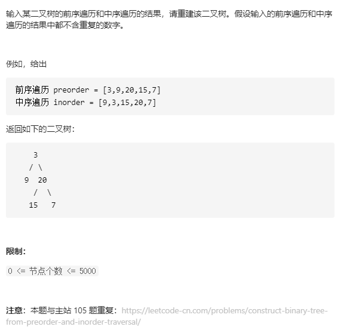

# 中等篇

## 1~10

### 1.[剑指 Offer 64. 求1+2+…+n](https://leetcode-cn.com/problems/qiu-12n-lcof/)


### 解法1：逻辑运算符的短路效应

常规的递归解法，如下：

```c++
class Solution {
public:
    int sumNums(int n) {
        return  n == 0 ? 0 : (n + sumNums(n - 1));
    }
};
```

那么如何替代这个"?"判断呢？

使用"&&"代替，比如`A && B`，A为false，就不会执行B，A为true才会执行true。

那么把A作为判断递归出口的条件，B为执行的动作！

参考：[力扣官方](https://leetcode-cn.com/problems/qiu-12n-lcof/solution/qiu-12n-by-leetcode-solution/)


```c++
class Solution {
public:
    int sumNums(int n) {
        //return  n == 0 ? 0 : (n + sumNums(n - 1));
        n && (n += sumNums(n - 1));
        return n;
    }
};
```


### 2.[剑指 Offer 56 - II. 数组中数字出现的次数 II](https://leetcode-cn.com/problems/shu-zu-zhong-shu-zi-chu-xian-de-ci-shu-ii-lcof/)


#### 解法1：哈希表

统计频率用map是很常见的。

这里遗忘的是map是pair类型怎么取元素，涉及到迭代器iter的话，可以两种取法

1. iter是指针，指向一对pair<int, int>，用“->"直接取，如iter->first、iter->second
2. 取出iter指针指向的一对（对指针解引用），然后用pair的"."，如( * iter).first，(*iter).second

```c++
class Solution {
public:
    int singleNumber(vector<int>& nums) {
        unordered_map<int, int> umap;
        for(auto n:nums) umap[n]++;
        auto iter = umap.begin();
        int res;
        while(iter != umap.end()){
            if(iter->second == 1){ 
                res = iter->first;
                break;
            }
            iter++;
        }
        return res;
    }
};
```


#### 解法2：排序

```c++
class Solution {
public:
    // 跳跃式遍历
    int singleNumber(vector<int>& nums) {
        sort(nums.begin(), nums.end());
        int i = 0, j = nums.size() - 1;
        if(nums[0] != nums[1]) return nums[0];
        if(nums[j - 1] != nums[j]) return nums[j];
        while(i <= j){
            if((i + 1) <= j && nums[i] == nums[i + 1]){
                i += 3;
                continue;
            }
            else if((i + 1) <= j && nums[i] != nums[i + 1])
                return nums[i];
        }
        return -1;
    }
};
```

#### 解法3：位运算

本题最优解法，但难以理解其实现！

参考[Krahets](https://leetcode-cn.com/problems/shu-zu-zhong-shu-zi-chu-xian-de-ci-shu-ii-lcof/solution/mian-shi-ti-56-ii-shu-zu-zhong-shu-zi-chu-xian-d-4/)


```c++
class Solution {
public:
    int singleNumber(vector<int>& nums) {
        int ones = 0, twos = 0;
        for(int num : nums){
            ones = ones ^ num & ~twos;
            twos = twos ^ num & ~ones;
        }
        return ones;
    }
};
```


### 3.[剑指 Offer 35. 复杂链表的复制](https://leetcode-cn.com/problems/fu-za-lian-biao-de-fu-zhi-lcof/)


#### 解法1：拼接-拆装

对原链表原地复制next节点，然后再复制random节点，最后拆分。

要注意遍历链表时，要确保取的那个节点不为空！注意的点如代码所示：

```c++
/*
// Definition for a Node.
class Node {
public:
    int val;
    Node* next;
    Node* random;
    
    Node(int _val) {
        val = _val;
        next = NULL;
        random = NULL;
    }
};
*/
class Solution {
public:
    Node* copyRandomList(Node* head) {
        if(head == nullptr) return head;
        // 1.拼接next：为每一个节点在原链表上，复制一个节点（相当于复制next指向的节点）
        Node* cur = head;
        while(cur != nullptr){
            Node* node = new Node(cur->val);
            node->next = cur->next;
            cur->next = node;
            cur = cur->next->next;
        }
        // 2.拼接random，cur指向原链表节点,cur->next指向新链表节点
        cur = head;
        while(cur && cur->next){ 
            // 注意点1：cur->next、cur->random要使用，所以要确保不为空
            if(cur->random != nullptr) cur->next->random = cur->random->next;
            cur = cur->next->next;
        }

        // 3.拆分旧、新链表。现在链表状态：旧节点1：新节点2：旧节点2：新节点2:...
        cur = head->next;
        Node* pre = head, *res = cur;
        while(cur && cur->next){ 
            // 注意点2：要使用cur->next->next，所以cur->next不为空
            // 跳一节点的拆分旧、新节点
            pre->next = pre->next->next;
            cur->next = cur->next->next;
            pre = pre->next; // 这里将旧链表节点往后移动一位
            cur = cur->next;
        }
        pre->next = nullptr; // 注意点3：将旧链表下一节点置空！很重要！面试可加分！
        return res;
    }
};
```

#### 解法2：哈希表


```c++
class Solution {
public:
    Node* copyRandomList(Node* head) {
        if(head == nullptr) return head;
        // key : value = oldNode : newNode
        unordered_map<Node*, Node*> umap;
        Node* cur = head;
        // 1.拷贝新链表节点，无next,random
        while(cur){
            umap[cur] = new Node(cur->val);
            cur = cur->next;
        }
        // 2.拷贝next, random
        cur = head;
        while(cur){
            umap[cur]->next = umap[cur->next];
            umap[cur]->random = umap[cur->random];
            cur = cur->next;
        }
        return umap[head];
    }
};
```


### 4.[剑指 Offer 56 - I. 数组中数字出现的次数](https://leetcode-cn.com/problems/shu-zu-zhong-shu-zi-chu-xian-de-ci-shu-lcof/)


#### 解法1：哈希表

借用哈希表，空间复杂度为O(N)，不符合题意

#### 解法2：位运算

参考[Krahets](https://leetcode-cn.com/problems/shu-zu-zhong-shu-zi-chu-xian-de-ci-shu-lcof/solution/jian-zhi-offer-56-i-shu-zu-zhong-shu-zi-tykom/)

```c++
class Solution {
public:
    vector<int> singleNumbers(vector<int>& nums) {
        // 1.得到数组中两个数字x,y的异或结果
        // 除了这两个，其他数字出现两次，那么异或会抵消
        int n = 0;
        for(auto num:nums) n ^= num;
        // 2.求 x ^ y 的二进制第一个非0的位
        int m = 1;
        while((n & m) == 0) m <<= 1;
        // 3.通过m来将数组分组
        int x = 0, y = 0;
        for(auto num:nums){
            if((num & m)) x ^= num;
            else y ^= num;
        }
        return vector<int>{x, y};
    }
};
```

#### 5.[剑指 Offer 07. 重建二叉树](https://leetcode-cn.com/problems/zhong-jian-er-cha-shu-lcof/)




#### 解法1：下标法(不使用额外空间)

一遍AC~

大致思路：

1. 以先序的第一个节点作为头结点
2. 在中序中，找到先序第一个节点的位置: delimiter，作为分割点
3. 找到后，切分中序为： 左中序 右中序
4. 切分先序为：左先序 右先序
5. 递归构造左子树、右子树！

这里用下标来确定左（右）先（中）序，节省了空间。

时间复杂度O(N)

空间复杂度O(N)

```c++
class Solution {
public:
    TreeNode* buildTree(vector<int>& preorder, vector<int>& inorder) {
        return build(preorder, 0, preorder.size() - 1, inorder, 0, inorder.size() - 1); // 注意：左闭右闭
    }
private:
    TreeNode* build(vector<int>& preorder, int preStart, int preEnd, vector<int>& inorder, int inStart, int inEnd){
        if(preStart > preEnd) return nullptr;
        // 1.以先序的第一个节点作为头结点
        TreeNode* node = new TreeNode(preorder[preStart]);
        // 2.找到先序第一个节点在中序中的位置: delimiter
        int delimiter = 0;
        for(delimiter = inStart; delimiter <= inEnd; delimiter++){
            if(inorder[delimiter] == preorder[preStart]) break;
        }

        // 3.找到后，切分中序为： 左中序 右中序
        int leftInorderStart = inStart;
        int leftInorderEnd = delimiter - 1;
        int rightInorderStart = delimiter + 1;
        int rightInorderEnd = inEnd;
        // 4.切分先序为：左先序 右先序
        int leftPreorderStart = preStart + 1;
        int leftPreorderEnd = leftPreorderStart + (leftInorderEnd - leftInorderStart);
        int rightPreorderStart = leftPreorderEnd + 1;
        int rightPreorderEnd = preEnd;

        node->left = build(preorder, leftPreorderStart, leftPreorderEnd, inorder, leftInorderStart, leftInorderEnd);
        node->right = build(preorder, rightPreorderStart, rightPreorderEnd, inorder, rightInorderStart, rightInorderEnd);
        return node;
    }
};
```

#### 解法2：使用vector(额外空间)

这里每次递归传递分割后的数组，需要临时创建空间，内存消耗比较大！

时间复杂度O(N):调用系统栈

空间复杂度O(N^2)

```c++
class Solution {
public:
    TreeNode* buildTree(vector<int>& preorder, vector<int>& inorder) {
        if(preorder.size() == 0 || inorder.size() == 0) return nullptr;
        // 1.以先序第一个节点，构造根节点node
        TreeNode* node = new TreeNode(preorder[0]);
        // 2. 以preorfer[0]在中序找到分割点delimiter
        int delimeter;
        for(delimeter = 0; delimeter < inorder.size(); delimeter++){
            if(inorder[delimeter] == preorder[0]) break;
        }
        // 3.以分割点切分中序为：左中序 右中序
        vector<int> leftInorder(inorder.begin(), inorder.begin() + delimeter); // 左闭右开
        vector<int> rightInorder(inorder.begin() + delimeter + 1, inorder.end());
        // 4.以左（右）中序的长度，来切分先序为：左先序 右先序
        vector<int> leftPreorder(preorder.begin() + 1, preorder.begin() + 1 + leftInorder.size());
        vector<int> rightPreorder(preorder.begin() + 1 + leftInorder.size(), preorder.end());

        // 5.让左（右）先序 左（右）中序 构建左右子树
        node->left = buildTree(leftPreorder, leftInorder);
        node->right = buildTree(rightPreorder, rightInorder);
        return node;
    }
};
```


### 6.[剑指 Offer 47. 礼物的最大价值](https://leetcode-cn.com/problems/li-wu-de-zui-da-jie-zhi-lcof/)


#### 解法1：动态规划

```c++
class Solution {
public:
    int maxValue(vector<vector<int>>& grid) {
        // dp[i][j] -- 在grid[i][j]位置上，最大礼物价值为dp[i][j]
        // dp[i][j] = grid[i][j] + max(dp[i - 1][j], dp[i][j - 1])
        // 初始化
        int m = grid.size(), n = grid[0].size();
        vector<vector<int>> dp(m, vector<int>(n, 0));
        dp[0][0] = grid[0][0];
        for(int j = 1; j < n; j++) dp[0][j] = grid[0][j] + dp[0][j - 1];
        for(int i = 1; i < m; i++) dp[i][0] = grid[i][0] + dp[i - 1][0];
        for(int i = 1; i < m; i++){
            for(int j = 1; j < n; j++){
                dp[i][j] = grid[i][j] + max(dp[i - 1][j], dp[i][j - 1]);
            }
        }
        return dp[m - 1][n - 1];
    }
};
```


### 7.[剑指 Offer 36. 二叉搜索树与双向链表](https://leetcode-cn.com/problems/er-cha-sou-suo-shu-yu-shuang-xiang-lian-biao-lcof/)


#### 解法1：中序

参考：[Krahets](https://leetcode-cn.com/problems/er-cha-sou-suo-shu-yu-shuang-xiang-lian-biao-lcof/solution/mian-shi-ti-36-er-cha-sou-suo-shu-yu-shuang-xian-5/)

要注意的点：头结点的判断，以及非头尾节点连接好后，头尾节点的连接


```c++
class Solution {
public:
    Node* treeToDoublyList(Node* root) {
        if(root == nullptr) return nullptr;
        dfs(root);
        head->left = pre;
        pre->right = head;
        return head;
    }
private:
    Node* pre, *head;
    void dfs(Node* cur){
        if(cur == nullptr) return;
        // 左
        dfs(cur->left);
        // 中
        if(pre == nullptr){ // cur的前一个节点是空节点，说明cur是头结点
            head = cur;            
        }else{
            cur->left = pre;
            pre->right = cur;
        }
        pre = cur;
        // 右
        dfs(cur->right);
    }
};
```


### 8.[剑指 Offer 49. 丑数](https://leetcode-cn.com/problems/chou-shu-lcof/)


#### 解法1：动态规划

参考[Krahets](https://leetcode-cn.com/problems/chou-shu-lcof/solution/mian-shi-ti-49-chou-shu-dong-tai-gui-hua-qing-xi-t/)


这里用a,b,c存放下标，存放谁的下标呢？

存放的分别是乘以2，乘以3，乘以5后的某个丑数值的下标。

- n2 = Xa * 2
- n3 = Xb * 3
- n5 = Xc * 5

```c++
class Solution {
public:
    int nthUglyNumber(int n) {
        // dp[i] -- 第 i 个 位置上丑数是 dp[i]
        vector<int> dp(n);
        // 初始化
        dp[0] = 1;
        int a = 0, b = 0, c = 0; // 例如：dp[a]为首个乘以2接近dp[i]的数
        for(int i = 1; i < n; i++){
            int n2 = dp[a] * 2, n3 = dp[b] * 3, n5 = dp[c] * 5;
            dp[i] = min({n2, n3, n5});
            if(dp[i] == n2) a++;
            if(dp[i] == n3) b++;
            if(dp[i] == n5) c++;
        }
        return dp[n - 1];
    }
};
```


### 9.[剑指 Offer 32 - I. 从上到下打印二叉树](https://leetcode-cn.com/problems/cong-shang-dao-xia-da-yin-er-cha-shu-lcof/)


#### 解法1：BFS-层次遍历

根据题意，一层一层往下遍历就是。

```c++
class Solution {
public:
    vector<int> levelOrder(TreeNode* root) {
        // 层次遍历
        if(root == nullptr) return {};
        vector<int> res;
        queue<TreeNode*> que;
        que.push(root);
        while(!que.empty()){
            int size = que.size();
            for(int i = 0; i < size; i++){
                TreeNode* node = que.front(); que.pop();
                res.push_back(node->val);
                if(node->left !=nullptr) que.push(node->left);
                if(node->right != nullptr) que.push(node->right);
            }
        }
        return res;
    }
};
```


### 10.[剑指 Offer 63. 股票的最大利润](https://leetcode-cn.com/problems/gu-piao-de-zui-da-li-run-lcof/)


#### 解法1：暴力法

超时

```c++
class Solution {
public:
    int maxProfit(vector<int>& prices) {
        int res = 0;
        for(int i = 0; i < prices.size(); i++){
            for(int j = i + 1; j < prices.size(); j++){
                int tmp = prices[j] - prices[i];
                res = max(res, tmp);
            }
        }
        return res;
    }
};
```

#### 解法2：贪心

看题解说是动态规划，但是我感觉更像贪心算法。

每一次遍历，更新到当前位置的最小值，以及更新到当前位置所得最大利润。

由局部最优推出全局最优。

```c++
class Solution {
public:
    int maxProfit(vector<int>& prices) {
       if(prices.size() == 0) return 0;
       int res = INT_MIN;
       int minProfit = INT_MAX;
       for(int i = 0; i < prices.size(); i++){
           minProfit = min(minProfit, prices[i]);
           res = max(res, prices[i] - minProfit);
       }
        return res;
    }
};
```

