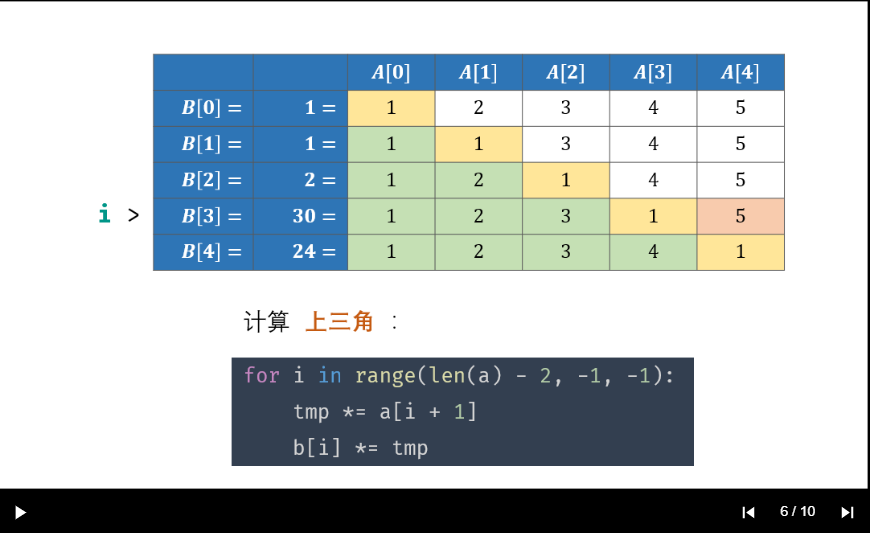
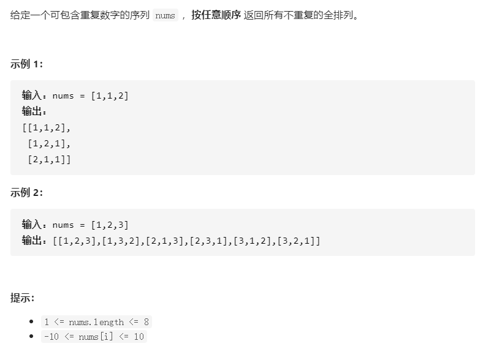
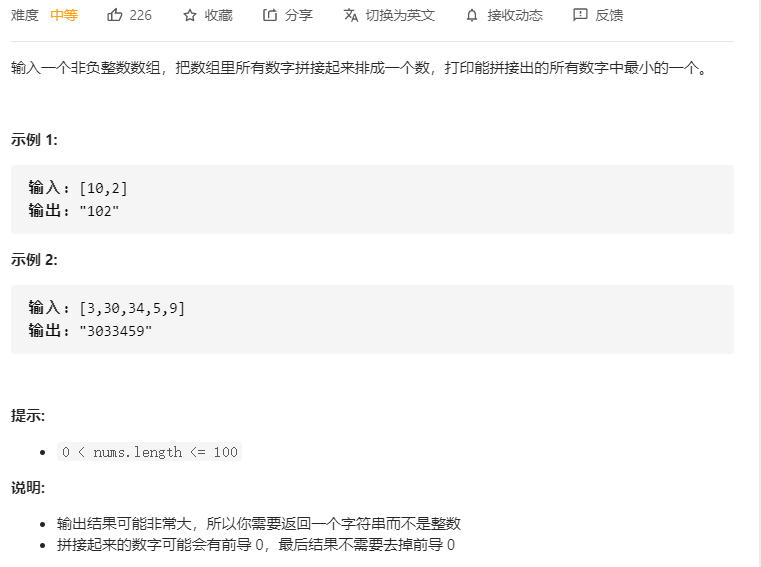

# 中等篇

[TOC]


## 11-20


### 11.[剑指 Offer 31. 栈的压入、弹出序列](https://leetcode-cn.com/problems/zhan-de-ya-ru-dan-chu-xu-lie-lcof/)


#### 思路：

使用一个栈`stk`，对于`pushed`数组模拟入栈操作，使用 `i` 来标志出栈位置

当栈不为空，并且此刻出栈数组位置上的元素`poped[i]`等于栈顶元素`stk.top()`，说明需要模拟出栈了，并且出栈数组的元素往后移动一位，也就是`i`变化了。那么栈顶`stk.top`以及`poped[i]`，也跟着变化，**所以这个过程是需要循环进行的**。

```c++
class Solution {
public:
    bool validateStackSequences(vector<int>& pushed, vector<int>& popped) {
        stack<int> stk;
        int i = 0;
        for(int &p:pushed){
            stk.push(p);
            while(!stk.empty() && popped[i] == stk.top()){
                stk.pop();
                i++;
            }
        }
        return stk.empty();
    }
};
```


### 12.[剑指 Offer 66. 构建乘积数组](https://leetcode-cn.com/problems/gou-jian-cheng-ji-shu-zu-lcof/)


#### 思路：

下三角计算：


上三角计算:




想起这张图，两个方面入手：

1. 想起B[1]、A[0]的关系，想起下三角怎么写
2. 想起B[3]、A[4]的关系，想起上三角怎么写

```c++
class Solution {
public:
    vector<int> constructArr(vector<int>& a) {
        vector<int> b(a.size(), 1);
        // 1.计算下三角
        int tmp1 = 1;
        for(int i = 1; i < a.size(); i++){
            // tmp1是从前往后的累乘：B[1] = B[1] * A[0]
            tmp1 *= a[i - 1]; 
            b[i] *= tmp1;
        }
        // 2.计算上三角
        int tmp2 = 1;
        for(int j = a.size() - 2; j >= 0; j--){
            // tmp2是从后往前的累乘：B[3] = B[3] * A[4]
            tmp2 *= a[j + 1];
            b[j] *= tmp2;
        }
        return b;
    }
};
```


### 13.[剑指 Offer 32 - III. 从上到下打印二叉树 III](https://leetcode-cn.com/problems/cong-shang-dao-xia-da-yin-er-cha-shu-iii-lcof/)


#### 思路：

涉及**一层一层的**操作，直接队列来做BFS！

这里需要设计一个统计数值的cnt，当前为奇数高度层则正序，偶数高度层则逆序。

技巧是**直接申请好一个固定大小**的vector，通过**下标进行赋值**即可。

```c++
class Solution {
public:
    vector<vector<int>> levelOrder(TreeNode* root) {
        if(root == nullptr) return {};
        vector<vector<int>> res;
        queue<TreeNode*> que;
        que.push(root);
        int cnt = 0;
        while(!que.empty()){
            int size = que.size();
            vector<int> level(size, 0);
            cnt++;
            for(int i = 0; i < size; i++){
                TreeNode* node = que.front(); que.pop();
                if(cnt & 1) level[i] = node->val; // 正序
                else level[size - i - 1] = node->val; // 逆序
                if(node->left) que.push(node->left);
                if(node->right) que.push(node->right);
            }
            res.push_back(level);
        }
        return res;
    }
};
```


### 14.[剑指 Offer 34. 二叉树中和为某一值的路径](https://leetcode-cn.com/problems/er-cha-shu-zhong-he-wei-mou-yi-zhi-de-lu-jing-lcof/)


#### 思路：

别怕，就是干，不也能写出来吗？！

**主要是要注意空节点不入递归！**

然后到了叶子结点考虑收集就可以。

```c++
class Solution {
public:
    vector<vector<int>> pathSum(TreeNode* root, int target) {
        if(root == nullptr) return {};
        vector<int> path;
        traverse(root, target, path); // root不为空
        return res;
    }
private:
    vector<vector<int>> res;
    void traverse(TreeNode* cur, int target, vector<int>& path){
        path.push_back(cur->val); // 确保了cur 不会为空
        // 遇上叶子节点时，考虑收集结果
        if(cur->left == nullptr && cur->right == nullptr){
            if(path.size() != 0){
                if(target == accumulate(path.begin(), path.end(), 0)){
                    res.push_back(path);
                }
                return;
            }
            return;
        }
        // 保证调用tarverse，传入的节点不为空！
        if(cur->left != nullptr){
            traverse(cur->left, target, path);
            path.pop_back();
        }
        if(cur->right != nullptr){
            traverse(cur->right, target, path);
            path.pop_back();
        }
        return;
    }
};
```


### 15.[剑指 Offer 14- I. 剪绳子](https://leetcode-cn.com/problems/jian-sheng-zi-lcof/)


#### 思路：

参考[Krahets](https://leetcode-cn.com/problems/jian-sheng-zi-lcof/solution/mian-shi-ti-14-i-jian-sheng-zi-tan-xin-si-xiang-by/)


得到两个结论

1. 尽可能等分成,每段长度为x
2. 取极值点x = 3

对于以`x=3`，进行切分成`a`段，剩余`b`的长度，那么`b`有三种情况：

1. b=0，刚好切分
2. b=1，那么把前面整切的一个`3`拿过来，总长度为`4`，切成`2`、`2`
3. b=2，不继续切分了,切了乘积为`1`，还不如直接`2`

```c++
class Solution {
public:
    int cuttingRope(int n) {
        if(n <= 3) return n - 1;
        int a = n / 3; // 整除
        int b = n % 3; // 余数:有三种情况b=0,1,2
        if(b == 0) return pow(3, a);
        if(b == 1) return pow(3, a - 1) * 4;
        return pow(3, a) * 2;
    }
};
```


### 16.[剑指 Offer 38. 字符串的排列](https://leetcode-cn.com/problems/zi-fu-chuan-de-pai-lie-lcof/)


跟[47. 全排列 II](https://leetcode-cn.com/problems/permutations-ii/)很像，本题只不过是把vector换成了string，换汤不换药！



看下面这个图，理解同一层重复与树枝上重复的区别

1. 同一层重复（横），`nums[i-1] == nums[i]`且`used[i-1]=0`，不可以！
2. 树枝上重复（纵），`nums[i-1] == nums[i]`且`used[i-1]=1`，可以！


```c++
class Solution {
public:
    vector<vector<int>> permuteUnique(vector<int>& nums) {
        vector<int> used(nums.size(), 0);
        sort(nums.begin(), nums.end());
        backtracking(nums, used);
        return res;
    }
private:
    vector<vector<int>> res;
    vector<int> path;
    void backtracking(vector<int>& nums, vector<int>& used){
        if(path.size() == nums.size()){
            res.push_back(path);
            return;
        }
        for(int i = 0; i < nums.size(); i++){
            if(i > 0 && nums[i] == nums[i - 1] && used[i - 1] == 0){
                continue;  // 同一层去重
            }
            if(used[i] == 0){ // 纵向该节点未使用
                used[i] = 1;
                path.push_back(nums[i]);
                backtracking(nums, used);
                path.pop_back();
                used[i] = 0;
            }
        }
    }
};
```

参考`代码随想录`写的本题代码如下：

```c++
class Solution {
public:
    vector<string> permutation(string s) {
        sort(s.begin(), s.end());
        vector<bool> used(s.size(), false);
        backtracking(s, used);
        return res;
    }
private:
    vector<string> res;
    string path;
    void backtracking(string& s, vector<bool>& used){
        if(path.size() == s.size()){
            res.push_back(path);
            return;
        }
        for(int i = 0; i < s.size(); i++){
            // 如果是同一层使用过
            if(i > 0 && s[i - 1] == s[i] && used[i - 1] == false) continue;
            if(used[i] == false){
                used[i] = true;
                path.push_back(s[i]);
                backtracking(s, used); //回溯
                path.pop_back();
                used[i] = false;
            }
        }
    }
};
```


### 17.[剑指 Offer 45. 把数组排成最小的数](https://leetcode-cn.com/problems/ba-shu-zu-pai-cheng-zui-xiao-de-shu-lcof/)



参考：[Krahets](https://leetcode-cn.com/problems/zi-fu-chuan-de-pai-lie-lcof/)


证明有些难，看不太懂，就先放着了。

直接使用sort，并自定义排序方式

```c++
class Solution {
public:
    string minNumber(vector<int>& nums) {
        vector<string> s;
        for(auto num:nums) s.push_back(to_string(num));
        // 1.排序
        sort(s.begin(), s.end(), [](string& x, string& y){ return x + y < y + x; });
        // 2.拼接数字字符
        string res;
        for(auto s1:s) res.append(s1);
        return res;
    }
};
```

也可以自己写一个`快速排序`

```c++
class Solution {
public:
    string minNumber(vector<int>& nums) {
        vector<string> s;
        for(auto num:nums) s.push_back(to_string(num));
        // 1.排序
        quickSort(s, 0, s.size() - 1);
        // 2.拼接数字字符
        string res;
        for(auto s1:s) res.append(s1);
        return res;
    }
private:
    // 升序： x "<" y
    bool static cmp(const string& x, const string& y){
        return x + y <= y + x;
    }
    void quickSort(vector<string>& s, int l, int r){
        if(l >= r) return;
        int i = l, j = r;
        string &p = s[l];
        while(i < j){
            while(i < j && cmp(p, s[j])) j--;
            while(i < j && cmp(s[i], p)) i++;
            swap(s[i], s[j]);
        }
        swap(p, s[i]);
        quickSort(s, l, i - 1);
        quickSort(s, i + 1, r);
    }
};
```

对比一下快排模板，改变的是根据哨兵p将数组划分成两组时所用的比较。

1. 先从后往前，只要当前值>=哨兵p（`arr[j]>=p`），就一直往前，表现为`j--`
2. 然后从前往后，只要当前值<=哨兵p（`arr[i]<=p`），就一直往后，表现为`i++`

```c++
void quickSort(vector<int>& arr, int l, int r){
        if(l >= r) return; // 当数组只有一个数时，终止递归
        int i = l, j = r;  //哨兵划分范围（以 arr[l] 左边第一个数作为基准数）
        int &p = arr[l];
		while(i < j){
           	while(i < j && arr[j] >= p) j--; //这两个while有顺序的 ，j右边全部大于哨兵值 
            while(i < j && arr[i] <= p) i++; // i 左边全部小于哨兵值 
            swap(arr[i], arr[j]);  //此时交换i,j位置的值，那么（l, i）的值 <= 哨兵值， （i + 1, r） >= 哨兵值                  
			}
        swap(p, arr[i]); // 将哨兵p放到 i 位置 
        // 递归左（右）子数组执行哨兵划分
    	// 以 i 位置为界，左边小于哨兵值p，右边大于哨兵值p
        quickSort(arr, l, i - 1);
        quickSort(arr, i + 1, r);
    }
```


### 18.[剑指 Offer 60. n个骰子的点数](https://leetcode-cn.com/problems/nge-tou-zi-de-dian-shu-lcof/)


不好理解，代码好难`orz`。

参考[Krahets](https://leetcode-cn.com/problems/nge-tou-zi-de-dian-shu-lcof/solution/jian-zhi-offer-60-n-ge-tou-zi-de-dian-sh-z36d/)


正向递推：图中绿色下划线的内容。

```c++
class Solution {
public:
    vector<double> dicesProbability(int n) {
        // dp:代表前一个f(n - 1),初始化f(n = 1,i = 1 ~ 6)
        vector<double> dp(6, 1.0 / 6.0); 
        for(int i = 2; i <= n; i++){ // 递推f(n = 2 ~ n)
            vector<double> tmp(5 * i + 1, 0); // 递推到当前结果f(n)
            for(int j = 0; j < dp.size(); j++){ //遍历前一个f(n - 1)
                //每一个数字k对f(n - 1 + 1, i + k)的贡献
                for(int k = 0; k < 6; k++){ 
                    tmp[j + k] += (dp[j] / 6.0);
                }
            }
            // 将当前保存，作为下一次的前一个结果
            dp = tmp; 
        }
        return dp;
    }
};
```


### 19.[剑指 Offer 33. 二叉搜索树的后序遍历序列](https://leetcode-cn.com/problems/er-cha-sou-suo-shu-de-hou-xu-bian-li-xu-lie-lcof/)


#### 思路：

看一个序列是否是满足BST的后序遍历，那么就把它当成BST，并进行后序遍历的模拟，如果模拟过程中发现与原先的假定不符合那么就为`false`咯~

后序：左 右 中

3个假定：

1. 对于序列某段区间`[i, j]`，假定`j`为中间节点，根据节点值，划分区间为左区间（对应左子树），右区间（对应右子树），划分完后，` p == j`
2. 左子树符合
3. 右子树符合

3个条件都符合，说明就是正确的！**注意一下递归退出条件**！

```c++
class Solution {
public:
    bool verifyPostorder(vector<int>& postorder) {
        return dfs(postorder, 0, postorder.size() - 1);
    }
private:
    bool dfs(vector<int>& postorder, int i, int j){
        // 后序：左 右 中
        // val(左) < val(中) < val(右)
        // 把postorder[j]视为中间节点，根据val大小划分区间
        // i >= j说明此子树节点数量 ≤1 ，无需判别正确性，因此直接返回 true
        if(i >= j) return true; 
        int p = i;
        while(postorder[p] < postorder[j]) p++; 
        int m = p - 1; // 左子树区间:[i, m]
        while(postorder[p] > postorder[j]) p++;
        int n = p - 1; // 右子树区间:[m+1, n]
        // 当前p == j 且 左右子树也符合后序遍历，整个才是符合后序遍历序列
        return p == j && dfs(postorder, i, m) && dfs(postorder, m+1, n);
    }
};
```

这种题目类似判断一棵树是否是[101. 对称二叉树](https://leetcode-cn.com/problems/symmetric-tree/)？

递归代码：

```c++
class Solution {
public:
    bool isSymmetric(TreeNode* root) {
        if(root == nullptr) return true;
        return isValid(root->left, root->right);
    }
private:
    bool isValid(TreeNode* left, TreeNode* right){
        if(left == nullptr && right != nullptr) return false; 
        else if(left != nullptr && right == nullptr) return false;
        else if(left == nullptr && right == nullptr) return true;    
        else if(left->val != right->val) return false; // 这一条要在这最后，是为了确保left\right不为空  
        
        return isValid(left->left, right->right) && isValid(left->right, right->left);
    }
};
```

迭代代码：

```c++
class Solution {
public:
    bool isSymmetric(TreeNode* root) {
        if(root == nullptr) return true;
        queue<TreeNode*> que;
        que.push(root->left);
        que.push(root->right);
        while(!que.empty()){
            // 每次比较对称位置上的两个节点
            TreeNode* left = que.front(); que.pop();
            TreeNode* right = que.front(); que.pop();
            if(left == nullptr && right == nullptr){
                continue;
            }
            if((!left && right) || (left && !right) || ((left && right ) && left->val != right->val) ){
                return false;
            }
            // 剩下两者都不为空，且值相等，即对称
            que.push(left->left);  // 外部对称
            que.push(right->right);
            que.push(left->right); // 内部对称
            que.push(right->left);
        }
        return true;
    }
};
```


### 20.[剑指 Offer 46. 把数字翻译成字符串](https://leetcode-cn.com/problems/ba-shu-zi-fan-yi-cheng-zi-fu-chuan-lcof/)


#### 思路：


**状态定义**：dp[i]--到第i位数字翻译的方案数为dp[i]

**动态转移方程**：对于第i-2，i-1位组成的两位数`n`

1. `n∈[10, 25]，dp[i] = dp[i - 1] + dp[i - 2]`
2. `n∈[0, 9] ∪ [26,99]，dp[i] = dp[i - 1]`

**初始化**：

> Q： 无数字情况 dp[0] = 1 从何而来？
> A： 当 num第 1, 2 位的组成的数字∈[10,25] 时，显然应有 `2` 种翻译方法，即 `dp[2] = dp[1] + dp[0] = 2` ，而显然` dp[1] = 1` ，因此推出 `dp[0] = 1 `。
>
> dp[0]是为了递推使用。

将数字转化为字符串更好操作。

```C++
class Solution {
public:
    int translateNum(int num) {
        string str = to_string(num);
        // dp[i]--num上第 i 位数字翻译的方案数为dp[i]
        vector<int> dp(str.size() + 1);
        dp[0] = dp[1] = 1;
        for(int i = 2; i <= str.size(); i++){
            string t2(str.begin() + i - 2, str.begin() + i);
            int n = stoi(t2);
            dp[i] = (n >= 10 && n <= 25) ? dp[i - 1] + dp[i - 2] : dp[i - 1];
        } 
        return dp[str.size()];
    }
};
```

