# 中等篇

[TOC]


## 21-31

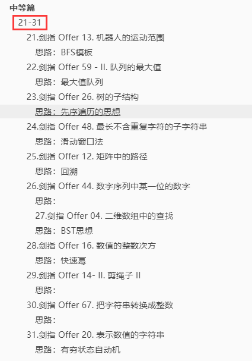

### 21.[剑指 Offer 13. 机器人的运动范围](https://leetcode-cn.com/problems/ji-qi-ren-de-yun-dong-fan-wei-lcof/)

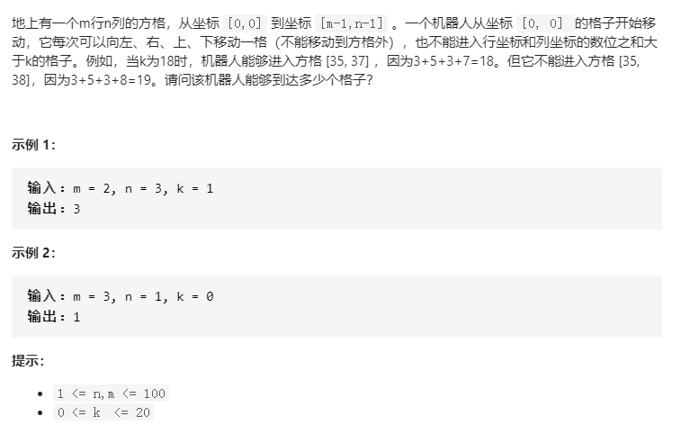

#### 思路：BFS模板

之前写过的BFS都是二叉树上的操作，这次接触到了二维矩阵的BFS，也可以说是图论。

看到一个大佬的模板：[BFS模板](https://leetcode-cn.com/problems/ji-qi-ren-de-yun-dong-fan-wei-lcof/solution/bfsmo-ban-yi-ci-bei-hui-chu-chu-shi-yong-by-fuxuem/)

**干货如下：**

1、BFS使用队列，把每个还没有搜索到的点一次放入队列，然后再弹出队列的头部元素当做当前遍历点。

如果**不需要确定当前遍历到了哪一层**，BFS模板如下：

```c++
while queue 不空：
    cur = queue.pop()
    for 节点 in cur的所有相邻节点：
        if 该节点有效且未访问过：
            queue.push(该节点)
```

2、如果要确定当前遍历到了哪一层，BFS模板如下。这里增加了level表示当前遍历到二叉树中的哪一层了，也可以理解为在一个图中，现在已经走了多少步了。size表示在开始遍历新的一层时，队列中有多少个元素，即有多少个点需要向前走一步。(这也是我在**二叉树**经常使用的~)

```c++
level = 0
while queue 不空：
    size = queue.size()
    while (size --) {
        cur = queue.pop()
        for 节点 in cur的所有相邻节点：
            if 该节点有效且未被访问过：
                queue.push(该节点)
    }
    level ++;
```

对应本题，应该使用模板1。

1. 这里用一个visited来标记每一个位置的访问信息，true表示访问过
2. 对于每一个que的队首元素front，取出来就是一对坐标（x, y），此时表示一条路径，res++
3. 然后遍历这个坐标的四个相邻方向，即上下左右，这里用一个二维direction来存放（脑补一下，往上移动，是不是`x减少1，y保持不动`？对应`{-1, 0}`。实在不行画个图也是更容易理解的）
4. 对每个方向上的元素（也就是新的坐标位置）判断是否合法
   - 不合法，跳过
   - 合法，加入队列，同时标记已经访问过

**所以这里的做法是每次将节点（本题是位置坐标）加入队列，同时设置访问状态，然后弹出队列，遍历周围位置，达到遍历全局的目的。**

代码如下：

```c++
class Solution {
public:
    int movingCount(int m, int n, int k) {
        vector<vector<bool>> visited(m, vector<bool>(n, false));
        queue<pair<int, int>> que; // 存放一对坐标{x, y}
        que.push({0, 0});
        visited[0][0] = true;
        int res = 0;
        while(!que.empty()){
            pair<int, int> front = que.front(); que.pop();
            int x = front.first;
            int y = front.second;
            res++;
            // 遍历该位置(x, y)相邻的四个位置
            for(auto d:directions){
                int newX = x + d[0];
                int newY = y + d[1];
                if(newX < 0 || newX > m-1 || newY < 0 || newY > n-1 || 
                    bitSum(newX) + bitSum(newY) > k || visited[newX][newY]){
                        continue;
                }
                que.push({newX, newY});
                visited[newX][newY] = true;
            }
        }
        return res;
    }
private:
    //vector<vector<int>> directions = {{-1, 0}, {1, 0}, {0, -1}, {0, 1}}; // 上下左右
    vector<vector<int>> directions = {{1, 0}, {0, 1}}; // 往 下 右方向即可，这是隐藏的剪枝优化
    int bitSum(int x){
        int sum = 0;
        while(x != 0){
            sum += x % 10;
            x /= 10;
        }
        return sum;
    }
};
```

解法2：DFS

因为m, n范围在[1, 100]，也就是下标范围[0, 99]，对于某个坐标（i, j）数位和可以直接计算：`i / 10 + i % 10 + j / 10 + j % 10`

```C++
class Solution {
public:
    int movingCount(int m, int n, int k) {
        vector<vector<bool>> visited(m, vector<bool>(n, false));
        dfs(m, n, k, 0, 0, visited);
        return count;
    }
private:
    int count = 0;
    void dfs(int m, int n, int k, int i, int j, vector<vector<bool>>& visited){
        if(i < 0 || i >= m || j < 0 || j >= n || (i / 10 + i % 10 + j / 10 + j % 10) > k || visited[i][j]){
            return;
        }
        visited[i][j] = true;
        count++;
        dfs(m, n, k, i + 1, j, visited); // 下
        //dfs(m, n, k, i - 1, j, visited);
        dfs(m, n, k, i, j + 1, visited); // 右
        //dfs(m, n, k, i, j - 1, visited);
    }
};
```


再来看看[剑指 Offer 32 - III. 从上到下打印二叉树 III](https://leetcode-cn.com/problems/cong-shang-dao-xia-da-yin-er-cha-shu-iii-lcof/)

用的是模板2，区别的话在于这里在加入队列的时候没有处理，而是每次弹出队列在进行处理，问题不大~

```c++
/**
 * Definition for a binary tree node.
 * struct TreeNode {
 *     int val;
 *     TreeNode *left;
 *     TreeNode *right;
 *     TreeNode(int x) : val(x), left(NULL), right(NULL) {}
 * };
 */
class Solution {
public:
    vector<vector<int>> levelOrder(TreeNode* root) {
        if(root == nullptr) return {};
        vector<vector<int>> res;
        queue<TreeNode*> que;
        que.push(root);
        int cnt = 0;
        while(!que.empty()){
            int size = que.size();
            vector<int> level(size, 0);
            cnt++; // 统计当前层
            for(int i = 0; i < size; i++){ // 访问当前节点周围节点：左右子树
                TreeNode* node = que.front(); que.pop();
                if(cnt & 1) level[i] = node->val;
                else level[size - i - 1] = node->val;
                if(node->left) que.push(node->left);
                if(node->right) que.push(node->right);
            }
            res.push_back(level);
        }
        return res;
    }
};
```


### 22.[剑指 Offer 59 - II. 队列的最大值](https://leetcode-cn.com/problems/dui-lie-de-zui-da-zhi-lcof/)

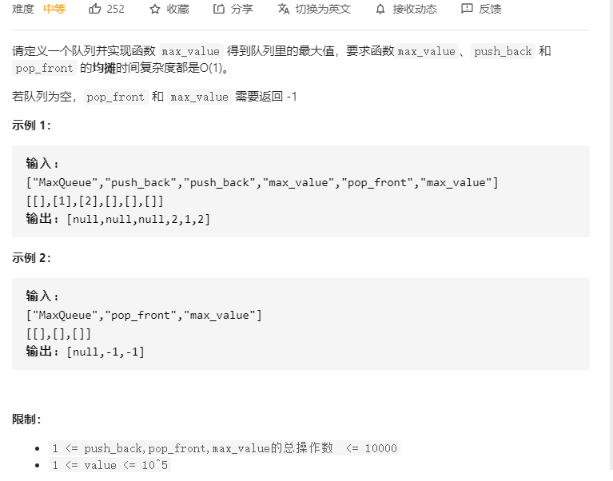

#### 思路：最大值队列

这里有一个非常重要的数据结构：维护动态数组的最大值的队列deq

跟[239. 滑动窗口最大值](https://leetcode-cn.com/problems/sliding-window-maximum/)用到的思路是一样的。每次在`新添加元素`or`删除元素`，都会更新deq，保证队首`deq.front()`为最大值。

本题代码如下：

```c++
class MaxQueue {
public:
    MaxQueue() {}
    
    int max_value() {
        return deq.empty() ? -1 : deq.front();
    }
    
    void push_back(int value) {
        que.push(value);
        // 当插入的值大于最大值队列的末尾元素，就一直pop掉末尾元素
        while(!deq.empty() && value > deq.back()) deq.pop_back();
        deq.push_back(value);
    }
    
    int pop_front() {
        if(que.empty()) return -1;
        int front = que.front();
        que.pop();
        // 如果pop掉的值刚好也等于最大值队列deq队首元素，那么deq也要pop
        if(front == deq.front()) deq.pop_front();
        return front;
    }
private:
    queue<int> que; // 维护队列所有元素
    deque<int> deq; // 维护队列最大值
};
```

[239. 滑动窗口最大值](https://leetcode-cn.com/problems/sliding-window-maximum/)代码如下：

```c++
class Solution {
public:
    vector<int> maxSlidingWindow(vector<int>& nums, int k) {
        vector<int> res;
        MyQueue que;
        // 前 k 个元素的最大值
        for(int i = 0; i < k; i++){
            que.push(nums[i]);
        }
        
        res.push_back(que.front());
        
        for(int i = k; i < nums.size(); i++){
            que.pop(nums[i - k]); // 剔除窗口左边
            que.push(nums[i]); // 添加窗口右边
            res.push_back(que.front());
        }
        return res;
    }
private:
    // 单调队列 -- 队首为最大值的递减队列
    class MyQueue{
    private:        
        deque<int> que;
    public:
        // pop元素：当窗口向右移动，最左端少掉的那个元素，是队列队首元素
        void pop(int num){
            if(!que.empty() && num == que.front()) que.pop_front();
        }
        // push元素：当窗口向右移动，最右边会新增一个元素
        // 不断跟队尾元素比较，将队尾比它小的都pop
        void push(int num){
            while(!que.empty() && num > que.back()){
                que.pop_back();
            }
            que.push_back(num);
        }
        // 获取队首元素
        int front(){
            return que.front();
        }
    };
};
```


### 23.[剑指 Offer 26. 树的子结构](https://leetcode-cn.com/problems/shu-de-zi-jie-gou-lcof/)

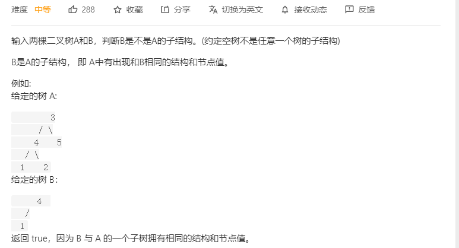

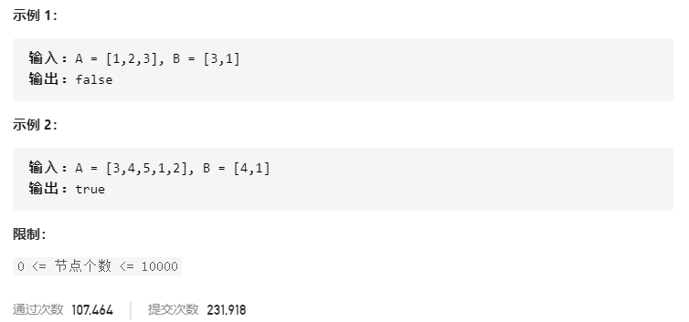

#### 思路：先序遍历的思想

判断`B`是否为`A`的子结构，要满足

1. 遍历`A`的每一个节点`nA`，即当前节点，对应`isSubStructure`函数
2. 从`nA`节点出发，判断。方法是同时遍历`A、B`，对应`dfs`函数
   - `A`为空，或者`A、B`当前节点值不一样，说明当前节点不符合，返回`false`
   - `B`为空，说明之前遍历的节点都相同，`B`是`A`的子结构，返回`true`
   - `A、B`的当前值`不为空且相等`，就**递归**判断`A`的左、右子树跟`B`的左、右子树是否符合

```c++
class Solution {
public:
    bool isSubStructure(TreeNode* A, TreeNode* B) {
        // 当前A、B不为空情况下
        // 若 A == B，则通过dfs判断B是否为A的子结构
        // 否则，从A的左右子树中先找到等于B的节点
        return (A && B) && (dfs(A, B) || isSubStructure(A->left, B) || isSubStructure(A->right, B));
    }
private:
    // A 是否包含B
    bool dfs(TreeNode* A, TreeNode* B){
        // 两个树同时遍历，遍历完了B，说明都符合，是A的子结构
        if(B == nullptr) return true;
        // 如果遍历过程A自己是空B不为空，肯定不匹配
        // 如果遍历过程中A、B节点值不相等，肯定不匹配
        if(A == nullptr || A->val != B->val) return false;
        return dfs(A->left, B->left) && dfs(A->right, B->right);
    }
};
```


### 24.[剑指 Offer 48. 最长不含重复字符的子字符串](https://leetcode-cn.com/problems/zui-chang-bu-han-zhong-fu-zi-fu-de-zi-zi-fu-chuan-lcof/)

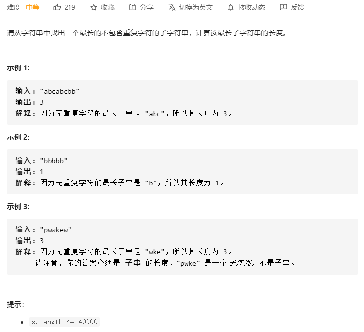

#### 思路：滑动窗口法

窗口内维护的是不含重复的子字符串。

用一个数组used标记字符是否使用过。当窗口最右边right的值已经出现过，那么左边界要往右移动，同时更新窗口内最大不同子字符串数。

```c++
class Solution {
public:
    int lengthOfLongestSubstring(string s) {
        vector<bool> used(256, false);
        int left = 0, right = 0, res = 0;
        while(right < s.size()){
            // used[s[right]] = true时，即出现了之前出现过的字符
            // 说明此刻应该统计下一个字符串，应该更新左边界
            // 撤销used数组中使用过的字符，让下一个字符串能够使用它们
            while(used[s[right]]){
                used[s[left]] = false;
                left++;
            }
            res = max(res, right - left + 1);
            used[s[right]] = true;
            right++;
        }
        return res;
    }
};
```

V2：哈希表法，跟V1逻辑差不多，只不过多了删除哈希表key，以及插入key的操作

```c++
class Solution {
public:
    int lengthOfLongestSubstring(string s) {
        int left = 0, right = 0, res = 0;
        unordered_set<char> used; // 以字符为key
        while(right < s.size()){
            while(used.count(s[right]) != 0){
                used.erase(s[left]); //将之前出现过的从哈希表中撤销
                left++;
            }
            res = max(res, right - left + 1);
            used.insert(s[right]); // 插入
            right++;
        }
        return res;
    }
};
```

V3：哈希表法

```c++
class Solution {
public:
    int lengthOfLongestSubstring(string s) {
        unordered_map<char, int> map;
        int i = -1, res = 0;
        for(int j = 0; j < s.size(); j++){
            if(map.count(s[j]) != 0){
                 i = max(i, map[s[j]]); // 字符之前出现过，更新 i 为字符上一次出现的位置，上一次位置比i小则不更新
            }
            map[s[j]] = j; // 更新当前字符对应位置
            res = max(res, j - i);
        }
        return res;
    }
};
```


### 25.[剑指 Offer 12. 矩阵中的路径](https://leetcode-cn.com/problems/ju-zhen-zhong-de-lu-jing-lcof/)

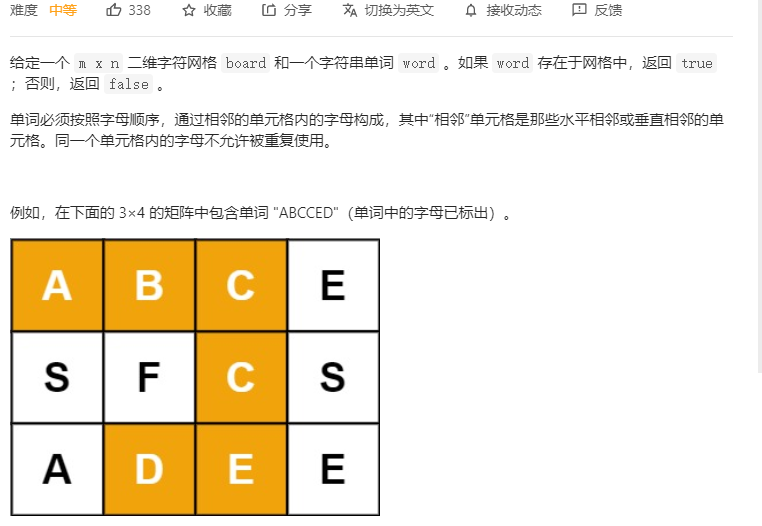

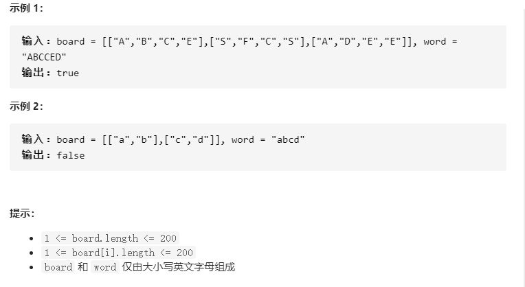

#### 思路：回溯

第一种方法：使用两层for循环来匹配word[0]，然后若匹配上了，则继续往下探索是否后面的也能够匹配

这里用visited来标记已经使用过的，避免重复访问。每次从当前位置，探索相邻的四个方向上。

那么当整个board都是相同的字符且匹配word[0]时，会非常的耗费时间，因为对于每一个board上字符，都要进行探索。

```c++
class Solution {
public:
    bool exist(vector<vector<char>>& board, string word) {
        m = board.size(), n = board[0].size();     
        // 这两个for循环：用来匹配word[0]的位置，并从该位置往后跟word后面的匹配
        for(int i = 0; i < m; i++){
            for(int j = 0; j < n; j++){
                if(board[i][j] == word[0]){ // 当前位置等于字符串开头 字符
                    vector<vector<bool>> visited(m, vector<bool>(n, false));
                    visited[i][j] = true;
                    // 如果继续往下探索，能够找到，则返回true
                    // 否则，啥也不做，返回，找另一个等于开头字符的位置去探索
                    if(dfs(board, word, visited, i, j, 0)){ 
                        return true;
                    }
                    visited[i][j] = false;
                }
            }
        }
        return false;
    }
private:
    vector<vector<int>> directions = {{-1, 0}, {1, 0}, {0, -1}, {0, 1}}; // 上下左右
     int m , n;
    bool dfs(vector<vector<char>>& board, string word, vector<vector<bool>> &visited, int x, int y, int index){
        if(index == word.size() - 1) return true; // 探索完毕，匹配的位置到了最后位置
        // 否则，index继续
        for(auto d:directions){ // 当前位置的四个相邻方向
            int newX = x + d[0];
            int newY = y + d[1];
            if(newX >= 0 && newX < m && newY >= 0 && newY < n && board[newX][newY] == word[index + 1] && !visited[newX][newY]){
                visited[newX][newY] = true;
                if(dfs(board, word, visited, newX, newY, index + 1)) return true;
                visited[newX][newY] = false;
            }
        }
        return false;
    }
};
```

第二种不用visited的方法，如下：

速度最快，直接dfs里面填坐标，不用directions

```c++
class Solution {
public:
    bool exist(vector<vector<char>>& board, string word) {
        m = board.size(), n = board[0].size();
        for(int i = 0; i < m; i++){
            for(int j = 0; j < n; j++){
                if(dfs(board, i, j, word, 0)) return true;
            }
        }
        return false;
    }
private:
    int m, n;
    bool dfs(vector<vector<char>>& board, int i, int j, string& word, int index){
        if(i < 0 || i >= m || j < 0 || j >= n || board[i][j] != word[index]) return false;
        if(index == word.size() - 1) return true;
        // 标志为使用过，防止开启下次递归重复使用
        board[i][j] = '\0'; 
        // 向周围4个方向递归搜索
        bool res = dfs(board, i + 1, j, word, index + 1) || dfs(board, i - 1, j, word, index + 1)
                 ||dfs(board, i, j + 1, word, index + 1) || dfs(board, i, j - 1, word, index + 1);
        // 撤销，恢复原状
        board[i][j] = word[index];
        return res;
    }
};
```

directions:

```c++
class Solution {
public:
    bool exist(vector<vector<char>>& board, string word) {
        m = board.size(), n = board[0].size();     
        // 这两个for循环：用来匹配word[0]的位置，并从该位置往后跟word后面的匹配
        for(int i = 0; i < m; i++){
            for(int j = 0; j < n; j++){
                if(dfs(board, word, i, j, 0)) return true;
            }
        }
        return false;
    }
private:
    vector<vector<int>> directions = {{-1, 0}, {1, 0}, {0, -1}, {0, 1}}; // 上下左右
    int m , n;
    bool dfs(vector<vector<char>>& board, string word, int x, int y, int index){
        // 越界或者当前不匹配
        if(x < 0 || x > m-1 || y < 0 || y > n-1 || board[x][y] != word[index]) return false;
        if(index == word.size() - 1) return true; // 探索完毕，匹配的位置到了最后位置
        // index继续往下匹配，将当前字符改为非board中的字符，防止再次使用当前值
        // 代替了visited标记
        board[x][y] = '\0';
        bool res = false;
        for(auto d:directions){ // 当前位置的四个相邻方向
            int newX = x + d[0];
            int newY = y + d[1];
            if(dfs(board, word, newX, newY, index + 1)){
                res = true;
                break;
            }
        }  
        board[x][y] = word[index]; // 恢复
        return res;
    }
};
```


### 26.[剑指 Offer 44. 数字序列中某一位的数字](https://leetcode-cn.com/problems/shu-zi-xu-lie-zhong-mou-yi-wei-de-shu-zi-lcof/)

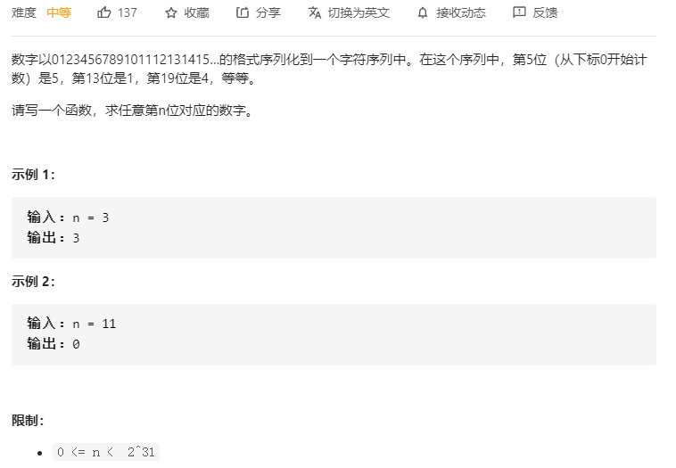

#### 思路：

找规律，看题解半天也理解不了，考到的几率不大，先放着了。时间成本太大。

```c++
class Solution {
public:
    int findNthDigit(int n) {
        long long start = 1;
        int digit = 1;
        long long count = 9;
        while(n>count){
            n -=count;
            start *= 10;
            digit++;
            count = start* digit* 9;  
        }
        int num = start +(n-1)/digit;
        string s = to_string(num);
        return s[(n-1)%digit] - '0';
    }
};
```


#### 27.[剑指 Offer 04. 二维数组中的查找](https://leetcode-cn.com/problems/er-wei-shu-zu-zhong-de-cha-zhao-lcof/)

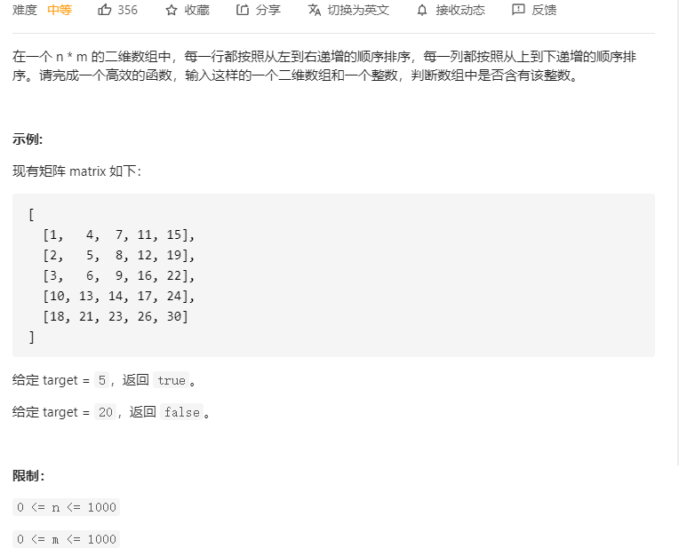

#### 思路：BST思想

将数组逆时针旋转45°，就可以发现类似二叉搜索树。利用排序的特性。

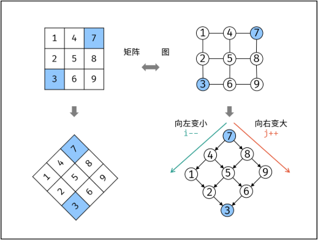

```c++
class Solution {
public:
    bool findNumberIn2DArray(vector<vector<int>>& matrix, int target) {
        int i = matrix.size() - 1, j = 0;
        while(i >= 0 && j < matrix[0].size()){
            if(target < matrix[i][j]) i--;
            else if(target > matrix[i][j]) j++;
            else return true;
        }
        return false;
    }
};
```


### 28.[剑指 Offer 16. 数值的整数次方](https://leetcode-cn.com/problems/shu-zhi-de-zheng-shu-ci-fang-lcof/)

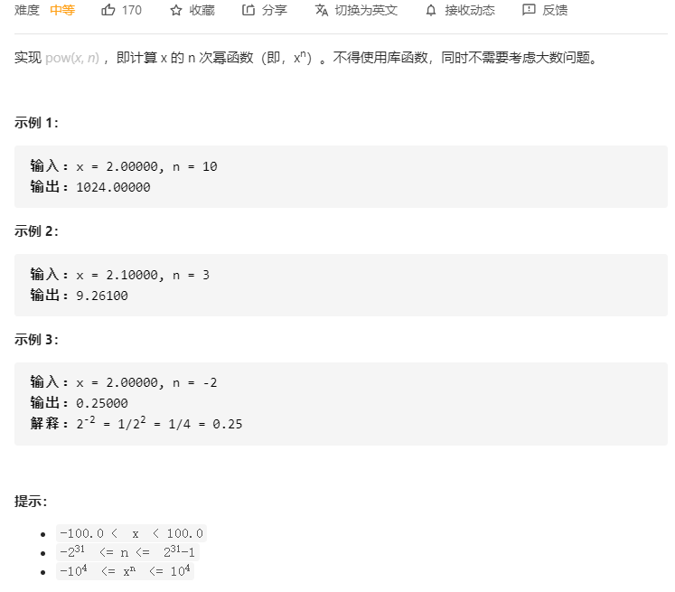

#### 思路：快速幂

快速幂的思想是将每次乘以`x`，转化为乘以`x^2`，那么就要看`x ^ n`中的`n`以`2`为一组能够分成几次了；在循环二分时，每当 `n` 为奇数时，将**多出的一项 `x`乘入 `res`**

```c++
以x = 3, n = 5为例, 求 3 ^ 5
那么初始值b = 5, res = 1.0
    
1.b = 5, 为奇数, res *= x = 1 * 3 = 3
x = 3 * 3 = 3 ^ 2
b = 5 / 2 = 2

2.b = 2, res = 3
x = (3 ^ 2) * (3 ^ 2)  = 3 ^ 4 = 81
b = 2 / 2 = 1

3.b = 1, 为奇数, res *= x = 3 * (3 ^ 4) = 3 ^ 5
x = (3 ^ 4) * (3 ^ 4) = 3 ^ 8
b = 1 / 2 = 0
    
4.b不满足while条件，退出
5.返回res = 3 ^ 5
```

整体代码如下：

```c++
class Solution {
public:
    double myPow(double x, int n) {
        long b = n;
        if(b < 0){
            b = -b;
            x = 1.0 / x; // x ^ (-2) = (1 / x) ^ 2
        }
        // 快速幂：每次乘以x转化为每次乘以x^2
        double res = 1.0;
        while(b){
            if(b & 1) res *= x;
            x *= x; // 每次乘以 x ^ 2
            b >>= 1; // 每次右移一位，除以2
        }
        return res;
    }
};
```


### 29.[剑指 Offer 14- II. 剪绳子 II](https://leetcode-cn.com/problems/jian-sheng-zi-ii-lcof/)

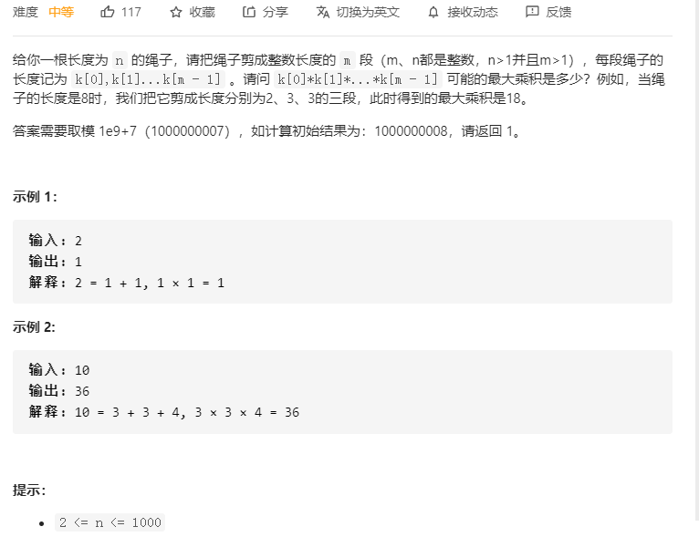

#### 思路：

相比于[剑指 Offer 14- I. 剪绳子](https://leetcode-cn.com/problems/jian-sheng-zi-lcof/)，这题多了一个大数。14-I代码如下：

```c++
class Solution {
public:
    int cuttingRope(int n) {
        if(n <= 3) return n - 1;
        int a = n / 3; // 整除
        int b = n % 3; // 余数:有三种情况b=0,1,2
        if(b == 0) return pow(3, a);
        if(b == 1) return pow(3, a - 1) * 4;
        return pow(3, a) * 2;
    }
};
```

本题用到[剑指 Offer 16. 数值的整数次方](https://leetcode-cn.com/problems/shu-zhi-de-zheng-shu-ci-fang-lcof/)的快速幂思想，来求`x的n次方`，整体代码如下：

```c++
class Solution {
public:
    int cuttingRope(int n) {
        if(n <= 3) return n - 1;
        int a = n / 3, b = n % 3;
        const int p = 1000000007;
        
        long res = 1, x = 3;
        int i = a - 1;
        // 快速幂实现res = 3 ^ (a - 1)
        while(i){
            if(i & 1) res = (res * x) % p;
            x = (x * x) % p;
            i >>= 1;
        }
        // 看最后剩下的b = 0, 1, 2三种情况
        if(b == 0) return (res * 3) % p;
        if(b == 1) return (res * 2 * 2) % p;
        return (res * 3 * 2) % p;
    }
};
```


### 30.[剑指 Offer 67. 把字符串转换成整数](https://leetcode-cn.com/problems/ba-zi-fu-chuan-zhuan-huan-cheng-zheng-shu-lcof/)

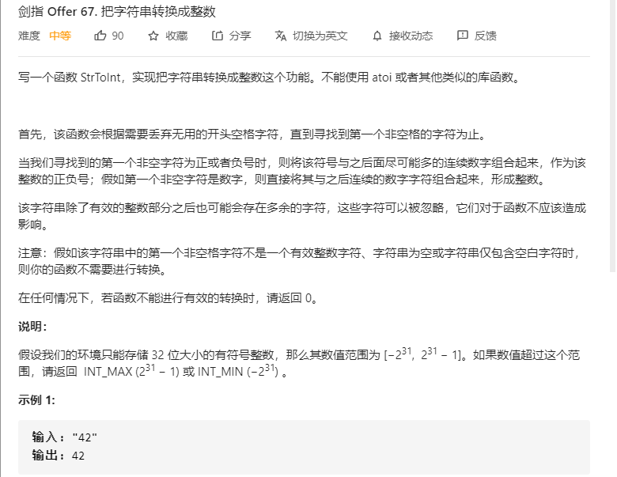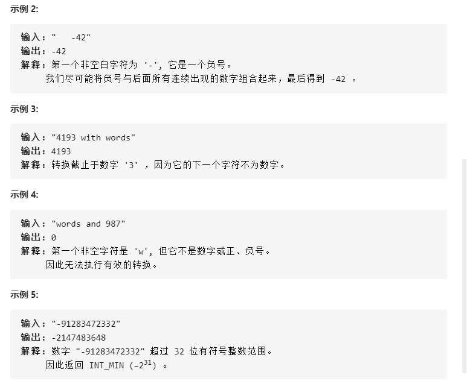

#### 思路：

题目下方提到：`只能存储32位大小的有符号整数`，所以`long`是不可以用的，下面给出假如有long的类型存在下的写法。

**long**

```c++
class Solution {
public:
    int strToInt(string str) {
        int i = 0, isNegtive = 1;
        while(str[i] == ' ') i++;
        if(str[i] == '-') isNegtive = -1;
        if(str[i] == '-' || str[i] == '+') i++; 
        long res = 0;
        for(; i < str.size() && isdigit(str[i]); i++){
            res = res * 10 + (str[i] - '0');
            if(res >= INT_MAX && isNegtive == 1) return INT_MAX;
            if(res > INT_MAX && isNegtive == -1) return INT_MIN; // 不能等于
        }
        return isNegtive * res;
    }
};
```

**无long**

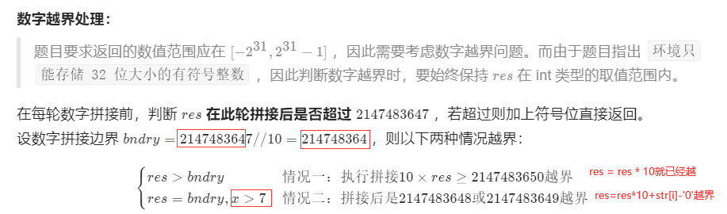

**解法1**：需要记住最大值的具体值，题目中没有提供。不太适合。但是代码简洁。

```c++
class Solution {
public:
    int strToInt(string str) {
        int i = 0, flag = 1;
        int res = 0; //默认flag = 1，正数
        while (str[i] == ' ') i ++;
        if (str[i] == '-') flag = -1;
        if (str[i] == '-' || str[i] == '+') i ++;
        for (; i < str.size() && isdigit(str[i]); i ++)  {
            if (res > INT_MAX / 10 || (res == INT_MAX / 10 && str[i] - '0' > 7)) //溢出判定
                  return flag == 1 ? INT_MAX : INT_MIN;
            res = res * 10 + (str[i] - '0');
        } 
        return flag * res;
    }
};
```

**解法2**：不需要记住具体值。主要的是一个`/`是一个向下取整的，`res = INT_MAX / 10`可以说明`res * 10 <= INT_MAX`的。所以可以通过这个来求`res * 10` 与 `INT_MAX`的差值，也就是阈值。`(str[i] - '0')`与阈值比较进行判断。

```c++
class Solution {
public:
    int strToInt(string str) {       
        int flag = 1, i = 0;
        while(str[i] == ' ') i++;
        if(str[i] == '-') flag = -1;
        if(str[i] == '-' || str[i] == '+') i++;
        int res = 0;
        for(; i < str.size() && isdigit(str[i]); i++){
            // 有两种情况需要直接返回
            // 1、res直接大于最大值缩小10倍后的大小（/是向下取整，会更小），即res*10是大于最大值的
            if(res > INT_MAX / 10){               
                return flag == 1 ? INT_MAX : INT_MIN;
            }
            // 2、res是等于最大值缩小10倍后的大小，那么判断最大值跟res放大10倍后的差值
            // 该差值反映了一个阈值，如果（str[i] - '0'）大于阈值，说明会越界
            if(res == INT_MAX / 10){
                int threshold = INT_MAX - res * 10; // 阈值
                if((str[i] - '0') > threshold){ // 如果继续计算，会溢出，提前终止
                    return flag == 1 ? INT_MAX : INT_MIN;
                }
            }
            res = res * 10 + (str[i] - '0');
        }
        return flag * res;
    }
};
```


### 31.[剑指 Offer 20. 表示数值的字符串](https://leetcode-cn.com/problems/biao-shi-shu-zhi-de-zi-fu-chuan-lcof/)

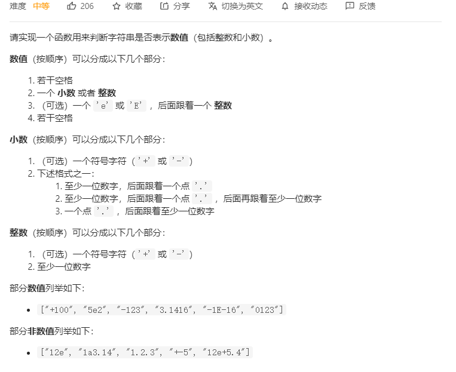

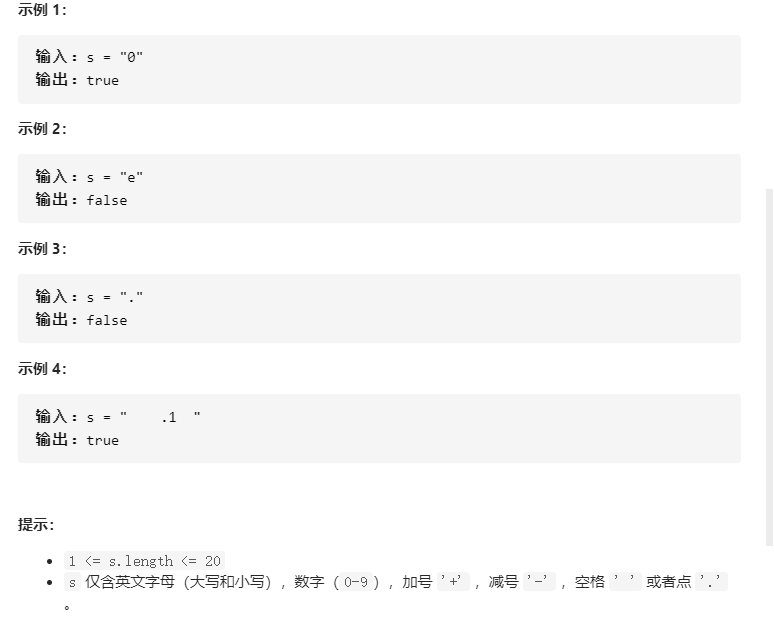

#### 思路：有穷状态自动机

我TM直接不会...先放着，看半天看不懂，时间成本较大，得闲了再说。

```c++
class Solution {
public:
    // 数字的格式可以用A[.[B]][e|EC]或者.B[e|EC]表示，
    // 其中A和C都是整数（可以有正负号，也可以没有），而B是一个无符号整数
    bool isNumber(string s) {
        if(s.size() == 0)
            return false;
        int index = 0;
        //字符串开始有空格，可以返回true
        while(s[index] == ' ')  //书中代码没有该项测试
            ++index;
        bool numeric = scanInteger(s, index);
        // 如果出现'.'，接下来是数字的小数部分
        if(s[index] == '.'){
            ++index;
            // 下面一行代码用||的原因：
            // 1. 小数可以没有整数部分，例如.123等于0.123；
            // 2. 小数点后面可以没有数字，例如233.等于233.0；
            // 3. 当然小数点前面和后面可以有数字，例如233.666
            numeric = scanUnsignedInteger(s, index) || numeric;
        }

        // 如果出现'e'或者'E'，接下来跟着的是数字的指数部分
        if(s[index] == 'e' || s[index] == 'E'){
            ++index;
            // 下面一行代码用&&的原因：
            // 1. 当e或E前面没有数字时，整个字符串不能表示数字，例如.e1、e1；
            // 2. 当e或E后面没有整数时，整个字符串不能表示数字，例如12e、12e+5.4
            numeric = numeric && scanInteger(s ,index);
        }
        //字符串结尾有空格，可以返回true
        while(s[index] == ' ')
            ++index;
        cout << s.size() << " " << index;   //调试用
        return numeric && index == s.size();
    }
private:
    // 整数的格式可以用[+|-]B表示, 其中B为无符号整数
    bool scanInteger(const string s, int& index){
        if(s[index] == '+' || s[index] == '-')
            ++index;
        return scanUnsignedInteger(s, index);
    }
    bool scanUnsignedInteger(const string s, int& index){
        int befor = index;
        while(index != s.size() && s[index] >= '0' && s[index] <= '9')
            index ++;
        return index > befor;
    }
};
```

