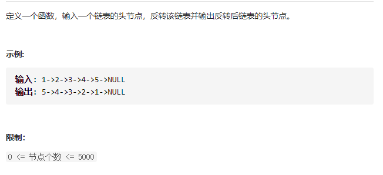

#  简单篇

[TOC]


## 1~10

### 1.[剑指 Offer 58 - II. 左旋转字符串](https://leetcode-cn.com/problems/zuo-xuan-zhuan-zi-fu-chuan-lcof/)


#### 解法1：直接使用容器

注意：容器拷贝要声明类型以及紧跟（），比如==string str(s.begin(), s.end())==

```c++
class Solution {
public:
    string reverseLeftWords(string s, int n) {
        string res = string(s.begin() + n, s.end()) + string(s.begin(), s.begin() + n);
        return res;
    }
};
```

#### 解法2	：substr

注意==substr(开始位置， 截取几个字符)==

```c++
class Solution {
public:
    string reverseLeftWords(string s, int n) {
        string s1 = s.substr(0, n); // 从下标0开始，截取n个字符，也就是到下标n-1位置    
        string s2 = s.substr(n, s.length() - n);
        return s2 + s1;
    }
};
```

#### 解法3:for循环

```c++
class Solution {
public:
    string reverseLeftWords(string s, int n) {
        string s1;
        string s2;
        for(int i = 0; i < s.length(); i++){
            if(i < n) s1.push_back(s[i]);
            else s2.push_back(s[i]);
        }
        return s2 + s1;
    }
};
```


### 2.[剑指 Offer 55 - I. 二叉树的深度](https://leetcode-cn.com/problems/er-cha-shu-de-shen-du-lcof/)


#### 解法1：递归

算出左右子树的最大深度，然后加上根节点

```c++
class Solution{
public:
    int maxDepth(TreeNode* root) {
       if(root == nullptr) return 0;
       int leftDepth = maxDepth(root->left);
       int rightDepth = maxDepth(root->right);
       return max(leftDepth, rightDepth) + 1; // 加上根节点
    }
};
```

简化版本

```c++
class Solution {
public:
    int maxDepth(TreeNode* root) {
        return root == nullptr ? 0 : max(maxDepth(root->left), maxDepth(root->right)) + 1;
    }
};
```

#### 解法2：BFS

层序遍历，一层一层遍历，到一层统计一次

```c++
class Solution {
public:
    int maxDepth(TreeNode* root) {
       if(root == nullptr) return 0;
       queue<TreeNode*> que;
       que.push(root);
       int depth = 0;
       while(!que.empty()){
           int size = que.size();
           depth++; // 每到一层就统计一次
           for(int i = 0; i < size; i++){
               TreeNode* node = que.front();
               que.pop();
               if(node->left != nullptr) que.push(node->left);
               if(node->right != nullptr) que.push(node->right);
           }
       }
       return depth;
    }
};
```


### 3.[剑指 Offer 27. 二叉树的镜像](https://leetcode-cn.com/problems/er-cha-shu-de-jing-xiang-lcof/)

跟[226. 翻转二叉树](https://leetcode-cn.com/problems/invert-binary-tree/)是一样的题，只需要==将左右子树交换==即可


#### 解法1：递归--先序后序都可以，中序不行

```c++
class Solution {
public:
    TreeNode* mirrorTree(TreeNode* root) {
        traverse(root);
        return root;
    }
private:
    void traverse(TreeNode* root){
        if(root == nullptr) return;
        swap(root->left, root->right); // 中
        traverse(root->left); // 左
        traverse(root->right); // 右
    }
};
```

#### 解法2：迭代--先序

注意：1.前序、后序的迭代使用栈时，都==需要先入栈且不判空==,在循环内部 ==中==的 处理时进行空节点判断

```c++
class Solution {
public:
    TreeNode* mirrorTree(TreeNode* root) {
        stack<TreeNode*> stk;
        stk.push(root);
        while(!stk.empty()){
            // 中
            TreeNode* cur = stk.top(); stk.pop();
            if(cur != nullptr) swap(cur->left, cur->right);
            else continue;
            // 因为栈后进先出的特性，所以先序得先让右先入栈
            stk.push(cur->right); // 右
            stk.push(cur->left); // 左
        }
        return root;
    }
};
```


### 4.[剑指 Offer 22. 链表中倒数第k个节点](https://leetcode-cn.com/problems/lian-biao-zhong-dao-shu-di-kge-jie-dian-lcof/)


#### 解法1：双指针法

复杂度：时O(1), 空O(1)

```c++
class Solution {
public:
    ListNode* getKthFromEnd(ListNode* head, int k) {
        // 双指针
        if(k < 0 || head == nullptr) return nullptr;
        ListNode* pre = head;
        ListNode* cur = head;
        // cur先走 k 步,使两个指针相差k步
        while(cur != nullptr && k--){
            cur = cur->next;
        }
        // 同时移动， cur 到达链表尾部结束
        while(pre != nullptr && cur != nullptr){
            pre = pre->next;
            cur = cur->next;
        }
        return pre;
    }
};
```

#### 解法2：计数法

先遍历一遍链表统计长度count，然后从头开始遍历count - k 步，就返回cur节点,就是倒数第k个节点

复杂度：时O(N), 空O(1)

```c++
class Solution {
public:
    ListNode* getKthFromEnd(ListNode* head, int k) {
        // 计数--时O(N)空O(1)
        if(k < 0 || head == nullptr) return nullptr;
        ListNode* cur = head;
        int count = 0;
        while(cur != nullptr){
            ++count;
            cur = cur->next;
        }
        int mv = count - k;
        cur = head;
        while(cur != nullptr && mv--){ // 一定要加上链表节点不为空的条件
            cur = cur->next;
        }
        return cur;
    }
};
```


### 5.[剑指 Offer 17. 打印从1到最大的n位数](https://leetcode-cn.com/problems/da-yin-cong-1dao-zui-da-de-nwei-shu-lcof/)


#### 解法1：pow函数

```c++
class Solution {
public:
    vector<int> printNumbers(int n) {
        vector<int> res;
        int maxValue = pow(10, n) - 1;
        for(int i = 1; i <= maxValue; i++){
            res.push_back(i);
        }
        return res;
    }
};
```

#### 解法2：不使用指数函数pow

```c++
class Solution {
public:
    vector<int> printNumbers(int n) {
        vector<int> res;
        int maxValue = 1;
        while(n)
        {
            maxValue *= 10;
            n--;
        }
        for(int i = 1; i<= maxValue-1; i++)
        {
            res.push_back(i);
        }
        return res;
    }
};
```

#### 解法3：全排列

##### [**==参考资料==**](https://leetcode-cn.com/problems/da-yin-cong-1dao-zui-da-de-nwei-shu-lcof/solution/mian-shi-ti-17-da-yin-cong-1-dao-zui-da-de-n-wei-2/)

==新知识==：当处理大数的时候，需要用字符串来递归（==有些抽象，理解时间长了些==）

注意：stoi(str) -- 将字符串转为int类型


```c++
class Solution {
public:
    vector<int> printNumbers(int n) {
        s.resize(n, '0');
        dfs(0, n); // s[0] ~ s[n - 1], s[i] 是 0 ~9 的全排列
        return res;
    }
private:
    vector<int> res;
    string s;
    void dfs(int start, int end){
        // 一个全排列完了，就开始收集结果,假如n=3, s="000"
        // 固定s[0] 0 -> 00  (01 02 ... 09)
        // 再固定s[1] 00 -> 000 001 002 003 ... 008 009
        // s[2]不用固定，因为是最后一个(n - 1)
        if(start == end){ // 当等于end(s[end]是不可能取到), 也就是说 s[0] ~ s[n - 1]已经全排列一次完成
            saver();
            return;
        }
        for(int i = 0; i <= 9; i++){
            s[start] = i + '0'; // 整数 i 转字符
            dfs(start + 1, end);
        }
    }
    void saver(){
        // 去除s中高位0, 如 003 -> 3
        int begin = 0;
        int end = s.size() - 1;
        while(begin <= end && s[begin] == '0') begin++;
        if(begin <= end){
            string tmp = s.substr(begin); // 从非0位置开始截取至末尾
            res.push_back(stoi(tmp)); //转成整数
        }
    }
};
```


#### 6.[剑指 Offer 05. 替换空格](https://leetcode-cn.com/problems/ti-huan-kong-ge-lcof/)


#### 解法1：replace函数

通用法：替换整个字符串的oldStr ==》newStr

s.replace(开始位置， 被替换长度， 替换成什么字符)

```c++
class Solution {
public:
    string replaceSpace(string s) {
        string oldStr = " ";
        string newStr = "%20";
        string::size_type pos = 0;
        while((pos = s.find(oldStr, pos)) != string::npos){
            s.replace(pos, oldStr.size(), newStr); 
            pos += newStr.size(); // 更新开始搜索位置为替换newStr后的位置（这时候才是原字符串的位置）
        }
        return s;
    }
};
```

#### 解法2：新建一个string字符串

注意：string也可以使用 s += c, 可以对字符进行 ”+“ 的操作！原先以为只有string + string才可以

```c++
class Solution {
public:
    string replaceSpace(string s) {
        string res;
        for(char str:s)
        {
            if(str == ' ') res += "%20";
            else res += str;
        }
        return res;
    }
};
```

#### 解法3：双指针法

原地修改字符串的长度，需要扩增的容量为空格字符数的两倍

然后倒序的方式，将原字符串中的字符从（新扩容）最后位置开始覆盖，分为两种情况

​	1.若不为空，则直接覆盖

​	2.若为空，则将连续的3个位置覆盖为“%20”

```c++
class Solution {
public:
    string replaceSpace(string s) {
        int count = 0;
        for(char c:s){  // 统计空格长度
            if(c == ' ') ++count;
        }
        
        int len = s.size();
        s.resize(len + 2 * count); // 空格替换为%20, 新增两个长度
        
        for(int i = len - 1, j = s.size() - 1; j > i; i--){
            if(s[i] != ' '){
                s[j] = s[i];
                j--;
            }
            else{
                s[j - 2] = '%';
                s[j - 1] = '2';
                s[j] = '0';
                j -= 3;
            }
        }
        return s;
    }
};
```


### 7.[剑指 Offer 06. 从尾到头打印链表](https://leetcode-cn.com/problems/cong-wei-dao-tou-da-yin-lian-biao-lcof/)


#### 解法1：vector数组

先遍历链表，同时存到数组中，再反转数组。

reverse时间复杂度O(n), 整体时O(n), 空O(1)，因为数组是需要返回的结果，不属于算法开销

```c++
class Solution {
public:
    vector<int> reversePrint(ListNode* head) {
        ListNode* cur = head;
        vector<int> res;
        if(cur == nullptr) return res;
        
        while(cur != nullptr){
            res.push_back(cur->val);
            cur = cur->next;
        }

        reverse(res.begin(), res.end()); // 这个reverse是返回空的
        return res;
    }
};
```

#### 解法2：反转链表法

先反转链表，然后放入数组

时O(n) ,空O(1)

```c++
class Solution {
public:
    vector<int> reversePrint(ListNode* head) {
        if(head == nullptr) return {};
        // 反转链表
        ListNode* pre = nullptr;
        ListNode* cur = head;
        while(cur != nullptr){
            ListNode* tmp = cur->next;
            cur->next = pre;
            pre = cur;
            cur = tmp;
        }
        // 添加结果
        cur = pre;
        vector<int> res;
        while(cur != nullptr){
            res.push_back(cur->val);
            cur = cur->next;
        }     
        return res;
    }
};
```

#### 解法3：辅助栈

根据栈的“后进先出”的特点，将全部链表进栈后，再弹出即可

注意：凡是遇到==顺序（容器）类反转的问题==，都可以考虑用栈来做，比如反转链表，反转字符串

时O(n) ，空O(n)

```c++
class Solution {
public:
    vector<int> reversePrint(ListNode* head) {
        if(head == nullptr) return {};
        stack<int> stk;
        vector<int> res;
        ListNode* cur = head;
        while(cur != nullptr){
            stk.push(cur->val);
            cur = cur->next;
        }  
        while(!stk.empty()){
            int tmp = stk.top(); stk.pop();
            res.push_back(tmp);
        }   
        return res;
    }
};
```


### 8.[剑指 Offer 54. 二叉搜索树的第k大节点](https://leetcode-cn.com/problems/er-cha-sou-suo-shu-de-di-kda-jie-dian-lcof/)


==二叉搜索树(BST)==最大的特点就是有序，中序遍历还是升序，一定要利用好这一特点！

这里是求第k大，所以反中序：右 中 左，就是降序。

#### 解法1：DFS--辅助vector

利用中序遍历的方法，收集结果，vector默认是升序，取第k大的数需要从后开始取

借助了vector,所以空O(n), 递归调用了n个系统栈，所以时O(n)

```c++
class Solution {
public:
    int kthLargest(TreeNode* root, int k) {
        traverse(root);
        int size = res.size();
        return res[size - k];
    }
private:
    vector<int> res;
    void traverse(TreeNode* node){
        if(node == nullptr) return;
        traverse(node->left);
        res.push_back(node->val);
        traverse(node->right);
    }
};
```

#### 解法2：DFS--不借助辅助vector

引入count来统计次数，达到k次即返回结果

注意：这个count要传入引用，吃了大亏了。

时间：O(n)，若是树退化为链表（右子树全为空或者左子树全为空）,递归调用n个系统栈

空间：O(1)

```c++
class Solution {
public:
    int kthLargest(TreeNode* root, int k) {
        int count = 0;
        traverse(root, k, count);
        return res;
    }
private:
    int res = INT_MIN;
    void traverse(TreeNode* node, int k, int& count){
        if(node == nullptr) return;
        traverse(node->right, k, count); // 右
        // 中
        count += 1;
        if(count == k){
            res = node->val;
            return;
        }  
        traverse(node->left, k, count);  // 左
    }
};
```

迭代版本如下：

```c++
class Solution {
public:
    int kthLargest(TreeNode* root, int k) {
        stack<TreeNode*> stk;
        TreeNode* cur = root;
        int res = INT_MAX;
        int count = 0;
        while(cur != nullptr || !stk.empty()){
                // 右
            if(cur != nullptr){ 
                stk.push(cur);
                cur = cur->right;
            }else{
                // 中
                cur = stk.top(); stk.pop();
                count += 1;
                if(count == k){
                    res = cur->val;
                    break;
                }
                // 左
                cur = cur->left;
            }
        }
        return res;
    }
};
```


### 9.[剑指 Offer 24. 反转链表](https://leetcode-cn.com/problems/fan-zhuan-lian-biao-lcof/)



#### 解法1:迭代法

一个pre指向前一个节点，cur指向当前节点，tmp指向当前节点的下一个节点

当cur不为空时，先保存cur的下一个节点到tmp, 然后反转pre、cur,然后pre指向cur,cur指向tmp

```c++
class Solution {
public:
    ListNode* reverseList(ListNode* head) {
        ListNode* pre = nullptr;
        ListNode* cur = head;
        while(cur != nullptr){
            ListNode* tmp = cur->next;
            cur->next = pre;
            pre = cur;
            cur = tmp;
        }
        return pre;
    }
};
```

#### 解法2：辅助栈

跟[剑指 Offer 06. 从尾到头打印链表](https://leetcode-cn.com/problems/cong-wei-dao-tou-da-yin-lian-biao-lcof/)是一样的，应用栈的“先进后出的性质”

注意注释部分，要让==尾后节点指向空==，不然形成环会溢出！！

时间：O(n)

空间：O(n), 借用一个辅助栈

```c++
class Solution {
public:
    ListNode* reverseList(ListNode* head) {
        ListNode* cur = head;
        stack<ListNode*> stk;
        while(cur != nullptr){
            stk.push(cur);
            cur = cur->next;
        }
        ListNode* demmy = new ListNode(0);
        demmy->next = nullptr;
        ListNode* res = demmy;
        while(!stk.empty()){
            ListNode* tmp = stk.top(); stk.pop();
            demmy->next = tmp;
            demmy = demmy->next;
        }
        // 因为此时的demmy指向的是第一个节点，必须让它的下一个节点指向空，不然会成环
        demmy->next = nullptr; 
        return res->next;
    }
};
```

#### 解法3：辅助数组

思想跟辅助栈差不多，只是将数组倒序遍历模拟栈的操作

时间：O(n)

空间：O(n), 借用一个辅助数组

```c++
class Solution {
public:
    ListNode* reverseList(ListNode* head) {
        ListNode* cur = head;
        vector<ListNode*> v;
        while(cur != nullptr){
            v.push_back(cur);
            cur = cur->next;
        }
        ListNode* demmy = new ListNode(0);
        demmy->next = nullptr;
        ListNode* res = demmy;
        for(int i = v.size() - 1; i >= 0; i--){
            ListNode* tmp = v[i];
            demmy->next = tmp;
            demmy = demmy->next;
        }
        // 因为此时的demmy指向的是第一个节点，必须让它的下一个节点指向空，不然会成环
        demmy->next = nullptr; 
        return res->next;
    }
};
```


### 10.[剑指 Offer 15. 二进制中1的个数](https://leetcode-cn.com/problems/er-jin-zhi-zhong-1de-ge-shu-lcof/)


#### 解法1：n & 1

参考[Krahets](https://leetcode-cn.com/problems/er-jin-zhi-zhong-1de-ge-shu-lcof/solution/mian-shi-ti-15-er-jin-zhi-zhong-1de-ge-shu-wei-yun/)

n & 1可以判断最右边的位的情况

​	==1， 最右边为1

​	==0，最右边为0


```c++
class Solution {
public:
    int hammingWeight(uint32_t n) {
        int count = 0;
        while(n != 0){
            int lstRight = n & 1; // 看最右一位是 0 是 1
            if(lstRight == 1) count += lstRight;
            // 上面两行也可以简化为: count += (n & 1);
            n >>= 1;
        }
        return count;
    }
};
```

#### 解法2： n & (n - 1)

n& (n - 1)每次消去最右边的1

```c++
class Solution {
public:
    int hammingWeight(uint32_t n) {
        int count = 0;
        while(n != 0){
            count++;
            n = n & (n - 1);
        }
        return count;
    }
};
```

