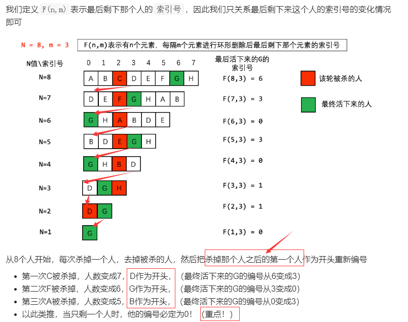
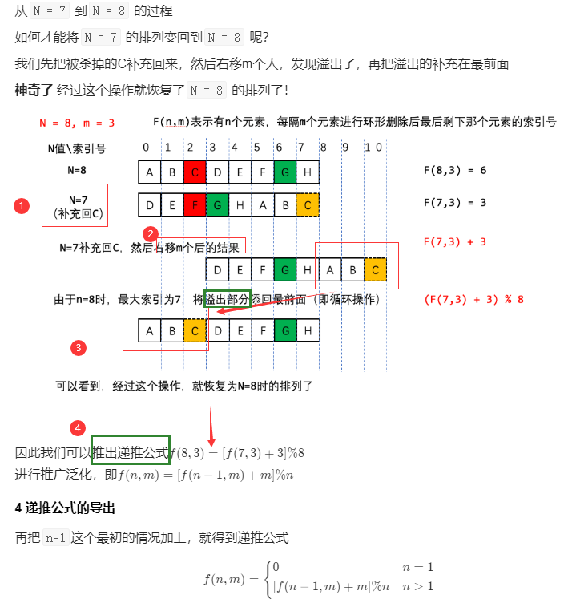

# 简单篇

## 11-20

### 11.[剑指 Offer 25. 合并两个排序的链表](https://leetcode-cn.com/problems/he-bing-liang-ge-pai-xu-de-lian-biao-lcof/)

#### 解法1：新建链表串联两个链表节点

1.当两个链表都不为空的时候，head的下一个指针指向==节点值更小==的节点

2.当两个链表不为空遍历完，head的下一个指针该指向哪个节点？

当然是优先指向非空的节点！！！怎么判断非空呢？

只需要判断其中一条链表是否为空即可！比如链表1为空，那么就==优先==指向链表2

```c++
class Solution {
public:
    ListNode* mergeTwoLists(ListNode* l1, ListNode* l2) {
        ListNode* head = new ListNode(0);
        ListNode* res = head;
        while(l1 != nullptr && l2 != nullptr){
            // head->next优先指向节点值更小的点
            if(l1->val < l2->val){  
                head->next = l1;
                l1 = l1->next;
            }else{
                head->next = l2;
                l2 = l2->next;
            }
            head = head->next;
        }
        // 假如l1 或者 l2 有一个还未空，则head的下一个应该指向非空的那个
        head->next = (l1 == nullptr) ? l2 : l1;
        return res->next;
    }
};
```

#### 解法2：递归

这里返回条件比较难想，可以从重叠子问题思想来思考，即选好了一个小的节点，那么下一次要合并的是不是它的下一个节点跟另一个链表的合并问题？

```c++
class Solution {
public:
    ListNode* mergeTwoLists(ListNode* l1, ListNode* l2) {
        if(l1 == nullptr) return l2;
        if(l2 == nullptr) return l1;
        if(l1->val < l2->val){
            // 让更小的成为头节点，并让更小的下一个节点跟另一个链表去合并
            l1->next = mergeTwoLists(l1->next, l2); 
            return l1;  // 返回更小的节点
        }else{
            l2->next = mergeTwoLists(l1, l2->next);
            return l2;
        }
    }
};
```

### 12.[剑指 Offer 09. 用两个栈实现队列](https://leetcode-cn.com/problems/yong-liang-ge-zhan-shi-xian-dui-lie-lcof/)

本题是简单的逻辑模拟

两个栈，一个栈stk1用来添加，另一个stk2用来删除

注意，只有当两个栈同时为空，才不能删除，当stk2不为空，直接pop就可以

```c++
class CQueue {
public:
    CQueue() {

    }
    
    void appendTail(int value) {
        stk1.push(value);
    }
    
    int deleteHead() {
        if(stk1.empty() && stk2.empty()) return -1;
        int tmp;
        if(stk2.empty()){
            while(!stk1.empty()){
                int tmp = stk1.top(); stk1.pop();
                stk2.push(tmp);
            }
        }
        tmp = stk2.top();
        stk2.pop();
        return tmp;
    }
private:
    stack<int> stk1;
    stack<int> stk2;
};
```

### 13.[剑指 Offer 57 - II. 和为s的连续正数序列](https://leetcode-cn.com/problems/he-wei-sde-lian-xu-zheng-shu-xu-lie-lcof/)

#### 解法1：公式法

一段连续数字 i, i+1, i+2, ..., j-1, j的和等于 (i + j)(j - i + 1)/2，如

1 2 ... 98 99的和等于 (1 + 99)(99 - 1 + 1)/2 = 100 * 99 = 9900

题目：target = (i + j)(j - i + 1)/2, target,i已知，求j

解一元二次方程：j
$$
j^2 + j + i - i^2 - 2target = 0
$$
得解
$$
j = (-1 +sqrt(1 - (4(i - i^2 - 2target)))/{2}
$$
j是一个浮点数，题目要求序列长度至少为2，所以j初始化为2.循环条件i < j，这样可以保证至少含有两个数（当i,j是相邻两个数的时候）

题目要求的是整数，所以判断double类型的j取整后的j是否等于原来的（**细节：**这里会将左边整型自动转成double来跟右值对比）

```c++
class Solution {
public:
    vector<vector<int>> findContinuousSequence(int target) {
        int i = 1;
        double j = 2.0;
        vector<vector<int>> res;
        while(i < j){
            j = (-1 + sqrt(1 + 4 * (2 * target + (long long)i * i - i) ) ) / 2;
            if(j == (int) j){ // (int) j 是个整数，然后强转成跟右值一样的类型
                vector<int> tmp;
                for(int k = i; k <= j; k++) tmp.push_back(k);
                res.push_back(tmp);
            }
            i++;
        }
        return res;
    }
};
```

#### 解法2：双指针法(滑动窗口)

滑动窗口，就是根据左右两个边界的变换，进行滑动。

窗口内的和sum与target关系分为3种情况：

1. sum == target ,那么可以收集起来，同时把窗口最左去掉，以便找后面是否还有
2. sum > target，那么要缩减左边界，sum先更新，再更新左边界向右移动
3. sum < target，那么要扩张右边界，先扩张，再更新sum

```c++
class Solution {
public:
    vector<vector<int>> findContinuousSequence(int target) {
        int i = 1; // 左边界
        int j = 2; // 右边界
        int sum = 3; // 窗口内的和
        vector<vector<int>> res;
        while(i < j){ // 保证窗口至少两个数字
            if(sum == target){
                vector<int> tmp;
                for(int k = i; k <= j; k++) tmp.push_back(k);
                res.push_back(tmp);
            }
            if(sum >= target){ // 等于的时候，也要去掉最左，为了找后面是否还有满足的序列
                			  //  窗口的值大了，去掉左边界最左
                sum -= i;
                i++;
            }else{
                // 窗口的和还少，加大右边界  
                // 注意跟sum > target里面sum、i、j的更新顺序不一样的    
                j++;
                sum += j;
            }
        }
        return res;
    }
};
```

### 14.[剑指 Offer 68 - II. 二叉树的最近公共祖先](https://leetcode-cn.com/problems/er-cha-shu-de-zui-jin-gong-gong-zu-xian-lcof/)

递归终止条件的后两个可能会遗漏，当root为其中一个节点时，无疑它就是那个最近的祖先

然后递归的话就是去左右子树找，看是否可以找到两个节点，若某一子树找到两个节点，则返回这个子树节点。

若左右两个子树都能找到，说明子树的公共节点就是root

```c++
class Solution {
public:
    TreeNode* lowestCommonAncestor(TreeNode* root, TreeNode* p, TreeNode* q) {
        if(root == nullptr || root == p || root == q) return root;
        TreeNode* left = lowestCommonAncestor(root->left, p, q);
        TreeNode* right = lowestCommonAncestor(root->right, p, q);
        if(left == nullptr && right == nullptr) return nullptr;
        else if(left != nullptr && right == nullptr) return left;
        else if(left == nullptr && right != nullptr) return right;
        return root;
    }
};
```

### 15.[剑指 Offer 68 - I. 二叉搜索树的最近公共祖先](https://leetcode-cn.com/problems/er-cha-sou-suo-shu-de-zui-jin-gong-gong-zu-xian-lcof/)

 利用BST有序特性，节点值大于左孩子值的小于右孩子值，

1.  往一个节点cur看它的孩子中是否存在节点p、q,分几种情况：
2.  当前节点值若**都小于**p、q值,而BST中当前左孩子值小于当前值，显然，左孩子中不可能存在节点p、q,应该往当前节点的右边去找。
3.  当前节点值若**都大于**p、q值,...
4.  当前节点值一个小于p,一个大于q或者一个小于q,一个大于p,说明这个节点即为最近公共祖先

这里有序，就是在递归前，选择左右哪个分支去递归，二选一，效率是普通二叉树的2倍！

```c++
class Solution {
public:
    TreeNode* lowestCommonAncestor(TreeNode* root, TreeNode* p, TreeNode* q) {
        if(root == nullptr || root == p || root == q) return root;
        if(p->val < root->val && q->val < root->val) return lowestCommonAncestor(root->left, p, q);
        if(p->val > root->val && q->val > root->val) return lowestCommonAncestor(root->right, p, q);
        return root;
    }
};
```

找到了就可以立即返回了，当然也可以按照普通二叉树的写法，如下：

```c++
class Solution {
public:
    TreeNode* lowestCommonAncestor(TreeNode* root, TreeNode* p, TreeNode* q) {
        if(root == nullptr || root == p || root == q) return root;
        if(p->val < root->val && q->val < root->val){
            TreeNode* left =  lowestCommonAncestor(root->left, p, q);
            return left;
        }
        if(p->val > root->val && q->val > root->val){
            TreeNode* right = lowestCommonAncestor(root->right, p, q);
            return right;
        }
        return root;
    }
};
```

### 16.[剑指 Offer 39. 数组中出现次数超过一半的数字](https://leetcode-cn.com/problems/shu-zu-zhong-chu-xian-ci-shu-chao-guo-yi-ban-de-shu-zi-lcof/)

#### 解法1：暴力法

先排序

最差的情况下，重复的那个数在数组最后，那么时间复杂度为O(N),空间O(1)

```c++
class Solution {
public:
    int majorityElement(vector<int>& nums) {
        if(nums.size() == 1) return nums[0];
        int size = nums.size();
        sort(nums.begin(), nums.end());
        int count = 1;
        int res = 0;
        for(int i = 0; i < nums.size() - 1; i++){
            if(nums[i] == nums[i + 1]){
                count++;
            }
            if(nums[i] != nums[i + 1]){         
                count = 1;
            }
            if(count > size / 2){
                res = nums[i];
                break;
            }
        }
        return res;
    }
};
```

**其实返回排序后数组的中点即可**

```c++
class Solution {
public:
    int majorityElement(vector<int>& nums) {
        sort(nums.begin(), nums.end());
        return nums[nums.size() / 2];
    }
};
```


#### 解法2：unordered_map

遍历数组，记录每个数字对应的频率，当频率大于数组一半就返回。

unordered_map效率很高，插入删除查询时间复杂度都是O(1),但由于要遍历整个数组，所以整体时间复杂度是O(N),空间复杂度O(N)

```c++
class Solution {
public:
    int majorityElement(vector<int>& nums) {
        int size = nums.size();
        if(size == 1) return nums[0];
        unordered_map<int, int> m;
        for(auto n:nums){
            m[n]++;
            if(m[n] > size / 2) return n;
        }
        return 0;
    }
};
```

#### 解法3：摩尔投票法

[参考Krahets](https://leetcode-cn.com/problems/shu-zu-zhong-chu-xian-ci-shu-chao-guo-yi-ban-de-shu-zi-lcof/solution/mian-shi-ti-39-shu-zu-zhong-chu-xian-ci-shu-chao-3/)

摩尔投票法解决的是数组中众数超过一半的问题，通过相邻不同碰撞消去，那么最终剩下的就会是众数。

时间：O(N)，空间O(1)

```c++
class Solution {
public:
    int majorityElement(vector<int>& nums) {
       int x = 0, vote = 0;
       for(auto num:nums){
           if(vote == 0) x = num; //擂台上（众数）没有人，则把当前的num上台，成为擂主x
           vote += (num == x ? 1 : -1); // 当擂台有人，则判断当前可能要上台的人num是否跟擂主同一组，若同则擂主组员人数加一，否则擂主组员人数减一
       }
       return x;
    }
};
```

### 17.[剑指 Offer 32 - II. 从上到下打印二叉树 II](https://leetcode-cn.com/problems/cong-shang-dao-xia-da-yin-er-cha-shu-ii-lcof/)

#### 解法1：BFS

vector的clear函数的时间复杂度为O(N),需要遍历整颗树，所以整体时间复杂度O(N)

res是要返回的内容，不属于算法空间开销，算法用到了一个队列，一个vector（level每层用完会清空），所以空间复杂度是O(N)

```c++
class Solution {
public:
    vector<vector<int>> levelOrder(TreeNode* root) {
        if(root == nullptr) return {};
        vector<vector<int>> res;
        vector<int> level;
        queue<TreeNode*> que;
        que.push(root);
        while(!que.empty()){
            int size = que.size();
            for(int i = 0; i < size; i++){
                TreeNode* node = que.front(); que.pop();
                level.push_back(node->val);
                if(node->left != nullptr) que.push(node->left);
                if(node->right != nullptr) que.push(node->right);
            }
            res.push_back(level);
            level.clear();
        }
        return res;
    }
};
```

### 18.[剑指 Offer 03. 数组中重复的数字](https://leetcode-cn.com/problems/shu-zu-zhong-zhong-fu-de-shu-zi-lcof/)

#### 解法1：unordered_map

关于频率的问题，首先要想到的是哈希表。如果不要求key有序，则首先考虑unordered_map，因为效率高！

```c++
class Solution {
public:
    int findRepeatNumber(vector<int>& nums) {
        unordered_map<int, int> m;
        int res = -1;
        for(auto n:nums){
            m[n]++;
            if(m[n] > 1){
                res = n;
                break;
            }
        }
        return res;
    }
};
```

#### 解法2：原地交换

[参考Krahets](https://leetcode-cn.com/problems/shu-zu-zhong-zhong-fu-de-shu-zi-lcof/solution/mian-shi-ti-03-shu-zu-zhong-zhong-fu-de-shu-zi-yua/)

还蛮不好理解的

```c++
class Solution {
public:
    int findRepeatNumber(vector<int>& nums) {
        int i = 0;
        while(i < nums.size()){
            // 从头开始遍历，先看当前 i位置上的值是否符合 i = nums[i]
            // 符合则说明这个在正确的位置上，跳过
            if(i == nums[i]){
                i++;
                continue;
            }else{
                if(nums[i] == nums[nums[i]]){ // 说明重复了，比如 i = 0, nums[i] = nums[0], 若nums[i] = 1, nums[nums[i]] = nums[1], 
                    						 //若nums [nums[i]]也等于1，那么nums[0] = nums[1] = 1,说明元素1重复
                    return nums[i];
                    break;
                }else{
                    swap(nums[i], nums[nums[i]]);
                }
            }
        }
        return -1;
    }
};
```

### 19.[剑指 Offer 57. 和为s的两个数字](https://leetcode-cn.com/problems/he-wei-sde-liang-ge-shu-zi-lcof/)

#### 解法1：unordered_set

遍历数组，先判断如果set中有target - n，就说明找到一组

```c++
class Solution {
public:
    vector<int> twoSum(vector<int>& nums, int target) {
        unordered_set<int> myset;
        for(auto n:nums){
            if(myset.count(target - n) != 0){
                return {n, target - n};
            }
            myset.insert(n);
        }
        return {-1, -1};
    }
};
```

#### 解法2：二分查找

题目中若是提到了有序的，那么可以考虑二分法来搜索。

```c++
class Solution {
public:
    vector<int> twoSum(vector<int>& nums, int target) {
        for(int i = 0; i < nums.size(); i++){
            if(binarySearch(nums, i + 1, nums.size() - 1, target - nums[i])){
                return {nums[i], target - nums[i]};
            }
        }
        return {};
    }
private:
    bool binarySearch(vector<int>& nums, int l, int r, int target){
        while(l <= r){
            int m = l + (r - l)/2;
            if(target == nums[m]) return true;
            else if(target > nums[m]) l = m + 1;
            else r = m - 1;
        }
        return false;
    }
};
```

当然也可以使用C++ STL标准库binary_search函数

binary_search（搜索开始范围， 结束范围， 搜索target）

```c++
class Solution {
public:
    // 二分法
    vector<int> twoSum(vector<int>& nums, int target) {
       for(int i = 0; i < nums.size(); i++){
           if(binary_search(nums.begin() + i + 1, nums.end(), target - nums[i])){
               return vector<int> {nums[i], target - nums[i]};
           }
       }
       return {};
    }
};
```

#### 解法3：双指针法

这个写法很像二分法，只不过target不是跟中间值比较，而是跟左右的和比较！

跟[剑指 Offer 57 - II. 和为s的连续正数序列](https://leetcode-cn.com/problems/he-wei-sde-lian-xu-zheng-shu-xu-lie-lcof/)有些像，但是57题的滑动窗口得是**连续的**！

```c++
class Solution {
public:
    vector<int> twoSum(vector<int>& nums, int target) {
        int l = 0, r = nums.size() - 1;
        while(l < r){ // 因为是两个数，所以不能取等
            int sum = nums[l] + nums[r];
            if(sum == target) return {nums[l], nums[r]};
            else if(sum > target) r--;
            else if(sum < target) l++;
        }
        return {};
    }
};
```

### 20.[剑指 Offer 62. 圆圈中最后剩下的数字](https://leetcode-cn.com/problems/yuan-quan-zhong-zui-hou-sheng-xia-de-shu-zi-lcof/)

本题是约瑟夫环问题

[^约瑟夫环]: N个人围成一圈，第一个人从1开始报数，报M的将被杀掉，下一个人接着从1开始报。如此反复，最后剩下一个，求最后的胜利者。

[参考COOLUCAS](https://leetcode-cn.com/problems/yuan-quan-zhong-zui-hou-sheng-xia-de-shu-zi-lcof/solution/huan-ge-jiao-du-ju-li-jie-jue-yue-se-fu-huan-by-as/)，提到只关注最终活着的人的编号！看两幅图：

N从大到小



反推



代码如下：

```c++
class Solution {
public:
    int lastRemaining(int n, int m) {
        int survivorIndex = 0; //只有一个人的时候，存活下来的人的下标一定是0
        for(int person = 2; person <= n; person++){ // 2~n个人活下来的人的下标
            survivorIndex = (survivorIndex + m) % person;
        }
        return survivorIndex;
    }
};
```

