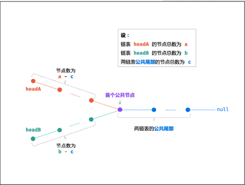

# 简单篇

## 21~30

### 21.[剑指 Offer 21. 调整数组顺序使奇数位于偶数前面](https://leetcode-cn.com/problems/diao-zheng-shu-zu-shun-xu-shi-qi-shu-wei-yu-ou-shu-qian-mian-lcof/)

#### 解法1：暴力法

直接遍历，将奇数偶数放到不同的数组保存，然后合并

```c++
class Solution {
public:
    vector<int> exchange(vector<int>& nums) {
        vector<int> q, o;
        for(int i = 0; i < nums.size(); i++){
            if(nums[i] & 1) q.push_back(nums[i]);
            else o.push_back(nums[i]);
        }
        vector<int> res(q.begin(), q.end());
        for(auto n:o) res.push_back(n);
        return res;
    }
};
```

#### 解法2：双指针法

```c++
class Solution {
public:
    vector<int> exchange(vector<int>& nums) {
        int i = 0, j = nums.size() - 1;
        while(i < j){
            while(i < j && (nums[j] & 1) == 0) j--; // 往左，直到遇到奇数
            while(i < j && (nums[i] & 1) == 1) i++; // 往右，直到遇到偶数
            swap(nums[i], nums[j]);
        }
        return nums;
    }
};
```

#### 解法3：快慢指针

slow标志当前奇数位最后一位，如[0, slow]都是奇数

fast往前移动，遇到奇数就交换给nums[slow]

```c++
class Solution {
public:
    vector<int> exchange(vector<int>& nums) {
        int slow = 0, fast = 0;
        while(fast < nums.size()){
            if(nums[fast] & 1){
                swap(nums[slow], nums[fast]);
                slow++;
            }
            fast++;
        }
        return nums;
    }
};
```

### 22.[剑指 Offer 52. 两个链表的第一个公共节点](https://leetcode-cn.com/problems/liang-ge-lian-biao-de-di-yi-ge-gong-gong-jie-dian-lcof/)

#### 解法1：差值步

```c++
class Solution {
public:
    ListNode *getIntersectionNode(ListNode *headA, ListNode *headB) {
        if(headA == nullptr || headB == nullptr) return nullptr;
        ListNode* c1 = headA;
        ListNode* c2 = headB;
        int count1 = 0, count2 = 0;
        // 1.分别统计两条链表的长度
        while(c1 != nullptr){
            ++count1;
            c1 = c1->next;
        }
        while(c2 != nullptr){
            ++count2;
            c2 = c2->next;
        }
        c1 = (count1 >= count2) ? headA : headB; // c1指向更长的那条链表
        c2 = (c1 == headA) ? headB : headA; // c2指向更短的那条链表
        // 2.让更长的链表先走 差值步
        int subValue = abs(count1 - count2); 
        while(c1 != nullptr && subValue--){
            c1 = c1->next;
        }
        while(c1 != nullptr && c2 != nullptr){
            if(c1 == c2) return c1;
            c1 = c1->next;
            c2 = c2->next;
        }
        return nullptr;
    }
};
```

#### 解法2：双指针

[参考Krahets](https://leetcode-cn.com/problems/liang-ge-lian-biao-de-di-yi-ge-gong-gong-jie-dian-lcof/solution/jian-zhi-offer-52-liang-ge-lian-biao-de-gcruu/)

假设链表headA长度为a, headB长度为b，它们公共的长度为c

那么**非共同**的长度分别为： a - c 、b - c

那么让A先走完headA,然后再走headB，那么总长度 a + (b - c)

那么让B先走完headB,然后再走headA，那么总长度 b + (a - c)

这样不就相遇了？返回此时节点即可



```c++
class Solution {
public:
    ListNode *getIntersectionNode(ListNode *headA, ListNode *headB) {
        ListNode* A = headA;
        ListNode* B = headB;
        while(A != B){
            A = (A != nullptr) ? A->next : headB;
            B = (B != nullptr) ? B->next : headA;
        }
        return A;
    }
};
```

### 23.[剑指 Offer 50. 第一个只出现一次的字符](https://leetcode-cn.com/problems/di-yi-ge-zhi-chu-xian-yi-ci-de-zi-fu-lcof/)

