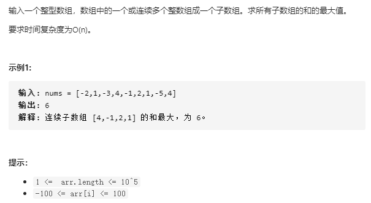
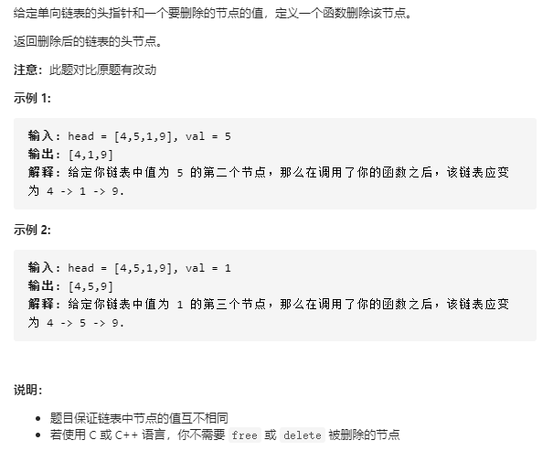
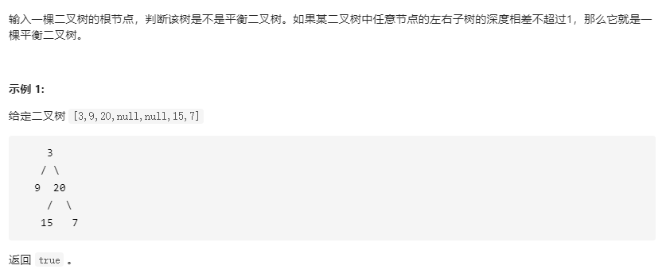
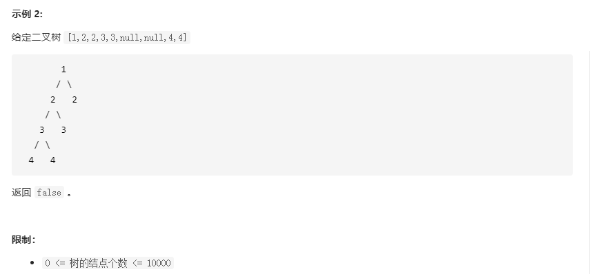
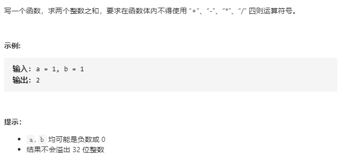
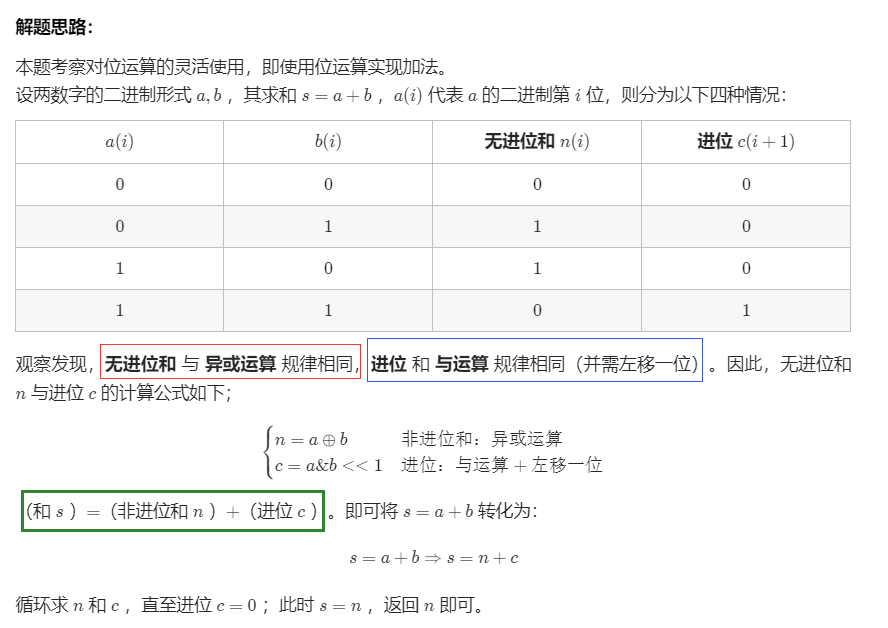
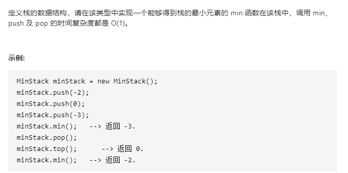
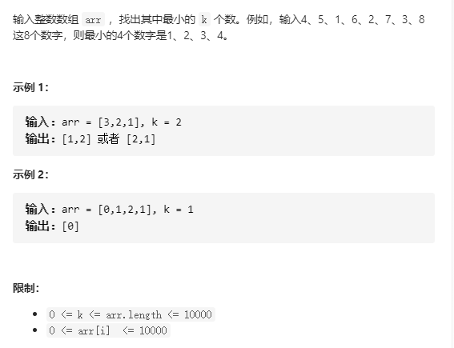

# 简单篇

## 21~30

### 21.[剑指 Offer 21. 调整数组顺序使奇数位于偶数前面](https://leetcode-cn.com/problems/diao-zheng-shu-zu-shun-xu-shi-qi-shu-wei-yu-ou-shu-qian-mian-lcof/)

#### 解法1：暴力法

直接遍历，将奇数偶数放到不同的数组保存，然后合并

```c++
class Solution {
public:
    vector<int> exchange(vector<int>& nums) {
        vector<int> q, o;
        for(int i = 0; i < nums.size(); i++){
            if(nums[i] & 1) q.push_back(nums[i]);
            else o.push_back(nums[i]);
        }
        vector<int> res(q.begin(), q.end());
        for(auto n:o) res.push_back(n);
        return res;
    }
};
```

#### 解法2：双指针法

```c++
class Solution {
public:
    vector<int> exchange(vector<int>& nums) {
        int i = 0, j = nums.size() - 1;
        while(i < j){
            while(i < j && (nums[j] & 1) == 0) j--; // 往左，直到遇到奇数
            while(i < j && (nums[i] & 1) == 1) i++; // 往右，直到遇到偶数
            swap(nums[i], nums[j]);
        }
        return nums;
    }
};
```

#### 解法3：快慢指针

slow标志当前奇数位最后一位，如[0, slow]都是奇数

fast往前移动，遇到奇数就交换给nums[slow]

```c++
class Solution {
public:
    vector<int> exchange(vector<int>& nums) {
        int slow = 0, fast = 0;
        while(fast < nums.size()){
            if(nums[fast] & 1){
                swap(nums[slow], nums[fast]);
                slow++;
            }
            fast++;
        }
        return nums;
    }
};
```


### 22.[剑指 Offer 52. 两个链表的第一个公共节点](https://leetcode-cn.com/problems/liang-ge-lian-biao-de-di-yi-ge-gong-gong-jie-dian-lcof/)

#### 解法1：差值步

```c++
class Solution {
public:
    ListNode *getIntersectionNode(ListNode *headA, ListNode *headB) {
        if(headA == nullptr || headB == nullptr) return nullptr;
        ListNode* c1 = headA;
        ListNode* c2 = headB;
        int count1 = 0, count2 = 0;
        // 1.分别统计两条链表的长度
        while(c1 != nullptr){
            ++count1;
            c1 = c1->next;
        }
        while(c2 != nullptr){
            ++count2;
            c2 = c2->next;
        }
        c1 = (count1 >= count2) ? headA : headB; // c1指向更长的那条链表
        c2 = (c1 == headA) ? headB : headA; // c2指向更短的那条链表
        // 2.让更长的链表先走 差值步
        int subValue = abs(count1 - count2); 
        while(c1 != nullptr && subValue--){
            c1 = c1->next;
        }
        while(c1 != nullptr && c2 != nullptr){
            if(c1 == c2) return c1;
            c1 = c1->next;
            c2 = c2->next;
        }
        return nullptr;
    }
};
```

#### 解法2：双指针

[参考Krahets](https://leetcode-cn.com/problems/liang-ge-lian-biao-de-di-yi-ge-gong-gong-jie-dian-lcof/solution/jian-zhi-offer-52-liang-ge-lian-biao-de-gcruu/)

假设链表headA长度为a, headB长度为b，它们公共的长度为c

那么**非共同**的长度分别为： a - c 、b - c

那么让A先走完headA,然后再走headB，那么总长度 a + (b - c)

那么让B先走完headB,然后再走headA，那么总长度 b + (a - c)

这样不就相遇了？返回此时节点即可


```c++
class Solution {
public:
    ListNode *getIntersectionNode(ListNode *headA, ListNode *headB) {
        ListNode* A = headA;
        ListNode* B = headB;
        while(A != B){
            A = (A != nullptr) ? A->next : headB;
            B = (B != nullptr) ? B->next : headA;
        }
        return A;
    }
};
```


### 23.[剑指 Offer 50. 第一个只出现一次的字符](https://leetcode-cn.com/problems/di-yi-ge-zhi-chu-xian-yi-ci-de-zi-fu-lcof/)

#### 解法1：哈希表

借助unordered_map统计每个单词频率，然后从前往后遍历，第一个频率为 1 的单词即为结果

时间：O(N)

空间：O(N)

```c++
class Solution {
public:
    char firstUniqChar(string s) {
        unordered_map<char, int> m;
        for(char c:s) m[c]++; // 统计每个词频率
        char res = ' ';
        for(int i = 0; i < s.size(); i++){
            if(m[s[i]] == 1){ // 遇到第一个频率为1的就是结果
                res = s[i]; 
                break;
            }
        }
        return res;
    }
};
```

#### 解法2：数组哈希

因为题目提到，s都是小写字母，所以可以考虑用数组来做这个哈希映射。

时间：O(N)

空间：O(1)，因为是常量数组

```c++
class Solution {
public:
    char firstUniqChar(string s) {
        int m[26] = {0};
        for(char c:s) m[c - 'a']++;
        char res = ' ';
        for(int i = 0; i < s.size(); i++){
            if(m[s[i] - 'a'] == 1){
                res = s[i];
                break;
            }
        }
        return res;
    }
};
```


### 24.[剑指 Offer 42. 连续子数组的最大和](https://leetcode-cn.com/problems/lian-xu-zi-shu-zu-de-zui-da-he-lcof/)



#### 解法1：动态规划

dp[i] -- 到达位置 i 时，所得到的最大和为 dp[i]

递推方程：dp[i]取决于前一个对当前的贡献是正还是负，即

​							**dp[i] = (dp[i - 1] > 0) ? dp[i - 1] + nums[i] : nums[i]**
$$
dp[i]=\left\{ 
\begin{aligned} 
 dp[i - 1] + nums[i],\ dp[i - 1] >= 0 \\ 
 nums[i],\ dp[i - 1] < 0
\end{aligned} 
\right.
$$

```c++
class Solution {
public:
    int maxSubArray(vector<int>& nums) {
        // 看前一个对当前的贡献 是正还是负，是负就舍弃
        // dp[i] = (dp[i - 1] > 0) ? dp[i - 1] + nums[i] : nums[i]
        int pre = 0; // 前一个最大和
        int cur = 0; // 现在一个最大和
        int res = INT_MIN; // 所有最大和的最大值
        for(int i = 0; i < nums.size(); i++){
            cur = (pre > 0) ? pre + nums[i] : nums[i];
            pre = cur;
            if(cur > res) res = cur;
        }
        return res;
    }
};
```


### 25.[剑指 Offer 18. 删除链表的节点](https://leetcode-cn.com/problems/shan-chu-lian-biao-de-jie-dian-lcof/)



#### 解法1：可删除多个

1. 若头结点开始连续的值都是val，直接指向下一个非val的节点
2. 以cur为当前节点，每次判断它的下一个节点的值(**这里首先要确保当前值不为空!!!**)是否等于val，若等于，可以将cur的下一个节点指针指向下一个的下一个，就完成了删除。这样的好处是不用保存前一个节点。

```c++
class Solution {
public:
    ListNode* deleteNode(ListNode* head, int val) {
        // 消去头结点值连续等于val的节点
        while(head != nullptr && head->val == val) head = head->next;
        if(head == nullptr) return head;
        ListNode* cur = head;
        while(cur != nullptr && cur->next != nullptr){
            if(cur->next->val == val) cur->next = cur->next->next;
            cur = cur->next;
        }
        return head;
    }
};
```

#### 解法2：保留前一个节点

pre保存前一个节点，当cur的值相等的时候，将pre的下一个指针指向cur的下一个节点即可完成删除的操作

```c++
class Solution {
public:
    ListNode* deleteNode(ListNode* head, int val) {
        while(head != nullptr && head->val == val) head = head->next;
        if(head == nullptr) return head;
        ListNode* cur = head;
        ListNode* pre = nullptr;
        while(cur != nullptr){         
            if(pre != nullptr && cur->val == val){
                pre->next = cur->next;
            }
            pre = cur;
            cur = cur->next;
        }
        return head;
    }
};
```

#### 解法3：哑结点

使用一个哑结点dummy，让它的下一个节点指向头结点，那么就类似头结点head上的每个节点，能够从它的前一个节点做操作，**这是链表常用的操作！**

```c++
class Solution {
public:
    ListNode* deleteNode(ListNode* head, int val) {
        ListNode* dummy = new ListNode(0);
        dummy->next = head;
        ListNode* cur = dummy;
        while(cur->next != nullptr){
            if(cur->next->val == val) cur->next = cur->next->next;
            else cur = cur->next;
        }
        return dummy->next;
    }
};
```


### 26.[剑指 Offer 55 - II. 平衡二叉树](https://leetcode-cn.com/problems/ping-heng-er-cha-shu-lcof/)





#### 解法1：递归简洁

一棵树是平衡二叉树应该满足以下两个条件：

1. 求深度。左右子树深度不超过1
2. 左右子树也是平衡二叉树

```c++
class Solution {
public:
    bool isBalanced(TreeNode* root) {
        if(root == nullptr) return true;
        return (abs(getHeight(root->left) - getHeight(root->right)) <= 1) && isBalanced(root->left) && isBalanced(root->right);
    }
private:
    int getHeight(TreeNode* root){
        return root == nullptr ? 0 : max(getHeight(root->left), getHeight(root->right)) + 1;
    }
};
```

**递归--逻辑清晰--剪枝版**

遇到一个不符合条件的要及时退出

```c++
class Solution {
public:
    bool isBalanced(TreeNode* root) {
        if(root == nullptr) return true;
        int leftH = getHeight(root->left);
        int rightH = getHeight(root->right);
        if(abs(leftH - rightH) > 1) return false;
        
        bool leftB = isBalanced(root->left);
        if(leftB == false) return false;
       
        bool rightB = isBalanced(root->right);
        if(rightB == false) return false;
        
        return true;
    }
private:
    int getHeight(TreeNode* root){
        return root == nullptr ? 0 : max(getHeight(root->left), getHeight(root->right)) + 1;
    }
};
```

比如以下代码没有剪枝，时间耗费很大！

```c++
class Solution {
public:
    bool isBalanced(TreeNode* root) {
        if(root == nullptr) return true;
        int leftH = getHeight(root->left);
        int rightH = getHeight(root->right);
        bool leftB = isBalanced(root->left);
        bool rightB = isBalanced(root->right);
        return (abs( leftH - rightH) <= 1) && leftB && rightB;
    }
private:
    int getHeight(TreeNode* root){
        return root == nullptr ? 0 : max(getHeight(root->left), getHeight(root->right)) + 1;
    }
};
```

三种方法耗时比较如下：


### 27.[剑指 Offer 65. 不用加减乘除做加法](https://leetcode-cn.com/problems/bu-yong-jia-jian-cheng-chu-zuo-jia-fa-lcof/)



#### 解法1：迭代法

参考[Krahets](https://leetcode-cn.com/problems/bu-yong-jia-jian-cheng-chu-zuo-jia-fa-lcof/solution/mian-shi-ti-65-bu-yong-jia-jian-cheng-chu-zuo-ji-7/)

参考[不使用“+”,“-”,“×”,“÷”实现四则运算](https://mp.weixin.qq.com/s?__biz=MzU0ODMyNDk0Mw==&mid=2247487218&idx=1&sn=a153b477b252a27ec1d3a2e6ef789fba&chksm=fb419dd2cc3614c476f41133fc70cad7eaffea3171c3f337cb74ed62c533f4e9f0f22c7dcbe8&token=1877388830&lang=zh_CN#rd)

还挺难理解的.....



假如两个数a,b若对应的二进制数相加没有产生进位，那么a + b == a ^ b

然后 判断是否要进位（ b 是否等于 0）

循环；

```c++
class Solution {
public:
    int add(int a, int b) {
        // b 表示 是否需要进位
        while(b != 0){
            int c = (unsigned int) (a & b) << 1; // c 暂时保存是否需要进位
            a = a ^ b; // a 保存不需要进位 相加的值
            b = c;
        }
        return a;
    }
};
```

递归写法

```c++
class Solution {
public:
    int add(int a, int b) {
       if(a == 0 || b == 0) return a ^ b;
       return add(a ^ b, (unsigned int)(a & b) << 1);
    }
};
```


### 28.[剑指 Offer 28. 对称的二叉树](https://leetcode-cn.com/problems/dui-cheng-de-er-cha-shu-lcof/)

假如root有两个子树left、right，满足对称二叉树的条件如下：

1. 左右子树同时为空

2. 或者都不为空，且左右子树节点值相等，

3. 它们的左右子树也是对称二叉树，左右孩子的外边与外边比较，内边与内边比较

   如left->left 与 right->right 、left->right 与 right->left

#### 解法1：递归

```c++
class Solution {
public:
    bool isSymmetric(TreeNode* root) {
        if(root == nullptr) return true;
        return traverse(root->left, root->right);
    }
private:
    bool traverse(TreeNode* left, TreeNode* right){
        if(left == nullptr && right == nullptr) return true;
        else if(left == nullptr && right != nullptr) return false;
        else if(left != nullptr && right == nullptr) return false;
        else if(left->val != right->val) return false;
        return (left->val == right->val) && traverse(left->left, right->right) && traverse(left->right, right->left); 
    }
};
```

#### 解法2：迭代

用两个队列，一个存放左子树，一个存放右子树；

每次弹出两个队首，一个左left，一个右right;

然后对两个进行比较；

比较完，若符合，则把它们要比较的外边，内边加入队列

```c++
class Solution {
public:
    bool isSymmetric(TreeNode* root) {
        if(root == nullptr) return true;
        // que1保存左子树 que2保存右子树
        queue<TreeNode*> que1; que1.push(root->left);
        queue<TreeNode*> que2; que2.push(root->right);
        while(!que1.empty() && !que2.empty()){
            TreeNode* left = que1.front(); que1.pop();
            TreeNode* right = que2.front(); que2.pop();

            if(left == nullptr && right == nullptr) continue;
            if((!left && right) || (left && !right) || (left->val != right->val)) return false;

            que1.push(left->left);  // 外边
            que2.push(right->right);
            que1.push(left->right); // 内边
            que2.push(right->left);
        }
        return true;
    }
};
```


### 29.[剑指 Offer 30. 包含min函数的栈](https://leetcode-cn.com/problems/bao-han-minhan-shu-de-zhan-lcof/)



逻辑模拟，维护最小值的栈思想很妙！

```c++
class MinStack {
public:
    /** initialize your data structure here. */
    MinStack() {

    }
    
    void push(int x) {
        // 添加的元素一定是放入stk1
        stk1.push(x);
        // 要不要放入stk2取决于stk2为空 或者 添加的元素比 stk2栈顶元素（最小值）还小
        if(stk2.empty() || x <= stk2.top()) stk2.push(x);
    }
    
    void pop() { 
        // 如果要pop的元素恰好是最小值，那么stk2也需要pop   
        if(stk1.top() == stk2.top()) stk2.pop();
        stk1.pop();
    }
    
    int top() {
        // stk1非空时，直接返回栈顶元素
        if(!stk1.empty()) return stk1.top(); 
        return INT_MIN;
    }
    
    int min() {
        // stk2非空时，直接返回栈顶元素即可
        if(!stk2.empty()) return stk2.top(); 
        else return INT_MIN;
    }
private:
    stack<int> stk1; // 正常维护所有值
    stack<int> stk2; // 仅仅维护最小值，栈顶是最小值
};
```


### 30.[剑指 Offer 40. 最小的k个数](https://leetcode-cn.com/problems/zui-xiao-de-kge-shu-lcof/)



思路就是对数字序列排序，然后取k个数。这里取升序，所以从开头取k个就行。

#### 解法1：调用sort库

```c++
class Solution {
public:
    vector<int> getLeastNumbers(vector<int>& arr, int k) {
        sort(arr, 0, arr.size() - 1);
        vector<int> res;
        res.assign(arr.begin(), arr.begin() + k);
        return res;
    }
}
```

#### 解法2：快排

```c++
class Solution {
public:
    vector<int> getLeastNumbers(vector<int>& arr, int k) {
        quickSort(arr, 0, arr.size() - 1);
        vector<int> res;
        res.assign(arr.begin(), arr.begin() + k);
        return res;
    }
private:
    void quickSort(vector<int>& arr, int l, int r){
        if(l >= r) return; // 只有一个数的时候停止递归
        int i = l, j = r; // 确定左右范围
        int& p = arr[l]; // 以arr[l]为哨兵, 是引用, 因为后面需要交换
        while(i < j){
            // 1.先从右-> 左，找第一个小于哨兵的数字
            // 2.再从左-> 右，找第一个大于哨兵的数字
            while(i < j && arr[j] >= p) j--;
            while(i < j && arr[i] <= p) i++;
            // 3.找到后，交换此时i,j位置上的数字
            swap(arr[i], p);
        }
        // 4.将哨兵位置跟i位置上的数字交换，此时哨兵左边的数字全部小于哨兵值，右边的全部大于哨兵值
        swap(p, arr[i]);
        // 5.将左边、右边分别递归
        quickSort(arr, l, i - 1);
        quickSort(arr, i + 1, r);
    }
};
```

这里也可以进行模板泛化，快排V2--泛化：

```c++
class Solution {
public:
    vector<int> getLeastNumbers(vector<int>& arr, int k) {
        quickSort(arr, 0, arr.size() - 1);
        vector<int> res;
        res.assign(arr.begin(), arr.begin() + k);
        return res;
    }
private:
    template< typename T>
    bool cmp(const T& a, const T& b){
        return a <= b;
    }
    void quickSort(vector<int>& arr, int l, int r){
        if(l >= r) return;
        int i = l, j = r;
        int& p = arr[l];
        while(i < j){
            while(i < j && cmp(p, arr[j])) j--;
            while(i < j && cmp(arr[i], p)) i++;
            swap(arr[i], arr[j]);
        }
        swap(arr[i], p);
        quickSort(arr, l, i - 1);
        quickSort(arr, i + 1, r);
    }
};
```

即快排的泛化：

1.需要修改比较的函数形参

2.**哨兵p的引用类型要确保正确！**

```c++
 template< typename T>
    bool cmp(const T& a, const T& b){
        return a <= b;
    }
    void quickSort(vector<int>& arr, int l, int r){
        if(l >= r) return;
        int i = l, j = r;
        int& p = arr[l];
        while(i < j){
            while(i < j && cmp(p, arr[j])) j--;
            while(i < j && cmp(arr[i], p)) i++;
            swap(arr[i], arr[j]);
        }
        swap(arr[i], p);
        quickSort(arr, l, i - 1);
        quickSort(arr, i + 1, r);
    }
```

