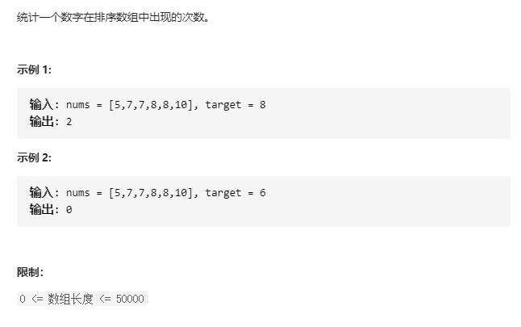
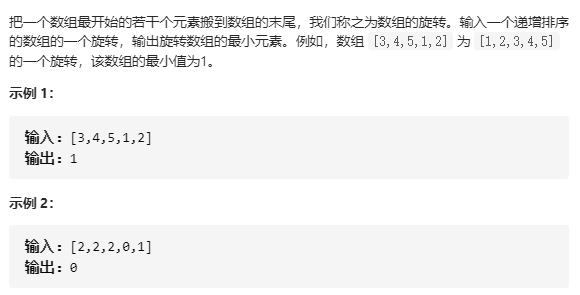
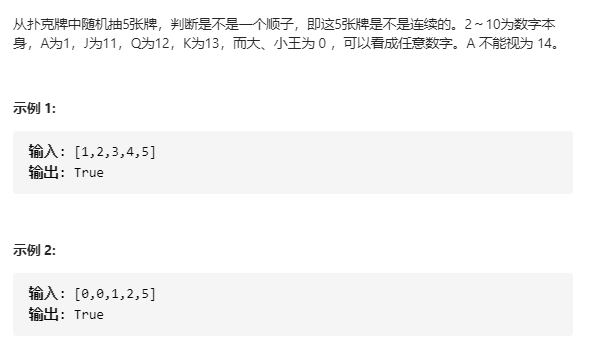
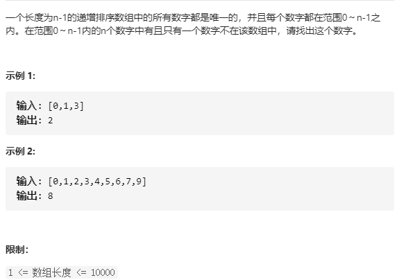
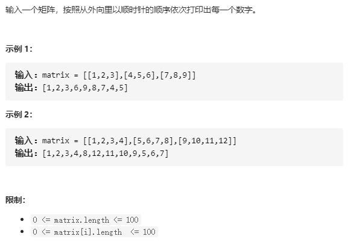
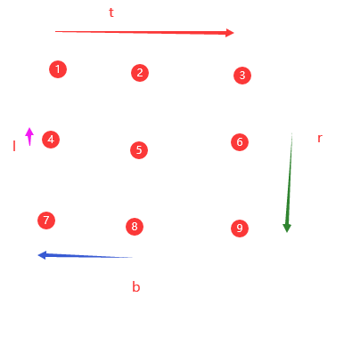
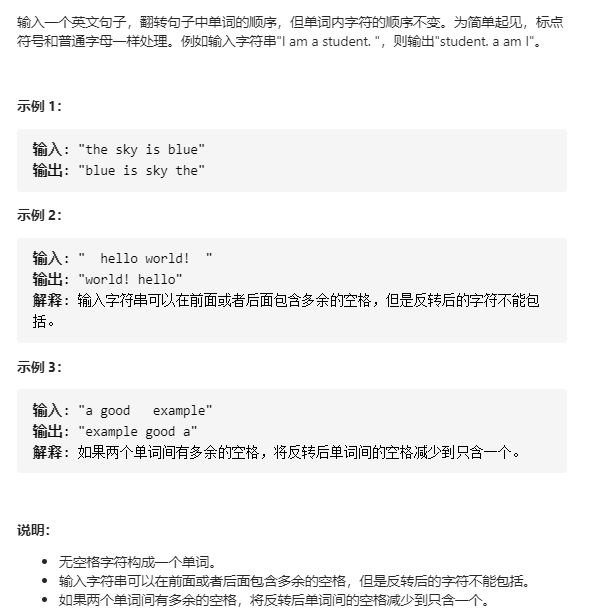
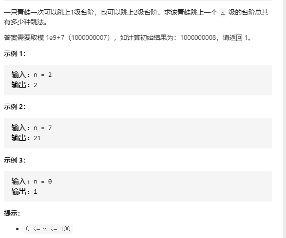
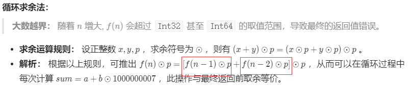
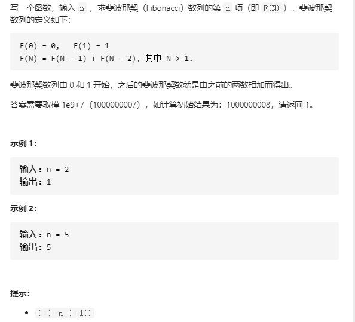

# 简单篇


## 31-38

### 31.[剑指 Offer 53 - I. 在排序数组中查找数字 I](https://leetcode-cn.com/problems/zai-pai-xu-shu-zu-zhong-cha-zhao-shu-zi-lcof/)

跟这题基本一样：[34. 在排序数组中查找元素的第一个和最后一个位置](https://leetcode-cn.com/problems/find-first-and-last-position-of-element-in-sorted-array/)，只不过这题是统计元素频率。



#### 解法1：暴力法

```c++
class Solution {
public:
    int search(vector<int>& nums, int target) {
        if(nums.size() == 0) return 0;
        if(target < nums[0] || target > nums[nums.size() - 1]) return 0;
        int res = 0;
        for(int &n:nums){
            res += (n == target) ? 1 : 0;
        }       
        return res;
    }

};
```


#### 解法2：单二分 O(N)

二分查找时间复杂度O（logn)，但是找到目标后，往左往右搜索，考虑如果整个数组都等于target，那么算法退化，需要遍历整个数组，所以最终的时间复杂度为**O（N）**！

**注意**：往右找相等时，下标条件越界！

nums.size()开始少了 -1，下标容易犯错！！！

```c++
class Solution {
public:
    int search(vector<int>& nums, int target) {
        if(nums.size() == 0) return 0;
        if(target < nums[0] || target > nums[nums.size() - 1]) return 0;
        
        // 在数组中：1.能找到 2.找不到
        int n = binarySearch(nums, target); // 找等于target的下标
        if(n == -1) return 0;
        int res = 1, i = n - 1, j = n + 1;
        // 往左找相等
        while(i >= 0 && nums[i] == target) {
            res++;
            i--;
        }
        // 往右找相等
        while(j <= (nums.size() - 1) && nums[j] == target){ // nums.size()开始少了 -1,下标容易犯错
            res++;
            j++;
        }
        return res;
    }
private:
    int binarySearch(vector<int>& nums, int target){
        int tmp = -1;
        int l = 0, r = nums.size() - 1;
        while(l <= r){
            int m = l + (r - l) / 2;
            if(target == nums[m]){
                tmp = m;
                break;
            }
            else if(target > nums[m]) l = m + 1;
            else if(target < nums[m]) r = m - 1;
        }
        return tmp;
    }
};
```

#### 解法3：双二分 O(logN)

找 <=target的最左、最右边界,理解起来有点难！细节！

```c++
class Solution {
public:
    int search(vector<int>& nums, int target) {
        int l = 0, r = nums.size() - 1;
        int left = leftBound(nums, l, r, target); // 最左边界（取不到的）
        int right = rightBound(nums, l, r, target); // 最右边界（取不到的）
        // target 不在数组范围内
        if(left == -999 || right == -999) return 0;
        // target 在范围内，分为：1.找不到 3.找到了
        if(right - left <= 1) return 0; // 范围内没有数，这行注释也可以过leetcode
        return ((right - 1) - (left + 1) + 1); // 细节1：范围内的数个数[left + 1, right - 1]
    }
private:
    int leftBound(vector<int>& nums, int l, int r, int target){
        int left_min = -999; // “-999”表示不在数组中
        while(l <= r){
            int m = l + (r - l) / 2;
            if(target <= nums[m]){ // 细节2：条件的选取
                r = m - 1;
                left_min = m - 1; // 细节3：左边界的更新
            }else if(target > nums[m]){
                l = m + 1;
            }
        }
        return left_min;
    }
    int rightBound(vector<int>& nums, int l, int r, int target){
        int right_max = -999;
        while(l <= r){
            int m = l + (r - l) / 2;
            if(target >= nums[m]){
                l = m + 1;
                right_max = m + 1;
            }else if(target < nums[m]){
                r = m - 1;
            }
        }
        return right_max;
    }
};
```


### 32.[剑指 Offer 11. 旋转数组的最小数字](https://leetcode-cn.com/problems/xuan-zhuan-shu-zu-de-zui-xiao-shu-zi-lcof/)



#### 解法1：暴力法

不推荐！

```c++
class Solution {
public:
    int minArray(vector<int>& numbers) {
        sort(numbers.begin(), numbers.end());
        return numbers[0];
    }
};
```

#### 解法2：二分法

```c++
class Solution {
public:
    int minArray(vector<int>& numbers) {
        // 找到旋转点，即为最小值
        // 如数组 ： 3 4 5 6 1 2 3
        // 左排序数组：3 4 5 6
        // 右排序数组：1 2 3
        int l= 0, r = numbers.size() - 1;
        while(l <= r){
            int m = l + (r - l) / 2;
            if(numbers[m] > numbers[r]){ // 旋转点一定在 右边, 范围[m + 1, r]
                l = m + 1;
            }else if(numbers[m] < numbers[r]){ // 旋转点一定在 左边，范围 [l, m]
                r = m; // m本身就可能是旋转点，所以这样取，而不是取r = m - 1
            }else{
                r--;
            }
        }
        return numbers[l];
    }
};
```


### 33.[剑指 Offer 61. 扑克牌中的顺子](https://leetcode-cn.com/problems/bu-ke-pai-zhong-de-shun-zi-lcof/)



满足顺子的条件

1. 除了大小王，数字不可重复
2. 最大值 - 最小值 < 5

#### 解法1：排序 + 遍历

```c++
class Solution {
public:
    bool isStraight(vector<int>& nums) {
        // 排序
        sort(nums.begin(), nums.end());
        int joker = 0;
        for(int i = 0; i < nums.size() - 1; i++){
            if(nums[i] == 0) joker++; // 统计大小王joker的数量
            else if(nums[i] == nums[i + 1]) return false;
        }
        return (nums[4] - nums[joker]) < 5; // 若joker为0个，则相当于最大值（最后一个） - 最小值（第一个）
    }
};
```

#### 解法2：set去重

```c++
class Solution {
public:
    bool isStraight(vector<int>& nums) {
        unordered_set<int> mySet;
        int mi = INT_MAX;
        int ma = INT_MIN;
        for(auto n:nums){
            if(n == 0) continue;
            mi = min(mi, n);
            ma = max(ma, n);
            if(mySet.find(n) != mySet.end()) return false; // 重复
            mySet.insert(n); // 不重复则插入
        }
        return (ma - mi) < 5;
    }
};
```

### 34.[剑指 Offer 53 - II. 0～n-1中缺失的数字](https://leetcode-cn.com/problems/que-shi-de-shu-zi-lcof/)



#### 解法1：二分法

假设排列正确的为**左数组**，排序错误的为**右数组**，那么缺失的数字为**右数组的第一个数字的索引**，为什么是索引呢？因为缺失的数字的索引被后面的占领了！

初始范围 [l, r]

当nums[m] == m,说明左边肯定是正确的，那么范围缩减为 [m + 1, r]

当nums[m] != m，说明此刻出现在右数组，那么缩减范围为[l, m - 1]

```c++
class Solution {
public:
    int missingNumber(vector<int>& nums) {
        int l = 0, r = nums.size() - 1;
        while(l <= r){
            int m = l + (r - l) / 2;
            if(nums[m] == m) l = m + 1;
            else{
                r = m - 1;
            }
        }
        return l;
    }
};
```


### 35.[剑指 Offer 29. 顺时针打印矩阵](https://leetcode-cn.com/problems/shun-shi-zhen-da-yin-ju-zhen-lcof/)



#### 解法1：四个边界

定义四个边界：上 下 左 右，分别为t、b、l、r



模拟顺时针，注意上、下，左、右，**必然是一个增一个减**

1. 从左到右，走完上面一行，**t增大**（往下移动一行）
2. 从上到下，走完右边一列，r减小（往左移动一列）
3. 从右到左，走完下面一行，**b减小**（往上移动一行）
4. 从下到上，走完左边一列，l增大（往右移动一列）

```c++
class Solution {
public:
    vector<int> spiralOrder(vector<vector<int>>& matrix) {
        if(matrix.size() == 0) return {};
        int l = 0, r = matrix[0].size() - 1, t = 0, b = matrix.size() - 1;
        vector<int> res;
        while(true){     
            for(int i = l; i <= r; i++) res.push_back(matrix[t][i]);  // 从左到右
            if(++t > b) break; //t往下移动一行
            
            for(int i = t; i <= b; i++) res.push_back(matrix[i][r]); // 从上到下
            if(l > --r) break; //r往左移动一列
           
            for(int i = r; i >= l; i--) res.push_back(matrix[b][i]);  // 从右到左
            if(t > --b) break; //b往上移动一行
           
            for(int i = b; i >= t; i--) res.push_back(matrix[i][l]);  // 从下到上
            if(++l > r) break; //l往右移动一列
        }
        return res;
    }
};
```


### 36.[剑指 Offer 58 - I. 翻转单词顺序](https://leetcode-cn.com/problems/fan-zhuan-dan-ci-shun-xu-lcof/)



#### 解法1：双指针法

题意是从后面开始 数 单词

那么要考虑的是 如何截取 一个 单词，据题意一个单词两边界都不是空格。

那么指针 i 从后开始，遇到空格直接跳过，然后遇到 非空格 开始 **局部循环**，最终走到局部的前一个位置，那么就确定了一个单词。每次 j 保存 i的值，为了下次局部循环使用。

添加完一个单词要加上空格，最后的结果需要pop一下，多了一个空格！

要注意的是这个**边界条件，循环里要加上，防止越界**！

时间复杂度：O(N)

空间复杂度：O(N)

```c++
class Solution {
public:
    string reverseWords(string s) {
        if(s.size() == 0) return "";
        string words;
        int i = s.size() - 1, j;
        while(i >= 0){
            if(i < s.size() && s[i] == ' '){ // 从后往前，跳过空格
                i--;
                continue;
            }
            // 到这里是非空格，也就是单词的最后一个字符
            while(i < s.size() && s[i] != ' '){
                i--;
            }
            // 已到达一个单词的前一位
            j = i; // 保留
            i++; // 回到单词开头
            // 截取这个单词, 非空即是单词
            while(i < s.size() && s[i] != ' '){
                words.push_back(s[i]);
                i++;
            }
             // 截取完一个，加空格
            words.push_back(' ');
            i = j;
        }
        words.pop_back();
        return words;
    }
};
```

#### 解法2：istringstream

istringstream的分词功能

完成单词切分，然后用双链表list的头插法，将单词排好序

然后遍历双链表，用一个string来存。

空间复杂度O(N)：

- 算法使用一个双向链表、一个istringstream

时间复杂度0(N)

- istringstream遍历分词O(N)，lst插入效率很高O(1)，遍历list为O(N)

list仅仅为了头部插入，这个也可以用**双端队列 deque** 来完成！

```c++
class Solution {
public:
    string reverseWords(string s) {
        if(s.size() == 0) return "";
        list<string> lst;
        istringstream wordss(s);
        string word;
        while(wordss >> word){
            lst.push_front(word);  
        }
        string words;
        list<string>::iterator iter = lst.begin();
        while(iter != lst.end()){
            words +=  *iter + " "; // 不能用push_back
            iter++;
        }
        words.pop_back();
        return words;
    }
};
```

deque版本

```c++
class Solution {
public:
    string reverseWords(string s) {
        if(s.size() == 0) return "";
        deque<string> deq;
        istringstream wordss(s);
        string word;
        while(wordss >> word){
            deq.push_front(word);  
        }
        string words;
        deque<string>::iterator iter = deq.begin();
        while(iter != deq.end()){
            words +=  *iter + " ";
            iter++;
        }
        words.pop_back();
        return words;
    }
};
```


### 37.[剑指 Offer 10- II. 青蛙跳台阶问题](https://leetcode-cn.com/problems/qing-wa-tiao-tai-jie-wen-ti-lcof/)



#### 解法1：dp

动态规划，跟斐波那契数列一样的，f(0) = 0, f(1) = 1

只不过是f(0) = 1, f(1) = 1

定义：f(n)：青蛙跳上 n 阶台阶 总共 有 f(n) 种方法

递推公式：**f(n) = f(n - 1) + f(n - 2)**

**注意这个取余**：



```c++
class Solution {
public:
    int numWays(int n) {
        if(n < 2) return 1;
        int a = 1, b = 1;
        int sum = 0;
        for(int i = 2; i <= n; i++){
            sum = (a + b) % 1000000007;
            a = b;
            b = sum;
        }
        return sum;
    }
};
```


### 38.[剑指 Offer 10- I. 斐波那契数列](https://leetcode-cn.com/problems/fei-bo-na-qi-shu-lie-lcof/)



#### 解法1：dp

动态转移方程已经给出

```c++
class Solution {
public:
    int fib(int n) {
        if(n < 2) return n;
        int a = 0, b = 1;
        int sum;
        for(int i = 2; i <= n; i++){
            sum = (a + b) % 1000000007;
            a = b;
            b = sum;
        }
        return sum;
    }
};
```

#### 解法2：记忆化递归

```c++
class Solution {
public:
    int fib(int n) {
        if(n < 2) return n;
        unordered_map<int, int> umap;
        return fib(umap, n); 
    }
private:
    int fib(unordered_map<int, int>& umap, int n){ // 记忆化递归
        if(n < 2) return n;
        if(umap.find(n) != umap.end()) return umap[n];

        int f1 = fib(umap, n - 1) % 1000000007;
        umap[n - 1] = f1;
        int f2 = fib(umap, n - 2) % 1000000007;
        umap[n - 2] = f2;  
        int res = (f1 + f2) % 1000000007;
        umap[n] = res;
        
        return res;
    }
};
```

