# 动态规划

目录：

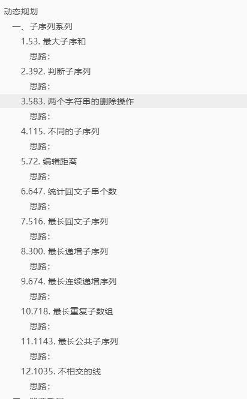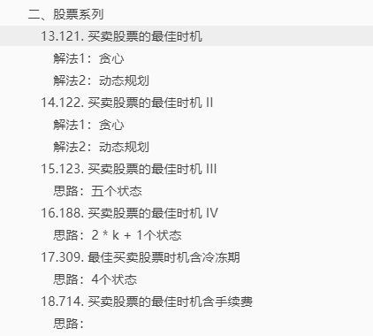

参考微信公众号：`代码随想录`

**动规五部曲**分别为：

1. 确定dp数组（dp table）以及下标的含义

2. 确定递推公式

3. dp数组如何初始化

4. 确定遍历顺序

5. 举例推导dp数组

## 一、子序列系列

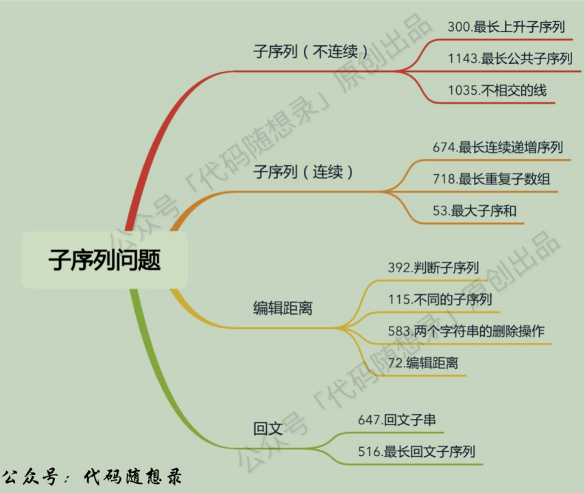

### 1.[53. 最大子序和](https://leetcode-cn.com/problems/maximum-subarray/)

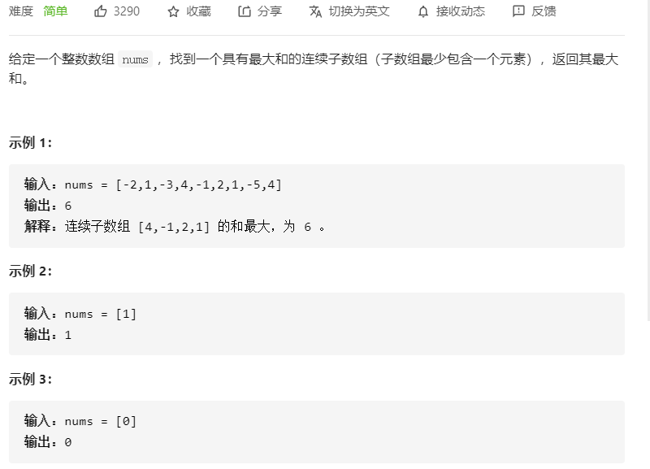

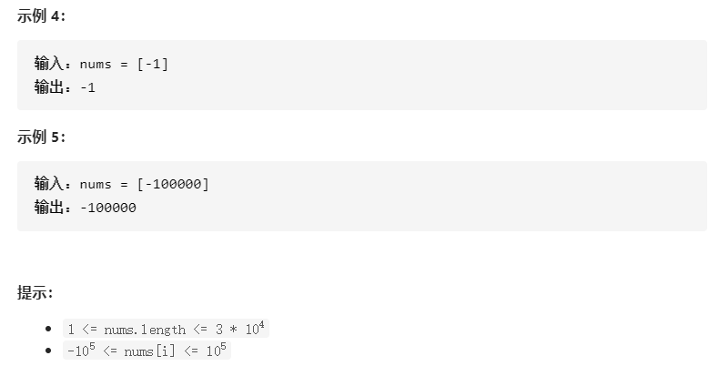

#### 思路：

定义状态dp[i]：到达下标i所得的最大子序和为dp[i]

动态转移方程：dp[i] = max(dp[i - 1] + nums[i], nums[i])；即当前最大子序和由两个方向递推而来：

1. 将当前元素nums[i]加入之前子序和
2. 将当前元素单独作为子序和

取两者的最大值，作为当前的最大子序和！

```c++
class Solution {
public:
    int maxSubArray(vector<int>& nums) {
        // DP
        // dp[i]--到达下标i所得的最大子序和为dp[i]
        vector<int> dp(nums.size());
        dp[0] = nums[0];
        int res = nums[0];
        for(int i = 1; i < nums.size(); i++){
            dp[i] = max(dp[i - 1] + nums[i], nums[i]);
            res = max(res, dp[i]);
        }
        return res;
    }
};
```

贪心如下：

```c++
class Solution {
public:
    int maxSubArray(vector<int>& nums) {
        if(nums.size() < 2) return nums[0];
        int res = INT_MIN;
        int sum = 0;
        for(int i = 0; i < nums.size(); i++){
            sum += nums[i];
            res = max(res, sum); // 每次保存最大子序和
            sum = max(sum, 0); // 如果子序和sum为负，则重置为0
        }
        return res;
    }
};
```

### 2.[392. 判断子序列](https://leetcode-cn.com/problems/is-subsequence/)

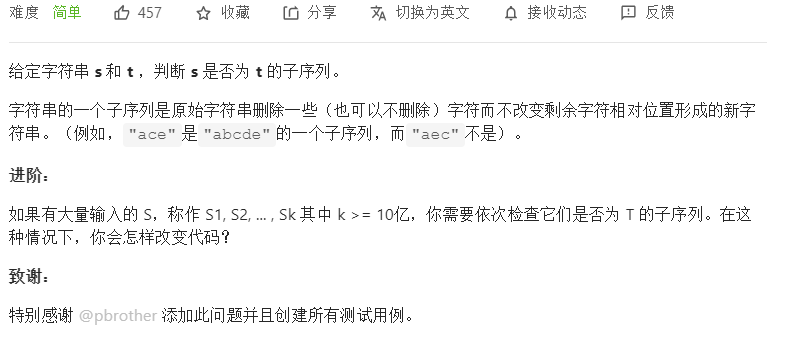

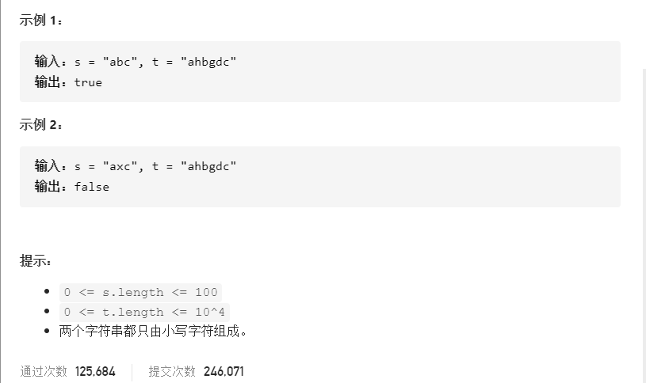

#### 思路：

定义状态：`dp[i][j]` -- 以 i-1 下标结尾的s字符串，与以 j-1 为结尾的字符串t，共同的子序列为`dp[i][j]`

状态转移：可以由两个方向得到

1. s[i - 1] == t[j - 1]，说明现在共同的序列在原来的基础上加1
2. s[i - 1] != t[j - 1]，说明现在共同的序列没改变，跟t[j - 2]那时的状态一样

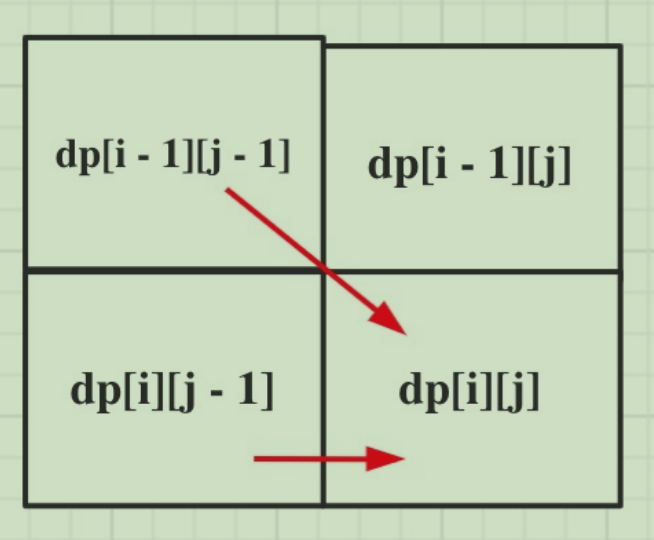

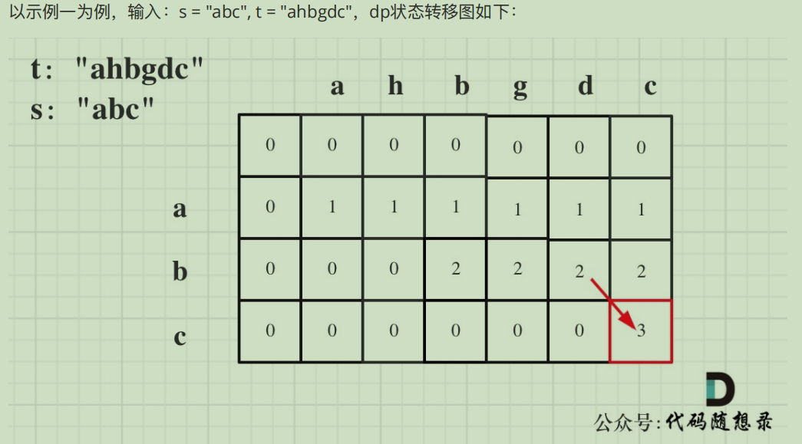

```C++
class Solution {
public:
    bool isSubsequence(string s, string t) {
        // dp[i][j]--以 i-1 下标结尾的s字符串，与以 j-1 为结尾的字符串t
        // 共同的子序列为dp[i][j]
        vector<vector<int>> dp(s.size() + 1, vector<int>(t.size() + 1, 0));
        for(int i = 1; i <= s.size(); i++){ // 从上到下
            for(int j = 1; j <= t.size(); j++){ // 从左到右
                if(s[i - 1] == t[j - 1]) dp[i][j] = dp[i - 1][j - 1] + 1;
                else dp[i][j] = dp[i][j - 1];
            }
        }
        if(dp[s.size()][t.size()] == s.size()) return true;
        return false;
    }
};
```


### 3.[583. 两个字符串的删除操作](https://leetcode-cn.com/problems/delete-operation-for-two-strings/)

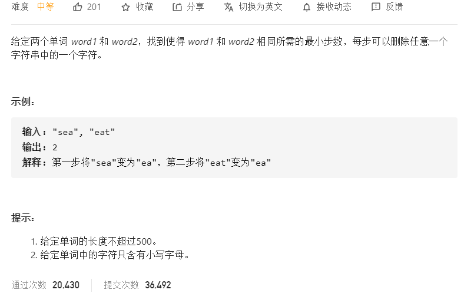

#### 思路：

**状态定义**：  `dp[i][j]`：以下标 i-1 为结尾的word1，与以下标 j-1 为结尾的word2，需要删除 `dp[i][j]`个字符，使当前word1、word2相等

**状态递推方程：**

对于当前word1与word2 `相等`需要删除 0 个，也就是跟上一次状态相同。

对于当前word1与word2`不相等`需要删除多少个字符能得到呢？由三个方向推得

1. word1删除一个
2. word2删除一个
3. word1、word2各删除一个

取三个的最小值即可。

**初始化：**以`word[i][0]`为例word1不为空，word2为空字符串，两个字符串要相等，那么要删除多少个字符？显然，删除 `i` 个

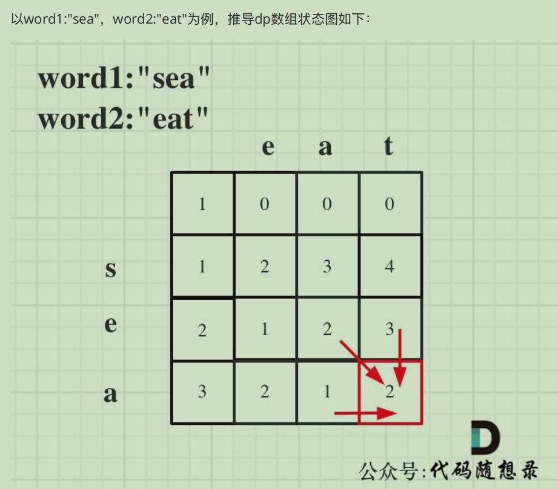

```c++
class Solution {
public:
    int minDistance(string word1, string word2) {
        int n1 = word1.size(), n2 = word2.size();
        // dp[i][j]：以下标 i-1 为结尾的word1，与以下标 j-1 为结尾的word2
        // 需要删除 dp[i][j] 个字符，使当前word1、word2相等
        vector<vector<int>> dp(n1 + 1, vector<int>(n2 + 1));
        for(int i = 0; i <= n1; i++) dp[i][0] = i;
        for(int j = 0; j <= n2; j++) dp[0][j] = j;
        for(int i = 1; i <= n1; i++){
            for(int j = 1; j <= n2; j++){
                if(word1[i - 1] == word2[j - 1]) dp[i][j] = dp[i - 1][j - 1];
                else{
                    dp[i][j] = min({dp[i - 1][j] + 1, dp[i][j - 1] + 1, dp[i - 1][j - 1] + 2});
                }
            }
        }
        return dp[n1][n2];
    }
};
```

### 4.[115. 不同的子序列](https://leetcode-cn.com/problems/distinct-subsequences/)

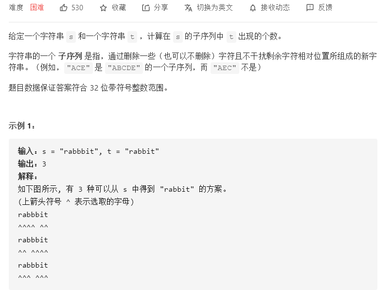

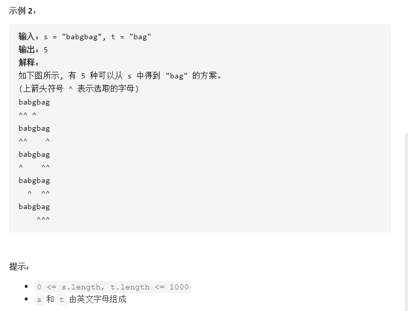

#### 思路：

**状态定义**：`dp[i][j]`：以下标 i-1 为结尾的s，含有以下标 j-1 为结尾的t的子序列的个数为 `dp[i][j]`

**状态递推方程**：分s[i-1]与t[j - 1]是否相等

1. 相等
   - ⼀部分是⽤s[i - 1]来匹配，那么个数为`dp[i - 1][j - 1]`。
   - ⼀部分是不⽤s[i - 1]来匹配，个数为`dp[i - 1][j]`。
2. 不相等：当前t是s的子序列的个数，跟t是s子序列`前一个`的状态一样，个数为`dp[i - 1][j]`

**初始化**:

1. `dp[i][0]`：s中含空字符串t的个数，为1
2. `dp[0][j]`：s为空，j不为空的情况下，不可能含有非空子序列t，所以为0
3. `dp[0][0]`：两个都为空字符串，所以为 1

```c++
class Solution {
public:
    int numDistinct(string s, string t) {
        // dp[i][j]：以下标 i-1 为结尾的s，含有以下标 j-1 为结尾的t
        // 的子序列的个数为 dp[i][j]
        int n1 = s.size(), n2 = t.size();
        if(n1 < n2) return 0;
        vector<vector<unsigned long long>> dp(n1 + 1, vector<unsigned long long>(n2 + 1));
        for(int i = 0; i <= n1; i++) dp[i][0] = 1;
        for(int j = 1; j <= n2; j++) dp[0][j] = 0;
        for(int i = 1; i <= n1; i++){
            for(int j = 1; j <= n2; j++){
                if(s[i - 1] == t[j - 1]) dp[i][j] = dp[i - 1][j - 1] + dp[i - 1][j];
                else dp[i][j] = dp[i - 1][j]; 
            }
        }
        return dp[n1][n2];
    }
};
```


### 5.[72. 编辑距离](https://leetcode-cn.com/problems/edit-distance/)

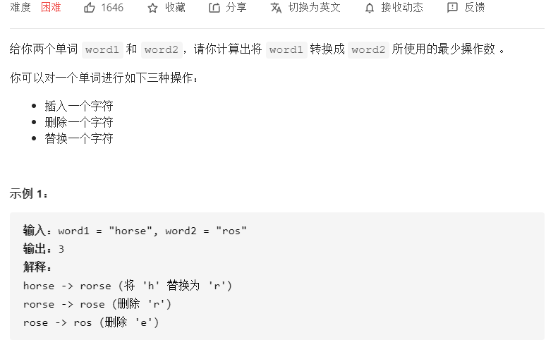

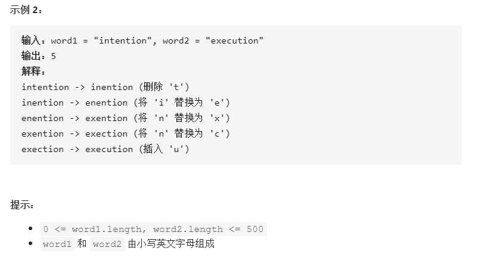

#### 思路：

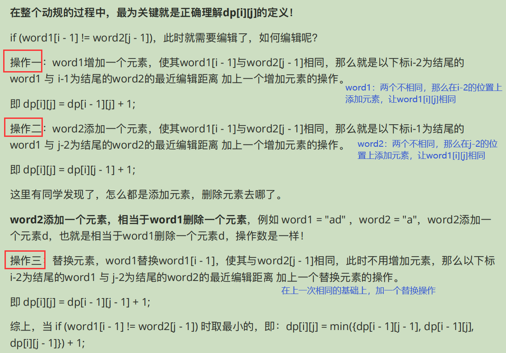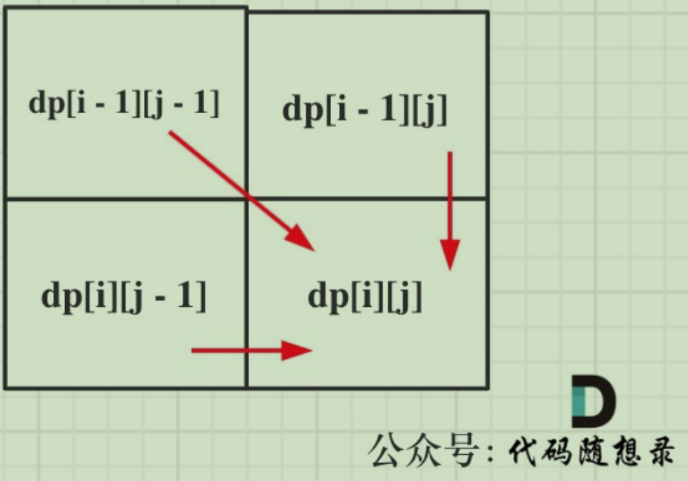

```C++
class Solution {
public:
    int minDistance(string word1, string word2) {
        // dp[i][j]--以下标i-1为结尾的字符串word1，和以下标j-1为结尾的字符串word2
        // 要相等，需要进行的操作数最少是dp[i][j]
        int n1 = word1.size(), n2 = word2.size();
        vector<vector<int>> dp(n1 + 1, vector<int>(n2 + 1));
        // 初始化
        for(int i = 0; i <= n1; i++) dp[i][0] = i;
        for(int j = 0; j <= n2; j++) dp[0][j] = j;
        for(int i = 1; i <= n1; i++){
            for(int j = 1; j <= n2; j++){
                // 相同，则不用增加操作，跟上一次相同
                if(word1[i - 1] == word2[j - 1]) dp[i][j] = dp[i - 1][j - 1];
                else{
                    dp[i][j] = min({dp[i - 1][j], dp[i][j - 1], dp[i - 1][j - 1]}) + 1;
                }
            }
        }
        return dp[n1][n2];
    }
};
```


### 6.[647. 统计回文子串个数](https://leetcode-cn.com/problems/palindromic-substrings/)

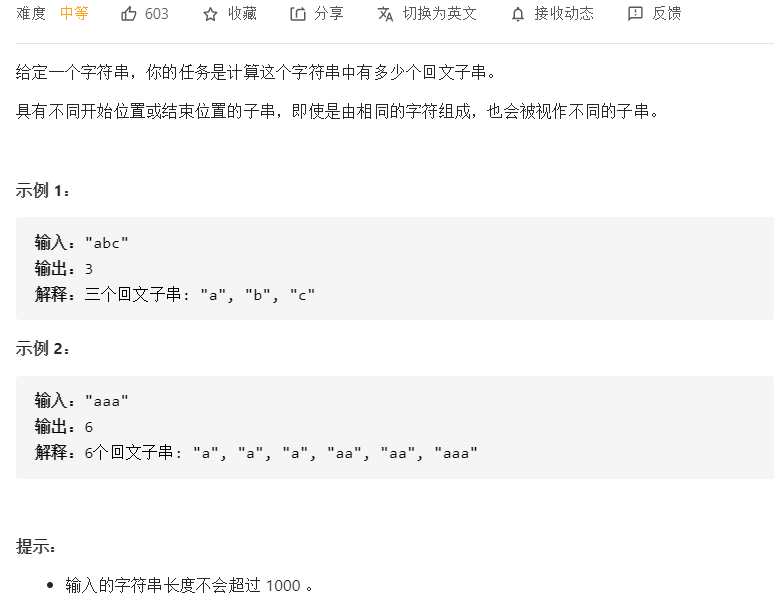

#### 思路：

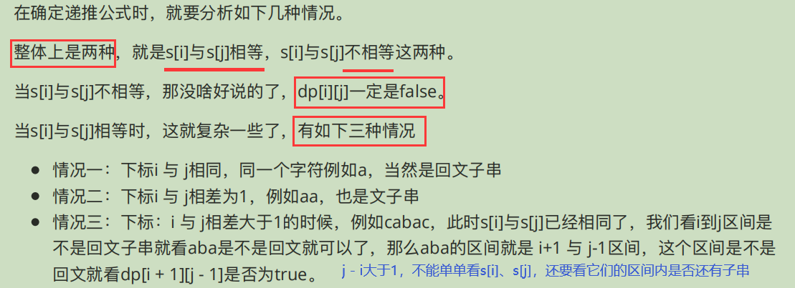

遍历顺序：

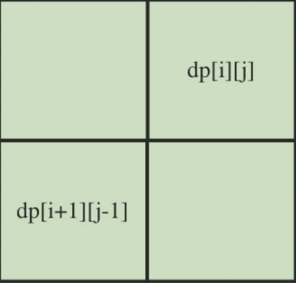

所以需要**从下到上，从左到右遍历**！

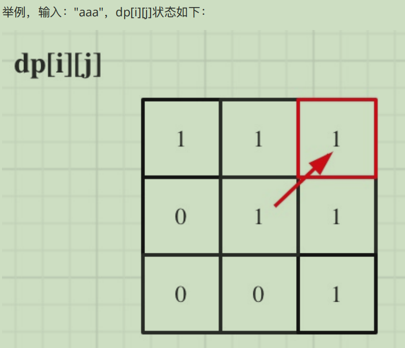

```C++
class Solution {
public:
    int countSubstrings(string s) {
        // dp[i][j]--以下标 i 为结尾的字符，到下标j为结尾的字符区间内
        // 的子串为回文则dp[i][j]=true，否则fasle
       // 初始化：一开始全都匹配不上
        vector<vector<bool>> dp(s.size(), vector<bool>(s.size(), false));
        int res = 0;
        for(int i = s.size() - 1; i >= 0; i--){
            for(int j = i; j < s.size(); j++){
                if(s[i] == s[j]){
                    if(j - i <= 1){ // 情况1、2
                        res++;
                        dp[i][j] = true;
                    }else if(dp[i + 1][j - 1]){ // 情况3
                        res++;
                        dp[i][j] = true;
                    }
                }
            }
        }
        return res;
    }
};
```


### 7.[516. 最长回文子序列](https://leetcode-cn.com/problems/longest-palindromic-subsequence/)

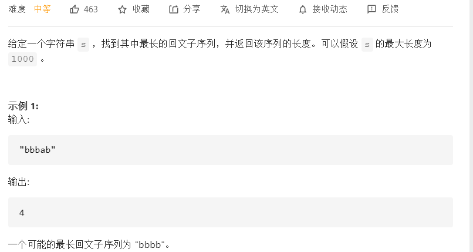

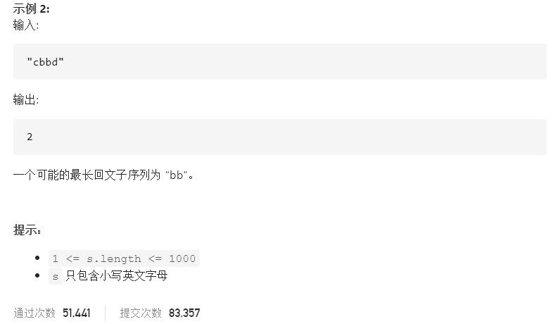

#### **思路**：

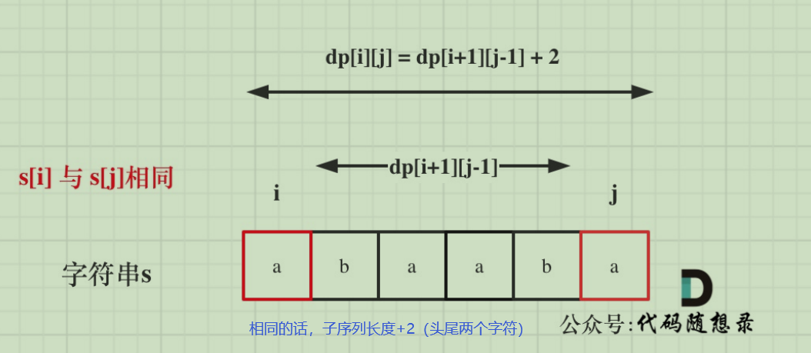

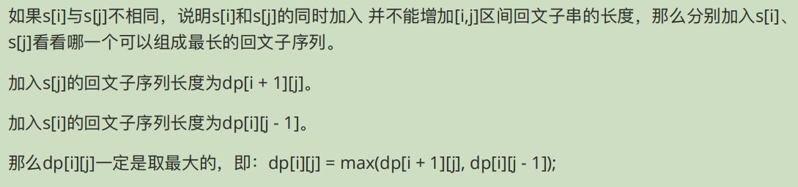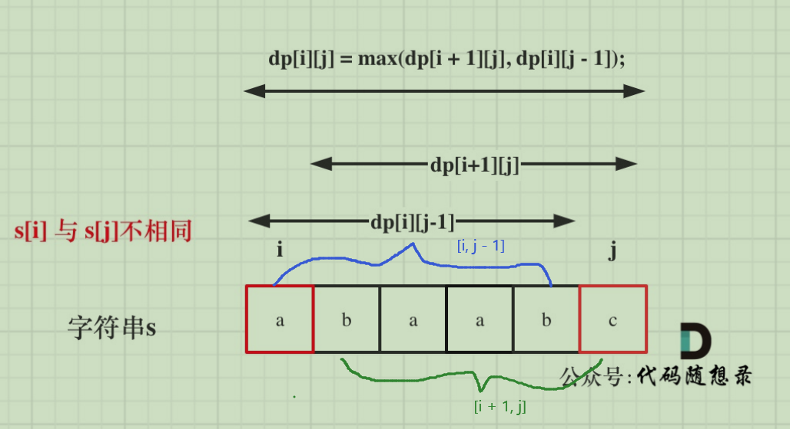

**初始化**：根据`dp[i][j]`的含义，那么当`i==j`时，也就是单个字符的情况，子序列是`1`。

**遍历顺序：**从递推公式`dp[i][j] = dp[i + 1][j - 1] + 2 `和` dp[i][j] = max(dp[i + 1][j], dp[i][j - 1])` 可以看出，`dp[i][j]`是依赖于`dp[i + 1][j - 1] `和 `dp[i + 1][j]`，也就是从矩阵的⻆度来说，`dp[i][j] `下⼀⾏的数据。 所以遍历**i**的时候⼀定要从下到上遍历，这样才能保证，下⼀⾏的数据是经过计算的。

**对比求最长回文串，也是一样的遍历顺序，dp容器大小的设置也跟之前的（原基础上+1）不一样，只需要定义跟字符串等大小的长度就可以（二维上）**。

```C++
class Solution {
public:
    int longestPalindromeSubseq(string s) {
        // dp[i][j]--以下标i到下标j的区间内，最大回文子序列为dp[i][j]
        vector<vector<int>> dp(s.size(), vector(s.size(), 0));
        for(int i = 0; i < s.size(); i++) dp[i][i] = 1;
        for(int i = s.size() - 1; i >= 0; i--){
            for(int j = i + 1; j < s.size(); j++){
                if(s[i] == s[j]) dp[i][j] = dp[i + 1][j - 1] + 2;
                else{
                    dp[i][j] = max(dp[i + 1][j], dp[i][j - 1]);
                }
            }
        }
        return dp[0][s.size() - 1];
    }
};
```


### 8.[300. 最长递增子序列](https://leetcode-cn.com/problems/longest-increasing-subsequence/)

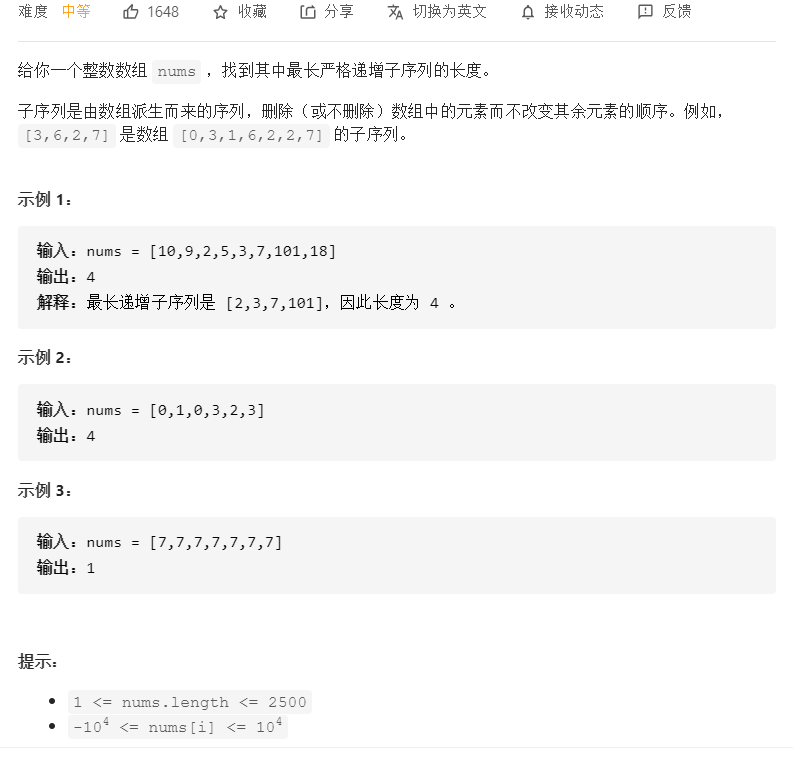

#### **思路**：

1. 对于每一个位置`i`，我们都需要从`j`从 0 到 `i - 1`遍历，如果`nums[i] > nums[j]`，就需要增加一个最长子序列数，保存这个过程中的最大值即为`dp[i]`的最长递增子序列数。
2. 用`res`来收集遍历每一个`i`时产生的`dp[i]`的最大值，即为整个序列的最大递增子序列数。

**注意dp[i]的定义，不是最长，而是指的长度！**

```C++
class Solution {
public:
    int lengthOfLIS(vector<int>& nums) {
        // dp[i]--到从位置0 到位置i 的递增子序列长度为dp[i]
        vector<int> dp(nums.size(), 1);
        int res = 1;
        for(int i = 1; i < nums.size(); i++){
            for(int j = 0; j < i; j++){
                if(nums[i] > nums[j]) dp[i] = max(dp[i], dp[j] + 1);
            }
            res = max(res, dp[i]);
        }
        return res;
    }
};
```


### 9.[674. 最长连续递增序列](https://leetcode-cn.com/problems/longest-continuous-increasing-subsequence/)

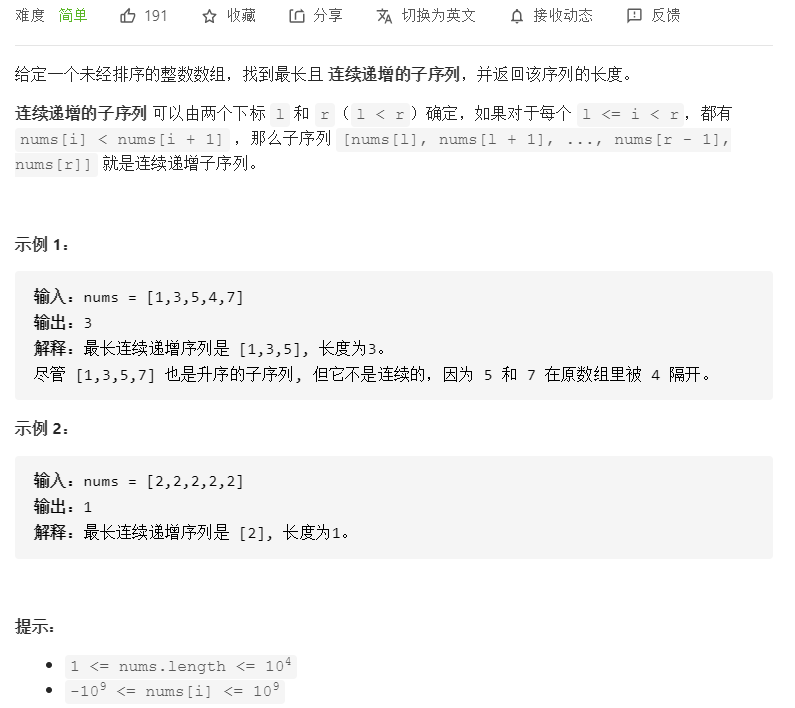

#### **思路**：

这题跟[300. 最长递增子序列](https://leetcode-cn.com/problems/longest-increasing-subsequence/)的不同之处在于**连续**，那么就不用考虑从位置`0`开始到位置`i`，每次看它的前一个的值跟当前值大小即可。每一个只需要考虑它的前一个的状态就行，如果当前元素大于前一个，那么递增序列+1。

用res来收集最大的连续递增子序列。

**注意dp[i]的定义，不是最长，而是指的长度！**

```c++
class Solution {
public:
    int findLengthOfLCIS(vector<int>& nums) {
        // dp[i]--到位置i(不一定是从0位置开始)的连续递增子序列为dp[i]
        vector<int> dp(nums.size(), 1);
        int res = 1;
        for(int i = 1; i < nums.size(); i++){
            if(nums[i] > nums[i - 1]) dp[i] = dp[i - 1] + 1;
            res = max(res, dp[i]);
        }
        return res;
    }
};
```

也可以用贪心来做

```c++
class Solution {
public:
    int findLengthOfLCIS(vector<int>& nums) {
        int count = 1; // 计数器：统计连续子序列数量
        int res = 1;
        for(int i = 1; i < nums.size(); i++){
            if(nums[i] > nums[i - 1]){
                count++;
                res = max(res, count); 
            }
            else{
                res = max(res, count); // 保存最大连续递增子序列
                count = 1; // 同时重置计数器
            }
        }
        return res;
    }
};
```


### 10.[718. 最长重复子数组](https://leetcode-cn.com/problems/maximum-length-of-repeated-subarray/)

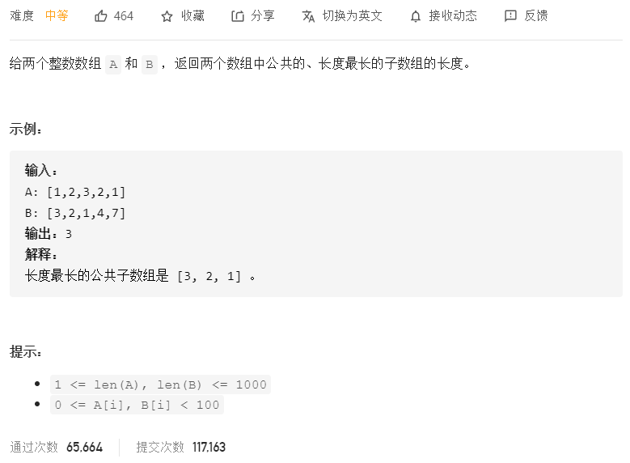

#### **思路：**

​	求最长重复子数组，其实就是求最长**连续**子序列，跟[674. 最长连续递增序列](https://leetcode-cn.com/problems/longest-continuous-increasing-subsequence/)相比，判断条件变成了对应的**是否相等**。

**递推公式**：`dp[i][j]`只由一个方向`dp[i - 1][j - 1]`推导而来。即当`A[i - 1] == B[j - 1]`相等的时候，`dp[i][j] = dp[i - 1][j - 1] + 1`;

**初始化**：`dp[i-1][j-1]`推导`dp[i][j]`，那么`i`需要从1开始推导，那么i=0如何初始化？即`dp[i][0]=?`的问题。联系`dp[i][j]`的定义，`dp[i][0]`的含义为：`nums1`以下标`i-1`结束的数组，与`nums2`以下标`-1`结束的数组，公共的子数组长度，显然没有意义。当然为了推导，设置为`0`。

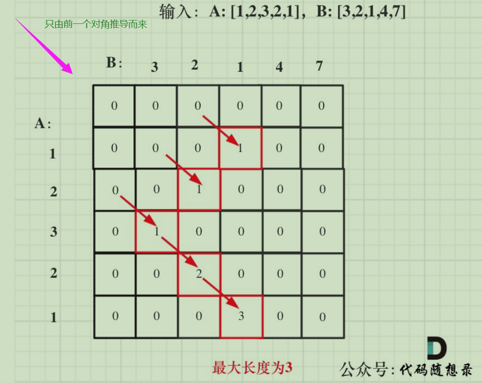


```C++
class Solution {
public:
    int findLength(vector<int>& nums1, vector<int>& nums2) {
        // dp[i][j]--以下标 i-1 结尾的nums1数组，和以下标 j-1 结尾的nums2数组
        // 所含有的公共子数组的长度为dp[i][j]
        int n1 = nums1.size(), n2 = nums2.size();
        vector<vector<int>> dp(n1 + 1, vector<int>(n2 + 1, 0));
        int res = 0;
        for(int i = 1; i <= n1; i++){
            for(int j = 1; j <= n2; j++){
                if(nums1[i - 1] == nums2[j - 1]) dp[i][j] = dp[i - 1][j - 1] + 1;
                res = max(res, dp[i][j]);
            }
        }
        return res;
    }
};
```


### 11.[1143. 最长公共子序列](https://leetcode-cn.com/problems/longest-common-subsequence/)

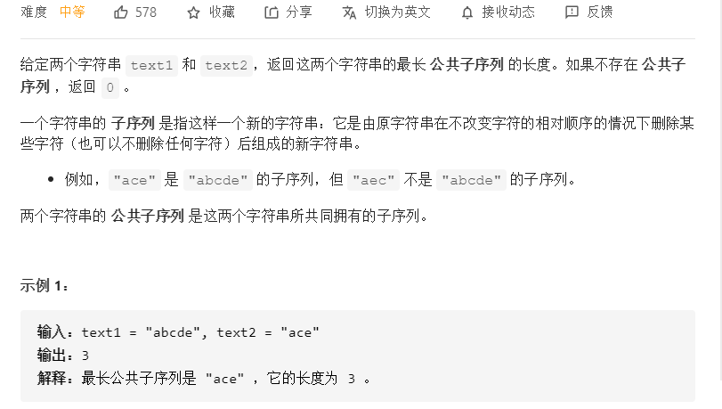

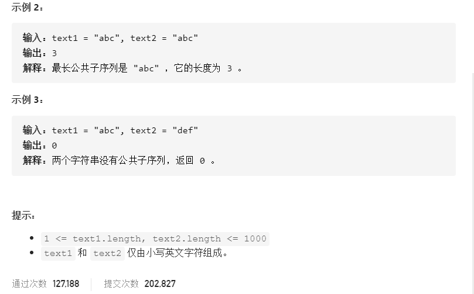

#### 思路：

做了一些子序列、子串的题目，这还是第一个自己想出来的`^o^`。

**状态定义**：`dp[i][j]`--以下标` i-1` 结尾的字符串text1，与以下标` j-1` 结尾的字符串text2，公共子序列长度为` dp[i][j]`

**状态方程推导：**对于两个对应的位置上的字符`text1[i - 1] 、 text2[j - 1]`

1. `==`，说明公共子序列又多一个，在之前的基础上 + 1
2. `!=`,当前不相等，只能取之前的（i-2与j-1、i-1与j-2）最大值

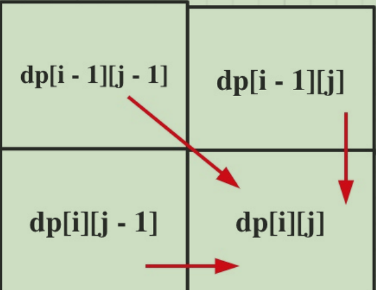

```C++
class Solution {
public:
    int longestCommonSubsequence(string text1, string text2) {
        // dp[i][j]--以下标 i-1 结尾的字符串text1，与以下标 j-1 结尾的字符串text2
        // 公共子序列长度为 dp[i][j]
        int n1 = text1.size(), n2 = text2.size();
        vector<vector<int>> dp(n1 + 1, vector<int>(n2 + 1, 0));
        int res = 0;
        for(int i = 1; i <= n1; i++){
            for(int j = 1; j <= n2; j++){
                if(text1[i - 1] == text2[j - 1]) dp[i][j] = dp[i - 1][j - 1] + 1;
                else dp[i][j] = max(dp[i - 1][j], dp[i][j - 1]);
                res = max(res, dp[i][j]);
            }
        }
        return res;
    }
};
```


### 12.[1035. 不相交的线](https://leetcode-cn.com/problems/uncrossed-lines/)

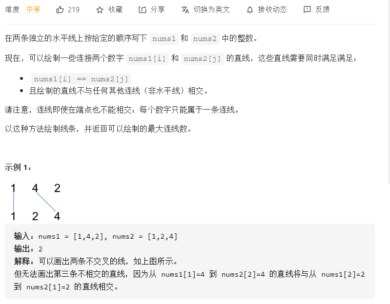

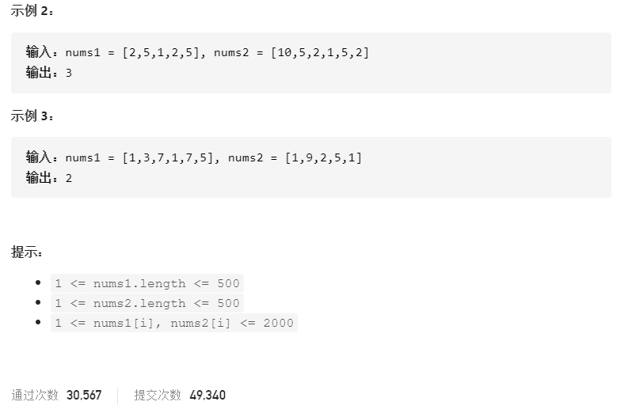

#### 思路：

看题目的意思，不就是[1143. 最长公共子序列](https://leetcode-cn.com/problems/longest-common-subsequence/)吗？

```C++
class Solution {
public:
    int maxUncrossedLines(vector<int>& nums1, vector<int>& nums2) {
        // dp[i][j]--以下标 i-1 为结尾的数组nums2，与以下标 j-1 为结尾的数组nums2
        // 最长公共子序列数为dp[i][j]
        int n1 = nums1.size(), n2 = nums2.size();
        vector<vector<int>> dp(n1 + 1, vector<int>(n2 + 1, 0));
        int res = 0;
        for(int i = 1; i <= n1; i++){
            for(int j = 1; j <= n2; j++){
                if(nums1[i - 1] == nums2[j - 1]) dp[i][j] = dp[i - 1][j - 1] + 1;
                else dp[i][j] = max(dp[i - 1][j], dp[i][j - 1]);
                res = max(res, dp[i][j]);
            }
        }
        return res;
    }
};
```


## 二、股票系列

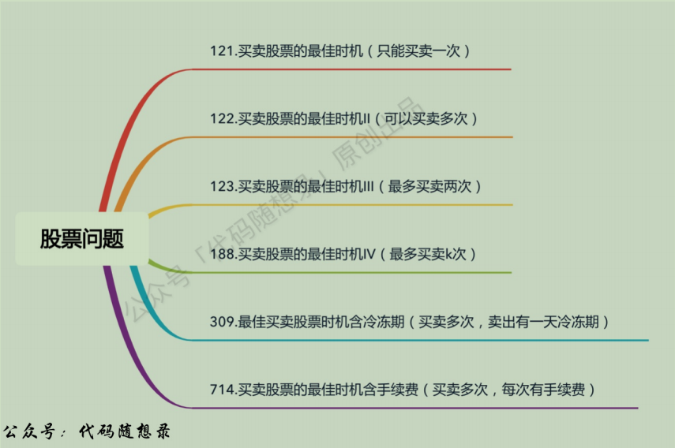

### 13.[121. 买卖股票的最佳时机](https://leetcode-cn.com/problems/best-time-to-buy-and-sell-stock/)

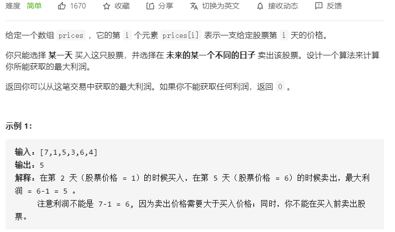

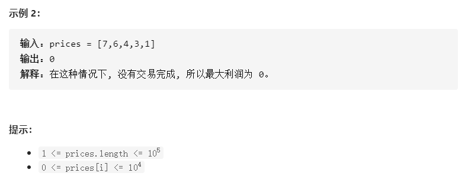

#### 解法1：贪心

取最左的最小值，然后遍历到当前位置的时候减去最小值，就是最大利润。

```c++
class Solution {
public:
    int maxProfit(vector<int>& prices) {
        // 贪心
        int low = INT_MAX;
        int res = 0;
        for(int i = 0; i < prices.size(); i++){
            low = min(low, prices[i]); // 更新最小值
            res = max(res, prices[i] - low); // 更新最大利润
        }
        return res;
    }
};
```

#### 解法2：动态规划

**状态定义：**

每天的状态就只有两种，即持有（买入）、不持有（卖出）

1. `dp[i][0]`--第 i 天持有股票所得最大现金
2. `dp[i][1]`--第 i 天不持有股票所得最大现金

**递推方程：**

1. `dp[i][0] = max(dp[i - 1][0], 0 - prices[i])`
   - 前一天就持有，今天啥也不干，保持前一天的状态
   - 今天才持有，**注意只买卖一次**！所以当天没买的时候现金为0
2. `dp[i][1] = max(dp[i - 1][1], dp[i - 1][0] + prices[i])`
   - 前一天就不持有，今天啥也不干，保持前一天的状态
   - 今天才不持有（今天卖出），那么前一天持有所剩现金加上卖出所得

```c++
class Solution {
public:
    int maxProfit(vector<int>& prices) {
        // 动态规划
        // dp[i][0]--第 i 天持有股票所得最大现金
        // dp[i][1]--第 i 天不持有股票所得最大现金
        vector<vector<int>> dp(prices.size(), vector<int>(2, 0));
        dp[0][0] = -prices[0];
        for(int i = 1; i < prices.size(); i++){
            dp[i][0] = max(dp[i - 1][0], 0 - prices[i]); // 只买卖一次，所以0-prices[i]
            dp[i][1] = max(dp[i - 1][1], dp[i - 1][0] + prices[i]);
        }
        return dp[prices.size() - 1][1];
    }
};
```


### 14.[122. 买卖股票的最佳时机 II](https://leetcode-cn.com/problems/best-time-to-buy-and-sell-stock-ii/)

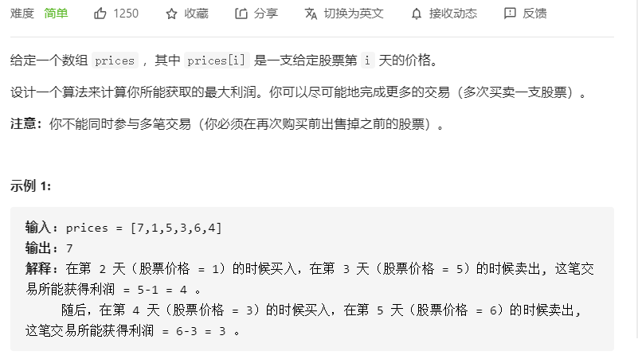

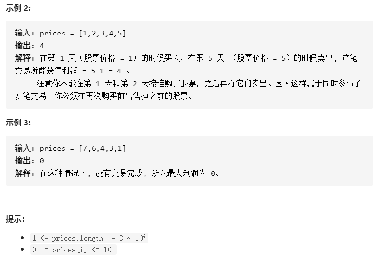

#### 解法1：贪心

```c++
class Solution {
public:
    int maxProfit(vector<int>& prices) {
        int res = 0;
        for(int i = 1; i < prices.size(); i++){
            // 只收集每天的正利润，从第二天开始产生利润
            if(prices[i] - prices[i - 1] > 0){
                res += prices[i] - prices[i - 1];
            }
        }
        return res;
    }
};
```

#### 解法2：动态规划

跟[121. 买卖股票的最佳时机](https://leetcode-cn.com/problems/best-time-to-buy-and-sell-stock/)唯一不同的地方，在于本题可以买卖多次，体现在代码中也就是当你买入（持有）的时候，需要考虑上次卖出后（不持有）对本次买入的影响！

```c++
class Solution {
public:
    int maxProfit(vector<int>& prices) {
        // 动态规划
        // dp[i][0]--第 i 天持有股票所得最大现金
        // dp[i][1]--第 i 天不持有股票所得最大现金
        vector<vector<int>> dp(prices.size(), vector<int>(2, 0));
        dp[0][0] = -prices[0];
        for(int i = 1; i < prices.size(); i++){
            dp[i][0] = max(dp[i - 1][0], dp[i - 1][1] - prices[i]); //唯一不同，因为这里允许买卖多次
            dp[i][1] = max(dp[i - 1][1], dp[i - 1][0] + prices[i]);
        }
        return dp[prices.size() - 1][1];
    }
};
```


### 15.[123. 买卖股票的最佳时机 III](https://leetcode-cn.com/problems/best-time-to-buy-and-sell-stock-iii/)

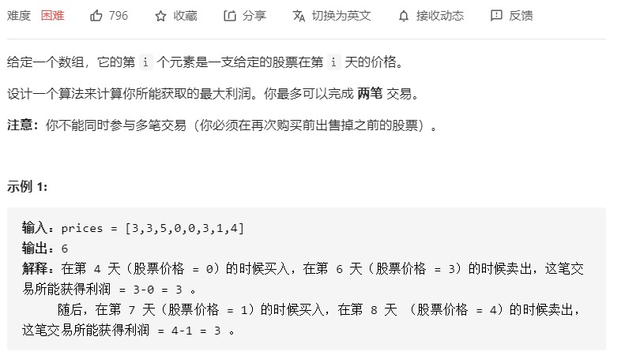

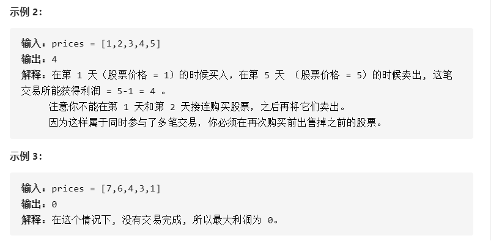

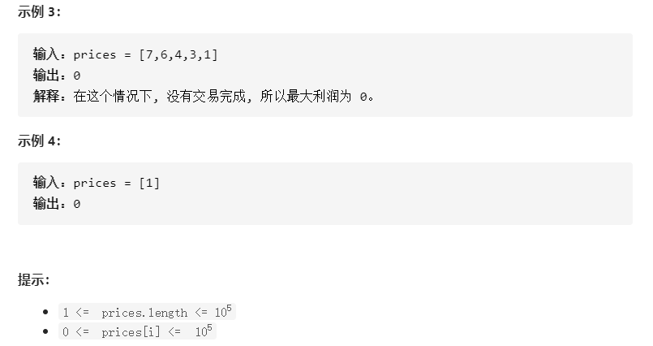

#### 思路：五个状态

每天的状态，有5个，即

- 0--不操作，保持原状
- 1--第一次买入
- 2--第一次卖出
- 3--第二次买入
- 4--第二次卖出

**买入并不是说当天一定要买入**，只是说可以有也可以没有这种状态。


**状态定义：**`dp[i][j]`中`i`表示第`i`天（仅以下标来解释，第0天现实中也不存在哈），`j`表示当天的`[0~4]`中状态


**递推方程：**

有些烧脑，最好自己写一下各个状态，结合每天的5个状态来推导！

- `dp[i][0] = dp[i - 1][0]`，既然不操作，那么跟前一天是一样的
- `dp[i][1]=max(dp[i - 1][1], dp[i - 1][0] - prices[i])`，当天第一次买入状态，有可能不买（前一天已经买了），那么就跟前一天一样。也有可能买，那么就是前一天不操作所得最大现金**减去**今天买入股票所用的花费。
- `dp[i][2]=max(dp[i - 1][2], dp[i - 1][1] + prices[i])`，当天第一次卖出状态，那可能不卖出（前一天已经卖出），那么就跟前一天一样。也有可能当天卖出，那么就是前一天买入的状态下**加上**今天卖出所得的现金。
- `dp[i][3]=max(dp[i - 1][3], dp[i - 1][2] - prices[i])`，同理，只不过第二次买入是在第一次卖出后才能进行的操作。
- `dp[i][4]=max(dp[i - 1][4], dp[i - 1][3] + prices[i])`，同理。


**初始化：**

只要是买入，那么就是需要花费！这里要注意第二次买入`dp[0][3]`也是`-prices[0]`！虽然对应现实意义上不是很明确。但是这些都是**状态**，也就是说并不是真正意义上的买入卖出。是假设这种状态发生会产生的结果。那么`dp[0][2]`也就是第0天第一次卖出所得利润，那么第一天买入`dp[i][1]=-prices[0]`，再卖出得到的不就是0，取最大值也还是0，所以其他卖出都是初始化为0；

代码如下：

```C++
class Solution {
public:
    int maxProfit(vector<int>& prices) {
        int n = prices.size() - 1;
        vector<vector<int>> dp(n + 1, vector<int>(5, 0));
        dp[0][1] = -prices[0];
        dp[0][3] = -prices[0];
        for(int i = 1; i <= n; i++){
            dp[i][0] = dp[i - 1][0];
            dp[i][1]=max(dp[i - 1][1], dp[i - 1][0] - prices[i]);
            dp[i][2]=max(dp[i - 1][2], dp[i - 1][1] + prices[i]);
            dp[i][3]=max(dp[i - 1][3], dp[i - 1][2] - prices[i]);
            dp[i][4]=max(dp[i - 1][4], dp[i - 1][3] + prices[i]);
        }
        return dp[n][4];
    }
};
```


### 16.[188. 买卖股票的最佳时机 IV](https://leetcode-cn.com/problems/best-time-to-buy-and-sell-stock-iv/)

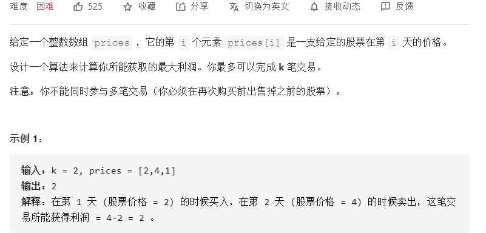

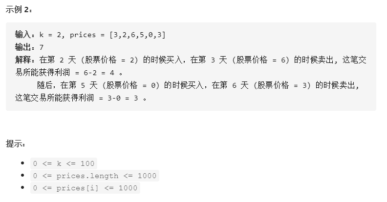

#### 思路：2 * k + 1个状态

这题是[123. 买卖股票的最佳时机 III](https://leetcode-cn.com/problems/best-time-to-buy-and-sell-stock-iii/)的进阶版。那么来分析一下，买卖`k`次每天的状态。如下：

- 0--不操作
- 1--第一次买入
- 2--第一次**卖出**
- 3--第二次买入
- 4--第二次**卖出**
- .......
- `2(k-1)-1=2*k-3`--第`k-1` 次买入
- `2(k-1)=2*k-2`--第`k-1` 次卖出
- `2*k-1`--第`k` 次买入
- `2*k`--第`k` 次卖出

可以发现，**当奇数的时候为买入，偶数的时候为卖出**！


**状态定义：**`dp[i][j]`,`i`表示第`i`天，`j`表示第`i`天的状态，`j∈[0, 2k]`

**递推过程：**

1.`dp[i][1]`表示第`i`天第一次买入的状态，有两种情况

- 不操作，那么跟前一天一样，即`dp[i][1]=dp[i - 1][1]`
- 买入，那么会在前一天上一个状态下，即0--没有操作，花费，即`dp[i][1]=dp[i - 1][0] - prices[i]`

2.`dp[i][2]`表示第`i`天第一次卖出的状态，有两种情况

- 不操作，那么跟前一天一样，即`dp[i][2]=dp[i - 1][2]`
- 卖出，那么在前一天的上一个状态，即1--第一次买入，赚钱，即`dp[i][2]=dp[i - 1][1] + prices[i]`

那么其他同理，`j∈[0, 2k - 2]`，从`0`开始跳，**每次跳1、2个的位置**。这里要注意的是`j`的右边界，因为`j`只需要最后能够跳到`最终位置前第2个`就行，理解这个很关键！

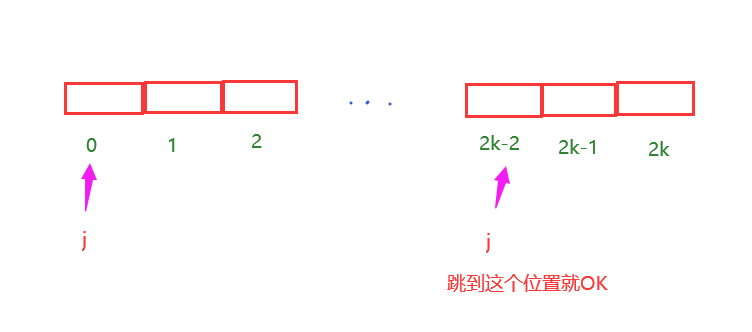

则总结出以下递推方程：

- 为奇数，买入： `dp[i][j + 1] = max(dp[i - 1][j + 1], dp[i - 1][j] - prices[i])`;
- 为偶数，卖出：`dp[i][j + 2] = max(dp[i - 1][j + 2], dp[i - 1][j + 1] + prices[i])`;


**初始化：**

- 这里收集最大利润，但是股票不买不卖，最小的利润也是0，所以不会产生为负数的利润，将卖出初始化为0就可以！

- 只要买入（奇数），就需要减去prices[0]。

- `j`从1开始，到最大下标的前一个`2 * k - 1`，代码如下：

- ```c++
    for(int j = 1; j <= 2 * k - 1; j += 2){
              dp[0][j] = -prices[0];
          }
  ```

  

整体代码如下：

```C++
class Solution {
public:
    int maxProfit(int k, vector<int>& prices) {
        if(prices.size() == 0) return 0;
        vector<vector<int>> dp(prices.size(), vector<int>(2 * k + 1, 0));
        // 奇数：买入；偶数：卖出
        // 初始化：只要是买入，都是要减去的
        for(int j = 1; j <= 2 * k - 1; j += 2){
            dp[0][j] = -prices[0];
        }
        for(int i = 1; i < prices.size(); i++){ // 遍历每天价格
            for(int j = 0; j <= 2 * k - 2; j += 2){ // 遍历每个状态
                dp[i][j + 1] = max(dp[i - 1][j + 1], dp[i - 1][j] - prices[i]);//买入
                dp[i][j + 2] = max(dp[i - 1][j + 2], dp[i - 1][j + 1] + prices[i]); // 卖出
            }
        }
        return dp[prices.size() - 1][2 * k];
    }
};
```

那么这里是不是可以总结一个模板，即无论你买卖几次(**k值需要确定值**)，我都可以用这个模板来解？

比如，[121. 买卖股票的最佳时机](https://leetcode-cn.com/problems/best-time-to-buy-and-sell-stock/)，只买卖一次，即k=1，代码如下：

```c++
class Solution {
public:
    int maxProfit(vector<int>& prices) {
        return maxProfitCommon(1, prices);
    }
private:
     int maxProfitCommon(int k, vector<int>& prices) {
        if(prices.size() == 0) return 0;
        vector<vector<int>> dp(prices.size(), vector<int>(2 * k + 1, 0));
        // 奇数：买入；偶数：卖出
        // 初始化：只要是买入，都是要减去的
        for(int j = 1; j <= 2 * k - 1; j += 2){
            dp[0][j] = -prices[0];
        }
        for(int i = 1; i < prices.size(); i++){ // 遍历每天价格
            for(int j = 0; j <= 2 * k - 2; j += 2){ // 遍历每个状态
                dp[i][j + 1] = max(dp[i - 1][j + 1], dp[i - 1][j] - prices[i]);//买入
                dp[i][j + 2] = max(dp[i - 1][j + 2], dp[i - 1][j + 1] + prices[i]); // 卖出
            }
        }
        return dp[prices.size() - 1][2 * k];
    }
};
```

比如，[123. 买卖股票的最佳时机 III](https://leetcode-cn.com/problems/best-time-to-buy-and-sell-stock-iii/)，最多买卖2次，即k=2，**代码只需要改动的仅仅是`k`的值！**

```c++
class Solution {
public:
    int maxProfit(vector<int>& prices) {
        return maxProfitCommon(2, prices);
    }
private:
     int maxProfitCommon(int k, vector<int>& prices) {
        if(prices.size() == 0) return 0;
        vector<vector<int>> dp(prices.size(), vector<int>(2 * k + 1, 0));
        // 奇数：买入；偶数：卖出
        // 初始化：只要是买入，都是要减去的
        for(int j = 1; j <= 2 * k - 1; j += 2){
            dp[0][j] = -prices[0];
        }
        for(int i = 1; i < prices.size(); i++){ // 遍历每天价格
            for(int j = 0; j <= 2 * k - 2; j += 2){ // 遍历每个状态
                dp[i][j + 1] = max(dp[i - 1][j + 1], dp[i - 1][j] - prices[i]);//买入
                dp[i][j + 2] = max(dp[i - 1][j + 2], dp[i - 1][j + 1] + prices[i]); // 卖出
            }
        }
        return dp[prices.size() - 1][2 * k];
    }
};
```


### 17.[309. 最佳买卖股票时机含冷冻期](https://leetcode-cn.com/problems/best-time-to-buy-and-sell-stock-with-cooldown/)

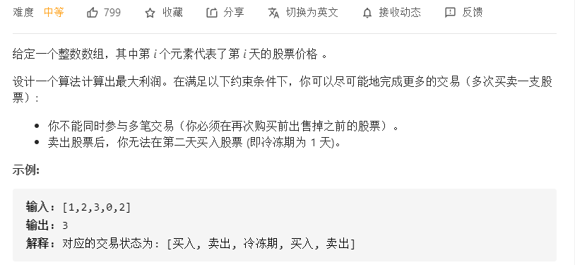

#### 思路：4个状态

当天状态如下：

- 0--买入
- 1--两天前卖出并且度过冷冻期，现在保持状态（还未进行下一次买入）
- 2--卖出
- 3--处于冷冻期，仅保持一天，也就是前一天是卖出状态

**状态定义：**`dp[i][j]`中，`i`表示第`i`天，`j∈[0,3]`，表示一天中的4个状态

**递推方程：**

- 对于`dp[i][0]`，也就是买入状态，有`3`种情况：

  - 前一天就买入，但是一直保持这种状态不操作，即`dp[i][0]=dp[i - 1][0]`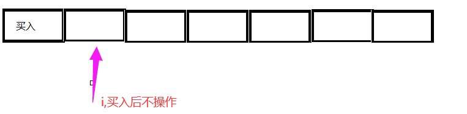
  - 今天买入，那么前一天有两种情况
    - 前一天是冷冻期，那么`dp[i][0]=dp[i - 1][3]-prices[i]`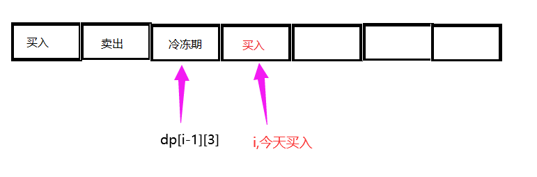
    - 两天前卖出并且度过冷冻期后，没有操作（至少一天），即`dp[i][0]=dp[i - 1][1]-prices[i]`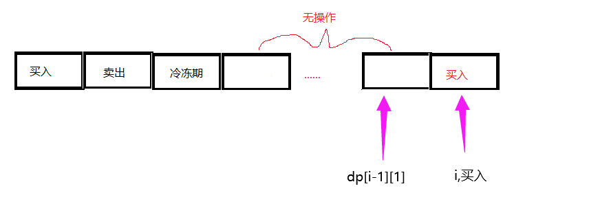

  取三者最大值。

- 对于`dp[i][1]`，有`2`种情况：

  - 前一天是冷冻期，`dp[i][1]=dp[i-1][3]`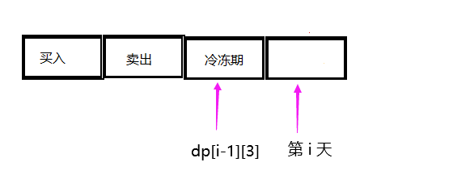
  - 两天前是冷冻期，但是还没买入，保持`dp[i][1]=dp[i-1][1]`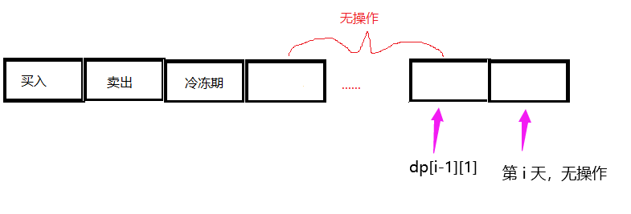

- 对于`dp[i][2]`，今天卖出，即`dp[i][2]=dp[i-1][0]+prices[i]`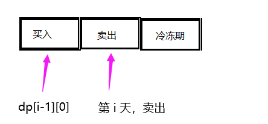

- 对于`dp[i][3]`，即今天冷冻期，那么就是前一天当天一定是卖出，即`dp[i][3]=dp[i - 1][2]`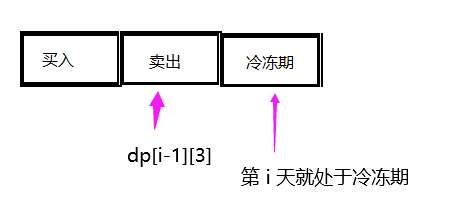

要时刻理解，**各个状态下的含义**，才不会晕头转向。整体代码如下：

```C++
class Solution {
public:
    int maxProfit(vector<int>& prices) {
        int n = prices.size();
        vector<vector<int>> dp(n, vector<int>(4, 0));
        dp[0][0] = -prices[0];
        for(int i = 1; i < n; i++){
            dp[i][0] = max(dp[i - 1][0], max(dp[i - 1][3], dp[i - 1][1]) - prices[i]); 
            dp[i][1] = max(dp[i - 1][1], dp[i - 1][3]);  
            dp[i][2] = dp[i - 1][0] + prices[i]; // 今天卖出股票
            dp[i][3] = dp[i - 1][2]; // 冷冻期，只保持 1 天
        }
        return max({dp[n - 1][1], dp[n - 1][2], dp[n - 1][3]});
    }
};
```


### 18.[714. 买卖股票的最佳时机含手续费](https://leetcode-cn.com/problems/best-time-to-buy-and-sell-stock-with-transaction-fee/)

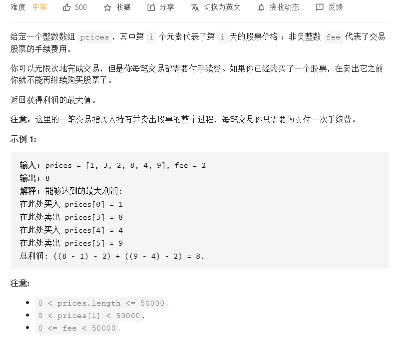

#### 思路：

相比于[122. 买卖股票的最佳时机 II](https://leetcode-cn.com/problems/best-time-to-buy-and-sell-stock-ii/)，本题多了一个手续费，那么只需要在卖出的时候支付手续费，就可以。另一个不同之处在于，本题多了手续费，也就是说有可能买入状态也可能是最大利润（当手续费高于所得时），所以返回值需要返回买入卖出两者的最大值。

122题代码如下：

```c++
class Solution {
public:
    int maxProfit(vector<int>& prices) {
        // dp[i][0] -- 第i天 持有 股票所得现金
        // dp[i][1] -- 第i天 不持有 股票所得现金
        vector<vector<int>> dp(prices.size(), vector<int>(2, 0));
        dp[0][0] = -prices[0];
        for(int i = 1; i < prices.size(); i++){
            dp[i][0] = max(dp[i - 1][0], dp[i - 1][1] - prices[i]); 
            dp[i][1] = max(dp[i - 1][1], dp[i - 1][0] + prices[i]);
        }
        return dp[prices.size() - 1][1];
    }
};
```

本题整体代码如下：

```c++
class Solution {
public:
    int maxProfit(vector<int>& prices, int fee) {
        int n = prices.size();
        // dp[i][0] -- 第i天 持有 股票所得现金
        // dp[i][1] -- 第i天 不持有 股票所得现金
        vector<vector<int>> dp(n, vector<int>(2, 0));
        dp[0][0] -= prices[0];
        for(int i = 1; i < n; i++){
            dp[i][0] = max(dp[i - 1][0], dp[i - 1][1] - prices[i]);
            dp[i][1] = max(dp[i - 1][1], dp[i - 1][0] + prices[i] - fee); // 卖出多了手续费
        }
        return max(dp[n - 1][0], dp[n - 1][1]);
    }
};
```

