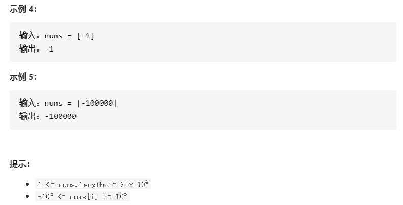
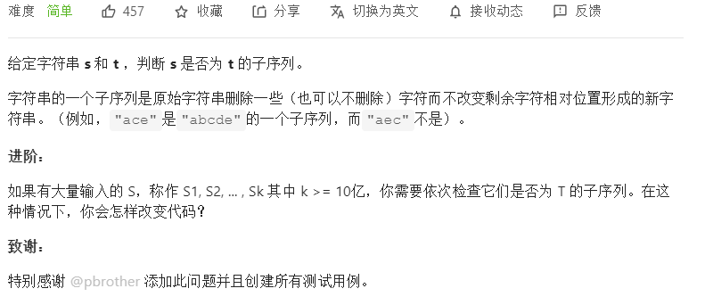
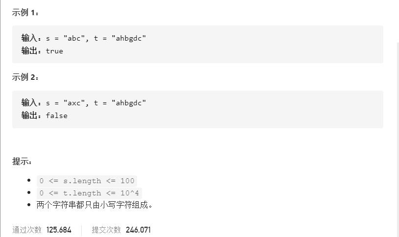
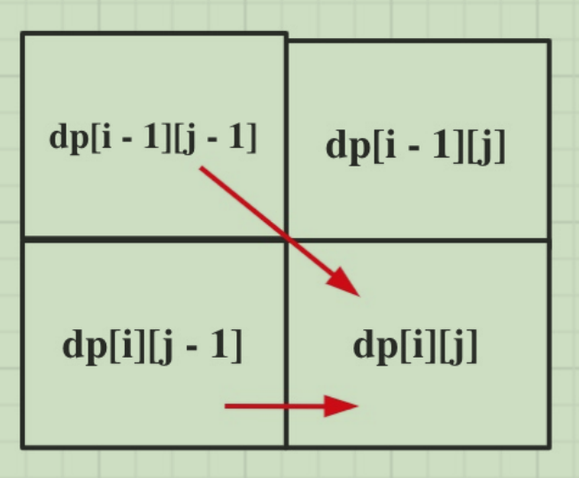
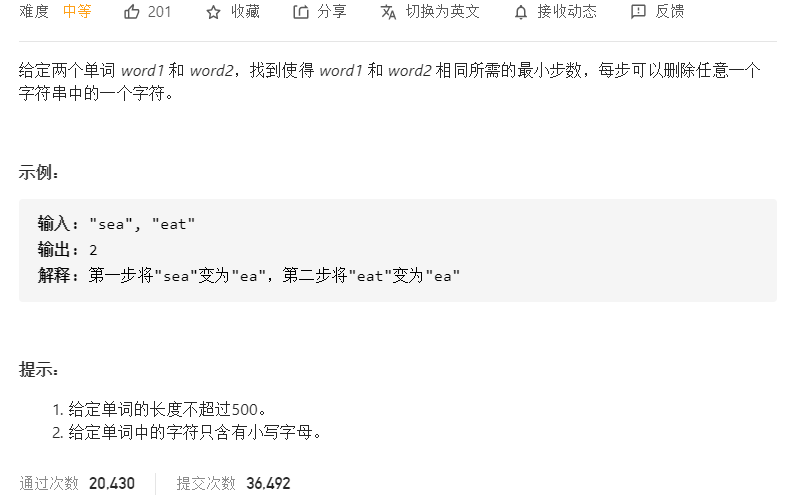
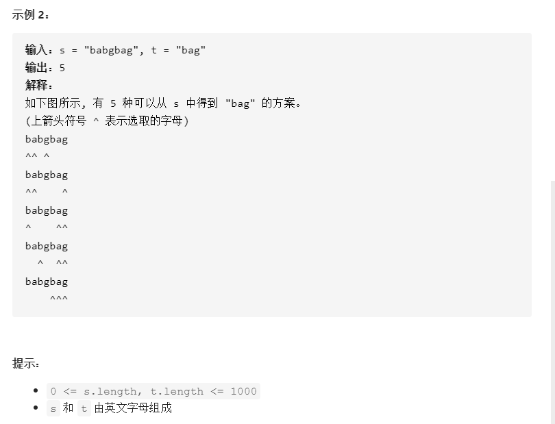
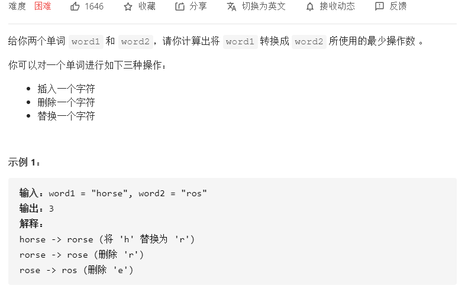
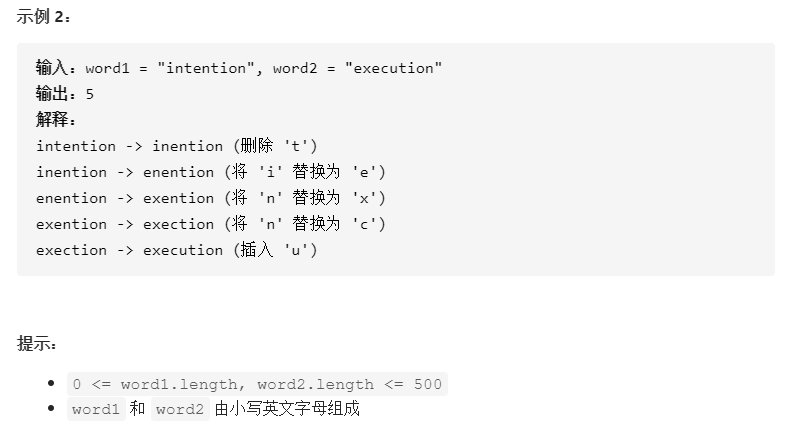

# 动态规划

## 1-20

参考微信公众号：`代码随想录`

### 1.[53. 最大子序和](https://leetcode-cn.com/problems/maximum-subarray/)




#### 思路：

定义状态dp[i]：到达下标i所得的最大子序和为dp[i]

动态转移方程：dp[i] = max(dp[i - 1] + nums[i], nums[i])；即当前最大子序和由两个方向递推而来：

1. 将当前元素nums[i]加入之前子序和
2. 将当前元素单独作为子序和

取两者的最大值，作为当前的最大子序和！

```c++
class Solution {
public:
    int maxSubArray(vector<int>& nums) {
        // DP
        // dp[i]--到达下标i所得的最大子序和为dp[i]
        vector<int> dp(nums.size());
        dp[0] = nums[0];
        int res = nums[0];
        for(int i = 1; i < nums.size(); i++){
            dp[i] = max(dp[i - 1] + nums[i], nums[i]);
            res = max(res, dp[i]);
        }
        return res;
    }
};
```

贪心如下：

```c++
class Solution {
public:
    int maxSubArray(vector<int>& nums) {
        if(nums.size() < 2) return nums[0];
        int res = INT_MIN;
        int sum = 0;
        for(int i = 0; i < nums.size(); i++){
            sum += nums[i];
            res = max(res, sum); // 每次保存最大子序和
            sum = max(sum, 0); // 如果子序和sum为负，则重置为0
        }
        return res;
    }
};
```

### 2.[392. 判断子序列](https://leetcode-cn.com/problems/is-subsequence/)





#### 思路：

定义状态：`dp[i][j]` -- 以 i-1 下标结尾的s字符串，与以 j-1 为结尾的字符串t，共同的子序列为`dp[i][j]`

状态转移：可以由两个方向得到

1. s[i - 1] == t[j - 1]，说明现在共同的序列在原来的基础上加1
2. s[i - 1] != t[j - 1]，说明现在共同的序列没改变，跟t[j - 2]那时的状态一样




```C++
class Solution {
public:
    bool isSubsequence(string s, string t) {
        // dp[i][j]--以 i-1 下标结尾的s字符串，与以 j-1 为结尾的字符串t
        // 共同的子序列为dp[i][j]
        vector<vector<int>> dp(s.size() + 1, vector<int>(t.size() + 1, 0));
        for(int i = 1; i <= s.size(); i++){ // 从上到下
            for(int j = 1; j <= t.size(); j++){ // 从左到右
                if(s[i - 1] == t[j - 1]) dp[i][j] = dp[i - 1][j - 1] + 1;
                else dp[i][j] = dp[i][j - 1];
            }
        }
        if(dp[s.size()][t.size()] == s.size()) return true;
        return false;
    }
};
```


### 3.[583. 两个字符串的删除操作](https://leetcode-cn.com/problems/delete-operation-for-two-strings/)



#### 思路：

**状态定义**：  `dp[i][j]`：以下标 i-1 为结尾的word1，与以下标 j-1 为结尾的word2，需要删除 `dp[i][j]`个字符，使当前word1、word2相等

**状态递推方程：**

对于当前word1与word2 `相等`需要删除 0 个，也就是跟上一次状态相同。

对于当前word1与word2`不相等`需要删除多少个字符能得到呢？由三个方向推得

1. word1删除一个
2. word2删除一个
3. word1、word2各删除一个

取三个的最小值即可。

**初始化：**以`word[i][0]`为例word1不为空，word2为空字符串，两个字符串要相等，那么要删除多少个字符？显然，删除 `i` 个


```c++
class Solution {
public:
    int minDistance(string word1, string word2) {
        int n1 = word1.size(), n2 = word2.size();
        // dp[i][j]：以下标 i-1 为结尾的word1，与以下标 j-1 为结尾的word2
        // 需要删除 dp[i][j] 个字符，使当前word1、word2相等
        vector<vector<int>> dp(n1 + 1, vector<int>(n2 + 1));
        for(int i = 0; i <= n1; i++) dp[i][0] = i;
        for(int j = 0; j <= n2; j++) dp[0][j] = j;
        for(int i = 1; i <= n1; i++){
            for(int j = 1; j <= n2; j++){
                if(word1[i - 1] == word2[j - 1]) dp[i][j] = dp[i - 1][j - 1];
                else{
                    dp[i][j] = min({dp[i - 1][j] + 1, dp[i][j - 1] + 1, dp[i - 1][j - 1] + 2});
                }
            }
        }
        return dp[n1][n2];
    }
};
```

### 4.[115. 不同的子序列](https://leetcode-cn.com/problems/distinct-subsequences/)




#### 思路：

**状态定义**：`dp[i][j]`：以下标 i-1 为结尾的s，含有以下标 j-1 为结尾的t的子序列的个数为 `dp[i][j]`

**状态递推方程**：分s[i-1]与t[j - 1]是否相等

1. 相等
   - ⼀部分是⽤s[i - 1]来匹配，那么个数为`dp[i - 1][j - 1]`。
   - ⼀部分是不⽤s[i - 1]来匹配，个数为`dp[i - 1][j]`。
2. 不相等：当前t是s的子序列的个数，跟t是s子序列`前一个`的状态一样，个数为`dp[i - 1][j]`

**初始化**:

1. `dp[i][0]`：s中含空字符串t的个数，为1
2. `dp[0][j]`：s为空，j不为空的情况下，不可能含有非空子序列t，所以为0
3. `dp[0][0]`：两个都为空字符串，所以为 1

```c++
class Solution {
public:
    int numDistinct(string s, string t) {
        // dp[i][j]：以下标 i-1 为结尾的s，含有以下标 j-1 为结尾的t
        // 的子序列的个数为 dp[i][j]
        int n1 = s.size(), n2 = t.size();
        if(n1 < n2) return 0;
        vector<vector<unsigned long long>> dp(n1 + 1, vector<unsigned long long>(n2 + 1));
        for(int i = 0; i <= n1; i++) dp[i][0] = 1;
        for(int j = 1; j <= n2; j++) dp[0][j] = 0;
        for(int i = 1; i <= n1; i++){
            for(int j = 1; j <= n2; j++){
                if(s[i - 1] == t[j - 1]) dp[i][j] = dp[i - 1][j - 1] + dp[i - 1][j];
                else dp[i][j] = dp[i - 1][j]; 
            }
        }
        return dp[n1][n2];
    }
};
```


### 5.[72. 编辑距离](https://leetcode-cn.com/problems/edit-distance/)





