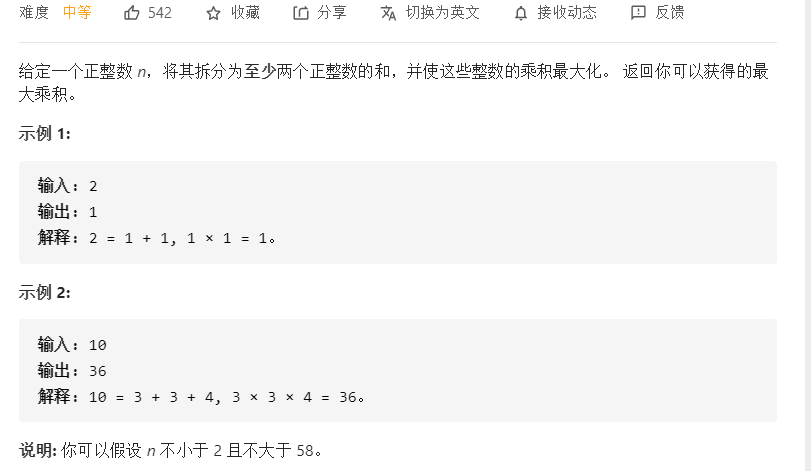
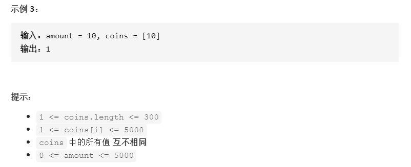

# 动态规划1

## 基础系列


### 1.[509. 斐波那契数](https://leetcode-cn.com/problems/fibonacci-number/)


**思路：**动态递推方程已经给出，初始化也已经给出。递推顺序从前往后，因为每一个位置都需要由前面的递推而来。

常规定义`dp[i]`如下：

```c++
class Solution {
public:
    int fib(int n) {
        if(n < 2) return n;
        //dp[i]--第 i 个数字对应的斐波那契数字为dp[i]
        vector<int> dp(n + 1);
        // 初始化
        dp[0] = 0;
        dp[1] = 1;
        for(int i = 2; i <= n; i++){
            dp[i] = dp[i - 1] + dp[i - 2];
        }
        return dp[n];
    }
};
```

每一个状态都只依赖前两个，优化代码如下：

```c++
class Solution {
public:
    int fib(int n) {
        if(n < 2) return n;
        int a = 0, b = 1, sum = 0;
        for(int i = 2; i <= n; i++){
            sum = a + b;
            a = b;
            b = sum;
        }
        return sum;
    }
};
```


### 2.[70. 爬楼梯](https://leetcode-cn.com/problems/climbing-stairs/)


**思路：**这题跟[509. 斐波那契数](https://leetcode-cn.com/problems/fibonacci-number/)本质上是同一题。只不过初始化不太一样。

**状态定义：**`dp[i]`：爬上`i`阶楼梯有dp[i]种方法

**递推方程：**对于`dp[i]`，也就是要爬上第`i`阶楼梯，可以怎么爬？

1. 可以从第`i - 1`阶爬`1`阶，有`dp[i-1]`种方法
2. 可以从第`i - 2`阶爬`2`阶，有`dp[i-2]`种方法

所以，`dp[i]`是可以从两个位置跳上来，那就是两个方法的和，即`dp[i] = dp[i-1] + dp[i-2]`

**初始化：**由题目中`n`是一个正整数，`n>=1`。跳上一阶台阶，只有一种方法，即`dp[1]=1`，跳上2阶台阶，可以从1阶跳1，可以从0阶跳2，那么`dp[2]=2`

**遍历顺序：**每一项都是由前面的推导而来，所以需要从前往后遍历。


整体代码如下：

```c++
class Solution {
public:
    int climbStairs(int n) {
        if(n <= 3) return n;
        vector<int> dp(n + 1);
        dp[1] = 1;
        dp[2] = 2;
        for(int i = 3; i <= n; i++){
            dp[i] = dp[i - 1] + dp[i - 2];
        }
        return dp[n];
    }
};
```

优化代码如下：

```c++
class Solution {
public:
    int climbStairs(int n) {
        if(n <= 3) return n;
        int a = 1, b = 2, sum = 0;
        for(int i = 3; i <= n; i++){
            sum = a + b;
            a = b;
            b = sum;
        }
        return sum;
    }
};
```

#### 改编：爬楼梯2.0

改为：⼀步⼀个台阶，两个台阶，三个台阶，**.......**，直到 **m**个台阶（描述为nums={1,2,3,...,m}）。问有多少种不同的⽅法可以爬到楼顶呢？

跟[377. 组合总和 Ⅳ](https://leetcode-cn.com/problems/combination-sum-iv/)完全一样了。

也就是说楼顶n是背包，⼀步⼀个台阶，两个台阶，三个台阶，**.......**，直到 **m**个台阶为物品，每一种步法都可以任意次。那么就是完全背包问题。


**状态定义：**`dp[j]`表示到达`j`层有`dp[j]`种方法

**递推方程：**`dp[j] += dp[j - nums[i]]`，刚好装满背包一般公式

**初始化：**`dp[0]=1`

**遍历方向：**比如到3层，可以（1， 2）,也可以(2, 1），即求排列数，外层背包，内层物品

整体代码如下：

```c++
class Solution {
public:
    int climbStairs(int n) {
        vector<int> dp(n + 1);
        dp[0] = 1;
        for(int j = 1; j <= n; j++){ // 背包
            for(int i = 1; i <= m; i++){ // 物品:一次一步、2步、3步...m步
                if((j - i) >= 0 && dp[j] < (INT_MAX - dp[j - i])){
                    dp[j] += dp[j - i];
                }
            }
        }
        return dp[n];
    }
};
```

对应本题，一次最多走2步，即m=2，即可AC。

### 3.[746. 使用最小花费爬楼梯](https://leetcode-cn.com/problems/min-cost-climbing-stairs/)


**思路：**这题最需要注意的是这句话`每当你爬上一个阶梯你都要花费对应的体力值，一旦支付了相应的体力值，你就可以选择向上爬一个阶梯或者爬两个阶梯`。也就是说当你在第 `0`个台阶的时候，就已经支付了体力值`cost[0]`

**状态定义**：`dp[i]`：跳到第 `i`层需要的最低体力消费为`dp[i]`

**递推方程：**`dp[i]`可以由两个方向跳上来，那么选择两个中耗费体力较小的那个即可，结合题意，跳上`i`层后，是需要先支付体力值的，即`dp[i] = min(dp[i-1], dp[i-2])+cost[i]`

**初始化：**在第 `0`层就什么也不用做，但是得支付体力值，即`dp[0]=cost[0]`。在第`1`层`dp[1] = cost[1]`，至于为甚么？看题解，存在争议，有一个解释说可以选择从前两个开始作为起始点，这倒也说的通。先跳过，不纠结。

**遍历顺序：**从前往后，没什么好说的。


整体代码如下：

```c++
class Solution {
public:
    int minCostClimbingStairs(vector<int>& cost) {
        // dp[i]--跳到下标位置为i的最低花费为dp[i]
        vector<int> dp(cost.size(), 0);
        // 初始化
        dp[0] = cost[0];
        dp[1] = cost[1];
        for(int i = 2; i < cost.size(); i++){
            dp[i] = min(dp[i - 1], dp[i - 2]) + cost[i];
        }
        return min(dp[cost.size() - 2], dp[cost.size() - 1]);
    }
};
```


### 4.[62. 不同路径](https://leetcode-cn.com/problems/unique-paths/)


**思路：**用二维矩阵来模拟

**状态定义：**`dp[i][j]`-- 从`dp[0][0]`到`dp[i][j]`不同的路径有`dp[i][j]`

**递推方程：**对于每一个位置（i,j >=1），可以由上面、左边得到

那么`dp[i][j] = dp[i - 1][j] + dp[i][j - 1]`

**初始化：**对于第一行，第一列的位置来说，只有一条路径，以第一行为例，行走规则是只能向下或者向右移动，那么它的每一个位置只能由左边推导而来，只有这一种方法，那么`dp[0][j]=1`。第一列，同理。

整体代码如下：

```c++
class Solution {
public:
    int uniquePaths(int m, int n) {
        // dp[i][j]-- 从dp[0][0]到dp[i][j]不同的路径有dp[i][j]
        vector<vector<int>> dp(m, vector<int>(n, 0));
        // 初始化
        for(int i = 0; i < m; i++) dp[i][0] = 1;
        for(int j = 0; j < n; j++) dp[0][j] = 1;
        for(int i = 1; i < m; i++){
            for(int j = 1; j < n; j++){
                dp[i][j] = dp[i - 1][j] + dp[i][j - 1];
            }
        }
        return dp[m - 1][n - 1];
    }
};
```


### 5.[63. 不同路径 II](https://leetcode-cn.com/problems/unique-paths-ii/)


**思路：**用二维矩阵来模拟

**状态定义：**`dp[i][j]`-- 从`dp[0][0]`到`dp[i][j]`不同的路径有`dp[i][j]`

**递推方程：**对于每一个位置（i,j >=1）且`没有障碍`，可以由上面、左边得到;

那么`dp[i][j] = dp[i - 1][j] + dp[i][j - 1]`

而对于位置上存在障碍的，是不可能到达的，所以是`0`。

**初始化：**对于第一行，第一列的位置来说，只有一条路径。以第一行为例，行走规则是只能向下或者向右移动，那么它的每一个位置只能由左边推导而来，只有这一种方法，那么`dp[0][j]=1`。但是遇到障碍的时候，后面的就走不通，方法是0。第一列，同理。


整体代码如下：

```c++
class Solution {
public:
    int uniquePathsWithObstacles(vector<vector<int>>& obstacleGrid) {
        // dp[i][j]-- 从dp[0][0]到dp[i][j]不同的路径有dp[i][j]
        int m = obstacleGrid.size(), n = obstacleGrid[0].size();
        vector<vector<int>> dp(m, vector<int>(n, 0));
        // 初始化
        for(int i = 0; i < m && obstacleGrid[i][0] == 0; i++) dp[i][0] = 1;
        for(int j = 0; j < n && obstacleGrid[0][j] == 0; j++) dp[0][j] = 1;
        for(int i = 1; i < m; i++){
            for(int j = 1; j < n; j++){
                if(obstacleGrid[i][j] == 0) dp[i][j] = dp[i - 1][j] + dp[i][j - 1];
            }
        }
        return dp[m - 1][n - 1];
    }
};
```


### 6.[343. 整数拆分](https://leetcode-cn.com/problems/integer-break/)



**动态规划：**

**状态定义：**`dp[i]`--拆分数字`i`获得的最大乘积为`dp[i]`

**递推方程：**有两种拆分方式

1. 第一种是`i`直接拆分成`j, i - j`两个数(也就是不拆分`i-j`)，即`dp[i] =  j * (i - j)`
2. 第二种是拆分`i-j`，那么就是`dp[i] =  j * dp[i - j]`

取两者最大值，因为每次`j`从`1`开始遍历到`i-1`，那么对于`dp[i]`也是需要**保住本轮遍历的最大值**，那么最终递推方程如下：

```c++
dp[i] = max( dp[i], max(dp[i - j] * j, (i - j) * j) )
```

**初始化：**`dp[0]、dp[1]`的拆分没有意义，所以从`dp[2]`开始拆分赋值为`1、1`，乘积为`1`

**遍历顺序：**从前往后

整体代码如下：

```c++
class Solution {
public:
    int integerBreak(int n) {
        // dp[i]--拆分数字i获得的最大乘积为dp[i]
        vector<int> dp(n + 1);
        dp[2] = 1;
        for(int i = 3; i <= n; i++){
            for(int j = 1; j <= i - 1; j++){
                dp[i] = max( dp[i], max(dp[i - j] * j, (i - j) * j) );
            }
        }
        return dp[n];
    }
};
```

**贪心**，跟[剑指 Offer 14- I. 剪绳子](https://leetcode-cn.com/problems/jian-sheng-zi-lcof/)、[剑指 Offer 14- II. 剪绳子 II](https://leetcode-cn.com/problems/jian-sheng-zi-ii-lcof/)是同一题，只要涉及把整数拆分求乘积最大，都是尽可能的拆成每一段为`3`

```c++
class Solution {
public:
    int integerBreak(int n) {
        if(n <= 3) return n - 1;
        int a = n / 3, b = n % 3;
        // b = 0, 1, 2
        if(b == 0) return pow(3, a);
        if(b == 1) return pow(3, a - 1) * 4;
        return pow(3, a) * 2;
    }
};
```


### 7.01背包二维数组

有N件物品和⼀个最多能装重量为W 的背包。第i件物品的重量是weight[i]，得到的价值是value[i] 。

每件物品只能⽤⼀次，求解将哪些物品装⼊背包⾥物品**价值总和最⼤**。


**状态定义：**`dp[i][j] `表示从下标为`[0-i]`的物品⾥任意取，放进容量为`j`的背包，价值总和最⼤是`dp[i][j] `

**递推方程：**

1. 背包容量放不下当前物品容量时，`dp[i][j] = dp[i - 1][j]`

2. 可以放下时，

   - 不选择放入，`dp[i][j] = dp[i - 1][j]`
   - 选择放入，`dp[i][j]dp[i - 1][j - weight[i]] + value[i]`

   取最大值，即`dp[i][j] = max(dp[i - 1][j], dp[i - 1][j - weight[i]] + value[i])`

**初始化：**

1. `dp[i][0]`，即背包容量为`0`情况下，放物品产生最大价值，都没有容量放了，价值当然为`0`
2. `dp[0][j]`，将第`0`个物品放入容量为`j`的背包上，产生的价值，那么只要能够放下，都是`value[0]`

注意：如果题⽬给的价值有负数，那么⾮0下标就要初始化为**负⽆穷**了。例如：⼀个物品的价值是-2，但对应的位置依然初始化为0，那么取最⼤值的时候，就会取0⽽不是-2了，所以要初始化为负⽆穷。

本题初始化后如下：


**遍历方向：**

先遍历物品，再遍历背包

OR 先遍历背包，再遍历物品都可以！

`dp[i][j] = max(dp[i - 1][j], dp[i - 1][j - weight[i]] + value[i])`; 递归公式中可以看出`dp[i][j]`是靠``dp[i-1][j]`和`dp[i - 1][j - weight[i]]`推导出来的。

`dp[i-1][j]`和`dp[i - 1][j - weight[i]] `都在`dp[i][j]`的左上⻆⽅向（包括正左和正上两个⽅向），那么先遍历物品，再遍历背包的过程如图所示：


再来看看先遍历背包，再遍历物品呢，如图：


都是一样的，不影响`dp[i][j]`的推导。这里我选择先遍历物品容量，再遍历背包容量~

**举例推导：**


比如`dp[2][4]`，从物品`0~2`选，每件只能选一次，那么可供选择的方案：

1. 取物品`0、1`，取物品`2`，价值`35`
2. 物品物品`0、1`不取，取物品`2`，价值`30`

取最大，即`dp[2][4]=35`


```c++
void test_2_wei_bag_problem1() {
     vector<int> weight = {1, 3, 4};
     vector<int> value = {15, 20, 30};
     int bagWeight = 4;
     // ⼆维数组
     vector<vector<int>> dp(weight.size() + 1, vector<int>(bagWeight + 1, 0));
     // 初始化
     for (int j = bagWeight; j >= weight[0]; j--) {
        dp[0][j] = dp[0][j - weight[0]] + value[0];
     }
     // weight数组的⼤⼩ 就是物品个数
     for(int i = 1; i < weight.size(); i++) { // 遍历物品
         for(int j = 0; j <= bagWeight; j++) { // 遍历背包容量
             if (j < weight[i]) dp[i][j] = dp[i - 1][j];
             else dp[i][j] = max(dp[i - 1][j], dp[i - 1][j - weight[i]] + value[i]);
     	}
     }
}
```


### 8.01背包一维数组

**状态定义：**`dp[j]`：容量为j的背包所能装物品的最大价值为`dp[j]`

**递推方程：**`dp[j]=max(dp[j], dp[j - weight[i]] + value[i])`

**初始化：**价值最低为0，初始化为0.如果价值有负的，初始化为最小值。

**遍历顺序：**这里只能先遍历物品，再遍历背包！

**举例推导：**


整体代码如下：

```c++
void test_1_wei_bag_problem() {
     vector<int> weight = {1, 3, 4};
     vector<int> value = {15, 20, 30};
     int bagWeight = 4;
     vector<int> dp(bagWeight + 1, 0); // 初始化
     for(int i = 0; i < weight.size(); i++) { // 遍历物品
         for(int j = bagWeight; j >= weight[i]; j--) { // 遍历背包容量
         	dp[j] = max(dp[j], dp[j - weight[i]] + value[i]);
         }
     }
     cout << dp[bagWeight] << endl;
}
```


### 9.[416. 分割等和子集](https://leetcode-cn.com/problems/partition-equal-subset-sum/)


**思路：**能不能划分为两个等和子集，那么每个子集等于数组全部元素和的一半。那么只要整个数组能够刚好凑出和的一半，整个就是能够划分的。特殊情况：对于和为奇数的，肯定是不能够划分的。

对应01背包，那么就是从数组中找出数字，能够刚好塞满背包容量为和一半

```
背包容量：bagWeight
物品重量：每个元素数值
物品价值：每个元素数值
问题转化：能不能 刚好 塞满bagWeight
```

**状态定义：**`dp[j]`，容量为`j`的背包装的物品最大和为`dp[j]`

其他跟01背包一样。

这里根据题意，最后判断`dp[bagWeight] 是否等于 bagWeight`即可

```c++
class Solution {
public:
    bool canPartition(vector<int>& nums) {
        int sum = accumulate(nums.begin(), nums.end(), 0);
        if(sum % 2 == 1) return false;
        int bagWeight = sum / 2;
        vector<int> dp(bagWeight + 1, 0);
        for(int i = 0; i < nums.size(); i++){
            for(int j = bagWeight; j >= nums[i]; j--){
                dp[j] = max(dp[j], dp[j - nums[i]] + nums[i]);
            }
        }
        return dp[bagWeight] == bagWeight ? true : false;
    }
};
```


### 10.[1049. 最后一块石头的重量 II](https://leetcode-cn.com/problems/last-stone-weight-ii/)


**思路：**本题跟[416. 分割等和子集](https://leetcode-cn.com/problems/partition-equal-subset-sum/)思路差不多。对于等分成两份，都可以考虑一下01背包。那么这题的话就是要求两个子集尽可能的相等，那么相互抵消的就越大，剩下的值就越小。

那么问题转化为先最大可能塞满容量为总和一半的背包`dp[bagWeight]`，那么另一个子集就是`sum - dp[bagWeight]`。最终结果是两者之差。

**状态定义：**`dp[j]`表示尽可能装满容量为`j`的背包，和为`dp[j]`

其他都跟01背包差不多。

```c++
class Solution {
public:
    int lastStoneWeightII(vector<int>& stones) {
        int sum = accumulate(stones.begin(), stones.end(), 0);
        int bagWeight = sum / 2;
        vector<int> dp(bagWeight + 1, 0);
        for(int i = 0; i < stones.size(); i++){
            for(int j = bagWeight; j >= stones[i]; j--){
                dp[j] = max(dp[j], dp[j - stones[i]] + stones[i]);
            }
        }
        return (sum - dp[bagWeight]) - dp[bagWeight];
    }
};
```


### 11.[494. 目标和](https://leetcode-cn.com/problems/target-sum/)


**思想：**假设数组总和为`sum`，添加"+"的整数和为`x`，那么添加“-”的整数和为`sum - x`，根据题意，要求`target = x - (sum - x)`有几种方法。

转化为`x = (sum + target) / 2`，那么装满容量为`x`的背包，**方法有多少种的问题**

这里要考虑**向下取整**的问题，比如`sum = 5, target = 2`是不可能的（可以用示例1推导下）。

```c++
if((sum + target) % 2 == 1) return 0;
```

**状态定义：**`dp[j]`，装满容量为`j`的背包，有`dp[j]`种方法

**递推方程：**`dp[j] += dp[j - nums[i]]`，**背包解决排列组合问题也是是这个方程！！！**

有哪些来源可以推出`dp[j]`呢？

不考虑`nums[i]`的情况下，填满容量为`j - nums[i]`的背包，有`dp[j - nums[i]]`种⽅法。

那么对于背包容量已经达到`j - nums[i]`的背包，只要搞到`nums[i]`的话，凑成`dp[j]`就有`dp[j - nums[i]]` 种⽅法(也就是说从`j - nums[i]`到 `j`，可以用到`j - nums[i]`的方法，即`dp[j - nums[i]]`)

**初始化：**最初都是`1`，因为后面的由前面的累加而来，如果是`0`那么无论怎么推导都是`0`。dp[0] = 1，理论上也很好解释，装满容量为0的背包，有1种⽅法，就是装0件物品。

**遍历顺序：**nums放在外循环，target在内循环，且内循环倒序

整体代码如下：

```c++
class Solution {
public:
    int findTargetSumWays(vector<int>& nums, int target) {
        int sum = accumulate(nums.begin(), nums.end(), 0);
        if((sum + target) % 2 == 1) return 0; //没有方法
        int bagWeight = (sum + target) / 2;
        vector<int> dp(bagWeight + 1);
        dp[0] = 1;
        for(int i = 0; i < nums.size(); i++){
            for(int j = bagWeight; j >= nums[i]; j--){
                dp[j] += dp[j - nums[i]];
            }
        }
        return dp[bagWeight];
    }
};
```


### 12.[474. 一和零](https://leetcode-cn.com/problems/ones-and-zeroes/)


**思路：**题意也不好理解。就是找出字符串strs的子集中，含有`m`个`0`，`n`个`1`，找出的这个子集还得是最大子集。

把m、n看做两个背包的最大容量，那么就是从strs中找出塞满它们的最大集合

**状态定义：**`dp[i][j]`表示最多有**i**个**0**和**j**个**1**的**strs**的最⼤⼦集的⼤⼩为`dp[i][j]`

**递推方程：**`dp[i][j] `可以由前⼀个`strs`⾥的字符串推导出来，strs⾥的字符串有zeroNum个0，oneNum个1。`dp[i][j] `就可以是 `dp[i - zeroNum][j - oneNum] + 1`，有点难理解。可以这样理解，在已经有了zeroNum个0、oneNum个1情况下，要到达**i**个**0**和**j**个**1**的**strs**的最⼤⼦集，不就是在zeroNum个0、oneNum个1**加上一个子集**？这个新加的子集有i - zeroNum个0，j - oneNum个1。

**初始化：**01背包初始化为0即可

**遍历顺序：**外层物品从前往后，内层二维背包，从后往前

整体代码如下：

```c++
class Solution {
public:
    int findMaxForm(vector<string>& strs, int m, int n) {
        vector<vector<int>> dp(m + 1, vector<int>(n + 1, 0));
        for(auto str:strs){ // 遍历物品
            int zeroNum = 0, oneNum = 0;
            for(char c:str){
                if(c == '0') zeroNum++;
                else oneNum++;
            }
            for(int i = m; i >= zeroNum; i--){ // 遍历2个维度上的背包
                for(int j = n; j >= oneNum; j--){
                    dp[i][j] = max(dp[i][j], dp[i - zeroNum][j - oneNum] + 1);
                }
            }
        }
        return dp[m][n];
    }
};
```


### 13.纯完全背包

有N件物品和⼀个最多能背重量为W的背包。第i件物品的重量是weight[i]，得到的价值是value[i] 。每件

物品都有⽆限个（也就是可以放⼊背包多次），求解将哪些物品装⼊背包⾥物品价值总和最⼤。

不同之处：

1. **完全背包和01背包问题唯⼀不同的地⽅就是，每种物品有⽆限件。**
2. 01背包和完全背包唯**⼀不同就是体现在遍历顺序上**
   - 01背包中⼆维dp数组的两个for遍历的先后循序是可以颠倒了，**⼀维dp数组**的两个for循环先后循序⼀定是先遍历物品，再遍历背包容量
   - 在完全背包中，对于⼀维**dp**数组来说，其实两个**for**循环嵌套顺序同样⽆所谓！

遍历时，物品初始值**一般**从0开始，背包是从**bag[0]**开始，具体问题具体分析。一般先这样代入试试。

整体代码如下：

```c++
// 先遍历物品，在遍历背包
void test_CompletePack() {
     vector<int> weight = {1, 3, 4};
     vector<int> value = {15, 20, 30};
     int bagWeight = 4;
     vector<int> dp(bagWeight + 1, 0);
     for(int i = 0; i < weight.size(); i++) { // 遍历物品
         for(int j = weight[i]; j <= bagWeight; j++) { // 遍历背包容量
         dp[j] = max(dp[j], dp[j - weight[i]] + value[i]);
         }
     }
 	cout << dp[bagWeight] << endl; 
}
```

以上可以颠倒只针对于纯完全背包问题，如果题目变化一下，可能就需要改变遍历顺序了。


### 14.[518. 零钱兑换 II](https://leetcode-cn.com/problems/coin-change-2/)




**思路：**本题说硬币个数是无限个，所以是完全背包问题。

在求**装满背包有⼏种⽅案**的时候，认清遍历顺序是⾮常关键的。

1. **组合数：外层for循环遍历物品，内层for遍历背包。**
2. **排列数：外层for遍历背包，内层for循环遍历物品。**

**简单记忆：**`组合数，外物品，内背包`，跟01背包遍历顺序一致。排列正好相反。


**状态定义：**`dp[j]`表示凑成总金额为`j`的硬币，总共有`dp[j]`种方法

递推方程：求装满背包的方法数，一般都是`dp[j] += dp[j - coins[i]]`

整体代码如下：

```c++
class Solution {
public:
    int change(int amount, vector<int>& coins) {
        vector<int> dp(amount + 1);
        dp[0] = 1;
        for(int i = 0; i < coins.size(); i++){ // 物品
            for(int j = coins[i]; j <= amount; j++){ // 背包
                dp[j] += dp[j - coins[i]];
            }
        }
        return dp[amount];
    }
};
```


### 15.[322. 零钱兑换](https://leetcode-cn.com/problems/coin-change/)


**思路：**相比于[518. 零钱兑换 II](https://leetcode-cn.com/problems/coin-change-2/)，本题是求能够装满背包的最少硬币数。排列或者组合都可以。这里选组合。

**状态定义：**dp[j]表示凑成总金额为j所需要的最小硬币数为dp[j]

递推方程：对于当前硬币金额**coins[i]**，凑成金额为**j**，那么就是凑成金额**j - coins[i]**的最少硬币上再加上**coins[i]**这个硬币。所以`dp[j] = dp[j - coins[i]] + 1`，要取遍历的最小值，最终`dp[j] = min(dp[j], dp[j - coins[i]] + 1)`

**初始化：**dp[0]凑成金额为0的最少硬币数自然是0。因为是取最小，所以**其他初始化为最大**（`dp[j]=INT_MAX`），这样可以保证取到最小。**一般取最小，初始值设置为最大，取最大，初始值设置为最小（小技巧）**。

**遍历顺序：**无所谓，既不是求组合也不是求排列。


有几个细节还是**要注意**，比如循环里的判断条件，以及返回的判断。

整体代码如下：

```c++
class Solution {
public:
    int coinChange(vector<int>& coins, int amount) {
        vector<int> dp(amount + 1, INT_MAX);
        dp[0] = 0;
        for(int i = 0; i < coins.size(); i++){ // 物品
            for(int j = coins[i]; j <= amount; j++){ // 背包
                if(dp[j - coins[i]] != INT_MAX){ //减去硬币金额不为最大，才能凑成
                    dp[j] = min(dp[j], dp[j - coins[i]] + 1);
                }
            }
        }
        return dp[amount] == INT_MAX ? -1 : dp[amount];
    }
};
```


### 16.[377. 组合总和 Ⅳ](https://leetcode-cn.com/problems/combination-sum-iv/)


**思路：**由实例1中一个可能组合（1,1,1,1）可以看到，元素可以取任意次。对应完全背包。

由（1,1,2）、（2,1,1）看出，这是求排列问题。所以遍历顺序外层背包，内层物品。

**状态定义：**`dp[j]`表示刚好装满容量为`j`的背包，有`dp[j]`种方法

**递推方程：**`dp[j] += dp[j - nums[i]]`，求刚好装满一般都是这个递推公式

**初始化：**dp[0]=1，没有实际含义，为递推做贡献

**遍历方向：**遍历顺序外层背包，内层物品

**举例推导：**


注意：`dp[j] < (INT_MAX - dp[j - nums[i]])`，不能写成`(dp[j] + dp[j - nums[i]]) < INT_MAX`，会溢出！

整体代码如下：

```c++
class Solution {
public:
    int combinationSum4(vector<int>& nums, int target) {
        vector<int> dp(target + 1);
        dp[0] = 1;
        for(int j = 0; j <= target; j++){ // 背包
            for(int i = 0; i < nums.size(); i++){ // 物品
                if((j - nums[i]) >= 0 && dp[j] < (INT_MAX - dp[j - nums[i]])){ // 注意这个判断很重要，防止溢出
                    dp[j] += dp[j - nums[i]];
                }
            }
        }
        return dp[target];
    }
};
```


### 17.[279. 完全平方数](https://leetcode-cn.com/problems/perfect-squares/)


**思路：**完全平方数就是物品（任意个），和n就是背包容量。那么本题就是求塞满容量为n的背包所需要的最小物品数。跟[322. 零钱兑换](https://leetcode-cn.com/problems/coin-change/)是一样的，只不过物品换了个说法

**状态定义：**`dp[j]`表示凑成背包容量为`j`，需要最少的完全平方个数为`dp[j]`

**递推方程：**`dp[j] = min(dp[j], dp[j - i * i] + 1)`

对于容量`j`，可以由`j - i * i`加上当前i的完全平方来凑，那么就是在最少的`j - i * i`基础上，再加上一个，即`dp[j - i * i] + 1`

然后保存一次遍历中dp[j]的最小值，需要`dp[j] = min(dp[j], dp[j - i * i] + 1)`

**初始化：**dp[0] = 0，dp[1]=1

**遍历顺序：**跟排列、组合无关，因此顺序无关。这里先物品，再背包。


整体代码如下：

```c++
class Solution {
public:
    int numSquares(int n) {
       vector<int> dp(n + 1, INT_MAX);
       dp[0] = 0;
       for(int i = 1; i * i <= n; i++){ // 物品i * i > n的话就肯定凑不齐n了
           for(int j = 1; j <= n; j++){ // 背包
               if((j - i * i) >= 0 && dp[j - i * i] <= (INT_MAX - 1)){
                   dp[j] = min(dp[j], dp[j - i * i] + 1);
               }
           }
       } 
       return dp[n] == INT_MAX ? -1 : dp[n];
    }
};
```


### 18.[139. 单词拆分](https://leetcode-cn.com/problems/word-break/)


**思想：**可以重复使用，也就是说可以使用任意次，想到完全背包。这里wordDict列表里的字符串对应物品，非空字符串s对应背包。整个问题可以转化为：有这些物品，能否要装满容量为s.size()的背包

**状态定义：** 字符串⻓度为**i**的话，**dp[i]**为**true**，表示可以拆分为⼀个或多个在字典中出现的单词

**递推方程：**如果s[j, i]这段区间的字符串出现在字典里，那么dp[j]一定是true。那么递推条件是

```c++
if([j, i] 这个区间的⼦串出现在字典⾥ && dp[j]是true){
	dp[i] = true
}
```

**初始化：**dp[0]=true，初始为false那么后面怎么推都是false。其他初始化为false

**遍历顺序：**无关排列、组合。所以都是可以的。这里先遍历背包，再遍历物品。对每一个背包容量，看能否用物品凑齐。

**举例推导：**


整体代码如下：

```c++
class Solution {
public:
    bool wordBreak(string s, vector<string>& wordDict) {
        unordered_set<string> wordSet(wordDict.begin(), wordDict.end());
        vector<bool> dp(s.size() + 1, false);
        dp[0] = true;
        for(int i = 1; i <= s.size(); i++){ // 背包
            for(int j = 0; j < i; j++){ // 物品
                string wordSub = s.substr(j, i - j);
                if(wordSet.find(wordSub) != wordSet.end() && dp[j] == true){
                    dp[i] = true;
                }
            }
        }
        return dp[s.size()];
    }
};
```

回溯法如下：

```c++
class Solution {
private:
     bool backtracking (const string& s,const unordered_set<string>& wordSet, 	
     vector<int>& memory,int startIndex) {
         if (startIndex >= s.size()) return true;
         // 如果memory[startIndex]不是初始值了，直接使⽤memory[startIndex]的结果
         if (memory[startIndex] != -1) return memory[startIndex];
         for (int i = startIndex; i < s.size(); i++) {
             string word = s.substr(startIndex, i - startIndex + 1);
             if (wordSet.find(word) != wordSet.end() 
                && backtracking(s, wordSet, memory, i + 1)){
                 memory[startIndex] = 1; // 记录以startIndex开始的⼦串是可以被拆分的
                 return true;
            }
         }
         memory[startIndex] = 0; // 记录以startIndex开始的⼦串是不可以被拆分的
         return false;
 }
public:
 bool wordBreak(string s, vector<string>& wordDict) {
     unordered_set<string> wordSet(wordDict.begin(), wordDict.end());
     vector<int> memory(s.size(), -1); // -1 表示初始化状态
     return backtracking(s, wordSet, memory, 0);
 }
};
```


### 19.[198. 打家劫舍](https://leetcode-cn.com/problems/house-robber/)


**思路：**对于第`i`（`i >=2`）号房子，那么可以选择偷，也可以选择不偷，看这两者如何取才能最大了

**状态定义：**`dp[i]`表示到`i`位置所能偷窃到的最高金额为`dp[i]`

**递推方程：**对于对于第`i`（`i >=2`）号房子，

1. 偷，`dp[i]=dp[i - 2]+nums[i]`
2. 不偷，`dp[i]=dp[i-1]`，这里并不是说真的偷前一家（不符合题中不能偷相邻两家），而是说跟前一个状态一样

所以两者取最大，即`dp[i]=max(dp[i-1], dp[i-2]+nums[i])`

**初始化：**dp[0]=nums[0]，dp[1] = max(nums[0], nums[1])

**遍历顺序：**从前往后

**举例推导：**


整体代码如下：

```c++
class Solution {
public:
    int rob(vector<int>& nums) {
        if(nums.size() < 2) return nums[0];
        vector<int> dp(nums.size(), INT_MIN);
        dp[0] = nums[0];
        dp[1] = max(nums[0], nums[1]);
        for(int i = 2; i < nums.size(); i++){
            dp[i] = max(dp[i - 1], dp[i - 2] + nums[i]);
        }
        return dp[nums.size() - 1];
    }
};
```


### 20.[213. 打家劫舍 II](https://leetcode-cn.com/problems/house-robber-ii/)


**思路：**跟[198. 打家劫舍](https://leetcode-cn.com/problems/house-robber/)不同的是本题多了环，那么该如何考虑？分三种情况，如下：

1. 不包含首尾
2. 不包含尾
3. 不包含头

那么情况2、3是包含了情况1的，考虑这两种情况下能偷到的最高金额就好。

其他都是一样，要注意的是传入下标，很容易越界，所以比较多的注意细节，见下方整体代码：

```C++
class Solution {
public:
    int rob(vector<int>& nums) {
        if(nums.size() < 2) return nums[0];
        int noHead = robCommon(nums, 1, nums.size() - 1);
        int noTail = robCommon(nums, 0, nums.size() - 2);
        return max(noHead, noTail);
    }
private:
    int robCommon(vector<int>& nums, int l, int r){
        if(r == l) return nums[l];
        vector<int> dp(nums.size(), INT_MIN); // 细节1，不是开r-l+1个大小的数组
        dp[l] = nums[l]; // 细节2：以l开始，r结束
        dp[l + 1] = max(nums[l], nums[l + 1]);
        for(int i = l + 2; i <= r; i++){
            dp[i] = max(dp[i - 1], dp[i - 2] + nums[i]);
        }
        return dp[r];
    }
};
```


### 21.[337. 打家劫舍 III](https://leetcode-cn.com/problems/house-robber-iii/)


#### 解法1：**记忆化递归**

对于父节点，可以选择偷，也可以选择不偷，最后取这两个情况下的最大值。

```c++
class Solution {
public:
    int rob(TreeNode* root) {
        if(root == nullptr) return 0;
        if(root->left == nullptr && root->right == nullptr) return root->val;
        if(umap[root]) return umap[root];
        // 偷父节点，那么不能偷左右孩子了，只能偷左右孩子的孩子
        int val1 = root->val;
        if(root->left) val1 += rob(root->left->left) + rob(root->left->right);
        if(root->right) val1 += rob(root->right->left) + rob(root->right->right);
        // 不偷父节点，那么可以偷左右孩子
        int val2 = rob(root->left) + rob(root->right);
        int res = max(val1, val2);
        umap[root] = res;
        return res;
    }
private:
    unordered_map<TreeNode*, int> umap;
};
```

#### 解法2：动态规划

**树型DP入门题**

1. 确定递归函数的参数和返回值
   - 这里要求解一个节点偷与不偷的状态下所得的金额，那么返回值为一个长度为2的数组，传入一个节点
   - 其实这⾥的返回数组就是dp数组。所以dp数组以及下标的含义：**下标为0**记录不偷该节点所得到的的最⼤⾦钱，**下标为1**记录偷该节点所得到的的最⼤⾦钱。⻓度为2的数组怎么标记树中每个节点的状态呢？别忘了在递归的过程中，系统栈会保存每⼀层递归的参数。
2. 确定终⽌条件
   - 在遍历的过程中，如果遇到空间点的话，很明显，⽆论偷还是不偷都是0，所以就返回`{0, 0}`
3. 确定遍历顺序
   - ⾸先明确的是使⽤后序遍历。 因为通过递归函数的返回值来做下⼀步计算。
   - 通过递归左节点，得到左节点偷与不偷的⾦钱
   - 通过递归右节点，得到右节点偷与不偷的⾦钱
4.  确定单层递归的逻辑
   - 如果不偷当前节点，那么就偷左右孩子，也不一定是一定要偷左右孩子，这个只是状态。即`val1 = max(left[0], left[1]) + max(right[0], right[1])`
   - 如果偷当前节点，那么就不能偷左右孩子，即`val2 = root->val + left[0] + right[0]`
5. 举例推导dp数组


整体代码如下：

```c++
class Solution {
public:
    int rob(TreeNode* root) {
        if(root == nullptr) return 0;
        vector<int> res = robV(root);
        return max(res[0], res[1]);
    }
private:
     // ⻓度为2的数组，0：不偷，1：偷
    vector<int> robV(TreeNode* root){
        if(root == nullptr) return {0, 0};
        vector<int> left = robV(root->left); // 左
        vector<int> right = robV(root->right); // 右
        // 中
        // 不偷父节点
        int val1 = max(left[0], left[1]) + max(right[0], right[1]);
         // 偷父结点
        int val2 = root->val + left[0] + right[0];
        return {val1, val2};
    }
};
```

