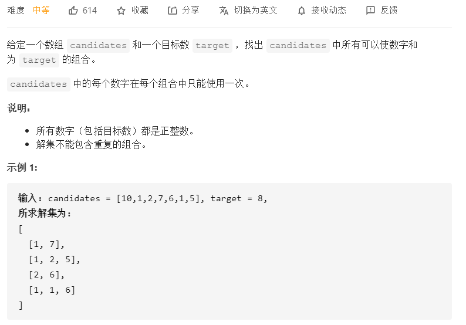
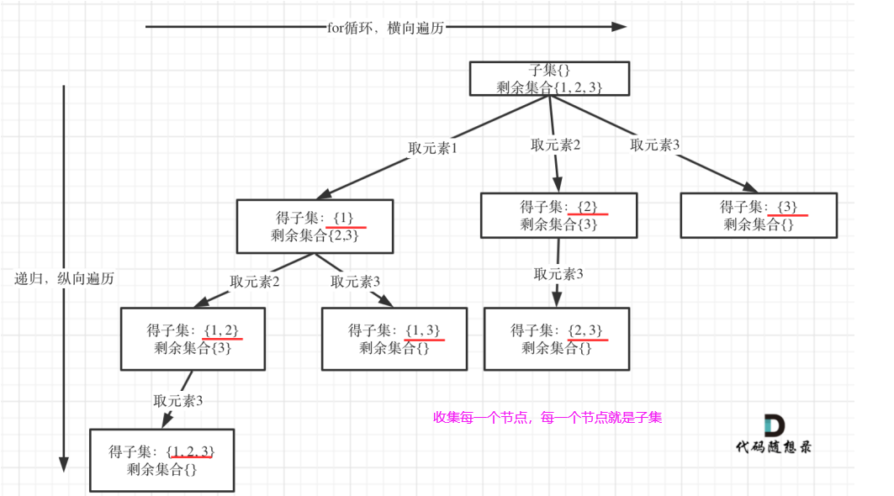

# 回溯

参考微信公众号：`代码随想录`

### 回溯法模板

```c++
void backtracking(参数) {
     if (终⽌条件) {
         存放结果;
         return;
     }
     for (选择：本层集合中元素（树中节点孩⼦的数量就是集合的⼤⼩）) {
         处理节点;
         backtracking(路径，选择列表); // 递归
         回溯，撤销处理结果
     }
}
```

回溯三部曲：

1. 回溯函数模板返回值以及参数，`void backtracking(参数)`

2. 回溯函数终⽌条件

   - 什么时候达到了终⽌条件，树中就可以看出，⼀般来说搜到叶⼦节点了，也就找到了满⾜条件的⼀条答案，把这个答案存放起来，并结束本层递归。

   - ```c++
     if (终⽌条件) {
          存放结果;
          return;
     }
     ```

3. 回溯搜索的遍历过程

   - 回溯法⼀般是在集合中递归搜索，集合的⼤⼩构成了树的宽度，递归的深度构成的树的深度，如下图：

   - **for**循环可以理解是横向遍历，**backtracking**（递归）就是纵向遍历，这样就把这棵树全遍历完了，⼀般来说，搜索叶⼦节点就是找的其中⼀个结果了

   - ```c++
     for (选择：本层集合中元素（树中节点孩⼦的数量就是集合的⼤⼩）) {
          处理节点;
          backtracking(路径，选择列表); // 递归
          回溯，撤销处理结果
     }
     ```

### 一些套路

1.如果是**一个**集合求组合，就需要startIndex，比如

- [77. 组合](https://leetcode-cn.com/problems/combinations/)
- [216. 组合总和 III](https://leetcode-cn.com/problems/combination-sum-iii/)
- [39. 组合总和](https://leetcode-cn.com/problems/combination-sum/)
- [40. 组合总和 II](https://leetcode-cn.com/problems/combination-sum-ii/)

2.如果是**多个**集合求组合，且各个集合互不影响，那么就不需要starIndex，比如

- [17. 电话号码的字母组合](https://leetcode-cn.com/problems/letter-combinations-of-a-phone-number/)

3.⼦集是收集树形结构中树的**所有节点**的结果。⽽组合问题、分割问题是收集树形结构中**叶⼦节点**的结果

4.排列

- 每层都是从 0 开始搜索，⽽不是startIndex
- 需要used数组，记录path⾥，都放了哪些元素了

5.同一层去重，可以先排序，然后在backtracking的for之前使用哈希去重，如下：

```c++
void backtracking(vector<int>& nums, int startIndex){
    if(递归终止条件) return;  
    unordered_set<int> uset; // 对本层去重
    for(int i = startIndex; i < nums.size(); i++){
        // 回溯逻辑
    }
}
```


### 1.[77. 组合](https://leetcode-cn.com/problems/combinations/)


**思路：**

**递归函数的返回值以及参数：**定义两个全局变量，一个用来存放全局结果（res），一个用来**存放符合结果**的集合(path)

其实不定义这两个全局遍历也是可以的，把这两个变量放进递归函数的参数⾥，但函数⾥参数太多影响可读性，这里就不放。

还有就是要传入一个n，表示集合范围；一个k，表示符合的结果条件；以及下一次应该从哪个位置开始遍历startIndex

每次从集合中选取元素，可选择的范围随着选择的进⾏⽽收缩，调整可选择的范围，就是要靠**startIndex**

从下图中红线部分可以看出，在集合[1,2,3,4]取1之后，下⼀层递归，就要在[2,3,4]中取数了，那么下⼀

层递归如何知道从[2,3,4]中取数呢，靠的就是startIndex。


**回溯函数终⽌条件**：当path达到k值，即说明收集到一个符合条件的结果，需要放入res中，并退出当前递归

**单层搜索的过程**：回溯法的搜索过程就是⼀个树型结构的遍历过程，在如下图中，可以看出for循环⽤来横向遍历，递归的

过程是纵向遍历。


**剪枝操作：**来举⼀个例⼦，n = 4，k = 4的话，那么第⼀层for循环的时候，从元素2开始的遍历都没有意义了。 在第

⼆层for循环，从元素3开始的遍历都没有意义了。如下图例子：


所以，可以剪枝的地⽅就在递归中每⼀层的**for循环所选择的起始位置**。

如果**for**循环选择的起始位置之后的元素个数 **已经不⾜** 我们需要的元素个数了，那么就没有必要搜索了。

接下来看⼀下优化过程如下：

1. 已经选择的元素个数：`path.size()`;
2. 还需要的元素个数为: `D = k - path.size()`;
3. 在集合n中**⾄多**要从该起始位置 : `n - (k - path.size()) + 1`，开始遍历（这个有些拗口，理解是至多，也就是说若是这个位置后开始，是不可能凑到k个元素的）
   - 假设所在位置为`x`，则`n - x + 1`表示剩余元素个数，满足条件：`n - x + 1 >= D` ==> `x <= n - D + 1`，即`n - (k - path.size()) + 1`

所以，剪枝代码如下：

```c++
public:
    vector<vector<int>> combine(int n, int k) {
        backtracking(n, k, 1);
        return res;
    }
private:
    vector<vector<int>> res;
    vector<int> path;
    void backtracking(int n, int k, int startIndex){
        if(path.size() == k){
            res.push_back(path);
            return;
        }
        for(int i = startIndex; i <= n - (k - path.size()) + 1; i++){
            path.push_back(i);
            backtracking(n, k, i + 1);
            path.pop_back();
        }
    }
};
```


### 2.[216. 组合总和 III](https://leetcode-cn.com/problems/combination-sum-iii/)


**思路**：在1-9个数中凑k个数，要求这k个数的和为n。

**递归函数参数及返回类型**：返回值一般为空。传入的参数如下：

1. targetSum：⽬标和，也就是题⽬中的n
2. k：k个数的集合
3. sum：已经收集元素的和，也就是path⾥元素的总和。
4. startIndex：下⼀层for循环搜索的起始位置。

**递归终止条件**：当path中元素个数达到k个，就需要退出

**单层搜索过程**：

1. sum需要添加当前元素值
2. path需要添加当前元素值
3. 递归进入下一层
4. 跳出递归，path需要“吐”出来
5. sum也需要“吐”出来


**剪枝操作**：当路径里的元素和 > targetSum时，就没必要递归下去了

```c++
class Solution {
public:
    vector<vector<int>> combinationSum3(int k, int n) {
        backtracking(n, k , 0, 1);
        return res;
    }
private:
    vector<vector<int>> res;
    vector<int> path;
    void backtracking(int targetSum, int k, int sum, int startIndex){
        if(sum > targetSum) return; // 剪枝
        if(path.size() == k){
            if(sum == targetSum) res.push_back(path);
            return;
        }
        for(int i = startIndex; i <= 9; i++){
            sum += i;
            path.push_back(i);
            backtracking(targetSum, k, sum, i + 1);
            path.pop_back();
            sum -= i;
        }
    }
};
```


### 3.[17. 电话号码的字母组合](https://leetcode-cn.com/problems/letter-combinations-of-a-phone-number/)


思路：需要将给定的digits中的每个数字对应字符串，取出一个，来组成一个长度为digits长度的字符串

这里用一个哈希映射，每个字符对应相应的字符串。

定义两个全局变量，res保存全局结果，path保存当前收集结果

**递归函数返回值以及参数**：返回值为空，即可。传入参数

1. digits，每次要从中取数字
2. index，取digits中第几个数字

**回溯终止条件**：当收集的结果path的长度等于digits的长度时，表示收集完一个结果。当前递归退出。

**单层搜索逻辑**：每次递归只搜索一个数字，那么需要先将这个数字对应的字符串映射出来，即letter

然后从0遍历这个letter，每次遍历如下：

1. 将当前字符加入到path
2. 开启下一层递归，注意是下一个数字进入递归，而不是当前字符
3. 下一层递归退出，当前path“吐”出字符

整体代码如下：

```c++
class Solution {
public:
    vector<string> letterCombinations(string digits) {
        if(digits.size() == 0) return {};
        backtracking(digits, 0);
        return res;
    }
private:
    vector<string> res;
    string path;
    map<char, string> dmap = {{'2', "abc"}, {'3', "def"},{'4', "ghi"}, {'5', "jkl"},
                            {'6', "mno"}, {'7', "pqrs"},{'8', "tuv"}, {'9', "wxyz"}};
    void backtracking(const string& digits, int index){
        if(path.size() == digits.size()) {
            res.push_back(path);
            return;
        }       
        string letter = dmap[digits[index]]; // 数字对应的字符串
        for(int i = 0; i < letter.size(); i++){ // 每一个数字对应的字符串都要从位置0开始
            path.push_back(letter[i]);
            backtracking(digits, index + 1); // 下一层要处理下一个数字
            path.pop_back();
        }
    }
};
```


### 4.[39. 组合总和](https://leetcode-cn.com/problems/combination-sum/)


**思路**：跟[216. 组合总和 III](https://leetcode-cn.com/problems/combination-sum-iii/)区别在于，

1. 本题是可以重复的，体现在代码中就是回溯传递的下标还是当前下标
2. 组合的个数是任意的

整体代码如下：

```c++
class Solution {
public:
    vector<vector<int>> combinationSum(vector<int>& candidates, int target) {
        backtracking(candidates, target, 0, 0);
        return res;
    }
private:
    vector<vector<int>> res;
    vector<int> path;
    void backtracking(vector<int>& candidates, int targetSum, int sum, int startIndex){
        if(sum > targetSum) return; // 剪枝
        if(sum == targetSum){
            res.push_back(path);
            return;
        }
        for(int i = startIndex; i < candidates.size(); i++){
            sum += candidates[i];
            path.push_back(candidates[i]);
            backtracking(candidates, targetSum, sum, i); // 可以重复取
            path.pop_back();
            sum -= candidates[i];
        }
    }
};
```

**剪枝**：对总集合**排序**之后，如果下⼀层的**sum**（就是本层的 **sum + candidates[i]**）已经⼤于**target**，就可以

结束本轮**for**循环的遍历。


**在求和问题中，排序之后加剪枝是常⻅的套路！**

```c++
class Solution {
public:
    vector<vector<int>> combinationSum(vector<int>& candidates, int target) {
        sort(candidates.begin(), candidates.end());
        backtracking(candidates, target, 0, 0);
        return res;
    }
private:
    vector<vector<int>> res;
    vector<int> path;
    void backtracking(vector<int>& candidates, int targetSum, int sum, int startIndex){
        if(sum > targetSum) return; // 剪枝
        if(sum == targetSum){
            res.push_back(path);
            return;
        }
        for(int i = startIndex; i < candidates.size() && sum + candidates[i] <= targetSum; i++){
            sum += candidates[i];
            path.push_back(candidates[i]);
            backtracking(candidates, targetSum, sum, i);
            path.pop_back();
            sum -= candidates[i];
        }
    }
};
```


### 5.[40. 组合总和 II](https://leetcode-cn.com/problems/combination-sum-ii/)




思路：跟[39. 组合总和](https://leetcode-cn.com/problems/combination-sum/)区别在于

1. 本题candidates 中的每个数字 在每个组合中 只能使⽤⼀次
2. 本题数组candidates的元素是有重复的

相同之处在于：解集不能包含重复的组合

> 这个去重为什么很难理解呢，**所谓去重，其实就是使⽤过的元素不能重复选取**。 这么⼀说好像很简单！
>
> 都知道组合问题可以抽象为树形结构，那么“使⽤过”在这个树形结构上是有**两个维度**的，⼀个维度是同⼀**树枝**上使⽤过，⼀个维度是同⼀**树层**上使⽤过。没有理解这两个层⾯上的“使⽤过”是造成⼤家没有彻底理解去重的根本原因。
>
> 那么问题来了，我们是要同⼀树层上使⽤过，还是同一树枝上使⽤过呢？
>
> 回看⼀下题⽬，元素在同⼀个组合内是可以重复的，怎么重复都没事，但两个组合不能相同。
>
> **所以我们要去重的是同⼀树层上的“使⽤过”，同⼀树枝上的都是⼀个组合⾥的元素，不⽤去重**
>
> **强调⼀下，树层去重的话，需要对数组排序！**

为了理解去重我们来举⼀个例⼦，candidates = [1, 1, 2], target = 3，（⽅便起⻅candidates已经排序了）


回溯三部曲：

**递归函数参数**：相比[39. 组合总和](https://leetcode-cn.com/problems/combination-sum/)，多加一个bool类型的used数组，用来记录同一树枝上的元素是否使用过

**递归终止条件**：跟之前[39. 组合总和](https://leetcode-cn.com/problems/combination-sum/)一样，没啥好说的

```c++
if(sum > target) return;
if(sum == target){
    res.push_back(path);
    return;
}
```

**单层搜索逻辑逻辑**：

> 要去重的是“同⼀树层上的使⽤过”，如何判断同⼀树层上元素（相同的元素）是否使⽤过了呢。
>
> 如果 candidates[i] == candidates[i - 1] 并且 used[i - 1] == false 
>
> 就说明：前⼀个树枝，使⽤了**candidates[i - 1]**，也就是说同⼀树层使⽤过**candidates[i - 1]**。
>
> 此时for循环⾥就应该做continue的操作。
>
> 在图中将used的变化⽤橘⻩⾊标注上，可以看出在candidates[i] == candidates[i - 1]相同的情况下：
>
> **used[i - 1] == true，说明同⼀  树⽀ candidates[i - 1]使⽤过**
>
> **used[i - 1] == false，说明同⼀ 树层 candidates[i - 1]使⽤过**


其他的逻辑跟之前[39. 组合总和](https://leetcode-cn.com/problems/combination-sum/)的一样

整体代码如下：

```c++
class Solution {
public:
    vector<vector<int>> combinationSum2(vector<int>& candidates, int target) {
        vector<bool> used(candidates.size(), false);
        sort(candidates.begin(), candidates.end());
        backtracking(candidates, used, target, 0, 0);
        return res;
    }
private:
    vector<vector<int>> res;
    vector<int> path;
    void backtracking(vector<int>& candidates, vector<bool>& used, int target, int sum, int startIndex)	{
        if(sum > target) return;
        if(sum == target){
            res.push_back(path);
            return;
        }
        for(int i = startIndex; i < candidates.size(); i++){
            if(i > 0 && candidates[i] == candidates[i - 1] && used[i - 1] == false) continue;
            sum += candidates[i];
            path.push_back(candidates[i]);
            used[i] = true;
            backtracking(candidates, used, target, sum, i + 1);
            used[i] = false;
            path.pop_back();
            sum -= candidates[i];
        }
    }
};
```


### 6.[131. 分割回文串](https://leetcode-cn.com/problems/palindrome-partitioning/)


**思想：**这题挺难的，理解的不太深刻

递归函数参数：

1. 两个全局变量：res存放全局结果集，path存放切割后回⽂的⼦串
2. 还需要startIndex，切割过的地方，不能重复切割，跟组合问题是一致的

递归终止条件：：切割线切到了字符串最后⾯，说明找到了⼀种切割⽅法，此时就是本层递归的终⽌条件。

> **那么在代码⾥什么是切割线呢？**
>
> 在处理组合问题的时候，递归参数需要传⼊startIndex，表示下⼀轮递归遍历的起始位置，这个
>
> startIndex就是切割线。


```c++
void backtracking (const string& s, int startIndex) {
     // 如果起始位置已经⼤于s的⼤⼩，说明已经找到了⼀组分割⽅案了
     if (startIndex >= s.size()){
         result.push_back(path);
         return;
     }
}
```

单层搜索的逻辑：

> 来看看在递归循环，中如何截取⼦串呢？
>
> 在 `for (int i = startIndex; i < s.size(); i++) `循环中，我们 定义了起始位置startIndex，那么 [startIndex, i] 就是要截取的⼦串。
>
> ⾸先判断这个⼦串是不是回⽂，如果是回⽂，就加⼊在 `vector<string> path `中，path⽤来记录切割过的回⽂⼦串。

整体代码如下：

```c++
class Solution {
public:
    vector<vector<string>> partition(string s) {
        backtracking(s, 0);
        return res;
    }
private:
    vector<vector<string>> res;
    vector<string> path;
    void backtracking(string& s, int startIndex){
        if(startIndex >= s.size()){
            res.push_back(path);
            return;
        }

        for(int i = startIndex; i < s.size(); i++){
            if(isPalindrome(s, startIndex, i)){ // 符合回文才需要添加到path
                string str = s.substr(startIndex, i - startIndex + 1);
                path.push_back(str);
            }else continue;
            backtracking(s, i + 1);
            path.pop_back();
        }
    }
    bool isPalindrome(string& s, int l, int r){ // 判断s是否为回文
        int i = l, j = r;
        while(i < j){
            if(s[i] != s[j]) return false;
            i++;
            j--;
        }
        return true;
    }
};
```


### 7.[93. 复原 IP 地址](https://leetcode-cn.com/problems/restore-ip-addresses/)


思路：

递归函数返回值以及参数：

1. 全局变量res保存全局结果
2. 分割跟组合问题一样，需要一个startIndex确定下一次分割
3. pointNum记录分割线

递归终止条件：当把字符串分成4段，也就是有三条分割线的时候，说明前三段已经符合IP的数值设定，那么判断第四段是否符合，若符合才放进结果集res

单层搜索逻辑：`for(int i = startIndex; i < s.size(); i++)`遍历以startIndex开始，到每一个位置i，那么[startIndex, i]这一段若合法，那么需要在这一段后面

1. 添加‘.'
2. 分割线pointNum+1
3. 在这个基础上，开启下一次递归，注意i+2，因为插入了'.'
4. 结束递归后，pointNum-1
5. 删除'.'


判断一段字符是否有效，有三种情况，整体代码如下：

```c++
class Solution {
public:
    vector<string> restoreIpAddresses(string s) {
        backtracking(s, 0, 0);
        return res;
    }
private:
    vector<string> res;
    void backtracking(string& s, int startIndex, int pointNum){
        if(pointNum == 3){
            // 已经有三个分隔符，说明前三个已经分割好且有效，那么判断最后一段，即第四段
            // 是否有效，若有效，把整个添加到结果集
            if(isValid(s, startIndex, s.size() - 1)){
                res.push_back(s);
            }
            return;
        }
        for(int i = startIndex; i < s.size(); i++){
            if(isValid(s, startIndex, i)){
                s.insert(s.begin() + i + 1, '.');
                pointNum++;
                backtracking(s, i + 2, pointNum);
                pointNum--;
                s.erase(s.begin() + i + 1);
            }
        }
    }
    bool isValid(const string& s, int start, int end){
        if(start > end) return false;
        // 首字符为 “0”
        if(start != end && s[start] == '0') return false;
        
        int num = 0;
        for(int i = start; i <= end; i++){
            // @ # ! ...等这些非法字符
            if(s[i] > '9' || s[i] < '0') return false;
            num = num * 10 + s[i] - '0';
            // 总和超过255
            if(num > 255) return false;
        }
        return true;
    }
};
```


### 8.[78. 子集](https://leetcode-cn.com/problems/subsets/)


思路：求子集，也就是收集树上的每一个节点

> ⼦集是收集树形结构中树的所有节点的结果。
>
> ⽽组合问题、分割问题是收集树形结构中叶⼦节点的结果

**递归函数返回值以及参数**：

1. 两个全局变量，res存放全局结果，path存放单个结果
2. 本质上还是一个集合求组合，需要startIndex 

**递归终止条件**：到了叶子节点，说明搜索完一个路径，就退出。但是因为本题是收集每一个节点，所以在for循环完已经可以跳出递归。不能理解的话，就使用递归跳出条件。

**单层搜索逻辑**：

1. 添加元素到path
2. 开启下一层递归
3. 退出递归，path“吐”出来



整体代码如下：

```c++
class Solution {
public:
    vector<vector<int>> subsets(vector<int>& nums) {
        backtracking(nums, 0);
        return res;
    }
private:
    vector<vector<int>> res;
    vector<int> path;
    void backtracking(vector<int>& nums, int startIndex){
        res.push_back(path); // 收集每一个节点
        if(startIndex >= nums.size()) return; // 可以不加，for完自动跳出
        for(int i = startIndex; i < nums.size(); i++){
            path.push_back(nums[i]);
            backtracking(nums, i + 1);
            path.pop_back();
        }
    }
};
```


### 9.[491. 递增子序列](https://leetcode-cn.com/problems/increasing-subsequences/)


思路：在每个节点中，找到能够递增的子序列。但是同一层不能重复，跟之前的去重不太一样（之前的不是序列，没有相对次序，所以先排序处理），本题不用先排序

递归函数返回值以及参数：本题求⼦序列，很明显⼀个元素不能重复使⽤，所以需要startIndex，调整下⼀层递归的起始位置。

终止条件：path中元素大于1个就可以

单层搜索逻辑：同⼀⽗节点下的同层上使⽤过的元素就不能在使⽤了


> 需要注意的点， unordered_set<int> uset; 是记录本层元素是否重复使⽤，新的⼀层
>
> **uset**都会重新定义（清空），所以要知道**uset**只负责本层！**同一层去重都可以用这个逻辑！**

```c++
class Solution {
public:
    vector<vector<int>> findSubsequences(vector<int>& nums) {
        backtracking(nums, 0);
        return res;
    }
private:
    vector<vector<int>> res;
    vector<int> path;
    void backtracking(vector<int>& nums, int startIndex){
        if(path.size() > 1) res.push_back(path);
        if(path.size() >= nums.size()) return;
        
        unordered_set<int> uset; // 对本层去重
        
        for(int i = startIndex; i < nums.size(); i++){
            // 注意是 || ,跟以前的去重使用的 && 不一样
            if((!path.empty() && path.back() > nums[i]) || uset.count(nums[i]) != 0) continue;
            path.push_back(nums[i]);
            uset.insert(nums[i]); // 本层该元素已经使用过，本层后面就不能再使用
            backtracking(nums, i + 1);
            path.pop_back();
        }
    }
};
```

因为每个数范围在[-100, 100]，所以可以使用数组哈希，如下：

```c++
class Solution {
public:
    vector<vector<int>> findSubsequences(vector<int>& nums) {
        backtracking(nums, 0);
        return res;
    }
private:
    vector<vector<int>> res;
    vector<int> path;
    void backtracking(vector<int>& nums, int startIndex){
        if(path.size() > 1) res.push_back(path);
        if(path.size() >= nums.size()) return;
        vector<int> uset(201, 0);
        for(int i = startIndex; i < nums.size(); i++){
            if((!path.empty() && path.back() > nums[i]) || uset[nums[i] + 100] != 0) continue;
            path.push_back(nums[i]);
            uset[nums[i] + 100] = 1;
            backtracking(nums, i + 1);
            path.pop_back();
        }
    }
};
```


### 10.[46. 全排列](https://leetcode-cn.com/problems/permutations/)


**思路**：题目中，nums中数字各不相同，也就不用考虑同一层会出现重复。那么全排列，每次需要从0位置出发，然后树枝上未使用过的节点进行回溯。（未看答案自己独立写出来了hhh）

**递归函数返回值及参数**：需要对同一树枝进行去重，所以需要传入一个数组used，记录节点使用情况。题目中显示每个元素在[-10, 10]内且互不相同，那么考虑数组哈希。

**递归终止条件**：收集叶子节点即可

**单层搜索逻辑**：

1. 当前节点使用过，则跳过。
2. 没有使用过，就可以加入path中，同时标记为已使用。
3. 开启下一层递归
4. 退出递归，将吃进去的"吐"出来，即path将当前节点pop，used标记为未使用

整体代码如下：

```c++
class Solution {
public:
    vector<vector<int>> permute(vector<int>& nums) {
        vector<int> used(21, 0); // 记录path中有哪些元素
        backtracking(nums, used);
        return res;
    }
private:
    vector<vector<int>> res;
    vector<int> path;
    void backtracking(vector<int>& nums, vector<int>& used){
        if(path.size() == nums.size()){
            res.push_back(path);
            return;
        }
        for(int i = 0; i < nums.size(); i++){ // 从 0 开始而不是startIndex
            if(used[i + 10] == 0){ // 树枝上未使用过
                used[i + 10] = 1;
                path.push_back(nums[i]);
                backtracking(nums, used);
                path.pop_back();
                used[i + 10] = 0;
            }
        }
    }
};
```


### 11.[47. 全排列 II](https://leetcode-cn.com/problems/permutations-ii/)


思路：对比[46. 全排列](https://leetcode-cn.com/problems/permutations/)，这题nums的元素有重复的。那么就需要在之前的基础上，对同一树层进行去重。排列问题，每次递归遍历都是从0开始。树层去重，需要先对数组排序。画画图最好理解了。（这题又是没看题解AC出来hhh）

**递归函数返回值及参数**：需要对同一树枝进行去重，所以需要传入一个数组used，记录节点使用情况。题目中显示每个元素在[-10, 10]内且互不相同，那么考虑数组哈希，当然直接用哈希表来做也可以。

**递归终止条件**：收集叶子节点即可

**单层搜索逻辑**：

1. 当前节点使用过，则跳过。
2. 当前节点跟前一个节点相同，且used[i-1]为0，说明同一树层这个元素之前使用过了，跳过
3. 没有使用过，就可以加入path中，同时标记为已使用。
4. 开启下一层递归
5. 退出递归，将吃进去的"吐"出来，即path将当前节点pop，used标记为未使用

```c++
class Solution {
public:
    vector<vector<int>> permuteUnique(vector<int>& nums) {
        sort(nums.begin(), nums.end());
        vector<int> used(21, 0);
        backtracking(nums, used);
        return res;
    }
private:
    vector<vector<int>> res;
    vector<int> path;
    void backtracking(vector<int>& nums, vector<int>& used){
        if(path.size() == nums.size()){
            res.push_back(path);
            return;
        }
        for(int i = 0; i < nums.size(); i++){
            if(i > 0 && nums[i] == nums[i - 1] && used[(i - 1) + 10] == 0){
                    continue; // 树层去重
            }
            if(used[i + 10] == 0){ // 树枝
                used[i + 10] = 1;
                path.push_back(nums[i]);
                backtracking(nums, used); // 下一层递归
                path.pop_back();
                used[i + 10] = 0;
            }
        }
    }
};
```


### 12.[51. N 皇后](https://leetcode-cn.com/problems/n-queens/)


思路：除了一个判断能否放置皇后的条件，其他都跟回溯模板差不多

递归函数返回值以及参数：参数n是棋牌的⼤⼩，然后⽤row来记录当前遍历到棋盘的第⼏层了，以及一个棋盘使用情况。

递归终止条件：到达叶子节点的时候，就可以返回了


单层搜索逻辑：递归深度就是row控制棋盘的⾏，每⼀层⾥for循环的col控制棋盘的列，⼀⾏⼀列，确定了放置皇后的位

置。**每次都是要从新的⼀⾏的起始位置** 开始搜，所以都是从0开始。

整体代码如下：

```c++
class Solution {
public:
    vector<vector<string>> solveNQueens(int n) {
        // 初始化为二维字符的方式，比较少用，要注意一下
        vector<string> chessboard(n, string(n, '.')); // n*n的棋盘
        backtracking(n, 0, chessboard);
        return res;
    }
private:
    vector<vector<string>> res;
    void backtracking(int n, int row, vector<string>& chessboard){
        if(row == n){
            res.push_back(chessboard);
            return;
        }
        for(int col = 0; col < n; col++){ // 每次从一行的 0 列开始，只放置1个
            if(isValid(chessboard, row, col, n)){ // 检查该位置是否符合放置条件
                chessboard[row][col] = 'Q'; // 放置皇后
                backtracking(n, row + 1, chessboard);
                chessboard[row][col] = '.'; // 撤销皇后
            }
        }
    }
    // 验证皇后放置在chessboard[row][col]的合法性
    bool isValid(vector<string>& chessboard, int row, int col, int n){
        // 1.不能同列
        for(int i = 0; i < row; i++){
            if(chessboard[i][col] == 'Q') return false;
        }
        // 2.不能同行，backtracking保证for循环同行中只会有一个
        // 3.45°不能有
        for(int i = row - 1, j = col - 1; i >= 0 && j >= 0; i--, j--){
            if(chessboard[i][j] == 'Q') return false;
        }
        // 4.135°不能有
        for(int i = row - 1, j = col + 1; i >= 0 && j < n; i--, j++){
            if(chessboard[i][j] == 'Q') return false;
        }
        return true;
    }
};
```


### 13.[37. 解数独](https://leetcode-cn.com/problems/sudoku-solver/)


**思路**：对于每个位置，若已经放置则跳过，如果还没有放，则从1~9挨个放，看哪个符合

**递归函数返回值及参数**：之前的都是void，**这里是bool**！因为解数独找到⼀个符合的条件（**就在树的叶⼦节点上**）⽴刻就返回，相当于找从根节点到叶⼦节点⼀条唯⼀路径，所以需要使⽤bool返回值

**递归终止条件**：

> 本题递归不⽤终⽌条件，解数独是要遍历整个树形结构寻找可能的叶⼦节点就⽴刻返回
>
> 递归的下⼀层的棋盘⼀定⽐上⼀层的棋盘多⼀个数，等数填满了棋盘⾃然就终⽌（填满当然好了，说明
>
> 找到结果了），所以不需要终⽌条件！

**单层递归搜索逻辑**：

> ⼀个for循环遍历棋盘的⾏，⼀个for循环遍历棋盘的列，⼀⾏⼀列确定下来之后，递归遍历这个位置放**9**个数字的可能性！
>
> 注意这⾥**return false**的地⽅，这⾥放**return false** 是有讲究的。
>
> 因为如果⼀⾏⼀列确定下来了，**这⾥尝试了9个数都不⾏**，说明这个棋盘 找不到 解决数独问题的解！
>
> 那么会直接返回， 这也就是为什么没有终⽌条件也不会永远填不满棋盘⽽⽆限递归下去！


**判断棋盘放置位置是否合法**：

> - 棋盘上是否已经放置
> - 同⾏是否重复
> - 同列是否重复
> - 9宫格⾥是否重复（逻辑想不到）

整体代码如下：

```c++
class Solution {
public:
    void solveSudoku(vector<vector<char>>& board) {
        backtracking(board);
    }
private:
    bool backtracking(vector<vector<char>>& board){
        for(int row = 0; row < board.size(); row++){ // 遍历行
            for(int col = 0; col < board[0].size(); col++){ // 遍历列
                if(board[row][col] != '.') continue; // 如果已经放置，则跳过
                for(char k = '1'; k <= '9'; k++){ // 每个位置放置1~9哪个合适
                    if(isValid(board, row, col, k)){
                        board[row][col] = k;
                        if(backtracking(board)) return true; // 找到合适的一组立刻返回
                        board[row][col] = '.';
                    }
                }
                return false; // 遍历完9个都不能放，那么说明放不聊
            }
        }
        return true; // 整个棋盘都遍历完没有返回false,说明棋盘是合适的
    }
    // 验证棋盘board[i][j]放置数字的合法性
    bool isValid(vector<vector<char>>& board, int row, int col, char k){
        // 0.棋盘上已经有数字
        if(board[row][col] != '.') return false;
        // 1.同列不重复
        for(int i = 0; i < 9; i++){
            if(board[i][col] == k) return false;
        }
        // 2.同行不重复
        for(int j = 0; j < 9; j++){
            if(board[row][j] == k) return false;
        }
        // 3.同九宫格不重复
        // 要先判断处于哪个九宫格
        int rowStart = (row / 3) * 3;
        int colStart = (col / 3) * 3;
        for(int i = rowStart; i < rowStart + 3; i++){
            for(int j = colStart; j < colStart + 3; j++){
                if(board[i][j] == k) return false;
            }
        }
        return true;
    }
};
```

