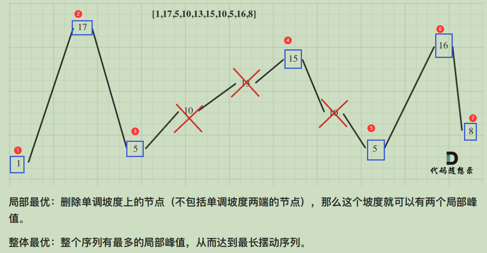

# 贪心

[TOC]

目录：

参考微信公众号：**代码随想录**

### 1.[455. 分发饼干](https://leetcode-cn.com/problems/assign-cookies/)


尽可能喂饱胃口大的孩子


```c++
class Solution {
public:
    int findContentChildren(vector<int>& g, vector<int>& s) {
        //1.排序
        sort(g.begin(), g.end()); // 小孩
        sort(s.begin(), s.end()); // 饼干
        int index = s.size() - 1; // 控制饼干移动
        int res = 0;
        for(int i = g.size() - 1; i >= 0; i--){
            if(index >= 0 && s[index] >= g[i]){
                res++;
                index--;
            }
        }
        return res;
    }
};
```


### 2.[376. 摆动序列](https://leetcode-cn.com/problems/wiggle-subsequence/)


前一个梯度pre，与下一个梯度cur方向相反的时候，就是一个摆动序列！

这个时候，结果加一，同时更新前一个为当前，这就完成了图中红×的操作（**跳过梯度相同的**）



```c++
class Solution {
public:
    int wiggleMaxLength(vector<int>& nums) {
        if(nums.size() < 2) return nums.size();
        int pre = 0; // 保存前一个峰值
        int cur = 0; // 保存当前峰值
        int res = 1; // 默认一个也是峰值
        for(int i = 1; i < nums.size(); i++){
            cur = nums[i] - nums[i - 1];
            if((pre >= 0 && cur < 0) || (pre <= 0 && cur > 0)){
                res++;
                pre = cur;
            }
        }
        return res;
    }
};
```


### 3.[53. 最大子序和](https://leetcode-cn.com/problems/maximum-subarray/)


#### 解法1：贪心

将每一步的元素加入进sum，如果是小于0，说明对总和贡献为负，重置sum = 0

每一步res保存局部连续和的最大值

```c++
class Solution {
public:
    int maxSubArray(vector<int>& nums) {
        if(nums.size() < 2) return nums[0];
        int res = INT_MIN;
        int sum = 0;
        for(int i = 0; i < nums.size(); i++){
            sum += nums[i];
            res = max(res, sum);
            sum = max(sum, 0);
        }
        return res;
    }
};
```

#### 解法2：动态规划

```c++
class Solution {
public:
    int maxSubArray(vector<int>& nums) {
        // 动态规划
        // dp[i] -- 到nums[i]对应的最大子序列和为dp[i]
        vector<int> dp(nums.size());
        dp[0] = nums[0];
        int res = dp[0];
        for(int i = 1; i < nums.size(); i++){
            dp[i] = max(nums[i], dp[i - 1] + nums[i]);
            if(dp[i] > res) res = dp[i];
        }
        return res;
    }
};
```


### 4.[122. 买卖股票的最佳时机 II](https://leetcode-cn.com/problems/best-time-to-buy-and-sell-stock-ii/)


```c++
class Solution {
public:
    int maxProfit(vector<int>& prices) {
        int res = 0;
        for(int i = 1; i < prices.size(); i++){
            // 只收集每天的正利润，从第二天开始产生利润
            if(prices[i] - prices[i - 1] > 0){
                res += prices[i] - prices[i - 1];
            }
        }
        return res;
    }
};
```


### 5.[55. 跳跃游戏](https://leetcode-cn.com/problems/jump-game/)


**思路：**

计算每次跳的覆盖范围，如果能够覆盖最后一个位置，那么就说明可行。


```c++
class Solution {
public:
    bool canJump(vector<int>& nums) {
        int cover = 0; 
        for(int i = 0; i <= cover; i++){
            cover = max(cover, i + nums[i]);
            if(cover >= nums.size() - 1) return true;
        }
        return false;
    }
};
```

### 6.[45. 跳跃游戏 II](https://leetcode-cn.com/problems/jump-game-ii/)


**思路：**

注意题目说明，保证一定可以到达最后位置，所以这里 i 可以到nums.size() - 2位置

逻辑清晰版本：

```c++
class Solution {
public:
    int jump(vector<int>& nums) {
        int res = 0;
        int curCover = 0; // 本次能够覆盖范围
        int nextCover = 0; // 下次能够覆盖范围
        for(int i = 0; i < nums.size() - 1; i++){ 
            nextCover = max(nextCover, i + nums[i]);
            // 当前位置到达能够覆盖的最大范围
            if(i == curCover){
                // 1、如果这个位置不是终点，需要再向前走一步
                if(i != nums.size() - 1){
                    ++res;
                    curCover = nextCover; // 更新本次能够覆盖的范围
                    if(curCover >= nums.size() - 1) break; // 本次能够覆盖终点，不用再走一步
                }
                // 2、如果这个位置已经是终点
                else{
                    break;
                }
            }
        }
        return res;
    }
};
```

第二种

```c++
class Solution {
public:
    int jump(vector<int>& nums) {
        int nextCover = 0; // 下一次覆盖的最大范围
        int curCover = 0; // 当前能够覆盖的最大范围
        int res = 0;
        for(int i = 0; i < nums.size() - 1; i++){ // 注意nums.size()-1
            nextCover = max(nextCover, i + nums[i]);
            // 当前到达的位置是当前状态能覆盖的最大范围的位置
            // 那么说明之前最大一跳，用完，需要再增加步数
            // 同时更新当前能够覆盖的最大范围 为 下一次覆盖范围
            if(i == curCover){ 
                curCover = nextCover;
                res++;
                if(nextCover >= nums.size() - 1) break;
            }
        }
        return res;
    }
};
```


### 7.[1005. K 次取反后最大化的数组和](https://leetcode-cn.com/problems/maximize-sum-of-array-after-k-negations/)


**思路：**

分 4 步

```c++
class Solution {
public:
    int largestSumAfterKNegations(vector<int>& nums, int k) {
        // 1. 按绝对值升序
        sort(nums.begin(), nums.end(), cmp);
        // 2. 把绝对值大的、为负数的数，转成正的
        for(int i = nums.size() - 1; i >= 0; i--){
            if(k > 0 && nums[i] < 0){
                nums[i] = -nums[i];
                k--;
            }
        }
        // 3.如果k还没有用完（那么此时整个数组都是正数）
        // 那么把绝对值最小的、正数，（反复!!!）转为负数
        while(k > 0){
            nums[0] = - nums[0];
            k--;
        }
        int sum = accumulate(nums.begin(), nums.end(), 0);
        return sum;
    }
private:
    // 按绝对值升序
    bool static cmp(const int& a, const int& b){
        return abs(a) < abs(b);
    }
};
```


### 8.[134. 加油站](https://leetcode-cn.com/problems/gas-station/)


#### 解法1：暴力法

暴力例举以每一个位置为出发位置，模拟加油、消耗，看最终能否回到出发位置。

**while循环来模拟循环队列是一个技巧。**

```c++
class Solution {
public:
    int canCompleteCircuit(vector<int>& gas, vector<int>& cost) {
        for(int i = 0; i < cost.size(); i++){
            int rest = gas[i] - cost[i]; // 开始位置，还能剩下油量
            int index = (i + 1) % cost.size(); // 开往下一个位置的下标
            while(rest > 0 && i != index){
                rest += gas[index] - cost[index];
                index = (index + 1) % cost.size();
            }
            if(rest >= 0 && index == i) return i;
        }
        return -1;
    }
};
```

#### 解法2：贪心

逻辑：如果总共剩余油量小于0，那么无论哪个位置开始，都不可能回到初始位置

那么从局部考虑，从位置0开始，到当前位置的剩余油量小于0时，那么[0, i]位置上也不可能成为初始位置，那么只能从[i+1, n]去找。当前剩余油量更新为0，统计后面的。

```c++
class Solution {
public:
    int canCompleteCircuit(vector<int>& gas, vector<int>& cost) {
        int curSum = 0;
        int totalSum = 0;
        int start = 0;
        for(int i = 0; i < cost.size(); i++){
            curSum += gas[i] - cost[i];
            totalSum += gas[i] - cost[i];
            // 一旦curSum < 0，说明 [0, i]位置不可能作为开始的位置
            // 需要考虑从下一个位置找
            if(curSum < 0){
                start = i + 1;
                curSum = 0;
            }
        }
        // 如果剩余油量总和小于0，说明，不可能有这样一个加油站
        if(totalSum < 0) return -1;
        return start;
    }
};
```


### 9.[135. 分发糖果](https://leetcode-cn.com/problems/candy/)


采用了两次贪心的思路：

1. ⼀次是从左到右遍历，只⽐较右边孩⼦评分⽐左边⼤的情况。
2. ⼀次是从右到左遍历，只⽐较左边孩⼦评分⽐右边⼤的情况。

**第2次贪心 为什么不能从前向后遍历呢？**

因为如果从前向后遍历，根据 ratings[i + 1] 来确定 ratings[i] 对应的糖果，那么每次都不能利⽤上前⼀次的⽐较结果了。

如下：

```c++
    for(int i = 0; i < nums.size() - 1; i++){
            if(ratings[i] > ratings[i + 1]){
                candyVec[i] = max(candyVec[i], candyVec[i + 1] + 1);
            }
        }
// 当 i = 1，且ratings[1] > ratings[2] 且 1号孩子糖果数比下一个多，那么此刻1号孩子需要的糖果数，是需要改变的。那么改变了rating[1]，那么此刻还能保证第0号孩子的糖果数就一定比1号的多？显然不能。所以需要从后往前，保证已经变的后面不会再变。
```

整体代码如下：

```c++
class Solution {
public:
    int candy(vector<int>& ratings) {
        // 1.局部贪心：前->后，让每个右孩子评分高的比左孩子 多一颗
        vector<int> candyVec(ratings.size(), 1);
        for(int i = 1; i < ratings.size(); i++){
            if(ratings[i] > ratings[i - 1]){
                candyVec[i] = candyVec[i - 1] + 1;
            }
        }
        // 2.局部贪心：后->前，让每个左孩子评分高的比右孩子 更多
        for(int i = ratings.size() - 2; i >= 0; i--){
            if(ratings[i] > ratings[i + 1]){
                candyVec[i] = max(candyVec[i], candyVec[i + 1] + 1);
            }
        }
        return accumulate(candyVec.begin(), candyVec.end(), 0);
    }
};
```


### 10.[860. 柠檬水找零](https://leetcode-cn.com/problems/lemonade-change/)


思路：统计每个面值的数量（其实20的不用，因为不会拿来找零），然后遇到20元的优先消耗 10 元的，因为 5 元的找零用处更大，贪心贪的是这里。

```c++
class Solution {
public:
    bool lemonadeChange(vector<int>& bills) {
        int five = 0;
        int ten = 0;
        int twenty = 0;
        for(auto b:bills){
            if(b == 5) five++;
            if(b == 10){
                if(five > 0){
                    five--;
                    ten++;
                }
                else return false;          
            }
            if(b == 20){
                if(ten > 0 && five > 0){
                    ten--;
                    five--;
                }
                else if(five > 2){
                    five -= 3;
                }
                else return false;
            }
        }
        return true;
    }
};
```


### 11.[406. 根据身高重建队列](https://leetcode-cn.com/problems/queue-reconstruction-by-height/)


思想：当有两个维度的时候，要先确定一个维度。那怎么确定呢？

可以假设，比如这里h,k维度。

如果按照k来从⼩到⼤排序，排完之后，会发现k的排列并不符合条件，身⾼也不符合条件，两个维度哪⼀个都没确定下来。

那么按照身⾼h来排序呢，身⾼⼀定是从⼤到⼩排（身⾼相同的话则k⼩的站前⾯），让⾼个⼦在前⾯。

此时我们可以确定⼀个维度了，就是身⾼，前⾯的节点⼀定都⽐本节点⾼！

那么只需要按照k为下标重新插⼊队列就可以了，为什么呢？


**插入元素的核心**是排序后，保证前面一定是有元素对应k个元素！

vector：

```c++
class Solution {
public:
    vector<vector<int>> reconstructQueue(vector<vector<int>>& people) {
        sort(people.begin(), people.end(), cmp);
        vector<vector<int>> que;
        for(int i = 0; i < people.size(); i++){
            int pos = people[i][1];
            que.insert(que.begin() + pos, people[i]);
        }
        return que;
    }
private:
    // 按身高降序，相等按 k的大小升序
    bool static cmp(const vector<int>& a, const vector<int>& b){
        if(a[0] == b[0]) return a[1] < b[1];
        return a[0] > b[0];
    }
};
```

list:

```c++
class Solution {
public:
    vector<vector<int>> reconstructQueue(vector<vector<int>>& people) {
        sort(people.begin(), people.end(), cmp);
        list<vector<int>> que;
        for(int i = 0; i < people.size(); i++){
            int pos = people[i][1];
            list<vector<int>>::iterator iter = que.begin();
            while(pos--) iter++;
            que.insert(iter, people[i]);
        }
        return vector<vector<int>>(que.begin(), que.end());
    }
private:
    // 按身高降序，相等按 k的大小升序
    bool static cmp(const vector<int>& a, const vector<int>& b){
        if(a[0] == b[0]) return a[1] < b[1];
        return a[0] > b[0];
    }
};
```

当insert数据的时候，如果已经⼤于**capicity**（当前数组可容纳元素的最大值），capicity会成倍扩容，但对外暴漏的**size**（遍历的时候用）其实仅仅是+1

时间对比如下：


### 12.[452. 用最少数量的箭引爆气球](https://leetcode-cn.com/problems/minimum-number-of-arrows-to-burst-balloons/)


**思路：**

当气球重叠的时候，可以使用同一支箭，而不重叠时，就需要再来一支箭。

怎样判断重叠？

1. 前一个气球的右边界小于当前气球的左边界时，就不重叠。
2. 否则重叠。重叠需要更新当前气球的右边界。


```c++
class Solution {
public:
    int findMinArrowShots(vector<vector<int>>& points) {
        if(points.size() == 0) return 0;
        int res = 1; // 至少需要一支箭
        sort(points.begin(), points.end(), cmp);
        for(int i = 1; i < points.size(); i++){
            // 如果当前气球 左边界 > 上一个气球的右边界
            // 说明，不挨着，需要再一支箭
            if(points[i][0] > points[i - 1][1]) res++;
            else{// 如果挨着，那么更新当前的右边界为两个右边界的最小值
                points[i][1] = min(points[i][1], points[i - 1][1]);
            }
        }
        return res;
    }
private:
    // 按 左边界升序
    bool static cmp(const vector<int>& a, const vector<int>& b){
        return a[0] < b[0];
    }
};
```


### 13.[435. 无重叠区间](https://leetcode-cn.com/problems/non-overlapping-intervals/)


**思路：**

按照右边界排序，从左向右记录⾮交叉区间的个数。最后⽤区间总数减去⾮交叉区间的个数就是需要移除的区间个数了。

此时问题就是要求⾮交叉区间的最⼤个数。

右边界排序之后，局部最优：优先选**右边界小**的区间，所以从左向右遍历，留给下⼀个区间的空间⼤⼀些，从⽽尽量避免交叉。全局最优：选取最多的⾮交叉区间。

```c++
class Solution {
public:
    int eraseOverlapIntervals(vector<vector<int>>& intervals) {
        if(intervals.size() == 0) return 0;
        int count = 1;
        sort(intervals.begin(), intervals.end(), cmp);
        int end = intervals[0][1]; // 作为非重叠的右边界
        for(int i = 1; i < intervals.size(); i++){
            // 当前左边界大于之前的非重叠的右边界时，
            // 说明新的一个非重叠区间出现，需要更新
            if(intervals[i][0] >= end){
                end = intervals[i][1];
                count++;
            }
        }
        return intervals.size() - count;
    }
private:
    // 按右边界升序
    bool static cmp(const vector<int>& a, const vector<int>& b){
        return a[1] < b[1];
    }
};
```


### 14.[763. 划分字母区间](https://leetcode-cn.com/problems/partition-labels/)


思路：

尽可能多的分割字符串

忘记字符转数字了，写成了**s[i] - '0'**

```c++
class Solution {
public:
    vector<int> partitionLabels(string s) {
        // 1.统计字符最后出现的位置
        int m[27] = {0};
        for(int i = 0; i < s.size(); i++){
            m[s[i] - 'a'] = i;
        }
        // 按字符开始，以及最右，分割字符串
        int left = 0;
        int right = 0;
        vector<int> res;
        for(int i = 0; i < s.size(); i++){
            right = max(right, m[s[i] - 'a']);
            if(i == right){
                res.push_back(right - left + 1);
                left = i + 1;
            }
        }
        return res;
    }
};
```


### 15.[56. 合并区间](https://leetcode-cn.com/problems/merge-intervals/)


**思路：**

重叠的时候只更新范围，不重叠的时候直接添加范围到结果

```c++
class Solution {
public:
    vector<vector<int>> merge(vector<vector<int>>& intervals) {
        if(intervals.size() == 0) return {};
        vector<vector<int>> res;
        sort(intervals.begin(), intervals.end(), cmp);
        res.push_back(intervals[0]);
        for(int i = 1 ; i < intervals.size(); i++){
            // 1.如果当前的左边界小于之前一个的右边界，说明是有重叠的
            // 需要进行合并,取两者的最大右边界
            if(intervals[i][0] <= res.back()[1]){
                  res.back()[1] = max(res.back()[1], intervals[i][1]);
            }else{ // 不重叠
                res.push_back(intervals[i]);
            }
        }
        return res;
    }
private:
    // 按 左边界 升序
    bool static cmp(const vector<int>& a, const vector<int>& b){
        return a[0] < b[0];
    }
};
```


### 16.[738. 单调递增的数字](https://leetcode-cn.com/problems/monotone-increasing-digits/)


**思路：**

举个例子：N =  98

从后往前遍历，如果前一个比当前的大，说明不是单增，那么把前一个减一，当前位置要变成9。最终为 89.

**从前向后遍历会改变已经遍历过的结果！**跟[135. 分发糖果](https://leetcode-cn.com/problems/candy/)的第二次贪心一样，所以**要想不改变之前改变的结果，得从后往前遍历！**

```c++
class Solution {
public:
    int monotoneIncreasingDigits(int n) {
        string s = to_string(n);
        int flag = s.size();
        for(int i = s.size() - 1; i > 0; i--){
            // 比如 98 --> 89,flag = 1，后面把标志位后面的全部变成9
            if(s[i - 1] > s[i]){
                s[i - 1]--; // 前一位减1,
                flag = i; // 标志要变成9的位置
            }
        }
        // 变 9 
        for(int i = flag; i < s.size(); i++){
            s[i] = '9';
        }
        return stoi(s);
    }
};
```


### 17.[714. 买卖股票的最佳时机含手续费](https://leetcode-cn.com/problems/best-time-to-buy-and-sell-stock-with-transaction-fee/)


#### 解法1：贪心

还比较难理解的。

```c++
class Solution {
public:
    int maxProfit(vector<int>& prices, int fee) {
        int minPrice = prices[0];
        int res = 0;
        for(int i = 1; i < prices.size(); i++){
            // 取最小的就进行卖出，实现最大利润
            minPrice = min(minPrice, prices[i]);
            // 能够产生利润，就需要更新
            if(prices[i] > minPrice + fee){
                res += prices[i] - minPrice - fee;
                minPrice = prices[i] - fee;
            }
        }
        return res;
    }
};
```

#### 解法2：动态规划

对第 `i`天的持有、不持有股票的状态进行分析即可。

```c++
class Solution {
public:
    int maxProfit(vector<int>& prices, int fee) {
        int n = prices.size();
        // dp[i][0] -- 第i天 持有 股票所得现金
        // dp[i][1] -- 第i天 不持有 股票所得现金
        vector<vector<int>> dp(n, vector<int>(2, 0));
        dp[0][0] -= prices[0];
        for(int i = 1; i < n; i++){
            dp[i][0] = max(dp[i - 1][0], dp[i - 1][1] - prices[i]);
            dp[i][1] = max(dp[i - 1][1], dp[i - 1][0] + prices[i] - fee);
        }
        return max(dp[n - 1][0], dp[n - 1][1]);
    }
};
```

当然这里可以简化，因为只涉及前后两个状态。如下：

```c++
class Solution {
public:
    int maxProfit(vector<int>& prices, int fee) {
        int n = prices.size();
        int holdStock = (-1) * prices[0]; // 持股票
        int saleStock = 0; // 卖出股票
        for (int i = 1; i < n; i++) {
            int previousHoldStock = holdStock;
            holdStock = max(holdStock, saleStock - prices[i]);
            saleStock = max(saleStock, previousHoldStock + prices[i] - fee);
        }
        return saleStock;
    }
};
```

