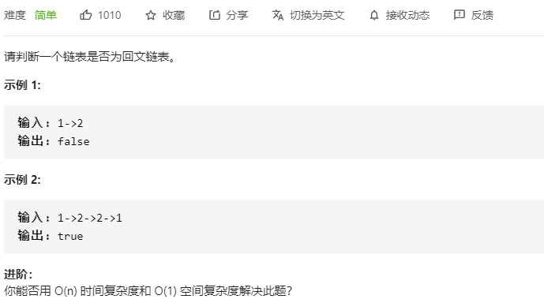
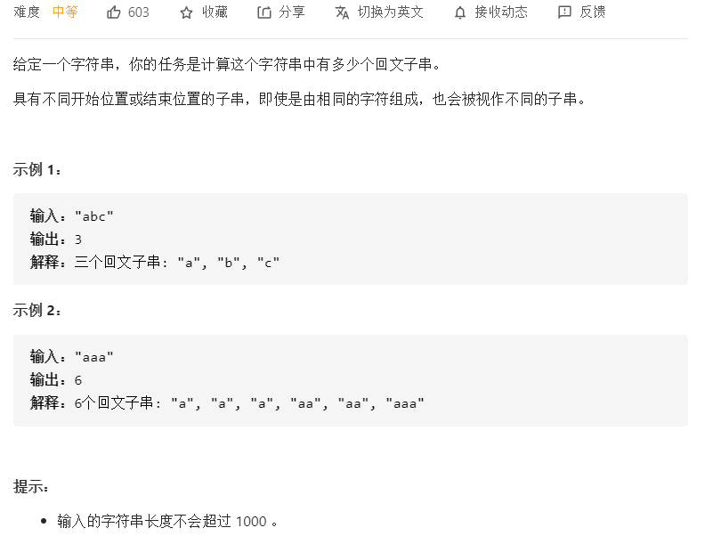
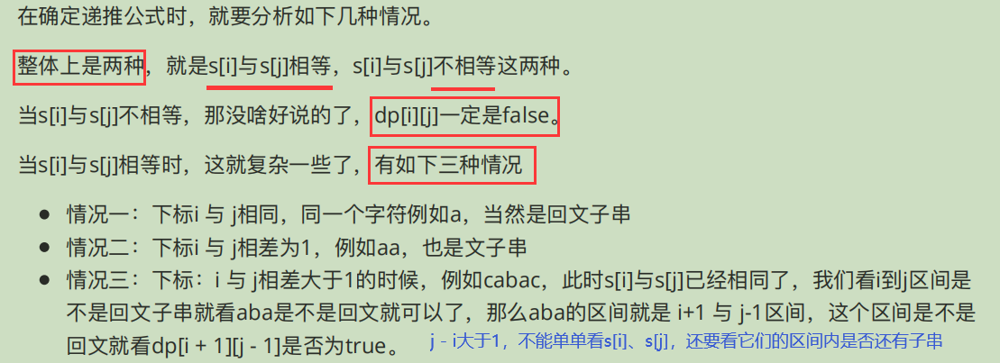
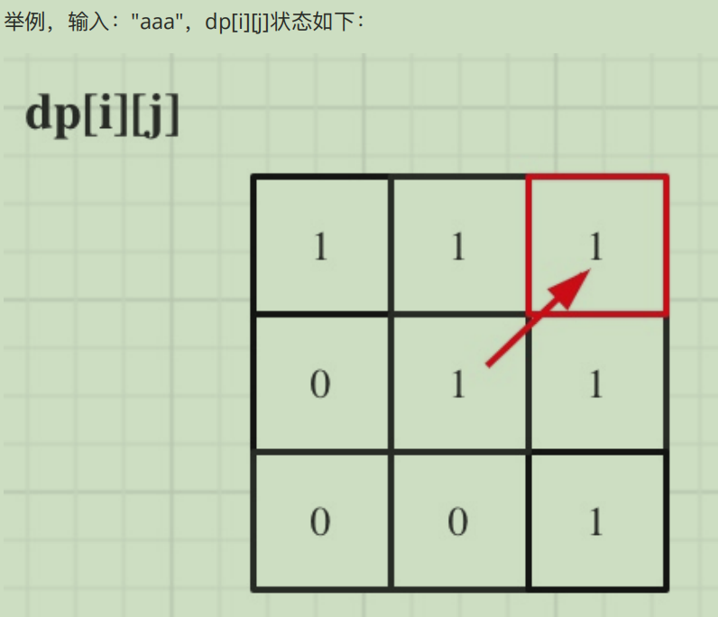
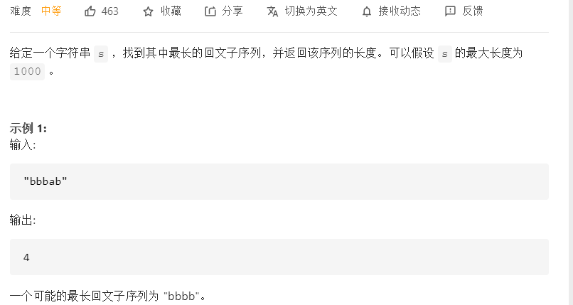
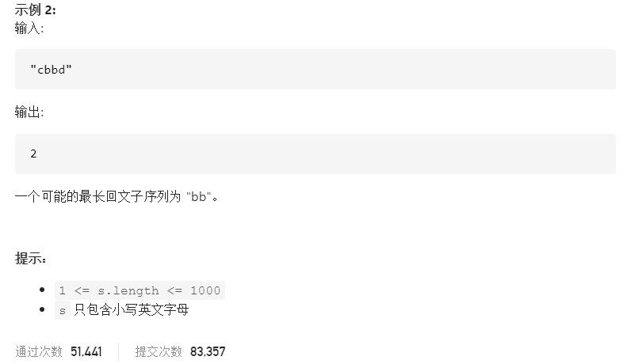
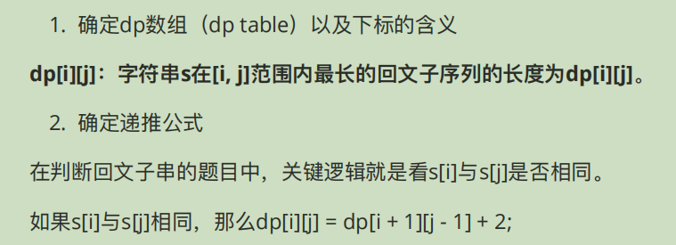
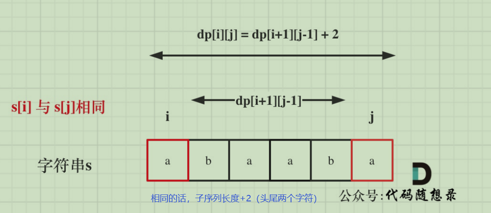
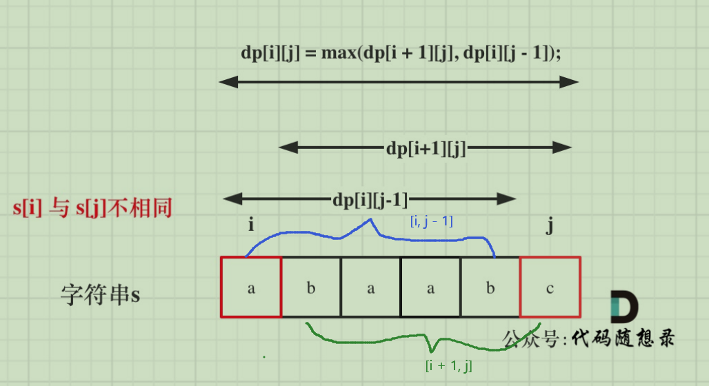

# 回文系列

### 1.[234. 回文链表](https://leetcode-cn.com/problems/palindrome-linked-list/)



**一般回文系列、反转之类的题都可以考虑用栈来做！**

#### 解法1：快慢指针 

本题最优解法。

快慢指针找中点，然后在中间反转链表，注意事项见注释。

```c++
/**
 * Definition for singly-linked list.
 * struct ListNode {
 *     int val;
 *     ListNode *next;
 *     ListNode() : val(0), next(nullptr) {}
 *     ListNode(int x) : val(x), next(nullptr) {}
 *     ListNode(int x, ListNode *next) : val(x), next(next) {}
 * };
 */
class Solution {
public:
    bool isPalindrome(ListNode* head) {
       if(head == nullptr || head->next == nullptr) return true;
       ListNode* slow = head, *fast = head, *pre;
       // 找中点
       while(fast && fast->next){
           pre = slow;
           slow = slow->next;
           fast = fast->next->next;
       }
        pre->next = nullptr; //前后断开
        // 反转后一段链表
        ListNode* cur = slow; 
        ListNode* pre1 = nullptr;
        while(cur){
            ListNode* tmp = cur->next;
            cur->next = pre1;
            pre1 = cur;
            cur = tmp;
        }
        // pre1为后半段链表头结点
        ListNode* c1 = pre1;
        ListNode* c2 = head;
        while(c1 && c2){
            if(c1->val != c2->val) return false; // 判断条件不能是节点，而是节点值！
            c1 = c1->next;
            c2 = c2->next;
        }
        return true;
    }
};
```


### 2.[647. 统计回文子串个数](https://leetcode-cn.com/problems/palindromic-substrings/)





```c++
class Solution {
public:
    int countSubstrings(string s) {
        // dp[i][j]--以下标 i 为结尾的字符，到下标j为结尾的字符区间内
        // 回文子串的个数为dp[i][j]
        vector<vector<bool>> dp(s.size(), vector<bool>(s.size(), false));
        int res = 0;
        for(int i = s.size() - 1; i >= 0; i--){
            for(int j = i; j < s.size(); j++){
                if(s[i] == s[j]){
                    if(j - i <= 1){
                        res++;
                        dp[i][j] = true;
                    }else if(dp[i + 1][j - 1]){
                        res++;
                        dp[i][j] = true;
                    }
                }
            }
        }
        return res;
    }
};
```


### 3.[516. 最长回文子序列](https://leetcode-cn.com/problems/longest-palindromic-subsequence/)





**思路：**

`s[i] == s[j]`





`s[i] != s[j]`





**初始化**：根据`dp[i][j]`的含义，那么当`i==j`时，也就是单个字符的情况，子序列是`1`。

**遍历顺序：**从递推公式`dp[i][j] = dp[i + 1][j - 1] + 2 `和` dp[i][j] = max(dp[i + 1][j], dp[i][j - 1])` 可以看出，`dp[i][j]`是依赖于`dp[i + 1][j - 1] `和 `dp[i + 1][j]`，也就是从矩阵的⻆度来说，`dp[i][j] `下⼀⾏的数据。 所以遍历**i**的时候⼀定要从下到上遍历，这样才能保证，下⼀⾏的数据是经过计算的。

**对比求最长回文串，也是一样的遍历顺序，dp容器大小的设置也跟之前的（原基础上+1）不一样，只需要定义跟字符串等大小的长度就可以（二维上）**


```C++
class Solution {
public:
    int longestPalindromeSubseq(string s) {
        // dp[i][j]--以下标i到下标j的区间内，最大回文子序列为dp[i][j]
        vector<vector<int>> dp(s.size(), vector(s.size(), 0));
        for(int i = 0; i < s.size(); i++) dp[i][i] = 1;
        for(int i = s.size() - 1; i >= 0; i--){
            for(int j = i + 1; j < s.size(); j++){
                if(s[i] == s[j]) dp[i][j] = dp[i + 1][j - 1] + 2;
                else{
                    dp[i][j] = max(dp[i + 1][j], dp[i][j - 1]);
                }
            }
        }
        return dp[0][s.size() - 1];
    }
};
```

