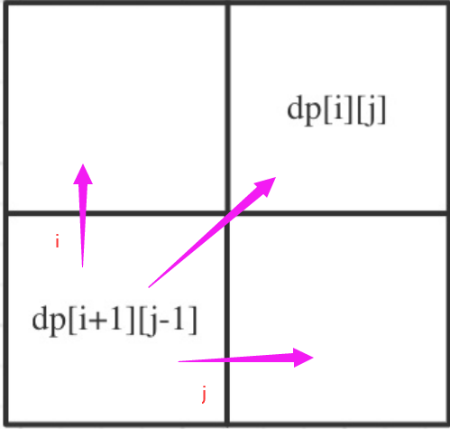
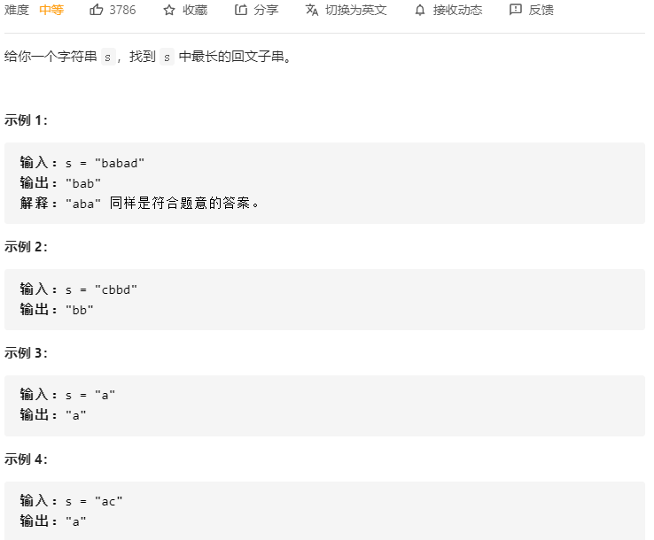
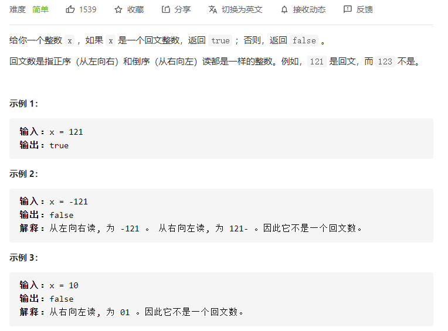
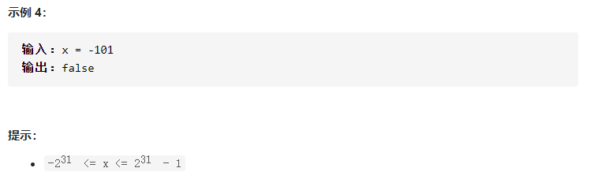

# 回文系列

### 1.[234. 回文链表](https://leetcode-cn.com/problems/palindrome-linked-list/)


**一般回文系列、反转之类的题都可以考虑用栈来做！**

#### 解法1：快慢指针 

本题最优解法。

快慢指针找中点，然后在中间反转链表，注意事项见注释。

```c++
/**
 * Definition for singly-linked list.
 * struct ListNode {
 *     int val;
 *     ListNode *next;
 *     ListNode() : val(0), next(nullptr) {}
 *     ListNode(int x) : val(x), next(nullptr) {}
 *     ListNode(int x, ListNode *next) : val(x), next(next) {}
 * };
 */
class Solution {
public:
    bool isPalindrome(ListNode* head) {
       if(head == nullptr || head->next == nullptr) return true;
       ListNode* slow = head, *fast = head, *pre;
       // 找中点
       while(fast && fast->next){
           pre = slow;
           slow = slow->next;
           fast = fast->next->next;
       }
        pre->next = nullptr; //前后断开
        // 反转后一段链表
        ListNode* cur = slow; 
        ListNode* pre1 = nullptr;
        while(cur){
            ListNode* tmp = cur->next;
            cur->next = pre1;
            pre1 = cur;
            cur = tmp;
        }
        // pre1为后半段链表头结点
        ListNode* c1 = pre1;
        ListNode* c2 = head;
        while(c1 && c2){
            if(c1->val != c2->val) return false; // 判断条件不能是节点，而是节点值！
            c1 = c1->next;
            c2 = c2->next;
        }
        return true;
    }
};
```


### 2.[647. 统计回文子串个数](https://leetcode-cn.com/problems/palindromic-substrings/)


**思路：[647. 统计回文子串个数](https://leetcode-cn.com/problems/palindromic-substrings/)模板题，用动态规划来搜整个字符串中的每个回文子串。**

动态规划五部曲如下：

1. 动态定义：`dp[i][j]`表示字符串s[i]~s[j]组成的字符串是否是回文子串

2. 转移方程：分几种情况

   1. s[i] != s[j]，那么(i, j)之间的字符串肯定不是回文，`dp[i][j]= false` ;
   2. s[i] == s[j]，分几种情况：
      - i == j，单个字符当然是回文子串
      - i == j - 1，也就是相邻的两个字符相等，比如`aa`，当然也是回文子串
      - j - i > 1，比如`abba`，i = 0, j = 3，那么此时s[0] == s[3] == a，如何判断整个是否为回文子串？那么取决于它们之间的是否为回文子串了，即`dp[i + 1][j - 1]`是为true吗？是的话，说明（i，j）也是回文子串

3. 初始化：一开始每个都为false，假设都不为回文，由此递推

4. 遍历顺序：⾸先从递推公式中可以看出，`s[i]==s[j] && j - i > 1`是根据`dp[i + 1][j - 1]`是否为true，在对`dp[i][j]`进⾏赋值true的。`dp[i + 1][j - 1] `在 `dp[i][j]`的左下⻆，如图：

   

   

整体代码如下：

```c++
class Solution {
public:
    int countSubstrings(string s) {
        // dp[i][j]--以下标 i 为结尾的字符，到下标j为结尾的字符区间内
        // 回文子串的个数为dp[i][j]
        vector<vector<bool>> dp(s.size(), vector<bool>(s.size(), false));
        int res = 0;
        for(int i = s.size() - 1; i >= 0; i--){
            for(int j = i; j < s.size(); j++){
                if(s[i] == s[j]){
                    if(j - i <= 1){
                        res++;
                        dp[i][j] = true;
                    }else if(dp[i + 1][j - 1]){
                        res++;
                        dp[i][j] = true;
                    }
                }
            }
        }
        return res;
    }
};
```


### 3.[5. 最长回文子串](https://leetcode-cn.com/problems/longest-palindromic-substring/)




**思路：[647. 统计回文子串个数](https://leetcode-cn.com/problems/palindromic-substrings/)模板题，用动态规划来搜整个字符串中的每个回文子串。**

#### 解法1：动态规划

跟[647. 统计回文子串个数](https://leetcode-cn.com/problems/palindromic-substrings/)一样的思路，只不过这里不是统计回文子串个数，而是取最大的回文子串。那么再每次遇到回文的时候，进行有条件的收集。

动态规划五部曲如下：

1. 动态定义：`dp[i][j]`表示字符串s[i]~s[j]组成的字符串是否是回文子串

2. 转移方程：分几种情况

   1. s[i] != s[j]，那么(i, j)之间的字符串肯定不是回文，`dp[i][j]= false` ;
   2. s[i] == s[j]，分几种情况：
      - i == j，单个字符当然是回文子串
      - i == j - 1，也就是相邻的两个字符相等，比如`aa`，当然也是回文子串
      - j - i > 1，比如`abba`，i = 0, j = 3，那么此时s[0] == s[3] == a，如何判断整个是否为回文子串？那么取决于它们之间的是否为回文子串了，即`dp[i + 1][j - 1]`是为true吗？是的话，说明（i，j）也是回文子串

3. 初始化：一开始每个都为false，假设都不为回文，由此递推

4. 遍历顺序：⾸先从递推公式中可以看出，`s[i]==s[j] && j - i > 1`是根据`dp[i + 1][j - 1]`是否为true，在对`dp[i][j]`进⾏赋值true的。`dp[i + 1][j - 1] `在 `dp[i][j]`的左下⻆，如图：

   

   

整体代码如下：

```c++
class Solution {
public:
    string longestPalindrome(string s) {
       // dp[i][j]--以下标 i 为结尾的字符，到下标j为结尾的字符区间内
        // 的子串为回文则dp[i][j]=true，否则fasle
       // 初始化：一开始全都匹配不上
        vector<vector<bool>> dp(s.size(), vector<bool>(s.size(), false));
        string res = "";
        for(int i = s.size() - 1; i >= 0; i--){
            for(int j = i; j < s.size(); j++){
                if(s[i] == s[j]){
                    if(j - i <= 1){ // 情况1、2
                        // 不同点！！！
                        if(j - i + 1 > res.size()){ // 当找到一个回文的时候，就判断是否是最大的回文子串
                            res = s.substr(i, j - i + 1);
                        }
                        dp[i][j] = true;
                    }else if(dp[i + 1][j - 1]){ // 情况3
                        // 不同点！！！
                        if(j - i + 1 > res.size()){ // 当找到一个回文的时候，就判断是否是最大的回文子串
                            res = s.substr(i, j - i + 1);
                        }
                        dp[i][j] = true;
                    }
                }
            }
        }
        return res;
    }
};
```

#### 解法2：回溯

超时了，爆搜每一个子串，当是回文的时候，判断是否为最大子串，是的话收集。

```c++
class Solution {
public:
    string longestPalindrome(string s) {
        if(isPalidrom(s, 0, s.size() - 1)) return s;
        backtracking(s, 0);
        return res;
    }
private:
    string res;
    void backtracking(string& s, int startIndex){
        if(startIndex >= s.size()) return;
        for(int i = startIndex; i < s.size(); i++){
            if(isPalidrom(s, startIndex, i)){
                string str = s.substr(startIndex, i - startIndex + 1);
                if((i - startIndex + 1) > res.size()) res = str;
            }else continue;
            backtracking(s, i + 1);
        }
    }
    // 判断是否是回文
    bool isPalidrom(string& s, int i, int j){
        if(i > j) return false;
        while(i < j){
            if(s[i] != s[j]) return false;
            i++;
            j--;
        }
        return true;
    }
};
```

跟[131. 分割回文串](https://leetcode-cn.com/problems/palindrome-partitioning/)对比，131逻辑的逻辑是将整体进行分割，即把**整个**字符串切分，使得每一个子串部分都是回文子串，取的是整体；

而本题的是从整个字符串中的所有回文子串中，取那个长度最长的，即取部分

```c++
class Solution {
public:
    vector<vector<string>> partition(string s) {
        backtracking(s, 0);
        return res;
    }
private:
    vector<vector<string>> res;
    vector<string> path;
    void backtracking(string& s, int startIndex){
        if(startIndex >= s.size()){
            res.push_back(path);
            return;
        }

        for(int i = startIndex; i < s.size(); i++){
            if(isPalindrome(s, startIndex, i)){ // 符合回文才需要添加到path
                string str = s.substr(startIndex, i - startIndex + 1);
                path.push_back(str);
            }else continue;
            backtracking(s, i + 1);
            path.pop_back();
        }
    }
    bool isPalindrome(string& s, int l, int r){ // 判断s是否为回文
        int i = l, j = r;
        while(i < j){
            if(s[i] != s[j]) return false;
            i++;
            j--;
        }
        return true;
    }
};
```


### 4.[516. 最长回文子序列](https://leetcode-cn.com/problems/longest-palindromic-subsequence/)


**思路：**

`s[i] == s[j]`


`s[i] != s[j]`


**初始化**：根据`dp[i][j]`的含义，那么当`i==j`时，也就是单个字符的情况，子序列是`1`。

**遍历顺序：**从递推公式`dp[i][j] = dp[i + 1][j - 1] + 2 `和` dp[i][j] = max(dp[i + 1][j], dp[i][j - 1])` 可以看出，`dp[i][j]`是依赖于`dp[i + 1][j - 1] `和 `dp[i + 1][j]`，也就是从矩阵的⻆度来说，`dp[i][j] `下⼀⾏的数据。 所以遍历**i**的时候⼀定要从下到上遍历，这样才能保证，下⼀⾏的数据是经过计算的。

**对比求最长回文串，也是一样的遍历顺序，dp容器大小的设置也跟之前的（原基础上+1）不一样，只需要定义跟字符串等大小的长度就可以（二维上）**


```C++
class Solution {
public:
    int longestPalindromeSubseq(string s) {
        // dp[i][j]--以下标i到下标j的区间内，最大回文子序列为dp[i][j]
        vector<vector<int>> dp(s.size(), vector(s.size(), 0));
        for(int i = 0; i < s.size(); i++) dp[i][i] = 1;
        for(int i = s.size() - 1; i >= 0; i--){
            for(int j = i + 1; j < s.size(); j++){
                if(s[i] == s[j]) dp[i][j] = dp[i + 1][j - 1] + 2;
                else{
                    dp[i][j] = max(dp[i + 1][j], dp[i][j - 1]);
                }
            }
        }
        return dp[0][s.size() - 1];
    }
};
```


### 5、[9. 回文数字](https://leetcode-cn.com/problems/palindrome-number/)





#### 解法1：最优解法

每次比较最高位最低位是否相等，然后去掉 最高位 最低位 将剩下的数继续循环这个操作

```c++
class Solution {
public:
    bool isPalindrome(int x) {
        if(x < 0) return false;
        int help = 1;
        // 将help变成跟x的位数一样...
        // 如x = 121, help变成100
        while(x / help >= 10){
            help *= 10;
        }
        // 最高位 x / help = 121 / 100 = 1
        // 最低位 x % 10 = 121 % 10 = 1
        while(x != 0){
            if(x / help != x % 10) return false; // 对应位置不相等
            x = (x % help) / 10; // 去掉 最高位、最低位
            help /= 100;
        }
        return true;
    }
};
```

#### 解法2：转成字符串

好理解，但效率低

```c++
class Solution {
public:
    bool isPalindrome(int x) {
        string s = to_string(x);
        int i = 0, j = s.size() - 1;
        while(i < j){
            if(s[i] != s[j]) return false;
            i++;
            j--;
        }
        return true;
    }
};
```

