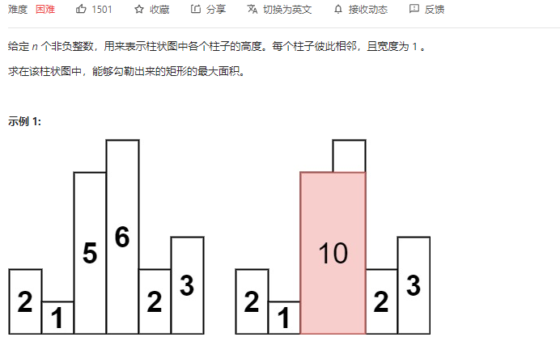
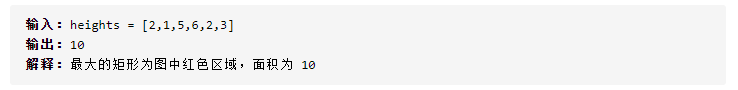
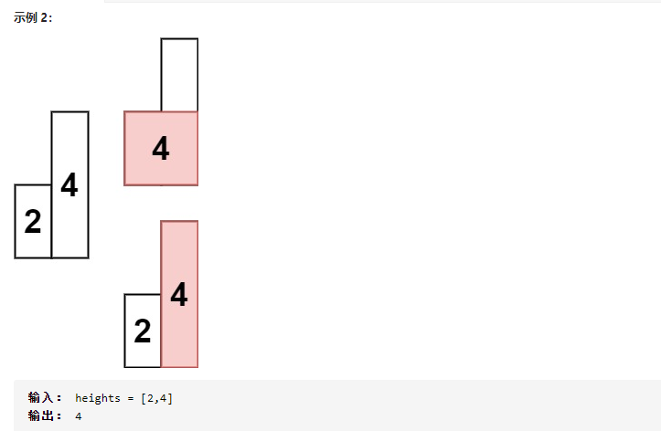

# 栈

## 单调栈

[单调栈相关资料](https://leetcode-cn.com/problems/largest-rectangle-in-histogram/solution/bao-li-jie-fa-zhan-by-liweiwei1419/)

在一维数组中对 **每一个数找到第一个比自己 `小或者大` 的元素**。这类“在一维数组中找第一个满足某种条件的数”的场景就是典型的单调栈应用场景。

找到第一个比自己小的，一般栈底

### [84.柱状图中最大的矩形](https://leetcode-cn.com/problems/largest-rectangle-in-histogram/)








单调栈：

```c++
class Solution {
public:
    int largestRectangleArea(vector<int>& heights) {
        stack<int> st;
        heights.insert(heights.begin(), 0); // 数组头部加入元素0
        heights.push_back(0); // 数组尾部加入元素0
        st.push(0);
        int result = 0;
        for (int i = 1; i < heights.size(); i++) {
            while (heights[i] < heights[st.top()]) {
                int mid = st.top();
                st.pop();
                int w = i - st.top() - 1;
                int h = heights[mid];
                result = max(result, w * h);
            }
            st.push(i);
        }
        return result;
    }
};
```

