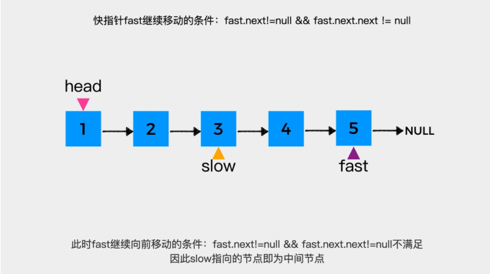
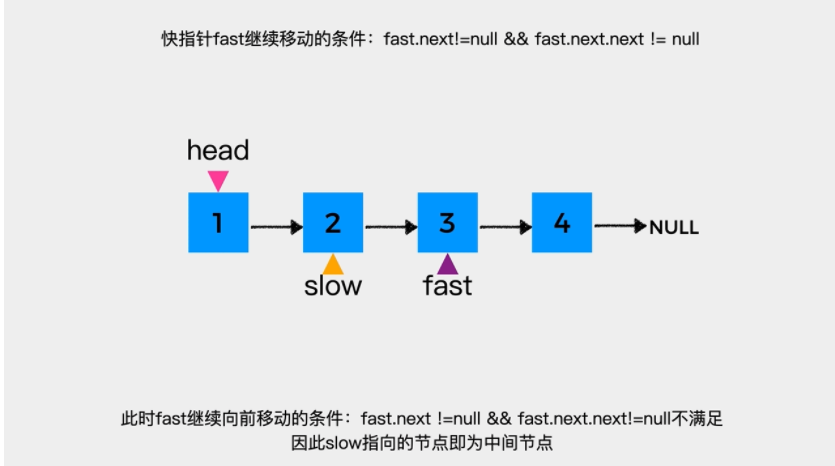
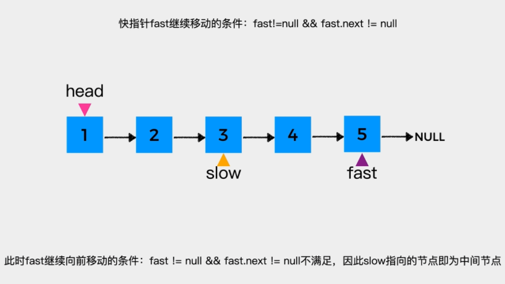
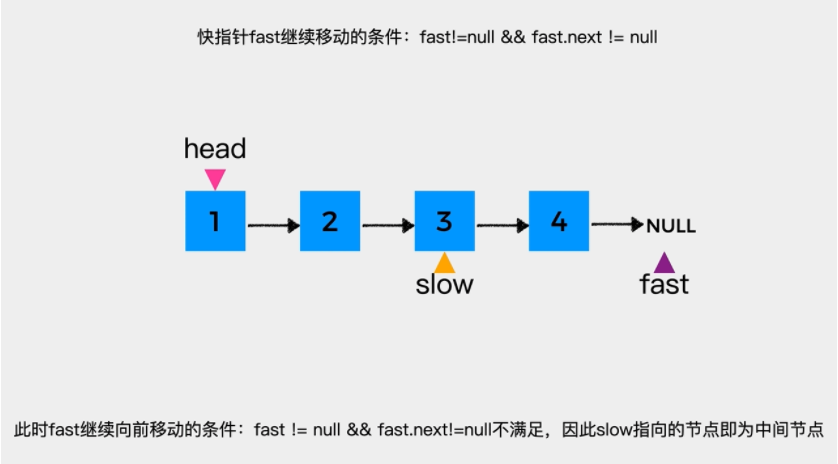
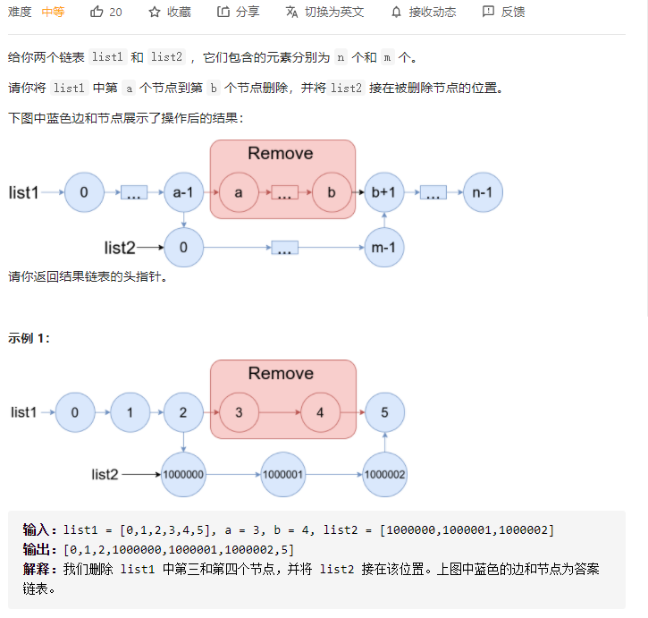
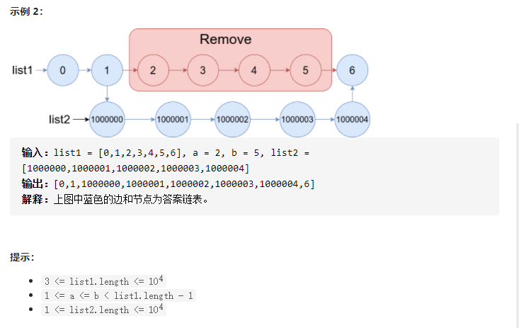

# 链表

## 快慢指针

### 1、找中点

[参考：hardcore-aryabhata](https://leetcode-cn.com/problems/reorder-list/solution/dong-hua-yan-shi-kuai-man-zhi-zhen-143-z-4kmk/)

快慢指针如何找到链表的中间节点，根据条件分两种情况：

1.当快指针fast向前移动的条件是：`fast.next!=null && fast.next.next != null`时：

对于节点个数为**奇数**的链表来说，如下，此时链表的中间节点是**节点3**。



对于节点个数为**偶数**的链表来说，如下，此时链表的**中间节点是节点2**，即在2和3这两个中间节点中，找到是**第一个中间节点**。



2.当快指针fast向前移动的条件是：`fast!=null && fast.next != null`时：

对于节点个数为**奇数**的链表来说，如下，此时链表的中间节点是**节点3**。



对于节点个数为**偶数**的链表来说，如下，此时链表的中间节点是**节点3**，即在2和3这两个中间节点中，找到是**第二个中间节点**。




## 合并链表

### 1、一般操作

```c++
   void mergeList(ListNode* l1, ListNode* l2){ // 合并链表
        ListNode* t1; // 存放l1的下一个节点
        ListNode* t2; // 存放l2的下一个节点
        while(l1 && l2){
            t1 = l1->next;
            t2 = l2->next;

            l1->next = l2;
            l1 = t1;

            l2->next = t1;
            l2 = t2;
        }
    }
```

### 2、[1669. 合并两个链表](https://leetcode-cn.com/problems/merge-in-between-linked-lists/)





思路：

找第一个插入节点p1,然后第二个插入节点p2

代码如下：

```c++
/**
 * Definition for singly-linked list.
 * struct ListNode {
 *     int val;
 *     ListNode *next;
 *     ListNode() : val(0), next(nullptr) {}
 *     ListNode(int x) : val(x), next(nullptr) {}
 *     ListNode(int x, ListNode *next) : val(x), next(next) {}
 * };
 */
class Solution {
public:
    ListNode* mergeInBetween(ListNode* list1, int a, int b, ListNode* list2) {
        ListNode* dummy = new ListNode(0, list1);
        ListNode* cur = dummy;

        // list1 -> p1 -> list2 -> p2
        int k1 = a;
        while(k1--) cur = cur->next;
        ListNode* p1 = cur; // p1的下一个位置为插入list2位置
        ListNode* tmp = p1->next; 
             
        int k2 = b - a + 1;
        while(k2--) cur = cur->next;
        ListNode* p2 = cur ? cur->next : nullptr; // p2保存list2最后节点下一个位置
        
        delete tmp; // 释放资源
        // 串联头部p1->list2
        p1->next = list2;

        // 串联尾部list2->p2
        cur = list2;
        while(cur->next) cur = cur->next;
        cur->next = p2;

        return dummy->next;
    }
};
```

