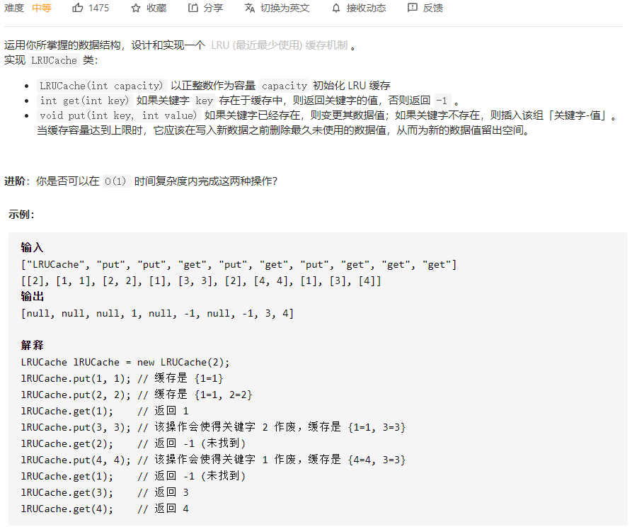
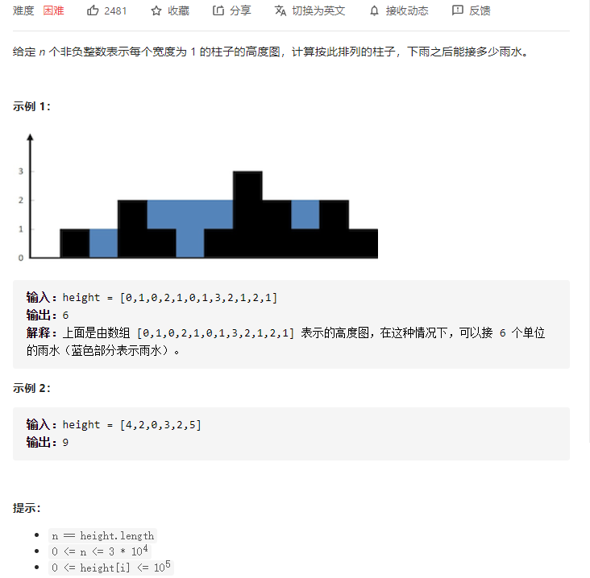
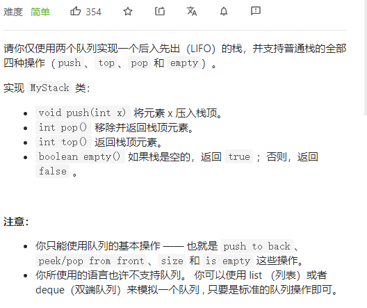
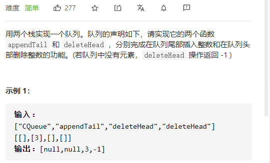
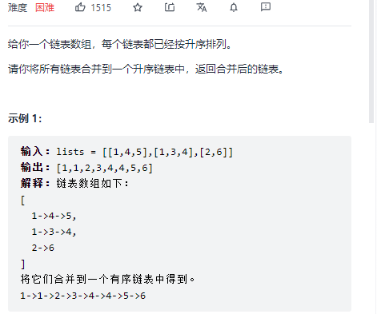
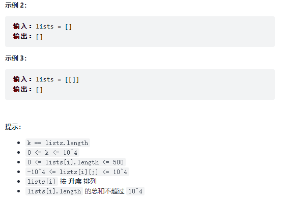
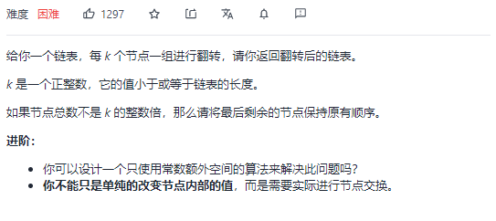
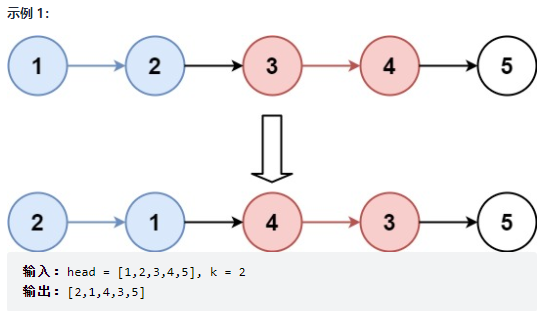

# 高频题

[TOC]


### 1、[146. LRU 缓存机制](https://leetcode-cn.com/problems/lru-cache/)



思路：

- 自定义双链表，模拟缓存。
- unordered_map哈希表来实现缓存链表的查询。

封装性很好。

注意：

1. 双链表中是这样的结构：head == 节点1 == 节点2 == ... == 节点capacity == tail。越往前的节点表示最近使用的，越往后表示最近最久未使用的
2. `unordered_map<int, DlinkNode*> cache`，只是用于查询功能，即链表中是否存在key对应的节点，理解为目录
3. 更新链表时，如果涉及到删除、增加了某个节点，对于cache，也需要进行相应的删除、增加

```c++
class LRUCache {
// 定义双链表结构
// 双链表模拟缓存结构
struct DlinkNode{
    int key, value;
    DlinkNode* next;
    DlinkNode* prev;
    DlinkNode():key(0), value(0), next(nullptr), prev(nullptr){}
    DlinkNode(int _key, int _value):key(_key), value(_value), next(nullptr), prev(nullptr){}
};
public:
    LRUCache(int _capacity) {
        capacity = _capacity;
        size = 0;
        head = new DlinkNode();
        tail = new DlinkNode();
        head->next = tail;
        tail->prev = head;
    }
    
    int get(int key) {
        // 缓存中找不到
        if(cache.count(key) == 0) return -1;
        // 找到：需要将该节点移到头部
        DlinkNode* node = cache[key];
        moveToHead(node);
        return node->value;
    }
    
    void put(int key, int value) {
        // 找到：更新链表缓存key对应的value，然后更新cache 
        if(cache.count(key) != 0){
            DlinkNode* node = cache[key];
            node->value = value;
            moveToHead(node);
        }else{
            // 找不到，则插入
            DlinkNode* node = new DlinkNode(key, value);
            addToHead(node);
            cache[key] = node;
            ++size;
            if(size > capacity){ // 超过缓存总容量
                removeEnd();
                --size;
            }
        }
    }
private:
    unordered_map<int, DlinkNode*> cache; // 查询：用于快速查询 缓存链表 中是否存在该节点
    int capacity; // 缓存总容量
    int size; // 已用容量
    DlinkNode* head; // 链表头，为了操作方便而设计，类似于单链表的哑结点
    DlinkNode* tail; // 链表尾

    void removeEnd(){ // 删除（缓存中）最后一个节点
        DlinkNode* node = tail->prev;
        cache.erase(node->key);
        remove(node);
        delete node;
    }
    void remove(DlinkNode* node){ // 移除节点
        node->prev->next = node->next;
        node->next->prev = node->prev;
    }
    void addToHead(DlinkNode* node){ // 添加到头结点
        // head ==> head->next 变成如下
        // head ==> node ==> head->next
        node->next = head->next;
        node->prev = head;
        head->next->prev = node;
        head->next = node;
    }
    void moveToHead(DlinkNode* node){ // 移到头部 = 移除当前 + 添加到头部
        remove(node);
        addToHead(node);
    }    
};
```


### 2、[42. 接雨水](https://leetcode-cn.com/problems/trapping-rain-water/)



**思路：**

#### 解法1：双指针法

按列来算。

- `i`遍历height每一个
- 当是第一个、最后一个，则不接雨水
- 每一个找到它的左边最大能接多少雨水、右边最大能接多少雨水
- 取两者的最小值，减去height[i]
- 如果大于0,则加入总和

```c++
class Solution {
public:
    int trap(vector<int>& height) {
          int sum = 0;
          for(int i = 0; i < height.size(); i++){
              // 第一天、最后一天不接雨水
              if(i == 0 || i == height.size() - 1) continue;
              int lHeight = i;
              int rHeight = i;
              // 以 i 为分界，找左右的最大值
              for(int l = i - 1; l >= 0; l--){
                  if(height[l] > height[lHeight]) lHeight = l;
              }
              for(int r = i + 1; r < height.size(); r++){
                  if(height[r] > height[rHeight]) rHeight = r;
              }
              // 取 左右最大值得的最小值，然后减去当前height[i]
              // 就是当前位置i所能接雨水的最大值
              int h = min(height[lHeight], height[rHeight]) - height[i];
              if(h > 0) sum += h;
          } 
          return sum;
    }
};
```

#### 解法2：动态规划

双指针法中，每次遍历`i`都需要往两边找对应的最大值，这样有很多是重复计算的。

当遍历到`i`的位置时，

- 如果要知道它的左边最大值，那么只需要将左边的最大值跟当前值比较，取最大值就可以，用maxLeft来记录
- 如果想知道它的右边最大值，那么只需要将右边的最大值跟当前值比较，取最大值就可以，用maxRight来记录

**状态定义**：maxLeft[i]表示[0, i]的最大值为maxLeft[i]；maxRight[i]表示[i, size - 1]的最大值为maxRight[i]

**转移方程**：由上面分析，每次遍历到i取，左右最大值的最小值 - 当前可接雨水的高度即可

- ```c++
  // 左边最大值
  maxLeft[i] = max(maxLeft[i - 1], height[i]);
  ```

- ```c++
  // 右边最大值
  maxRight[j] = max(maxRight[j + 1], height[j]);
  ```


**初始化**：maxLeft[0]即第一个位置最大值本身；maxRight[size - 1]即最后一个位置本身

**遍历顺序**：左边最大值的从左往右（找左值最大）；右边最大值的从右往左（找右值最大）

```c++
class Solution {
public:
    int trap(vector<int>& height) {
        if(height.size() <= 2) return 0;
        int size = height.size();
        vector<int> maxLeft(size, 0);
        vector<int> maxRight(size, 0);

        // 初始化 + 状态转移
        maxLeft[0] = height[0];
        for(int i = 1; i < size; i++){
            maxLeft[i] = max(maxLeft[i - 1], height[i]);
        }
        maxRight[size - 1] = height[size - 1];
        for(int j = size - 2; j >= 0; j--){
            maxRight[j] = max(maxRight[j + 1], height[j]);
        }
        // 求和
        int sum = 0;
        for(int k = 0; k < size; k++){
            int h = min(maxLeft[k], maxRight[k]) - height[k];
            if(h > 0) sum += h;
        }
        return sum;
    }
};
```


### 3、[225. 用队列实现栈](https://leetcode-cn.com/problems/implement-stack-using-queues/)



```c++
class MyStack {
public:
    /** Initialize your data structure here. */
    MyStack() {
    }
    
    /** Push element x onto stack. */
    void push(int x) {
        que1.push(x);
    }   
    /** Removes the element on top of the stack and returns that element. */
    int pop() {
        getBack();
        int tmp = que1.front(); // 栈顶元素
        que1.pop();
        restore();
        return tmp;
    } 
    /** Get the top element. */
    int top() {
        return que1.back();
    }  
    /** Returns whether the stack is empty. */
    bool empty() {
        return (que1.empty() && que2.empty());
    }
private:
    queue<int> que1; // 维护元素
    queue<int> que2; // 暂存元素
    void getBack(){  // que1 前面 n-1 个元素 移动到 que2
        while(!que1.empty()){
            if(que1.size() == 1) break;
            int t = que1.front();
            que1.pop();
            que2.push(t);
        }
    }
    void restore(){  // 将que2的元素恢复到que1
        while(!que2.empty()){
            int t = que2.front();
            que2.pop();
            que1.push(t);
        }
    }
};
```

### 4、[剑指 Offer 09. 用两个栈实现队列](https://leetcode-cn.com/problems/yong-liang-ge-zhan-shi-xian-dui-lie-lcof/)



```c++
class CQueue {
public:
    CQueue() {}   
    void appendTail(int value) {
        s_add.push(value);
    }
    
    int deleteHead() {
        int res = 0;
        if(!s_del.empty()) 
        {
            res = s_del.top();
            s_del.pop();
            return res;
        }
        if(s_add.empty() && s_del.empty()) return -1;
        while(!s_add.empty())
        {
            int temp = s_add.top();
            s_add.pop();
            s_del.push(temp);
        }
        res = s_del.top();
        s_del.pop();
        return res;
    }
private:
    stack<int> s_add, s_del;
};
```


### 5、[23. 合并K个升序链表](https://leetcode-cn.com/problems/merge-k-sorted-lists/)






```c++
/**
 * Definition for singly-linked list.
 * struct ListNode {
 *     int val;
 *     ListNode *next;
 *     ListNode() : val(0), next(nullptr) {}
 *     ListNode(int x) : val(x), next(nullptr) {}
 *     ListNode(int x, ListNode *next) : val(x), next(next) {}
 * };
 */
class Solution {
public:
    ListNode* mergeTwo(ListNode* a, ListNode* b){
        if(a == nullptr) return b;
        if(b == nullptr) return a;
        ListNode* p1 = a, *p2 = b;
        ListNode* hair = new ListNode(0), *p = hair;

        while(p1 && p2){
            if(p1->val < p2->val){
                p->next = p1;
                p1 = p1->next;
                p = p->next;
            }
            else if(p1->val >= p2->val){ // 坑2：要用else if
                p->next = p2;
                p2 = p2->next;
                p = p->next;
            }
        }
        p->next = (p1 != nullptr) ? p1 : p2;
        return hair->next;
    }
    ListNode* merge(vector<ListNode*>& lists, int l, int r){
        if(l == r) return lists[l];
        if(l > r) return nullptr; // 坑1，容易漏掉空list
        int mid = (l + r) >> 1;
        return mergeTwo(merge(lists, l, mid), merge(lists, mid + 1, r)); // 将两个merge放到mergeTwo，将两段链表合并
    }
    ListNode* mergeKLists(vector<ListNode*>& lists) {
        return merge(lists, 0, lists.size() - 1);
    }
};
```


### 6、[25. K 个一组翻转链表](https://leetcode-cn.com/problems/reverse-nodes-in-k-group/)





```c++
/**
 * Definition for singly-linked list.
 * struct ListNode {
 *     int val;
 *     ListNode *next;
 *     ListNode() : val(0), next(nullptr) {}
 *     ListNode(int x) : val(x), next(nullptr) {}
 *     ListNode(int x, ListNode *next) : val(x), next(next) {}
 * };
 */
class Solution {
public:
    pair<ListNode*, ListNode*> myReverse(ListNode* head, ListNode* tail){
        ListNode* pre = nullptr;
        ListNode* cur = head;
        while(pre != tail){ // 坑1
            ListNode* tmp = cur->next;
            cur->next = pre;
            pre = cur;
            cur = tmp;
        }
        return {tail, head};
    }
    
    ListNode* reverseKGroup(ListNode* head, int k) {
        ListNode* hair = new ListNode(0);
        hair->next = head;

        ListNode* tail = hair;
        while(tail){
            ListNode* pre = tail; // 坑2：k个一组链表的前一个节点
            int cnt = k;
            while(cnt--){
                tail = tail->next;
                if(tail == nullptr){
                    return hair->next;
                }
            }

            ListNode* nex = tail->next;
            tie(head, tail) = myReverse(head, tail);

            pre->next = head;
            tail->next = nex;

            head = nex; // 坑3：head要更新到下一次翻转的第一个节点
        }
        return hair->next;
    }
};
```

