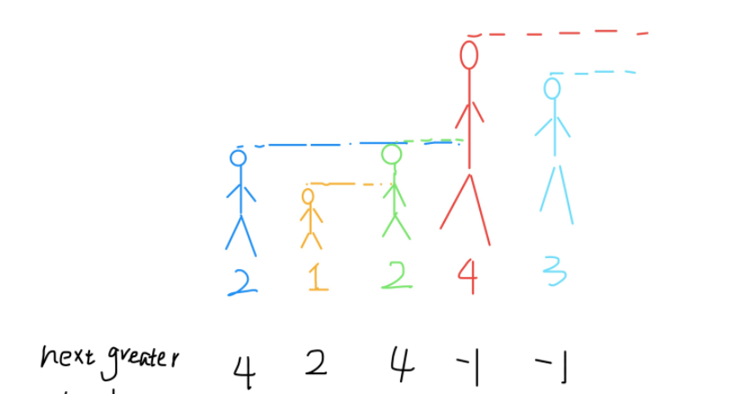

## 腾讯

### 压缩算法

时间限制：C/C++ 1秒，其他语言2秒

空间限制：C/C++ 256M，其他语言512M

小Q想要给他的朋友发送一个神秘字符串，但是他发现字符串的过于长了，于是小Q发明了一种压缩算法对字符串中重复的部分进行了压缩，对于字符串中连续的m个相同字符串S将会压缩为 `m|S` (m为一个整数且1<=m<=100)，例如字符串ABCABCABC将会被压缩为[3|ABC]，现在小Q的同学收到了小Q发送过来的字符串，你能帮助他进行解压缩么？ 

**输入例子1:**

```
"HG[3|B[2|CA]]F"
```

**输出例子1:**

```
"HGBCACABCACABCACAF"
```

**例子说明1:**

```
HG[3|B[2|CA]]F−>HG[3|BCACA]F−>HGBCACABCACABCACAF
```

代码如下：

```c++
class Solution {
public:
 
    string compress(string str) {
       
        stack<char> stk;
        for(int i = 0; i < str.size(); i++){
            // HG[3|B[ 2|CA ]]F
            if(str[i] == ']'){
               string t1 = ""; // 重复字符串
               while(!stk.empty() && stk.top() != '|'){ // CA
                   t1 = stk.top() + t1; // A - CA
                   stk.pop();
               }
               stk.pop(); // pop() '|'
               string t2 = ""; // t1重复次数
               while(!stk.empty() && stk.top() != '['){
                   t2 = stk.top() + t2; // 2
                   stk.pop();
               }
               stk.pop(); // pop() '['
               int n = stoi(t2);
               string s1 = ""; // 重复n次的字符串: CACA
               while(n--){
                   s1 += t1;
               }
               for(int j = 0; j < s1.size(); j++){ // 解压缩成正常的，入栈
                   stk.push(s1[j]);
               }  
           }else{ // 正常字符入栈
               stk.push(str[i]);
           }
        }
        // 栈中已全是正常字符
        string res = "";
        while(!stk.empty()){
            res = stk.top() + res;
            stk.pop();
        }
        return res;
    }
};
```


### 逛街

时间限制：C/C++ 2秒，其他语言4秒

空间限制：C/C++ 256M，其他语言512M

小Q在周末的时候和他的小伙伴来到大城市逛街，一条步行街上有很多高楼，共有n座高楼排成一行。

小Q从第一栋一直走到了最后一栋，小Q从来都没有见到这么多的楼，所以他想知道他在每栋楼的位置处能看到多少栋楼呢？（当前面的楼的高度大于等于后面的楼时，后面的楼将被挡住） 

**输入例子1**

```
[5,3,8,3,2,5]
```

**输出例子1:**

```
[3,3,5,4,4,4]
```

**例子说明1:**

```
当小Q处于位置3时，他可以向前看到位置2,1处的楼，向后看到位置4,6处的楼，加上第3栋楼，共可看到5栋楼。当小Q处于位置4时，他可以向前看到位置3处的楼，向后看到位置5,6处的楼，加上第4栋楼，共可看到4栋楼。
```

思路：运用单调栈的思路，什么是单调栈？

这篇博客讲的好==》https://blog.csdn.net/wolfGuiDao/article/details/104667642



对于每一个位置找第一个比它大的元素，那么把元素值想象成身高，每一个位置看到的是第一个比他高的人。那么把这个过程中比它小的都pop掉（一般对应栈顶），如果栈中不为空，露出来的栈顶即为答案。从右往左遍历，每次更新能看到的右边的人（比当前高的）

```c++
vector<int> nextGreaterElement(vector<int>& nums) {
	vector<int> ans(nums.size()); // 存放答案的数组
	stack<int> s;
	
	for (int i = nums.size() - 1; i >= 0; i--) 
	{ 
		// 倒着往栈⾥放
		while (!s.empty() && nums[i] >= s.top()) 
		{ 
			// 判定个⼦⾼矮
			s.pop(); // 矮个起开， 反正也被挡着了。 。 。
		} 
		ans[i] = s.empty() ? -1 : s.top(); // 这个元素⾝后的第⼀个⾼个
		s.push(nums[i]); // 进队， 接受之后的⾝⾼判定吧！
	} 
	return ans;
}

```


本题代码如下：

```c++
class Solution {
public:
    vector<int> findBuilding(vector<int>& heights) {
        stack<int> l, r;
        int n = heights.size();
        vector<int> dp(n, 1);
        // 从左往右遍历，能看到左边的楼层数
        // 如果当前楼层高度大于栈顶元素，说明当前的下一个是看不到 当前楼层之前 的楼层的
        // 因为它们被挡住了，需要pop出去
        // 注意for循环的条件
        for(int i = 0; i < n - 1; i++){
            while(!l.empty() && heights[i] >= l.top()){
                l.pop();
            }
            l.push(heights[i]); // 将当前楼层放入栈中，以供后面楼层评判
            dp[i + 1] += l.size(); // 当前楼层下一层可以看到栈中剩下的是比当前楼高的
        }
        // 从右往左遍历，能看到右边的楼层数
        // 同理
         for(int i = n - 1; i > 0; i--){
            while(!r.empty() && heights[i] >= r.top()){
                r.pop();
            }
            r.push(heights[i]); // 将当前楼层放入栈中，以供后面楼层评判
            dp[i - 1] += r.size(); // 当前楼层下一层可以看到栈中剩下的是比当前楼高的
        }
        return dp;
    }
};
```

